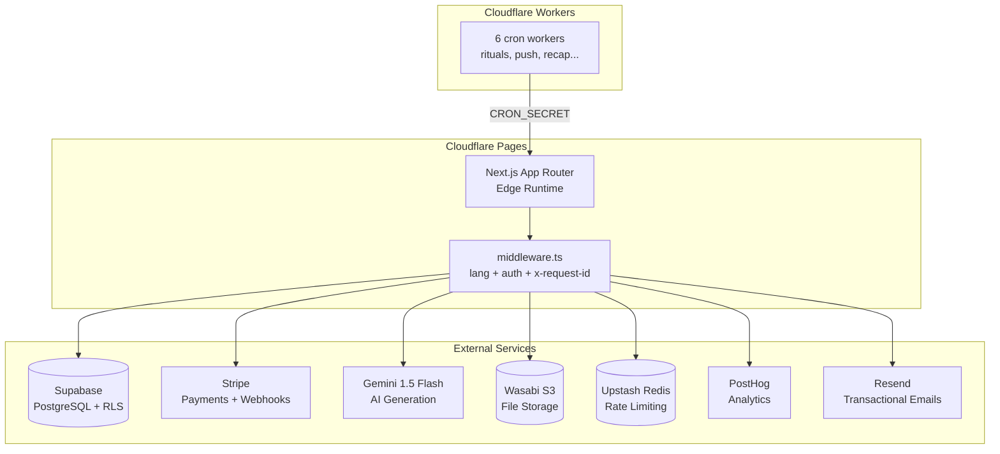
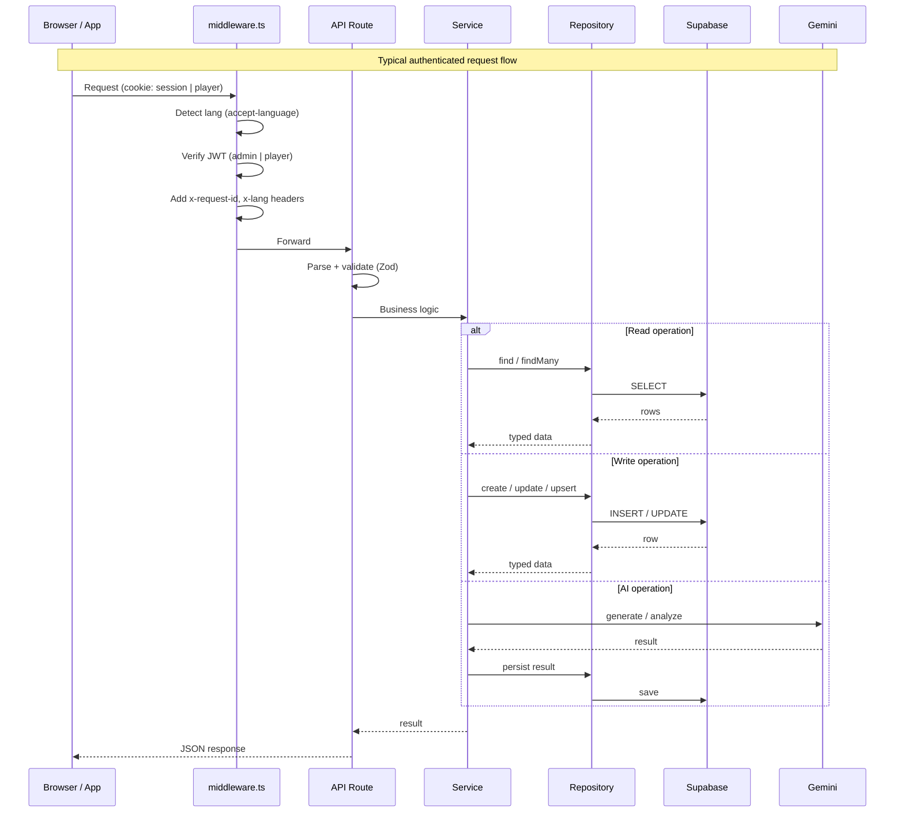

# Codebase Map — Captain Bond

Quick-reference for AI agents to understand the project structure, flow, and key files.

---

## 1. Quick Start

```bash
npm run dev          # Next.js dev server
npm run build        # Static build (71/71 pages)
npm run pages:build  # Cloudflare Pages build (@cloudflare/next-on-pages)
npm test             # Vitest
npm run test:e2e     # Playwright E2E
npm run validate:env # Check required secrets
```

---

## 2. Directory Tree

```
captainbond/
├── src/
│   ├── app/                          ← Next.js App Router (pages + API)
│   │   ├── (marketing)/              ← Pages publiques EN
│   │   │   ├── blog/                 ← 15 articles SEO
│   │   │   ├── couple/               ← Landing couple
│   │   │   ├── party/                ← Landing party
│   │   │   ├── printables/           ← Printables PDF
│   │   │   └── pro/                  ← Landing pro (bars)
│   │   ├── (distanciel)/             ← Pages authentifiées (couple dashboard)
│   │   │   ├── couple/               ← Dashboard couple + _components/
│   │   │   ├── group/                ← Groupe couple
│   │   │   └── tree/                 ← Neural tree
│   │   ├── admin/                    ← Admin panel (protégé middleware)
│   │   ├── api/                      ← 17 groupes de routes API
│   │   │   ├── couple/               ← API couple (ritual, analyze, reveal...)
│   │   │   ├── cron/                 ← 6 routes de Workers (rituals, push...)
│   │   │   ├── room/                 ← API room (create, join, play...)
│   │   │   ├── checkout/             ← Stripe checkout
│   │   │   ├── webhook/              ← Stripe webhook
│   │   │   ├── admin/                ← Admin API
│   │   │   ├── storage/              ← Wasabi presigned uploads
│   │   │   ├── trees/                ← Neural tree API
│   │   │   ├── me/                   ← User profile API
│   │   │   ├── player/               ← Player auth API
│   │   │   ├── public/               ← Public endpoints
│   │   │   ├── questions/            ← Questions API
│   │   │   ├── packs/                ← Packs API
│   │   │   ├── dj/                   ← DJ AI API
│   │   │   ├── corporate/            ← B2B API
│   │   │   ├── health/               ← Health check
│   │   │   └── user/                 ← User API
│   │   ├── fr/                       ← Pages FR (12 groupes: blog/, couple/, soiree/...)
│   │   ├── auth/                     ← Auth pages
│   │   ├── b2b/                      ← B2B landing
│   │   ├── corporate/                ← Corporate landing
│   │   ├── join/                     ← Room join page
│   │   ├── room/                     ← Room lobby
│   │   ├── studio/                   ← Studio (contenu)
│   │   ├── vault/                    ← Vault (archives)
│   │   ├── pricing/                  ← Pricing EN
│   │   ├── privacy/                  ← Privacy policy
│   │   ├── layout.tsx                ← Root layout (5 schemas JSON-LD, GA4, PostHog)
│   │   ├── globals.css               ← Tailwind v4 + .article-* system
│   │   ├── sitemap.ts                ← 52 URLs sitemap
│   │   ├── robots.ts                 ← robots.txt (AI bots allowed)
│   │   ├── middleware.ts             ← Lang detection, admin+player auth, x-request-id
│   │   ├── error.tsx                 ← Global error boundary (client crash recovery)
│   │   └── (distanciel)/error.tsx    ← Error boundary for couple dashboard
│   │
│   ├── components/                   ← React components
│   │   ├── couple/                   ← 24 composants couple (dashboard P1-P4)
│   │   ├── presentiel/               ← 15 composants party (host flow)
│   │   ├── distanciel/               ← 7 composants long-distance
│   │   ├── landing/                  ← BrandHub, Section, FeatureShowcase
│   │   ├── marketing/                ← CoupleCrossSellCard
│   │   ├── ui/                       ← ReadingProgressBar, MobileCta, ScrollToTop...
│   │   ├── admin/                    ← Admin components
│   │   ├── b2b/                      ← B2B components
│   │   ├── pro/                      ← Pro components
│   │   ├── endgame/                  ← End game components
│   │   └── *.tsx                     ← Singletons (AuthModal, ConsentModal, Countdown...)
│   │
│   ├── services/                     ← 30 services métier
│   │   ├── roomGameService.ts        ← Barrel re-export (3 split services)
│   │   ├── roomState.ts              ← Formal FSM (room status transitions)
│   │   ├── roomLifecycleService.ts   ← startNextRound, revealRound, skip, endRoom
│   │   ├── gamePlayService.ts       ← recordVote, getActiveQuestion, getImposteurRole
│   │   ├── profileService.ts        ← getPlayerGameProfile, getRoomGameProfiles
│   │   ├── roomService.ts            ← Room CRUD
│   │   ├── questionService.ts        ← Question generation + selection
│   │   ├── paymentService.ts         ← Stripe payments
│   │   ├── playerService.ts          ← Player management
│   │   ├── storageService.ts         ← Wasabi file uploads
│   │   ├── pushNotificationService.ts← Push notifications
│   │   ├── leadService.ts            ← Lead capture
│   │   ├── adminService.ts           ← Admin operations
│   │   ├── heatmapService.ts         ← Heatmap computation
│   │   ├── weeklyRecapService.ts     ← Weekly AI recap
│   │   ├── ritualService.ts          ← Daily ritual (sync 20h)
│   │   ├── treeProgressService.ts    ← Neural tree progress
│   │   ├── totemService.ts           ← Totem progression
│   │   ├── totemMappingService.ts    ← Totem → player mapping
│   │   ├── timeCapsuleService.ts     ← Time capsule
│   │   ├── resonanceReportService.ts ← Resonance reports
│   │   ├── couplePassService.ts      ← Couple pass logic
│   │   ├── coupleTrialService.ts     ← Free trial logic
│   │   ├── coupleMoodService.ts      ← Mood tracking
│   │   ├── coupleAnswerService.ts    ← Answer analysis
│   │   ├── coupleDailyQuestionService.ts ← Daily questions
│   │   ├── coupleDetoxService.ts     ← Detox challenges
│   │   ├── coupleProtocolService.ts  ← Protocols
│   │   ├── couplePortraitService.ts  ← Couple portrait
│   │   ├── coupleRealtimeService.ts  ← Realtime sync
│   │   ├── statsService.ts           ← Stats aggregation
│   │   ├── distanciel/               ← 7 services long-distance
│   │   ├── dj-ia/                    ← DJ AI services
│   │   └── stats/                    ← Stats modules
│   │
│   ├── game-modes/                   ← 5 modes de jeu
│   │   ├── icebreaker/               ← 3-8 joueurs, light/absurd
│   │   ├── spicy/                    ← 2-8 joueurs, dilemmes A/B
│   │   ├── deep-connection/          ← 3-6 joueurs, vulnerable
│   │   ├── date-night/               ← 2 joueurs, intimate
│   │   ├── imposteur/                ← 3-8 joueurs, bluff
│   │   ├── most-likely-to/           ← Party game
│   │   ├── mission-impossible/       ← Challenge mode
│   │   └── family/                   ← Family mode
│   │
│   ├── lib/                          ← Infrastructure partagée
│   │   ├── db/repositories/          ← Accès Supabase (CRUD)
│   │   ├── auth/                     ← Admin, player auth
│   │   ├── config/                     ← Config constants
│   │   ├── monetization/             ← Pricing, catalog
│   │   ├── cron/                     ← Cron lock
│   │   ├── pricing/                  ← Pricing tiers
│   │   ├── api/                      ← withApiHandler, getAuthenticatedUser
│   │   ├── couple/                   ← Couple helpers
│   │   ├── game/                     ← Game helpers
│   │   ├── events/                   ← Event tracking
│   │   ├── schemas/                  ← Zod schemas
│   │   ├── questions/                ← Question selection
│   │   ├── i18n/                     ← Translation helpers
│   │   ├── profilling/               ← Player profiling
│   │   ├── presentiel/               ← In-person game helpers
│   │   ├── native/                   ← Capacitor native helpers
│   │   ├── custom-decks/             ← Custom question decks
│   │   ├── gemini.ts                 ← Gemini AI client
│   │   ├── supabase.ts              ← Supabase client (anon key)
│   │   ├── supabase-admin.ts        ← Supabase client (service role)
│   │   ├── wasabi.ts                ← Wasabi S3 client
│   │   ├── stripe.ts                ← Stripe client
│   │   ├── upstash.ts               ← Redis client
│   │   ├── resend.ts                ← Email client
│   │   ├── errors.ts                ← AppError class
│   │   ├── env.ts                   ← Env var validation
│   │   ├── fetch.ts                 ← fetchWithTimeout, withTimeout
│   │   ├── json.ts                  ← safeJsonParse
│   │   ├── logger.ts                ← Structured logger
│   │   ├── cache.ts                 ← Redis cache
│   │   ├── rate-limit.ts            ← Rate limiting
│   │   ├── sanitize.ts              ← Input sanitization
│   │   ├── time.ts                  ← Date/time utilities
│   │   └── utils.ts                 ← Misc utilities
│   │
│   └── middleware.ts                 ← Edge middleware (lang + auth + x-request-id)
│
├── workers/                          ← Cloudflare Workers
│   └── cron-trigger/                 ← 6 cron workers (rituals, push, recap...)
│
├── prisma/schema.prisma              ← Schema Prisma (dev only — Supabase JS en prod)
├── supabase/migrations/              ← Migrations SQL (ordre numérique)
├── docs/                             ← ~30 fichiers de documentation
├── public/
│   ├── og/                           ← 48 OG images 1200×630.webp
│   └── okf/                          ← OKF (AI knowledge feed) 15+ fichiers
│
├── .github/workflows/
│   ├── deploy-pages.yml              ← CI/CD Cloudflare Pages
│   └── deploy-worker.yml             ← CI/CD Cloudflare Worker
│
├── .agents/
│   ├── anchor.md                     ← Session memory (à lire au début de chaque session)
│   ├── codebase-map.md               ← Ce fichier
│   └── state.json                    ← Session state checkpoint
│
├── AGENTS.md                         ← Master rules & conventions (À LIRE EN PRIORITÉ)
├── CLAUDE.md                         ← Claude config
├── wrangler.toml                     ← Cloudflare config / secrets
├── package.json                      ← name: "koze" (normal, pas un bug)
└── .env.example                      ← 28 env vars
```

---

## 3. Infrastructure



---

## 4. Route Map

```mermaid
graph TD
    ROOT["/"] --> LANDING[Landing page<br/>src/app/page.tsx]
    ROOT --> BLOG["/blog/*<br/>15 articles SEO"]
    ROOT --> FR["/fr/*<br/>12 routes FR"]
    ROOT --> COUPLE_LANDING["/couple<br/>Landing couple"]
    ROOT --> PARTY_LANDING["/party<br/>Landing party"]
    ROOT --> PRICING["/pricing<br/>Tarifs"]
    ROOT --> B2B["/b2b<br/>Bars & Cafés"]
    ROOT --> CORPORATE["/corporate<br/>Team Building"]

    BLOG --> BLOG_PAGES["15 page.tsx<br/>FAQ + HowTo schema<br/>OG images 1200×630"]

    subgraph "Authenticated"
        DASHBOARD["/couple (distanciel)<br/>Dashboard couple"]
        ROOM["/room/:id<br/>Room lobby"]
        JOIN["/join/:code<br/>Join room"]
        ADMIN["/admin/*<br/>Admin panel"]
    end
    DASHBOARD --> COUPLE_COMPONENTS["24 components<br/>Ritual, Heatmap, Tree..."]
    
    subgraph "API"
        API["/api/*"] --> API_COUPLE["/api/couple/<br/>ritual, analyze, reveal"]
        API --> API_CRON["/api/cron/<br/>6 cron routes"]
        API --> API_ROOM["/api/room/<br/>create, join, play"]
        API --> API_CHECKOUT["/api/checkout"]
        API --> API_WEBHOOK["/api/webhook"]
        API --> API_STORAGE["/api/storage"]
    end
    ADMIN -.-> MIDDLEWARE_PROTECT["middleware.ts<br/>Admin auth"]
    API -.-> API_WRAPPER["withApiHandler<br/>Zod + Edge"]

    FR --> FR_BLOG["/fr/blog/*<br/>15 articles FR"]
    FR --> FR_COUPLE["/fr/couple"]
    FR --> FR_SOIREE["/fr/soiree"]
    FR --> FR_TARIFS["/fr/tarifs"]
```

---

## 5. Data Flow



---

## 6. Key Files Index

| Quand chercher | Fichier(s) | Ce que ça contient |
|---|---|---|
| **Règlles générales** | `AGENTS.md` | Conventions, bugs connus, architecture decisions, P0 fixes |
| **Mémoire de session** | `.agents/anchor.md` | Résumé de la session en cours (lire en début de session) |
| **Layout global** | `src/app/layout.tsx` | 5 JSON-LD schemas, GA4, PostHog, LanguageProvider |
| **Middleware** | `src/middleware.ts` | Lang detection, admin auth, player auth |
| **CSS global** | `src/app/globals.css` | Tailwind v4 theme, `.article-*` system, animations |
| **Erreurs** | `src/lib/errors.ts` | AppError class, 20+ error codes |
| **Auth admin** | `src/lib/auth/admin.ts` | Admin JWT, cookie management, refresh token |
| **Auth player** | `src/lib/auth/player.ts` | Player JWT, cookie management, refresh token |
| **Jeux** | `src/game-modes/` | 5 modes + manifests, prompts, types |
| **Services métier** | `src/services/*.ts` | 30 services, toute la logique |
| **Accès DB** | `src/lib/db/repositories/` | CRUD Supabase |
| **API wrapper** | `src/lib/api/` | withApiHandler, withCronHandler, getAuthenticatedUser, rate limiting, Zod, Sentry |
| **API routes** | `src/app/api/*/route.ts` | 17 groupes de routes REST |
| **Dashboards** | `src/app/(distanciel)/couple/` | Couple dashboard page + _components/ |
| **Blog articles** | `src/app/(marketing)/blog/*/page.tsx` | 15 articles EN, template 11 étapes |
| **Composants couple** | `src/components/couple/` | 24 composants (totem, heatmap, recap...) |
| **Composants party** | `src/components/presentiel/` | 15 composants (host flow, modes...) |
| **Déploiement** | `wrangler.toml` | CF config, secrets, environments |
| **CI/CD** | `.github/workflows/` | Pages deploy + Worker deploy |
| **OG images** | `public/og/` + `scripts/generate-og-images.ts` | 48 images, 6 templates |
| **Sitemap** | `src/app/sitemap.ts` | 52 URLs |
| **Migration DB** | `supabase/migrations/` + `scripts/update-schema-summary.py` | Ordre numérique, schema summary (31 tables), indexes + RLS sur toutes les tables |
| **Documentation** | `docs/` | ~30 fichiers (deploy, audit, game design...) |
| **OKF (AI feed)** | `public/okf/` | 15+ fichiers pour crawlers IA |

---

## 7. Auth & Security Overview

```
                    SIGNUP / LOGIN / JOIN
                          │
                          v
              ┌──────────────────────────────────┐
              │         middleware.ts             │
              │   - Check JWT cookie              │
              │   - Si expiré → try refresh cookie │
              │   - Set x-lang, x-request-id       │
              └──────┬───────────────────────────┘
                     │
          ┌──────────┼──────────┐
          v          v          v
    ┌─────────┐ ┌─────────┐ ┌──────────┐
    │ Admin   │ │ Player  │ │ Public   │
    │ JWT     │ │ JWT     │ │ (anon)   │
    └─────────┘ └─────────┘ └──────────┘
         │           │            │
         v           v            v
     /admin/*    /api/player/*  /blog/*
     /api/admin/*  /api/room/*  /pricing
                  /couple       /party
```

**JWT + Refresh**: Deux cookies séparés par session. Middleware auto-refresh si JWT expiré + refresh cookie valide.
- Admin: JWT 7d, refresh 30d. Secrets: `ADMIN_JWT_SECRET`, `ADMIN_REFRESH_SECRET` (fallback: JWT secret).
- Player: JWT 30d, refresh 90d. Secrets: `PLAYER_JWT_SECRET`, `PLAYER_REFRESH_SECRET` (fallback: JWT secret).

---

## 8. Game Modes Quick Reference

| Mode | Players | Vibe | Mechanic | Runtime |
|---|---|---|---|---|
| Icebreaker | 3-8 | Light, absurd | Zero writing, vote on friends | ~15min |
| Spicy | 2-8 | Clivant | Dilemmas A/B, split room | ~15min |
| Deep Connection | 3-6 | Vulnerable | Black screen, spotlight | ~30min |
| Date Night | 2 | Intimate | TV off, hold-to-proceed | ~30min |
| Imposteur | 3-8 | Bluff | Secret question, detect lies | ~20min |
| Most Likely To | 3-8 | Party | Vote who's most likely to... | ~10min |
| Mission Impossible | 3-8 | Challenge | Dares, truth or dare style | ~20min |
| Family | 4-10 | Family-friendly | Adapted questions for all ages | ~20min |
