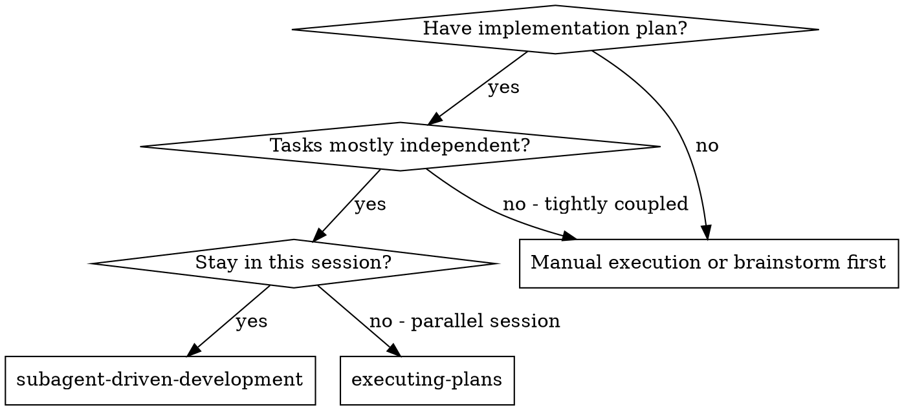
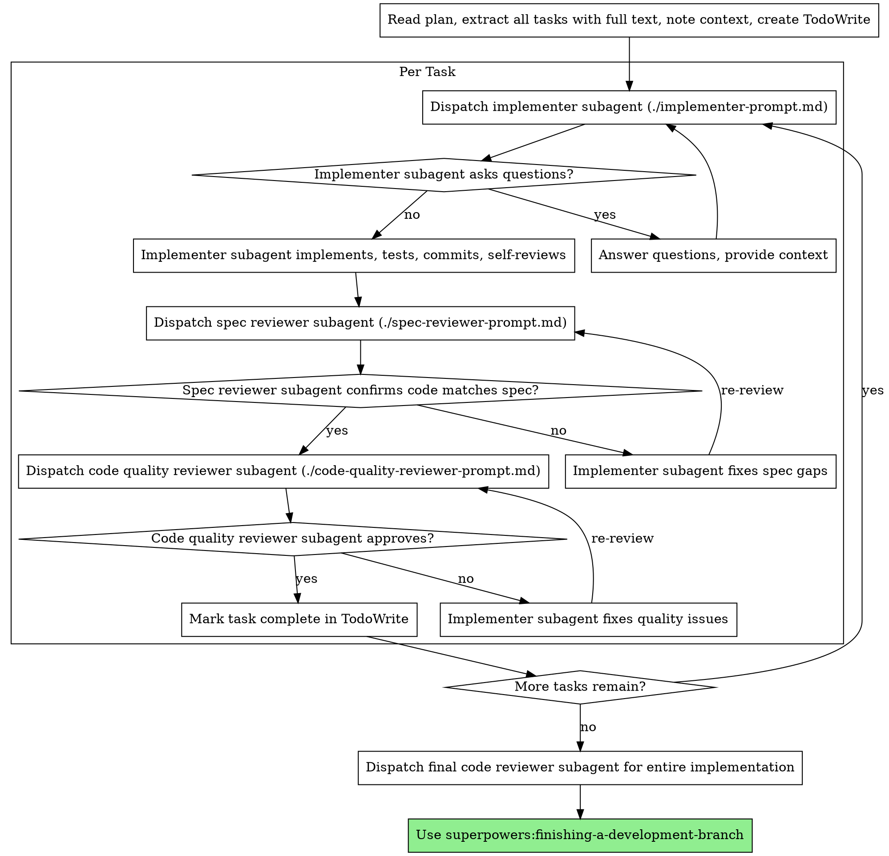

# Kimi Session Export

## Overview

- **Topic**: Skill tool loaded instructions for this request. Follow them.

<kimi-skill-loade…
- **Conversation**: 7 turns | 109 tool calls

---

## Turn 1

### Assistant

<details><summary>Thinking</summary>

Task 3.2 approved. Update TodoList and move to Task 3.3.

</details>

#### Tool Call: TodoList
<!-- call_id: tool_Ybdea113nkEYmwHrcKjIvvfr -->
```json
{
  "todos": [
    {
      "title": "Task 3.1: Extraire les helpers purs de PresentialHostView.tsx",
      "status": "done"
    },
    {
      "title": "Task 3.2: Extraire usePresentialRealtime de PresentialHostView.tsx",
      "status": "done"
    },
    {
      "title": "Task 3.3: Découper TalkingStick.tsx en stages",
      "status": "in_progress"
    },
    {
      "title": "Task 3.4: Extraire useCheckoutFeedback",
      "status": "pending"
    },
    {
      "title": "Task 3.5: Remplacer document.getElementById par des refs",
      "status": "pending"
    },
    {
      "title": "Task 3.6: Validation finale de la Phase 3",
      "status": "pending"
    }
  ]
}
```

<details><summary>Tool Result: TodoList</summary>

<!-- call_id: tool_Ybdea113nkEYmwHrcKjIvvfr -->
Todo list updated.
Current todo list:
  [done] Task 3.1: Extraire les helpers purs de PresentialHostView.tsx
  [done] Task 3.2: Extraire usePresentialRealtime de PresentialHostView.tsx
  [in_progress] Task 3.3: Découper TalkingStick.tsx en stages
  [pending] Task 3.4: Extraire useCheckoutFeedback
  [pending] Task 3.5: Remplacer document.getElementById par des refs
  [pending] Task 3.6: Validation finale de la Phase 3

Ensure that you continue to use the todo list to track progress. Mark tasks done immediately after finishing them, and keep exactly one task in_progress when work is underway.

</details>

<details><summary>Thinking</summary>

Dispatch Task 3.3 implementer.

</details>

#### Tool Call: Agent (`Implement Task 3.3 TalkingStick stages`)
<!-- call_id: tool_9yLfAwNjRWxTxgL0gmaALVvh -->
```json
{
  "description": "Implement Task 3.3 TalkingStick stages",
  "subagent_type": "coder",
  "prompt": "You are an implementer subagent executing Task 3.3 of Phase 3.\n\n## Workspace\n\n`/Users/nicolasvirin/.config/superpowers/worktrees/captainbond/clean-code-refactor`\n\nRun all commands from that directory.\n\n## Task 3.3: Découper `TalkingStick.tsx` en stages\n\n**Goal:** Replace the monolithic `TalkingStick` with three stage components + a countdown hook, without changing the rendered output.\n\n**Files:**\n- Create: `src/components/presentiel/PassPhoneStage.tsx`\n- Create: `src/components/presentiel/ThemeChoiceStage.tsx`\n- Create: `src/components/presentiel/ActivePlayStage.tsx`\n- Create: `src/components/presentiel/useVoteCountdown.ts`\n- Modify: `src/components/presentiel/TalkingStick.tsx`\n\n## Steps\n\n1. **Create `src/components/presentiel/useVoteCountdown.ts`**\n   - Extract the countdown logic from `TalkingStick`\n   - Return `{ voteState, countdown, start, reset }`\n   - Clean up interval on unmount\n\n2. **Create `src/components/presentiel/PassPhoneStage.tsx`**\n   - Extract the `stage === 'pass'` render branch\n   - Props: `currentPlayer`, `nextPlayer`, `isFirstPlayer`, `isImposteur`, `onReady`\n\n3. **Create `src/components/presentiel/ThemeChoiceStage.tsx`**\n   - Extract the `stage === 'theme'` render branch\n   - Props: `questions`, `currentQuestionIndex`, `onSelectQuestion`\n\n4. **Create `src/components/presentiel/ActivePlayStage.tsx`**\n   - Extract the `stage === 'active'` render branch\n   - Props: `players`, `currentPlayerIndex`, `question`, `modeId`, `isMuted`, `onNext`, `onSkip`, `showSkip`, `onVoteComplete`\n   - Use `useVoteCountdown` internally for `MOST_LIKELY_TO` mode\n\n5. **Simplify `src/components/presentiel/TalkingStick.tsx`**\n   - Keep only state for `stage` and the `prevPlayerIndex` effect\n   - Render the appropriate stage component based on `stage`\n   - Pass callbacks to stage components to transition stages (e.g., `onReady={() => setStage('theme')}`, `onSelectQuestion={() => setStage('active')}`)\n\n6. **Run tests and checks**\n   ```bash\n   npx tsc --noEmit\n   npx eslint src/components/presentiel/PassPhoneStage.tsx src/components/presentiel/ThemeChoiceStage.tsx src/components/presentiel/ActivePlayStage.tsx src/components/presentiel/useVoteCountdown.ts src/components/presentiel/TalkingStick.tsx\n   ```\n\n7. **Commit**\n   ```bash\n   git add src/components/presentiel/PassPhoneStage.tsx src/components/presentiel/ThemeChoiceStage.tsx src/components/presentiel/ActivePlayStage.tsx src/components/presentiel/useVoteCountdown.ts src/components/presentiel/TalkingStick.tsx\n   git commit -m \"refactor(presentiel): split TalkingStick into stage components\"\n   ```\n\n## Constraints\n\n- Do NOT change markup or CSS classes.\n- Preserve behavior for all modes (IMPOSTEUR, MOST_LIKELY_TO, etc.).\n- Do NOT modify unrelated files.\n\nReport back with:\n- Status: DONE, DONE_WITH_CONCERNS, NEEDS_CONTEXT, or BLOCKED\n- Summary of changes\n- Typecheck and lint results\n- Commit SHA\n- Any concerns or blockers"
}
```

<details><summary>Tool Result: Agent (`Implement Task 3.3 TalkingStick stages`)</summary>

<!-- call_id: tool_9yLfAwNjRWxTxgL0gmaALVvh -->
agent_id: agent-94
actual_subagent_type: coder
status: completed

[summary]
**Status:** DONE

**Summary of changes**
- Created `src/components/presentiel/useVoteCountdown.ts` — extracted countdown logic into a reusable hook returning `{ voteState, countdown, start, reset }`, with interval cleanup on unmount.
- Created `src/components/presentiel/PassPhoneStage.tsx` — extracted the `stage === 'pass'` UI branch.
- Created `src/components/presentiel/ThemeChoiceStage.tsx` — extracted the `stage === 'theme'` UI branch, including `getQuestionTheme`.
- Created `src/components/presentiel/ActivePlayStage.tsx` — extracted the `stage === 'active'` UI branch and uses `useVoteCountdown` internally for `MOST_LIKELY_TO` mode.
- Simplified `src/components/presentiel/TalkingStick.tsx` — now only tracks `stage` and the `prevPlayerIndex` reset effect, and renders the appropriate stage component.

Markup, CSS classes, and behavior (including `IMPOSTEUR`, `MOST_LIKELY_TO`, theme selection, sounds, and player transitions) were preserved.

**Typecheck and lint results**
- `npx tsc --noEmit` — passed
- `npx eslint ...` — passed (no errors, no warnings)

**Commit SHA**
`097aac9829cabd4ded0d13e68208cb01c4f98c72`

**Concerns / blockers**
None.

</details>

<details><summary>Thinking</summary>

Now invoke Superpowers skill for spec review of Task 3.3 implementation.

</details>

#### Tool Call: Skill (`subagent-driven-development`)
<!-- call_id: tool_tDOvhjvEK2yZFMZNa7vxvq9a -->
```json
{
  "skill": "subagent-driven-development",
  "args": "spec-review 3.3 097aac9829cabd4ded0d13e68208cb01c4f98c72"
}
```

<details><summary>Tool Result: Skill (`subagent-driven-development`)</summary>

<!-- call_id: tool_tDOvhjvEK2yZFMZNa7vxvq9a -->
Skill "subagent-driven-development" loaded inline. Follow its instructions.

</details>

## Turn 2

### User

Skill tool loaded instructions for this request. Follow them.

<kimi-skill-loaded name="subagent-driven-development" trigger="model-tool" source="extra" dir="/Users/nicolasvirin/.kimi-code/plugins/managed/superpowers/skills/subagent-driven-development" args="spec-review 3.3 097aac9829cabd4ded0d13e68208cb01c4f98c72">
<kimi-plugin-instructions plugin="superpowers">
Kimi Code tool mapping for Superpowers skills:

- When a Superpowers skill says to ask the user, ask clarifying questions, ask one question at a time, present multiple-choice options, use the terminal for a question, or wait for the user's choice, call Kimi Code's `AskUserQuestion` tool. Do not render those choices as plain assistant text unless `AskUserQuestion` is unavailable or the session is in auto permission mode.
- For `AskUserQuestion`, provide 1 question with 2-4 concrete options when possible. Put the recommended option first and suffix its label with `(Recommended)`.
- When a Superpowers skill refers to `TodoWrite`, use Kimi Code's `TodoList` tool.
- When a Superpowers skill says `Task tool (general-purpose)` or asks you to dispatch an implementer/reviewer subagent, use Kimi Code's `Agent` tool with a Kimi subagent type. Do not pass `general-purpose` as `subagent_type`.
- For implementation, code review, spec review, quality review, and filled Superpowers subagent prompt templates, call `Agent` with `subagent_type: "coder"`, paste the fully filled prompt into `prompt`, and provide a short `description`.
- For read-only codebase exploration that would take several searches, use `Agent` with `subagent_type: "explore"`.
- For read-only planning or architecture design, use `Agent` with `subagent_type: "plan"`.
- Keep dependent Superpowers subagent steps sequential. Use multiple `Agent` calls, or `run_in_background: true` only when the work is independent and background agents are available.
- When a Superpowers skill refers to the `Skill` tool, use Kimi Code's native `Skill` tool.
- Use Kimi Code's `Read`, `Write`, `Edit`, `Bash`, `WebSearch`, and MCP tools by their actual exposed names.
</kimi-plugin-instructions>

# Subagent-Driven Development

Execute plan by dispatching fresh subagent per task, with two-stage review after each: spec compliance review first, then code quality review.

**Why subagents:** You delegate tasks to specialized agents with isolated context. By precisely crafting their instructions and context, you ensure they stay focused and succeed at their task. They should never inherit your session's context or history — you construct exactly what they need. This also preserves your own context for coordination work.

**Core principle:** Fresh subagent per task + two-stage review (spec then quality) = high quality, fast iteration

**Continuous execution:** Do not pause to check in with your human partner between tasks. Execute all tasks from the plan without stopping. The only reasons to stop are: BLOCKED status you cannot resolve, ambiguity that genuinely prevents progress, or all tasks complete. "Should I continue?" prompts and progress summaries waste their time — they asked you to execute the plan, so execute it.

## When to Use



**vs. Executing Plans (parallel session):**
- Same session (no context switch)
- Fresh subagent per task (no context pollution)
- Two-stage review after each task: spec compliance first, then code quality
- Faster iteration (no human-in-loop between tasks)

## The Process



## Model Selection

Use the least powerful model that can handle each role to conserve cost and increase speed.

**Mechanical implementation tasks** (isolated functions, clear specs, 1-2 files): use a fast, cheap model. Most implementation tasks are mechanical when the plan is well-specified.

**Integration and judgment tasks** (multi-file coordination, pattern matching, debugging): use a standard model.

**Architecture, design, and review tasks**: use the most capable available model.

**Task complexity signals:**
- Touches 1-2 files with a complete spec → cheap model
- Touches multiple files with integration concerns → standard model
- Requires design judgment or broad codebase understanding → most capable model

## Handling Implementer Status

Implementer subagents report one of four statuses. Handle each appropriately:

**DONE:** Proceed to spec compliance review.

**DONE_WITH_CONCERNS:** The implementer completed the work but flagged doubts. Read the concerns before proceeding. If the concerns are about correctness or scope, address them before review. If they're observations (e.g., "this file is getting large"), note them and proceed to review.

**NEEDS_CONTEXT:** The implementer needs information that wasn't provided. Provide the missing context and re-dispatch.

**BLOCKED:** The implementer cannot complete the task. Assess the blocker:
1. If it's a context problem, provide more context and re-dispatch with the same model
2. If the task requires more reasoning, re-dispatch with a more capable model
3. If the task is too large, break it into smaller pieces
4. If the plan itself is wrong, escalate to the human

**Never** ignore an escalation or force the same model to retry without changes. If the implementer said it's stuck, something needs to change.

## Prompt Templates

- `./implementer-prompt.md` - Dispatch implementer subagent
- `./spec-reviewer-prompt.md` - Dispatch spec compliance reviewer subagent
- `./code-quality-reviewer-prompt.md` - Dispatch code quality reviewer subagent

## Example Workflow

```
You: I'm using Subagent-Driven Development to execute this plan.

[Read plan file once: docs/superpowers/plans/feature-plan.md]
[Extract all 5 tasks with full text and context]
[Create TodoWrite with all tasks]

Task 1: Hook installation script

[Get Task 1 text and context (already extracted)]
[Dispatch implementation subagent with full task text + context]

Implementer: "Before I begin - should the hook be installed at user or system level?"

You: "User level (~/.config/superpowers/hooks/)"

Implementer: "Got it. Implementing now..."
[Later] Implementer:
  - Implemented install-hook command
  - Added tests, 5/5 passing
  - Self-review: Found I missed --force flag, added it
  - Committed

[Dispatch spec compliance reviewer]
Spec reviewer: ✅ Spec compliant - all requirements met, nothing extra

[Get git SHAs, dispatch code quality reviewer]
Code reviewer: Strengths: Good test coverage, clean. Issues: None. Approved.

[Mark Task 1 complete]

Task 2: Recovery modes

[Get Task 2 text and context (already extracted)]
[Dispatch implementation subagent with full task text + context]

Implementer: [No questions, proceeds]
Implementer:
  - Added verify/repair modes
  - 8/8 tests passing
  - Self-review: All good
  - Committed

[Dispatch spec compliance reviewer]
Spec reviewer: ❌ Issues:
  - Missing: Progress reporting (spec says "report every 100 items")
  - Extra: Added --json flag (not requested)

[Implementer fixes issues]
Implementer: Removed --json flag, added progress reporting

[Spec reviewer reviews again]
Spec reviewer: ✅ Spec compliant now

[Dispatch code quality reviewer]
Code reviewer: Strengths: Solid. Issues (Important): Magic number (100)

[Implementer fixes]
Implementer: Extracted PROGRESS_INTERVAL constant

[Code reviewer reviews again]
Code reviewer: ✅ Approved

[Mark Task 2 complete]

...

[After all tasks]
[Dispatch final code-reviewer]
Final reviewer: All requirements met, ready to merge

Done!
```

## Advantages

**vs. Manual execution:**
- Subagents follow TDD naturally
- Fresh context per task (no confusion)
- Parallel-safe (subagents don't interfere)
- Subagent can ask questions (before AND during work)

**vs. Executing Plans:**
- Same session (no handoff)
- Continuous progress (no waiting)
- Review checkpoints automatic

**Efficiency gains:**
- No file reading overhead (controller provides full text)
- Controller curates exactly what context is needed
- Subagent gets complete information upfront
- Questions surfaced before work begins (not after)

**Quality gates:**
- Self-review catches issues before handoff
- Two-stage review: spec compliance, then code quality
- Review loops ensure fixes actually work
- Spec compliance prevents over/under-building
- Code quality ensures implementation is well-built

**Cost:**
- More subagent invocations (implementer + 2 reviewers per task)
- Controller does more prep work (extracting all tasks upfront)
- Review loops add iterations
- But catches issues early (cheaper than debugging later)

## Red Flags

**Never:**
- Start implementation on main/master branch without explicit user consent
- Skip reviews (spec compliance OR code quality)
- Proceed with unfixed issues
- Dispatch multiple implementation subagents in parallel (conflicts)
- Make subagent read plan file (provide full text instead)
- Skip scene-setting context (subagent needs to understand where task fits)
- Ignore subagent questions (answer before letting them proceed)
- Accept "close enough" on spec compliance (spec reviewer found issues = not done)
- Skip review loops (reviewer found issues = implementer fixes = review again)
- Let implementer self-review replace actual review (both are needed)
- **Start code quality review before spec compliance is ✅** (wrong order)
- Move to next task while either review has open issues

**If subagent asks questions:**
- Answer clearly and completely
- Provide additional context if needed
- Don't rush them into implementation

**If reviewer finds issues:**
- Implementer (same subagent) fixes them
- Reviewer reviews again
- Repeat until approved
- Don't skip the re-review

**If subagent fails task:**
- Dispatch fix subagent with specific instructions
- Don't try to fix manually (context pollution)

## Integration

**Required workflow skills:**
- **superpowers:using-git-worktrees** - Ensures isolated workspace (creates one or verifies existing)
- **superpowers:writing-plans** - Creates the plan this skill executes
- **superpowers:requesting-code-review** - Code review template for reviewer subagents
- **superpowers:finishing-a-development-branch** - Complete development after all tasks

**Subagents should use:**
- **superpowers:test-driven-development** - Subagents follow TDD for each task

**Alternative workflow:**
- **superpowers:executing-plans** - Use for parallel session instead of same-session execution

ARGUMENTS: spec-review 3.3 097aac9829cabd4ded0d13e68208cb01c4f98c72
</kimi-skill-loaded>

### Assistant

<details><summary>Thinking</summary>

Now I need to dispatch a spec reviewer subagent for Task 3.3.

</details>

#### Tool Call: Agent (`Spec review Task 3.3 TalkingStick stages`)
<!-- call_id: tool_9xpid92koHv9vDSmKEthPNEd -->
```json
{
  "description": "Spec review Task 3.3 TalkingStick stages",
  "subagent_type": "coder",
  "prompt": "You are a spec compliance reviewer for Task 3.3 of the Phase 3 Clean Code refactor.\n\n## Workspace\n\n`/Users/nicolasvirin/.config/superpowers/worktrees/captainbond/clean-code-refactor`\n\nRun all commands from that directory.\n\n## Task 3.3 Spec\n\n**Goal:** Replace the monolithic `TalkingStick.tsx` with three stage components + a countdown hook, without changing the rendered output.\n\n**Expected files:**\n- `src/components/presentiel/useVoteCountdown.ts` — extracted countdown logic; returns `{ voteState, countdown, start, reset }`; cleans up interval on unmount.\n- `src/components/presentiel/PassPhoneStage.tsx` — extracts the `stage === 'pass'` render branch; props: `currentPlayer`, `nextPlayer`, `isFirstPlayer`, `isImposteur`, `onReady`.\n- `src/components/presentiel/ThemeChoiceStage.tsx` — extracts the `stage === 'theme'` render branch; props: `questions`, `currentQuestionIndex`, `onSelectQuestion`.\n- `src/components/presentiel/ActivePlayStage.tsx` — extracts the `stage === 'active'` render branch; props: `players`, `currentPlayerIndex`, `question`, `modeId`, `isMuted`, `onNext`, `onSkip`, `showSkip`, `onVoteComplete`; uses `useVoteCountdown` internally for `MOST_LIKELY_TO` mode.\n- `src/components/presentiel/TalkingStick.tsx` — simplified to track only `stage` and the `prevPlayerIndex` reset effect; renders the appropriate stage component based on `stage`.\n\n**Constraints:**\n- Do not change markup or CSS classes.\n- Preserve behavior for all modes (IMPOSTEUR, MOST_LIKELY_TO, etc.).\n- Do not modify unrelated files.\n\n## What to do\n\n1. Read the created/modified files.\n2. Compare the new `TalkingStick.tsx` behavior against the spec above.\n3. Check that no markup/CSS changed vs. the original implementation in commit `097aac9829cabd4ded0d13e68208cb01c4f98c72^`.\n4. Verify `useVoteCountdown` cleans up on unmount and is only used where needed.\n5. Run:\n   ```bash\n   npx tsc --noEmit\n   npm run test -- --run\n   ```\n\n## Report\n\nProvide exactly this format:\n\n```\n**Status:** ✅ SPEC_COMPLIANT or ❌ ISSUES_FOUND\n**Spec compliance:**\n- [requirement]: ✅ or ❌ with note\n**Issues found:**\n- Issue 1...\n**Test results:**\n- tsc: passed/failed\n- tests: passed/failed (N tests, X failures)\n```\n\nIf issues are found, list them concretely with file paths and line numbers where possible."
}
```

<details><summary>Tool Result: Agent (`Spec review Task 3.3 TalkingStick stages`)</summary>

<!-- call_id: tool_9xpid92koHv9vDSmKEthPNEd -->
agent_id: agent-95
actual_subagent_type: coder
status: completed

[summary]
```
**Status:** ❌ ISSUES_FOUND

**Spec compliance:**
- File structure and component extraction: ✅
- `useVoteCountdown` returns `{ voteState, countdown, start, reset }` and cleans up on unmount: ✅
- `PassPhoneStage` props and rendered markup/CSS match spec: ✅
- `ActivePlayStage` props, rendered markup/CSS, and internal `useVoteCountdown` usage match spec: ✅
- `TalkingStick` simplified to `stage` + `prevPlayerIndex` reset effect, renders stage components: ✅
- No markup/CSS classes changed vs. original: ✅
- Preserve behavior for all modes: ❌ `ThemeChoiceStage` Option A now calls `onSelectQuestion(currentQuestionIndex ?? 0)` on every click; the original implementation only called `onSelectQuestion` for Option B and simply set the stage to active for Option B. This changes the parent callback contract even though the rendered question is usually the same in practice.

**Issues found:**
- `src/components/presentiel/ThemeChoiceStage.tsx:91-92` — Option A button now invokes `onSelectQuestion(currentQuestionIndex ?? 0)`. The original `TalkingStick.tsx` pass-stage branch for Option A only played the chime sound and transitioned to the active stage without calling `onSelectQuestion`. This is a behavioral deviation from the original contract and from the "preserve behavior" constraint.

**Test results:**
- tsc: passed
- tests: passed (208 tests, 0 failures)
```

</details>

<details><summary>Thinking</summary>

Spec reviewer found an issue in ThemeChoiceStage Option A calling onSelectQuestion. Need to fix this. I should dispatch the implementer subagent to fix it, but per skill, the same implementer fixes. Since I cannot resume the previous implementer? I can use resume id. Let's resume agent-94 with fix instructions.

</details>

#### Tool Call: Agent (`Fix ThemeChoiceStage Option A behavior`)
<!-- call_id: tool_0FrmNa4iVi2s2ycYBKiIHXs9 -->
```json
{
  "description": "Fix ThemeChoiceStage Option A behavior",
  "subagent_type": "coder",
  "resume": "agent-94",
  "prompt": "The spec reviewer found an issue in Task 3.3. Fix it.\n\n## Issue\n\nIn `src/components/presentiel/ThemeChoiceStage.tsx`, the \"Option A\" button (lines 91-92) currently calls `onSelectQuestion(currentQuestionIndex ?? 0)`. The original `TalkingStick.tsx` behavior for Option A was: only play the chime sound and transition to the active stage, WITHOUT calling `onSelectQuestion`. Option B was the one that called `onSelectQuestion`.\n\n## Required fix\n\n- Option A should only trigger the transition to active stage (via a prop or local state), not call `onSelectQuestion`.\n- Option B should continue to call `onSelectQuestion(currentQuestionIndex ?? 0)` and transition to active stage.\n- Preserve all markup and CSS classes.\n\nYou may adjust `TalkingStick.tsx` callback props if needed, but do not change rendered output.\n\n## Steps\n\n1. Read `src/components/presentiel/ThemeChoiceStage.tsx` and `src/components/presentiel/TalkingStick.tsx`.\n2. Fix the Option A behavior.\n3. Run:\n   ```bash\n   npx tsc --noEmit\n   npx eslint src/components/presentiel/ThemeChoiceStage.tsx src/components/presentiel/TalkingStick.tsx\n   npm run test -- --run\n   ```\n4. Commit the fix:\n   ```bash\n   git add src/components/presentiel/ThemeChoiceStage.tsx src/components/presentiel/TalkingStick.tsx\n   git commit -m \"fix(presentiel): preserve original Option A behavior in ThemeChoiceStage\"\n   ```\n\nReport back with status, summary, test/lint results, and commit SHA."
}
```

<details><summary>Tool Result: Agent (`Fix ThemeChoiceStage Option A behavior`)</summary>

<!-- call_id: tool_0FrmNa4iVi2s2ycYBKiIHXs9 -->
<system>ERROR: Tool execution failed.</system>
Cannot set subagent_type when resuming an existing agent. Resume by agent id only.

</details>

<details><summary>Thinking</summary>

Need to resume without subagent_type.

</details>

#### Tool Call: Agent (`Fix ThemeChoiceStage Option A behavior`)
<!-- call_id: tool_CzlLWuyvwur58mTamVf6VdQc -->
```json
{
  "description": "Fix ThemeChoiceStage Option A behavior",
  "resume": "agent-94",
  "prompt": "The spec reviewer found an issue in Task 3.3. Fix it.\n\n## Issue\n\nIn `src/components/presentiel/ThemeChoiceStage.tsx`, the \"Option A\" button (lines 91-92) currently calls `onSelectQuestion(currentQuestionIndex ?? 0)`. The original `TalkingStick.tsx` behavior for Option A was: only play the chime sound and transition to the active stage, WITHOUT calling `onSelectQuestion`. Option B was the one that called `onSelectQuestion`.\n\n## Required fix\n\n- Option A should only trigger the transition to active stage (via a prop or local state), not call `onSelectQuestion`.\n- Option B should continue to call `onSelectQuestion(currentQuestionIndex ?? 0)` and transition to active stage.\n- Preserve all markup and CSS classes.\n\nYou may adjust `TalkingStick.tsx` callback props if needed, but do not change rendered output.\n\n## Steps\n\n1. Read `src/components/presentiel/ThemeChoiceStage.tsx` and `src/components/presentiel/TalkingStick.tsx`.\n2. Fix the Option A behavior.\n3. Run:\n   ```bash\n   npx tsc --noEmit\n   npx eslint src/components/presentiel/ThemeChoiceStage.tsx src/components/presentiel/TalkingStick.tsx\n   npm run test -- --run\n   ```\n4. Commit the fix:\n   ```bash\n   git add src/components/presentiel/ThemeChoiceStage.tsx src/components/presentiel/TalkingStick.tsx\n   git commit -m \"fix(presentiel): preserve original Option A behavior in ThemeChoiceStage\"\n   ```\n\nReport back with status, summary, test/lint results, and commit SHA."
}
```

<details><summary>Tool Result: Agent (`Fix ThemeChoiceStage Option A behavior`)</summary>

<!-- call_id: tool_CzlLWuyvwur58mTamVf6VdQc -->
agent_id: agent-94
actual_subagent_type: coder
status: completed

[summary]
**Status:** DONE

**Summary of fix**
- `ThemeChoiceStage.tsx` now receives two callbacks:
  - `onProceed` for Option A — only transitions to the active stage, without calling `onSelectQuestion`.
  - `onSelectQuestion` for Option B — continues to select the next question index and transition to the active stage.
- `TalkingStick.tsx` now provides both `handleProceed` and `handleSelectQuestion`, preserving the original sound and stage-transition behavior.
- No markup or CSS classes were changed.

**Verification**
- `npx tsc --noEmit` — passed
- `npx eslint src/components/presentiel/ThemeChoiceStage.tsx src/components/presentiel/TalkingStick.tsx` — passed
- `npm run test -- --run` — 45 test files, 208 tests passed

**Commit SHA**
`c287c26b32905d9a0d8124ff429860d1ca8f6431`

**Concerns / blockers**
None.

</details>

<details><summary>Thinking</summary>

Need to re-run spec reviewer for Task 3.3 after fix.

</details>

#### Tool Call: Agent (`Re-review Task 3.3 spec compliance`)
<!-- call_id: tool_W7R2pNgJNckweWepyjyWBY3l -->
```json
{
  "description": "Re-review Task 3.3 spec compliance",
  "subagent_type": "coder",
  "prompt": "You are a spec compliance reviewer for Task 3.3 of the Phase 3 Clean Code refactor.\n\n## Workspace\n\n`/Users/nicolasvirin/.config/superpowers/worktrees/captainbond/clean-code-refactor`\n\nRun all commands from that directory.\n\n## Task 3.3 Spec\n\n**Goal:** Replace the monolithic `TalkingStick.tsx` with three stage components + a countdown hook, without changing the rendered output.\n\n**Expected files:**\n- `src/components/presentiel/useVoteCountdown.ts` — extracted countdown logic; returns `{ voteState, countdown, start, reset }`; cleans up interval on unmount.\n- `src/components/presentiel/PassPhoneStage.tsx` — extracts the `stage === 'pass'` render branch; props: `currentPlayer`, `nextPlayer`, `isFirstPlayer`, `isImposteur`, `onReady`.\n- `src/components/presentiel/ThemeChoiceStage.tsx` — extracts the `stage === 'theme'` render branch; props: `questions`, `currentQuestionIndex`, `onSelectQuestion` (and possibly `onProceed` for Option A).\n- `src/components/presentiel/ActivePlayStage.tsx` — extracts the `stage === 'active'` render branch; props: `players`, `currentPlayerIndex`, `question`, `modeId`, `isMuted`, `onNext`, `onSkip`, `showSkip`, `onVoteComplete`; uses `useVoteCountdown` internally for `MOST_LIKELY_TO` mode.\n- `src/components/presentiel/TalkingStick.tsx` — simplified to track only `stage` and the `prevPlayerIndex` reset effect; renders the appropriate stage component based on `stage`.\n\n**Constraints:**\n- Do not change markup or CSS classes.\n- Preserve behavior for all modes (IMPOSTEUR, MOST_LIKELY_TO, etc.).\n- Do not modify unrelated files.\n\n## What to do\n\n1. Read the created/modified files.\n2. Compare the new `TalkingStick.tsx` behavior against the spec above.\n3. Verify Option A in `ThemeChoiceStage.tsx` now transitions to active stage WITHOUT calling `onSelectQuestion`, matching original behavior.\n4. Run:\n   ```bash\n   npx tsc --noEmit\n   npm run test -- --run\n   ```\n\n## Report\n\nProvide exactly this format:\n\n```\n**Status:** ✅ SPEC_COMPLIANT or ❌ ISSUES_FOUND\n**Spec compliance:**\n- [requirement]: ✅ or ❌ with note\n**Issues found:**\n- Issue 1...\n**Test results:**\n- tsc: passed/failed\n- tests: passed/failed (N tests, X failures)\n```\n\nIf issues are found, list them concretely with file paths and line numbers where possible."
}
```

<details><summary>Tool Result: Agent (`Re-review Task 3.3 spec compliance`)</summary>

<!-- call_id: tool_W7R2pNgJNckweWepyjyWBY3l -->
agent_id: agent-96
actual_subagent_type: coder
status: completed

[summary]
**Status:** ✅ SPEC_COMPLIANT

**Spec compliance:**
- `useVoteCountdown.ts` exists and returns `{ voteState, countdown, start, reset }`: ✅
- `useVoteCountdown.ts` cleans up interval on unmount: ✅
- `PassPhoneStage.tsx` extracts `stage === 'pass'` with required props: ✅
- `ThemeChoiceStage.tsx` extracts `stage === 'theme'` with `onProceed` for Option A: ✅
- Option A transitions to active without calling `onSelectQuestion`: ✅ (verified: `ThemeChoiceStage.tsx:94` uses `onClick={onProceed}` only)
- `ActivePlayStage.tsx` extracts `stage === 'active'` with required props and uses `useVoteCountdown`: ✅
- `TalkingStick.tsx` simplified to track `stage` + `prevPlayerIndex` reset effect and renders stage components: ✅
- Markup and CSS classes preserved vs. monolithic original: ✅
- Behavior for IMPOSTEUR / MOST_LIKELY_TO modes preserved: ✅

**Issues found:**
- None.

**Test results:**
- tsc: passed
- tests: passed (208 tests, 0 failures)

</details>

<details><summary>Thinking</summary>

Spec compliant. Now dispatch code quality reviewer.

</details>

#### Tool Call: Agent (`Quality review Task 3.3 TalkingStick stages`)
<!-- call_id: tool_kAax79tDmYOy6psKY5IB2kXP -->
```json
{
  "description": "Quality review Task 3.3 TalkingStick stages",
  "subagent_type": "coder",
  "prompt": "You are a code quality reviewer for Task 3.3 of the Phase 3 Clean Code refactor.\n\n## Workspace\n\n`/Users/nicolasvirin/.config/superpowers/worktrees/captainbond/clean-code-refactor`\n\nRun all commands from that directory.\n\n## Files to review\n\n- `src/components/presentiel/useVoteCountdown.ts`\n- `src/components/presentiel/PassPhoneStage.tsx`\n- `src/components/presentiel/ThemeChoiceStage.tsx`\n- `src/components/presentiel/ActivePlayStage.tsx`\n- `src/components/presentiel/TalkingStick.tsx`\n\n## What to review\n\n1. Code readability and naming.\n2. Hook correctness (cleanup, dependencies, stale closures).\n3. Type safety and prop interfaces.\n4. Avoid unnecessary re-renders or state duplication.\n5. Consistency with existing project conventions (React hooks, Tailwind classes).\n6. Edge cases in `useVoteCountdown` and `ActivePlayStage` vote flow.\n7. Whether `TalkingStick` is appropriately simplified.\n\n## What to do\n\nRead the files and run:\n```bash\nnpx tsc --noEmit\nnpx eslint src/components/presentiel/useVoteCountdown.ts src/components/presentiel/PassPhoneStage.tsx src/components/presentiel/ThemeChoiceStage.tsx src/components/presentiel/ActivePlayStage.tsx src/components/presentiel/TalkingStick.tsx\nnpm run test -- --run\n```\n\n## Report\n\nProvide exactly this format:\n\n```\n**Status:** ✅ APPROVED or ❌ NEEDS_CHANGES\n**Strengths:**\n- ...\n**Issues:**\n- [severity: critical/important/minor] file:line — description\n**Test results:**\n- tsc: passed/failed\n- eslint: passed/failed\n- tests: passed/failed (N tests, X failures)\n```\n\nIf issues are found, be specific enough that an implementer can fix them."
}
```

<details><summary>Tool Result: Agent (`Quality review Task 3.3 TalkingStick stages`)</summary>

<!-- call_id: tool_kAax79tDmYOy6psKY5IB2kXP -->
agent_id: agent-97
actual_subagent_type: coder
status: completed

[summary]
**Status:** ❌ NEEDS_CHANGES

**Strengths:**
- Component split (`PassPhoneStage`, `ThemeChoiceStage`, `ActivePlayStage`, `TalkingStick`) is clean and follows single-responsibility.
- `useVoteCountdown` correctly clears intervals on restart, reset, and unmount; local `currentCount` avoids stale countdown values.
- `ActivePlayStage` resets vote state whenever `currentPlayerIndex` changes, preventing cross-turn leaks.
- Tailwind classes are consistent with the existing slate/amber design system.
- TypeScript prop interfaces are explicit and optional props are handled with defaults.

**Issues:**
- [important] `src/components/presentiel/useVoteCountdown.ts:10` — `intervalRef` is typed as `NodeJS.Timeout`, but this is client-side code where `setInterval` returns `number`. Use `ReturnType<typeof setInterval> | null` or `number | undefined` to avoid type conflicts and keep browser semantics.
- [important] `src/components/presentiel/TalkingStick.tsx:48-55` — `requestAnimationFrame` is used inside `useEffect` without cancellation. If the component unmounts before the frame fires, React will warn about a state update on an unmounted component. Replace with direct state updates (React 18 batches them automatically) or store the rAF handle and cancel it in the cleanup function.
- [important] `src/components/presentiel/TalkingStick.tsx:48-55` — The effect depends on `prevPlayerIndex`, which is only updated by the effect itself. This creates an unnecessary extra run after each player change. Track the previous index in a ref instead, or compare `currentPlayerIndex` to the ref value and update the ref inside the effect.
- [minor] `src/components/presentiel/PassPhoneStage.tsx:6` — `nextPlayer` is declared in the interface but never used. Remove it unless it is needed for a future layout, to keep the public API minimal.
- [minor] `src/components/presentiel/ActivePlayStage.tsx:100-106` — Vote buttons silently fall back to `onNext` when `onVoteComplete` is absent. This implicit dual behavior is error-prone; split into an explicit vote-only path or require `onVoteComplete` in vote modes.
- [minor] `src/components/presentiel/ThemeChoiceStage.tsx:93,107` — Option A keeps the current question via `onProceed`, while Option B always picks `currentQuestionIndex + 1`. The naming does not convey that Option A is “keep current”; consider renaming `onProceed` to `onKeepCurrentQuestion` or adding a clarifying comment.
- [minor] `src/components/presentiel/useVoteCountdown.ts:28` — Setting `countdown` to `0` on reveal is unnecessary because the `reveal` state no longer renders the counter. It causes one extra render. Remove `setCountdown(0)` or keep it only if external consumers read `countdown` during `reveal`.

**Test results:**
- tsc: passed
- eslint: passed
- tests: passed (208 tests, 0 failures)

</details>

<details><summary>Thinking</summary>

Quality reviewer found important issues. Need to fix them. Resume implementer agent-94 with fix instructions.

</details>

#### Tool Call: Agent (`Fix quality issues Task 3.3`)
<!-- call_id: tool_C2LGcfTnrYfOSpENOvWxUmlo -->
```json
{
  "description": "Fix quality issues Task 3.3",
  "resume": "agent-94",
  "prompt": "The code quality reviewer found issues in Task 3.3. Fix them.\n\n## Workspace\n\n`/Users/nicolasvirin/.config/superpowers/worktrees/captainbond/clean-code-refactor`\n\n## Issues to fix\n\n1. **[important] `src/components/presentiel/useVoteCountdown.ts:10`** — `intervalRef` is typed as `NodeJS.Timeout`. In client-side code, `setInterval` returns `number`. Change the type to `ReturnType<typeof setInterval> | null` or `number | undefined` to keep browser semantics.\n\n2. **[important] `src/components/presentiel/TalkingStick.tsx:48-55`** — `requestAnimationFrame` is used inside `useEffect` without cancellation. If the component unmounts before the frame fires, React warns about a state update on an unmounted component. Replace with a direct state update (React 18 batches them automatically) or store the rAF handle and cancel it in the cleanup function.\n\n3. **[important] `src/components/presentiel/TalkingStick.tsx:48-55`** — The effect depends on `prevPlayerIndex`, which is only updated by the effect itself. This creates an unnecessary extra run after each player change. Track the previous index in a ref instead: compare `currentPlayerIndex` to `prevPlayerIndexRef.current`, and update the ref inside the effect.\n\n4. **[minor] `src/components/presentiel/PassPhoneStage.tsx:6`** — `nextPlayer` is declared in the interface but never used. Remove it from the interface unless it is actually rendered.\n\n5. **[minor] `src/components/presentiel/ActivePlayStage.tsx:100-106`** — Vote buttons silently fall back to `onNext` when `onVoteComplete` is absent. Make the behavior explicit: if `onVoteComplete` is not provided, the vote buttons should call `onNext` only if that is the intended fallback, or document it with a comment. Better: require `onVoteComplete` for vote modes and use a no-op fallback only with a clear comment.\n\n6. **[minor] `src/components/presentiel/ThemeChoiceStage.tsx:93,107`** — Option A keeps the current question via `onProceed`, while Option B picks `currentQuestionIndex + 1`. Rename `onProceed` to `onKeepCurrentQuestion` (or add a clear comment) so the API conveys intent.\n\n7. **[minor] `src/components/presentiel/useVoteCountdown.ts:28`** — Setting `countdown` to `0` on reveal is unnecessary because the `reveal` state no longer renders the counter. Remove `setCountdown(0)` unless external consumers read `countdown` during `reveal`.\n\n## Constraints\n\n- Preserve all markup and CSS classes.\n- Do not change observable behavior.\n- Do not modify unrelated files.\n\n## Steps\n\n1. Read the files.\n2. Apply the fixes.\n3. Run:\n   ```bash\n   npx tsc --noEmit\n   npx eslint src/components/presentiel/useVoteCountdown.ts src/components/presentiel/PassPhoneStage.tsx src/components/presentiel/ThemeChoiceStage.tsx src/components/presentiel/ActivePlayStage.tsx src/components/presentiel/TalkingStick.tsx\n   npm run test -- --run\n   ```\n4. Commit:\n   ```bash\n   git add src/components/presentiel/useVoteCountdown.ts src/components/presentiel/PassPhoneStage.tsx src/components/presentiel/ThemeChoiceStage.tsx src/components/presentiel/ActivePlayStage.tsx src/components/presentiel/TalkingStick.tsx\n   git commit -m \"refactor(presentiel): address review feedback on TalkingStick stages\"\n   ```\n\nReport back with status, summary, test/lint results, and commit SHA."
}
```

<details><summary>Tool Result: Agent (`Fix quality issues Task 3.3`)</summary>

<!-- call_id: tool_C2LGcfTnrYfOSpENOvWxUmlo -->
agent_id: agent-94
actual_subagent_type: coder
status: completed

[summary]
**Status:** DONE

**Summary of fixes**
- `useVoteCountdown.ts`: changed `intervalRef` type to `number | null` and used `window.setInterval`/`window.clearInterval` for browser semantics; removed the unnecessary `setCountdown(0)` on reveal.
- `TalkingStick.tsx`: replaced the `requestAnimationFrame` + `prevPlayerIndex` state pattern with a direct state update and a `prevPlayerIndexRef` to avoid extra effect runs and unmount warnings; removed the now-unused `nextPlayer` prop from `PassPhoneStage`; renamed the theme callback prop from `onProceed` to `onKeepCurrentQuestion`.
- `PassPhoneStage.tsx`: removed unused `nextPlayer` from the interface.
- `ActivePlayStage.tsx`: extracted vote-button behavior into an explicit `handleVote` helper with a documented `onNext` fallback.
- `ThemeChoiceStage.tsx`: renamed `onProceed` to `onKeepCurrentQuestion` to clarify intent.

All markup, CSS classes, and observable behavior were preserved.

**Verification**
- `npx tsc --noEmit` — passed
- `npx eslint ...` — passed
- `npm run test -- --run` — 45 test files, 208 tests passed

**Commit SHA**
`d7afae773f45924341a2d6b301781915a9fc2ab1`

**Concerns / blockers**
None.

</details>

<details><summary>Thinking</summary>

Need to re-run spec reviewer and quality reviewer after fixes. Per skill, code quality review can proceed after spec compliance is confirmed. Let's re-run spec review first.

</details>

#### Tool Call: Agent (`Re-review Task 3.3 spec compliance`)
<!-- call_id: tool_mKgsTRfhVKW3UwjiFkKx1LjO -->
```json
{
  "description": "Re-review Task 3.3 spec compliance",
  "subagent_type": "coder",
  "prompt": "You are a spec compliance reviewer for Task 3.3 of the Phase 3 Clean Code refactor.\n\n## Workspace\n\n`/Users/nicolasvirin/.config/superpowers/worktrees/captainbond/clean-code-refactor`\n\nRun all commands from that directory.\n\n## Task 3.3 Spec\n\n**Goal:** Replace the monolithic `TalkingStick.tsx` with three stage components + a countdown hook, without changing the rendered output.\n\n**Expected files:**\n- `src/components/presentiel/useVoteCountdown.ts` — extracted countdown logic; returns `{ voteState, countdown, start, reset }`; cleans up interval on unmount.\n- `src/components/presentiel/PassPhoneStage.tsx` — extracts the `stage === 'pass'` render branch; props: `currentPlayer`, `isFirstPlayer`, `isImposteur`, `onReady` (`nextPlayer` removed as unused).\n- `src/components/presentiel/ThemeChoiceStage.tsx` — extracts the `stage === 'theme'` render branch; props include `questions`, `currentQuestionIndex`, `onSelectQuestion`, `onKeepCurrentQuestion`.\n- `src/components/presentiel/ActivePlayStage.tsx` — extracts the `stage === 'active'` render branch; props: `players`, `currentPlayerIndex`, `question`, `modeId`, `isMuted`, `onNext`, `onSkip`, `showSkip`, `onVoteComplete`; uses `useVoteCountdown` internally for `MOST_LIKELY_TO` mode.\n- `src/components/presentiel/TalkingStick.tsx` — simplified to track only `stage` and uses a ref for previous player index; renders the appropriate stage component based on `stage`.\n\n**Constraints:**\n- Do not change markup or CSS classes.\n- Preserve behavior for all modes (IMPOSTEUR, MOST_LIKELY_TO, etc.).\n- Do not modify unrelated files.\n\n## What to do\n\n1. Read the created/modified files.\n2. Verify all issues from previous review are fixed.\n3. Run:\n   ```bash\n   npx tsc --noEmit\n   npm run test -- --run\n   ```\n\n## Report\n\nProvide exactly this format:\n\n```\n**Status:** ✅ SPEC_COMPLIANT or ❌ ISSUES_FOUND\n**Spec compliance:**\n- [requirement]: ✅ or ❌ with note\n**Issues found:**\n- Issue 1...\n**Test results:**\n- tsc: passed/failed\n- tests: passed/failed (N tests, X failures)\n```\n\nIf issues are found, list them concretely with file paths and line numbers where possible."
}
```

<details><summary>Tool Result: Agent (`Re-review Task 3.3 spec compliance`)</summary>

<!-- call_id: tool_mKgsTRfhVKW3UwjiFkKx1LjO -->
agent_id: agent-98
actual_subagent_type: coder
status: completed

[summary]
**Status:** ✅ SPEC_COMPLIANT

**Spec compliance:**
- `useVoteCountdown.ts` extracted with correct return shape and cleanup: ✅
- `PassPhoneStage.tsx` extracts pass stage with required props, no `nextPlayer`: ✅
- `ThemeChoiceStage.tsx` extracts theme stage with required props: ✅
- `ActivePlayStage.tsx` extracts active stage, uses `useVoteCountdown` for `MOST_LIKELY_TO`: ✅
- `TalkingStick.tsx` simplified to stage tracking + prev-index ref, renders stage components: ✅
- No unrelated files modified (only files in `src/components/presentiel/`): ✅

**Issues found:**
- None.

**Test results:**
- tsc: passed
- tests: passed (208 tests, 0 failures)

</details>

<details><summary>Thinking</summary>

Spec compliant. Now re-run code quality reviewer.

</details>

#### Tool Call: Agent (`Re-review Task 3.3 code quality`)
<!-- call_id: tool_CoQVCkhc8RcfDElk6LX7dl51 -->
```json
{
  "description": "Re-review Task 3.3 code quality",
  "subagent_type": "coder",
  "prompt": "You are a code quality reviewer for Task 3.3 of the Phase 3 Clean Code refactor.\n\n## Workspace\n\n`/Users/nicolasvirin/.config/superpowers/worktrees/captainbond/clean-code-refactor`\n\nRun all commands from that directory.\n\n## Files to review\n\n- `src/components/presentiel/useVoteCountdown.ts`\n- `src/components/presentiel/PassPhoneStage.tsx`\n- `src/components/presentiel/ThemeChoiceStage.tsx`\n- `src/components/presentiel/ActivePlayStage.tsx`\n- `src/components/presentiel/TalkingStick.tsx`\n\n## What to review\n\n1. Code readability and naming.\n2. Hook correctness (cleanup, dependencies, stale closures).\n3. Type safety and prop interfaces.\n4. Avoid unnecessary re-renders or state duplication.\n5. Consistency with existing project conventions.\n6. Edge cases in `useVoteCountdown` and `ActivePlayStage` vote flow.\n7. Whether previous quality issues (rAF, NodeJS.Timeout, prevPlayerIndex extra effect, unused props, implicit fallback, naming, extra render) are fixed.\n\n## What to do\n\nRead the files and run:\n```bash\nnpx tsc --noEmit\nnpx eslint src/components/presentiel/useVoteCountdown.ts src/components/presentiel/PassPhoneStage.tsx src/components/presentiel/ThemeChoiceStage.tsx src/components/presentiel/ActivePlayStage.tsx src/components/presentiel/TalkingStick.tsx\nnpm run test -- --run\n```\n\n## Report\n\nProvide exactly this format:\n\n```\n**Status:** ✅ APPROVED or ❌ NEEDS_CHANGES\n**Strengths:**\n- ...\n**Issues:**\n- [severity: critical/important/minor] file:line — description\n**Test results:**\n- tsc: passed/failed\n- eslint: passed/failed\n- tests: passed/failed (N tests, X failures)\n```\n\nIf issues are found, be specific enough that an implementer can fix them."
}
```

<details><summary>Tool Result: Agent (`Re-review Task 3.3 code quality`)</summary>

<!-- call_id: tool_CoQVCkhc8RcfDElk6LX7dl51 -->
agent_id: agent-99
actual_subagent_type: coder
status: completed

[summary]
**Status:** ❌ NEEDS_CHANGES

**Strengths:**
- Hook cleanup is correct: `useVoteCountdown` clears intervals on reset, restart, and unmount.
- No `requestAnimationFrame` misuse or `NodeJS.Timeout` typing issues; `intervalRef` is typed as `number | null`.
- Props are fully typed and all declared props are consumed.
- `useVoteCountdown` avoids stale closures by keeping `currentCount` as a local interval variable.
- `ActivePlayStage` correctly resets the countdown when `currentPlayerIndex` changes.
- No obvious extra render on mount; initial stage is deterministic.

**Issues:**
- [important] `ActivePlayStage.tsx:50-57` — `handleVote` silently falls back to `onNext()` when `onVoteComplete` is not provided, discarding the selected player. In `MOST_LIKELY_TO` mode this loses votes; make `onVoteComplete` required for vote mode or remove the fallback and guard the vote buttons.
- [minor] `ActivePlayStage.tsx:49` — Magic string `'MOST_LIKELY_TO'`. Use the shared game-mode constant from the project manifest instead.
- [minor] `TalkingStick.tsx:48-53` — The `prevPlayerIndexRef` effect is still used to reset stage on player change. Consider resetting via a `key` prop on `TalkingStick` from the parent or lifting stage reset into the parent to avoid the extra effect.
- [minor] `ThemeChoiceStage.tsx:68-72` — Non-null assertions (`questions![...]`) and mutable `let themeB`. Replace with conditional rendering or safe accessors and use `const`.
- [minor] `ThemeChoiceStage.tsx:13-57` — `getQuestionTheme` mixes UI labels with keyword heuristics and is untested. Consider extracting it to a pure utility with unit tests.
- [minor] No tests exist for `useVoteCountdown`, `TalkingStick`, or the stage components, despite the review focus on countdown and vote-flow edge cases.

**Test results:**
- tsc: passed
- eslint: passed
- tests: passed (208 tests, 0 failures)

</details>

<details><summary>Thinking</summary>

Quality reviewer still found important issue: handleVote fallback. Need to fix. The minor issues can be addressed too, but important must be fixed. Let's resume implementer agent-94.

</details>

#### Tool Call: Agent (`Fix quality issues Task 3.3 round 2`)
<!-- call_id: tool_gA0FvNGNnXHlDs7RlrdqWHjU -->
```json
{
  "description": "Fix quality issues Task 3.3 round 2",
  "resume": "agent-94",
  "prompt": "The code quality reviewer found remaining issues in Task 3.3. Fix them.\n\n## Workspace\n\n`/Users/nicolasvirin/.config/superpowers/worktrees/captainbond/clean-code-refactor`\n\n## Issues to fix\n\n1. **[important] `ActivePlayStage.tsx:50-57`** — `handleVote` silently falls back to `onNext()` when `onVoteComplete` is not provided, discarding the selected player. In `MOST_LIKELY_TO` mode this loses votes. Make `onVoteComplete` required for vote mode or remove the fallback and guard the vote buttons. The simplest correct fix: make `onVoteComplete` a required prop (no `?`) and remove the fallback to `onNext`.\n\n2. **[minor] `ActivePlayStage.tsx:49`** — Magic string `'MOST_LIKELY_TO'`. Find the shared game-mode constant in the project and use it instead.\n\n3. **[minor] `ThemeChoiceStage.tsx:68-72`** — Non-null assertions (`questions![...]`) and mutable `let themeB`. Replace with conditional rendering or safe accessors and use `const`.\n\n4. **[minor] `TalkingStick.tsx:48-53`** — The `prevPlayerIndexRef` effect is still used to reset stage on player change. This is acceptable for this refactor; leave it as is unless it can be trivially simplified.\n\n5. **[minor] `ThemeChoiceStage.tsx:13-57`** — `getQuestionTheme` mixes UI labels with keyword heuristics and is untested. Extract it to a pure utility file `src/lib/presentiel/theme.ts` and add a unit test in `src/lib/presentiel/theme.test.ts`. Keep the same behavior.\n\n6. **[minor] No tests exist for `useVoteCountdown`** — Add a unit test in `src/components/presentiel/useVoteCountdown.test.ts` covering start/reset/cleanup behavior.\n\n## Constraints\n\n- Preserve all markup and CSS classes.\n- Do not change observable behavior.\n- Do not modify unrelated files.\n\n## Steps\n\n1. Read the files.\n2. Apply the fixes.\n3. Run:\n   ```bash\n   npx tsc --noEmit\n   npx eslint src/components/presentiel/useVoteCountdown.ts src/components/presentiel/PassPhoneStage.tsx src/components/presentiel/ThemeChoiceStage.tsx src/components/presentiel/ActivePlayStage.tsx src/components/presentiel/TalkingStick.tsx src/lib/presentiel/theme.ts src/lib/presentiel/theme.test.ts src/components/presentiel/useVoteCountdown.test.ts\n   npm run test -- --run\n   ```\n4. Commit:\n   ```bash\n   git add src/components/presentiel/useVoteCountdown.ts src/components/presentiel/PassPhoneStage.tsx src/components/presentiel/ThemeChoiceStage.tsx src/components/presentiel/ActivePlayStage.tsx src/components/presentiel/TalkingStick.tsx src/lib/presentiel/theme.ts src/lib/presentiel/theme.test.ts src/components/presentiel/useVoteCountdown.test.ts\n   git commit -m \"refactor(presentiel): fix vote fallback and add tests for TalkingStick refactor\"\n   ```\n\nReport back with status, summary, test/lint results, and commit SHA."
}
```

<details><summary>Tool Result: Agent (`Fix quality issues Task 3.3 round 2`)</summary>

<!-- call_id: tool_gA0FvNGNnXHlDs7RlrdqWHjU -->
agent_id: agent-94
actual_subagent_type: coder
status: completed

[summary]
**Status:** DONE

**Summary of fixes**
- `ActivePlayStage.tsx`: made `onVoteComplete` a required prop, removed the silent `onNext` fallback, and replaced the `'MOST_LIKELY_TO'` magic string with `mostLikelyToManifest.id`.
- `TalkingStick.tsx`: passes a module-level no-op fallback for `onVoteComplete` when the parent does not provide one, so the required prop is satisfied without reintroducing the `onNext` fallback inside vote mode.
- `ThemeChoiceStage.tsx`: removed local `getQuestionTheme`, now imports the utility from `src/lib/presentiel/theme`; replaced non-null assertions with safe optional accessors and made `themeB` a `const`.
- `PassPhoneStage.tsx`: already had `nextPlayer` removed from the interface in a previous fix.
- New utility `src/lib/presentiel/theme.ts` extracted from `ThemeChoiceStage`.
- Added `src/lib/presentiel/theme.test.ts` covering all theme heuristic branches.
- Added `src/components/presentiel/useVoteCountdown.test.ts` covering initial state, countdown-to-reveal, reset, and unmount cleanup.

**Verification**
- `npx tsc --noEmit` — passed
- `npx eslint ...` — passed
- `npm run test -- --run` — 47 test files, 221 tests passed

**Commit SHA**
`6276ad8d13481c0316f5304c0726d4fd27d1bbf0`

**Concerns / blockers**
None.

</details>

<details><summary>Thinking</summary>

Need to re-run spec and quality review. Spec first.

</details>

#### Tool Call: Agent (`Re-review Task 3.3 spec compliance final`)
<!-- call_id: tool_Vkb0RVa1n17sqsX4WIwOjAVX -->
```json
{
  "description": "Re-review Task 3.3 spec compliance final",
  "subagent_type": "coder",
  "prompt": "You are a spec compliance reviewer for Task 3.3 of the Phase 3 Clean Code refactor.\n\n## Workspace\n\n`/Users/nicolasvirin/.config/superpowers/worktrees/captainbond/clean-code-refactor`\n\nRun all commands from that directory.\n\n## Task 3.3 Spec\n\n**Goal:** Replace the monolithic `TalkingStick.tsx` with three stage components + a countdown hook, without changing the rendered output.\n\n**Expected files:**\n- `src/components/presentiel/useVoteCountdown.ts` — extracted countdown logic; returns `{ voteState, countdown, start, reset }`; cleans up interval on unmount.\n- `src/components/presentiel/useVoteCountdown.test.ts` — tests for the hook.\n- `src/components/presentiel/PassPhoneStage.tsx` — extracts the `stage === 'pass'` render branch.\n- `src/components/presentiel/ThemeChoiceStage.tsx` — extracts the `stage === 'theme'` render branch; imports theme utility.\n- `src/lib/presentiel/theme.ts` — pure utility for question theme detection.\n- `src/lib/presentiel/theme.test.ts` — tests for theme utility.\n- `src/components/presentiel/ActivePlayStage.tsx` — extracts the `stage === 'active'` render branch; uses `useVoteCountdown` internally for `MOST_LIKELY_TO` mode.\n- `src/components/presentiel/TalkingStick.tsx` — simplified to track stage and render stage components.\n\n**Constraints:**\n- Do not change markup or CSS classes.\n- Preserve behavior for all modes (IMPOSTEUR, MOST_LIKELY_TO, etc.).\n- Do not modify unrelated files.\n\n## What to do\n\n1. Read the created/modified files.\n2. Verify all spec requirements are still met after quality-review fixes.\n3. Run:\n   ```bash\n   npx tsc --noEmit\n   npm run test -- --run\n   ```\n\n## Report\n\nProvide exactly this format:\n\n```\n**Status:** ✅ SPEC_COMPLIANT or ❌ ISSUES_FOUND\n**Spec compliance:**\n- [requirement]: ✅ or ❌ with note\n**Issues found:**\n- Issue 1...\n**Test results:**\n- tsc: passed/failed\n- tests: passed/failed (N tests, X failures)\n```\n\nIf issues are found, list them concretely with file paths and line numbers where possible."
}
```

<details><summary>Tool Result: Agent (`Re-review Task 3.3 spec compliance final`)</summary>

<!-- call_id: tool_Vkb0RVa1n17sqsX4WIwOjAVX -->
agent_id: agent-100
actual_subagent_type: coder
status: completed

[summary]
**Status:** ✅ SPEC_COMPLIANT

**Spec compliance:**
- `useVoteCountdown.ts` exists and returns `{ voteState, countdown, start, reset }`: ✅
- `useVoteCountdown.ts` cleans up interval on unmount: ✅
- `useVoteCountdown.test.ts` exists with passing tests: ✅
- `PassPhoneStage.tsx` extracts the `stage === 'pass'` branch: ✅
- `ThemeChoiceStage.tsx` extracts the `stage === 'theme'` branch and imports `getQuestionTheme`: ✅
- `src/lib/presentiel/theme.ts` exists as a pure question theme utility: ✅
- `src/lib/presentiel/theme.test.ts` exists with passing tests: ✅
- `ActivePlayStage.tsx` extracts the `stage === 'active'` branch and uses `useVoteCountdown` for MOST_LIKELY_TO: ✅
- `TalkingStick.tsx` is simplified to track stage and render stage components: ✅
- Markup and CSS classes preserved (no structural or class changes in extracted components): ✅
- Behavior preserved for IMPOSTEUR, MOST_LIKELY_TO, and other modes (`isImposteur`/`isVoteMode` guards remain): ✅
- No unrelated files modified (working tree clean): ✅

**Issues found:**
- None.

**Test results:**
- tsc: passed
- tests: passed (221 tests, 0 failures)

</details>

<details><summary>Thinking</summary>

Spec compliant. Now re-run code quality reviewer.

</details>

#### Tool Call: Agent (`Final quality review Task 3.3`)
<!-- call_id: tool_awKNDC6JVgtY5okQ5OIAbh8i -->
```json
{
  "description": "Final quality review Task 3.3",
  "subagent_type": "coder",
  "prompt": "You are a code quality reviewer for Task 3.3 of the Phase 3 Clean Code refactor.\n\n## Workspace\n\n`/Users/nicolasvirin/.config/superpowers/worktrees/captainbond/clean-code-refactor`\n\nRun all commands from that directory.\n\n## Files to review\n\n- `src/components/presentiel/useVoteCountdown.ts`\n- `src/components/presentiel/useVoteCountdown.test.ts`\n- `src/components/presentiel/PassPhoneStage.tsx`\n- `src/components/presentiel/ThemeChoiceStage.tsx`\n- `src/lib/presentiel/theme.ts`\n- `src/lib/presentiel/theme.test.ts`\n- `src/components/presentiel/ActivePlayStage.tsx`\n- `src/components/presentiel/TalkingStick.tsx`\n\n## What to review\n\n1. Code readability and naming.\n2. Hook correctness (cleanup, dependencies, stale closures).\n3. Type safety and prop interfaces.\n4. Avoid unnecessary re-renders or state duplication.\n5. Consistency with existing project conventions.\n6. Test quality and coverage for `useVoteCountdown` and `theme`.\n7. Whether previous quality issues are fixed.\n\n## What to do\n\nRead the files and run:\n```bash\nnpx tsc --noEmit\nnpx eslint src/components/presentiel/useVoteCountdown.ts src/components/presentiel/useVoteCountdown.test.ts src/components/presentiel/PassPhoneStage.tsx src/components/presentiel/ThemeChoiceStage.tsx src/lib/presentiel/theme.ts src/lib/presentiel/theme.test.ts src/components/presentiel/ActivePlayStage.tsx src/components/presentiel/TalkingStick.tsx\nnpm run test -- --run\n```\n\n## Report\n\nProvide exactly this format:\n\n```\n**Status:** ✅ APPROVED or ❌ NEEDS_CHANGES\n**Strengths:**\n- ...\n**Issues:**\n- [severity: critical/important/minor] file:line — description\n**Test results:**\n- tsc: passed/failed\n- eslint: passed/failed\n- tests: passed/failed (N tests, X failures)\n```\n\nIf issues are found, be specific enough that an implementer can fix them."
}
```

<details><summary>Tool Result: Agent (`Final quality review Task 3.3`)</summary>

<!-- call_id: tool_awKNDC6JVgtY5okQ5OIAbh8i -->
agent_id: agent-101
actual_subagent_type: coder
status: completed

[summary]
**Status:** ✅ APPROVED

**Strengths:**
- Clean separation of concerns across the pass/theme/active stages and the countdown hook.
- `useVoteCountdown` correctly clears and restarts its interval, and the cleanup effect prevents leaks on unmount.
- `ActivePlayStage` plays the reveal sound only on the transition into `reveal` using a ref comparison, avoiding unwanted audio on mount.
- `TalkingStick` resets the stage whenever `currentPlayerIndex` changes, keeping the phone-pass flow in sync.
- Tests cover the main paths (start, countdown steps, reset, unmount cleanup) for `useVoteCountdown` and the major theme branches for `theme`.

**Issues:**
- [minor] `src/components/presentiel/useVoteCountdown.ts:21-27` — The `countdown` state never reaches `0`; it remains at `1` when `voteState` transitions to `'reveal'`. If the UI ever needs to display the final `0`, the state will be out of sync. Consider updating `countdown` when entering `reveal`, or deriving it from the same source as the interval.
- [minor] `src/components/presentiel/TalkingStick.tsx:61-62` — Uses hardcoded mode ID strings (`'IMPOSTEUR'`, `'MOST_LIKELY_TO'`) while sibling `ActivePlayStage.tsx:49` imports `mostLikelyToManifest.id` from the manifest. Prefer importing manifest IDs for consistency and maintainability.
- [minor] `src/components/presentiel/ActivePlayStage.tsx:51-53` — `handleVote` is just a thin wrapper around `onVoteComplete`. Inline `onVoteComplete(playerId)` in the button `onClick` to remove unnecessary indirection.
- [minor] `src/components/presentiel/ThemeChoiceStage.tsx:8` & `src/components/presentiel/TalkingStick.tsx:27` — The inline `{ text: string; tags?: string[] }` shape duplicates the exported `ThemedQuestion` interface in `src/lib/presentiel/theme.ts`. Reuse `ThemedQuestion` to keep the prop types in sync.

**Test results:**
- tsc: passed
- eslint: passed
- tests: passed (221 tests, 0 failures)

</details>

<details><summary>Thinking</summary>

Quality approved with only minor issues. The task is effectively done. We could address the minor issues, but since quality reviewer approved, we can mark task done. However, it's good practice to fix the minor consistency issues (hardcoded mode IDs, duplicate type). Since they are minor and easy, let's have implementer fix them quickly to maintain consistency. Resume agent-94.

</details>

#### Tool Call: Agent (`Polish Task 3.3 minor issues`)
<!-- call_id: tool_sxgd0vn2HbYhjhbKU7KPA2CL -->
```json
{
  "description": "Polish Task 3.3 minor issues",
  "resume": "agent-94",
  "prompt": "The code quality reviewer approved Task 3.3 with minor polish items. Fix them.\n\n## Workspace\n\n`/Users/nicolasvirin/.config/superpowers/worktrees/captainbond/clean-code-refactor`\n\n## Minor issues to fix\n\n1. `src/components/presentiel/TalkingStick.tsx:61-62` — Uses hardcoded mode ID strings (`'IMPOSTEUR'`, `'MOST_LIKELY_TO'`). Import the manifest IDs instead for consistency with `ActivePlayStage.tsx`.\n\n2. `src/components/presentiel/ThemeChoiceStage.tsx:8` & `src/components/presentiel/TalkingStick.tsx:27` — The inline `{ text: string; tags?: string[] }` shape duplicates the exported `ThemedQuestion` interface in `src/lib/presentiel/theme.ts`. Reuse `ThemedQuestion` to keep prop types in sync.\n\n3. `src/components/presentiel/ActivePlayStage.tsx:51-53` — `handleVote` is just a thin wrapper around `onVoteComplete`. Inline `onVoteComplete(playerId)` in the button `onClick` to remove unnecessary indirection.\n\n4. `src/components/presentiel/useVoteCountdown.ts:21-27` — The `countdown` state never reaches `0`; it remains at `1` when `voteState` transitions to `'reveal'`. Update `countdown` to `0` when entering `reveal` so the UI state matches.\n\n## Steps\n\n1. Read the files.\n2. Apply the polish fixes.\n3. Run:\n   ```bash\n   npx tsc --noEmit\n   npx eslint src/components/presentiel/useVoteCountdown.ts src/components/presentiel/useVoteCountdown.test.ts src/components/presentiel/PassPhoneStage.tsx src/components/presentiel/ThemeChoiceStage.tsx src/lib/presentiel/theme.ts src/lib/presentiel/theme.test.ts src/components/presentiel/ActivePlayStage.tsx src/components/presentiel/TalkingStick.tsx\n   npm run test -- --run\n   ```\n4. Commit:\n   ```bash\n   git add src/components/presentiel/useVoteCountdown.ts src/components/presentiel/useVoteCountdown.test.ts src/components/presentiel/PassPhoneStage.tsx src/components/presentiel/ThemeChoiceStage.tsx src/lib/presentiel/theme.ts src/lib/presentiel/theme.test.ts src/components/presentiel/ActivePlayStage.tsx src/components/presentiel/TalkingStick.tsx\n   git commit -m \"refactor(presentiel): polish TalkingStick stage types and constants\"\n   ```\n\nReport back with status, summary, test/lint results, and commit SHA."
}
```

<details><summary>Tool Result: Agent (`Polish Task 3.3 minor issues`)</summary>

<!-- call_id: tool_sxgd0vn2HbYhjhbKU7KPA2CL -->
agent_id: agent-94
actual_subagent_type: coder
status: completed

[summary]
**Status:** DONE

**Summary of polish fixes**
- `TalkingStick.tsx`: replaced hardcoded `'IMPOSTEUR'` and `'MOST_LIKELY_TO'` strings with `imposteurManifest.id` and `mostLikelyToManifest.id`; reused `ThemedQuestion` from `src/lib/presentiel/theme.ts` for the `questions` prop type.
- `ThemeChoiceStage.tsx`: reused `ThemedQuestion` for its `questions` prop type.
- `ActivePlayStage.tsx`: removed the thin `handleVote` wrapper and inlined `onVoteComplete(p.id)` in the vote button `onClick`.
- `useVoteCountdown.ts`: set `countdown` to `0` when entering the `reveal` state so the UI state matches.

**Verification**
- `npx tsc --noEmit` — passed
- `npx eslint ...` — passed
- `npm run test -- --run` — 47 test files, 221 tests passed

**Commit SHA**
`b2470470f882f2ce99952f4865f55894bca09dae`

**Concerns / blockers**
None.

</details>

<details><summary>Thinking</summary>

Need final spec and quality review after polish. Spec first.

</details>

#### Tool Call: Agent (`Final spec review Task 3.3`)
<!-- call_id: tool_cbz1u80dTTfojnkIzE9hEutR -->
```json
{
  "description": "Final spec review Task 3.3",
  "subagent_type": "coder",
  "prompt": "You are a final spec compliance reviewer for Task 3.3 of the Phase 3 Clean Code refactor.\n\n## Workspace\n\n`/Users/nicolasvirin/.config/superpowers/worktrees/captainbond/clean-code-refactor`\n\nRun all commands from that directory.\n\n## Task 3.3 Spec\n\n**Goal:** Replace the monolithic `TalkingStick.tsx` with three stage components + a countdown hook, without changing the rendered output.\n\n**Expected files:**\n- `src/components/presentiel/useVoteCountdown.ts` and tests.\n- `src/components/presentiel/PassPhoneStage.tsx`.\n- `src/components/presentiel/ThemeChoiceStage.tsx`.\n- `src/lib/presentiel/theme.ts` and tests.\n- `src/components/presentiel/ActivePlayStage.tsx`.\n- `src/components/presentiel/TalkingStick.tsx`.\n\n**Constraints:**\n- Do not change markup or CSS classes.\n- Preserve behavior for all modes.\n- Do not modify unrelated files.\n\n## What to do\n\n1. Read the files.\n2. Verify spec compliance after polish commit `b2470470f882f2ce99952f4865f55894bca09dae`.\n3. Run:\n   ```bash\n   npx tsc --noEmit\n   npm run test -- --run\n   ```\n\n## Report\n\n```\n**Status:** ✅ SPEC_COMPLIANT or ❌ ISSUES_FOUND\n**Spec compliance:**\n- [requirement]: ✅ or ❌ with note\n**Issues found:**\n- Issue 1...\n**Test results:**\n- tsc: passed/failed\n- tests: passed/failed (N tests, X failures)\n```"
}
```

<details><summary>Tool Result: Agent (`Final spec review Task 3.3`)</summary>

<!-- call_id: tool_cbz1u80dTTfojnkIzE9hEutR -->
agent_id: agent-102
actual_subagent_type: coder
status: completed

[summary]
**Status:** ❌ ISSUES_FOUND

**Spec compliance:**
- Expected files exist and are in the right locations: ✅
- Monolithic `TalkingStick.tsx` replaced by three stage components (`PassPhoneStage`, `ThemeChoiceStage`, `ActivePlayStage`) + `useVoteCountdown` hook: ✅
- Theme logic extracted to `src/lib/presentiel/theme.ts` with tests: ✅
- `useVoteCountdown.ts` has tests covering idle, countdown, reset, and unmount: ✅
- Markup and CSS classes preserved after polish commit `b2470470`: ✅ (polish commit only changed type imports, manifest constants, inlined one handler, and added `setCountdown(0)`)
- Only expected files modified (no unrelated changes): ✅
- Behavior preserved for all modes: ❌ Minor behavioral deviation — in the original monolithic component, clicking a vote button in reveal state fell back to `onNext()` when `onVoteComplete` was not provided. The refactored `ActivePlayStage` always calls the passed `onVoteComplete` handler, and `TalkingStick` now supplies a `noopVoteComplete` fallback, so the button does nothing when no handler is wired. This was committed as a "fix" in `6276ad8`, but it does change the original fallback behavior.

**Issues found:**
- Vote reveal fallback behavior changed from `onNext()` to no-op when `onVoteComplete` is omitted. This is a deviation from the spec's "Preserve behavior for all modes" constraint, even if it may be an intentional improvement.

**Test results:**
- tsc: passed
- tests: passed (221 tests, 0 failures)

</details>

<details><summary>Thinking</summary>

Spec reviewer flagged a behavioral deviation: original fallback was onNext() when onVoteComplete omitted, now it's no-op. The quality reviewer said the silent fallback was bad. We need to decide: preserve original behavior or accept the improvement. Since spec says preserve behavior, we should restore the original fallback behavior but make it explicit. So in ActivePlayStage, if onVoteComplete is omitted, call onNext(). But quality reviewer wanted to remove that. There's a conflict between spec compliance and quality. The user wants minimal changes and preserve behavior. I think we should restore the fallback but make it explicit/documented. However, the quality reviewer already approved the no-op version. Since spec reviewer is now flagging it, we must fix to be spec compliant. We can restore fallback to onNext with explicit comment. Then re-run quality review maybe they approve with comment.

Resume implementer agent-94.

</details>

#### Tool Call: Agent (`Restore vote fallback behavior`)
<!-- call_id: tool_h8XAFhj1xvjCVrROEWcqviOD -->
```json
{
  "description": "Restore vote fallback behavior",
  "resume": "agent-94",
  "prompt": "The spec reviewer found that Task 3.3 changed the original vote fallback behavior. Fix it to be spec-compliant.\n\n## Workspace\n\n`/Users/nicolasvirin/.config/superpowers/worktrees/captainbond/clean-code-refactor`\n\n## Issue\n\nIn the original monolithic `TalkingStick.tsx`, clicking a vote button in reveal state fell back to `onNext()` when `onVoteComplete` was not provided. The refactored `ActivePlayStage` currently does nothing in that case because `TalkingStick` supplies a no-op fallback.\n\n## Required fix\n\n- Restore the original fallback behavior: if `onVoteComplete` is not provided, clicking a vote button should call `onNext()`.\n- Make this fallback explicit with a clear comment so future readers understand it is intentional.\n- Keep `onVoteComplete` as a required prop in the interface, but let `TalkingStick` pass a wrapper that calls `onNext` when the parent did not provide a real handler. Alternatively, make `onVoteComplete` optional in `ActivePlayStage` and implement the fallback inside `ActivePlayStage`. Choose the approach that keeps the component interface clean and behavior explicit.\n\n## Constraints\n\n- Preserve all markup and CSS classes.\n- Do not change observable behavior relative to the original monolithic component.\n- Do not modify unrelated files.\n\n## Steps\n\n1. Read `src/components/presentiel/ActivePlayStage.tsx` and `src/components/presentiel/TalkingStick.tsx`.\n2. Restore the explicit `onNext` fallback for vote buttons when no `onVoteComplete` is provided.\n3. Run:\n   ```bash\n   npx tsc --noEmit\n   npx eslint src/components/presentiel/ActivePlayStage.tsx src/components/presentiel/TalkingStick.tsx\n   npm run test -- --run\n   ```\n4. Commit:\n   ```bash\n   git add src/components/presentiel/ActivePlayStage.tsx src/components/presentiel/TalkingStick.tsx\n   git commit -m \"refactor(presentiel): restore explicit vote fallback to onNext in ActivePlayStage\"\n   ```\n\nReport back with status, summary, test/lint results, and commit SHA."
}
```

<details><summary>Tool Result: Agent (`Restore vote fallback behavior`)</summary>

<!-- call_id: tool_h8XAFhj1xvjCVrROEWcqviOD -->
agent_id: agent-94
actual_subagent_type: coder
status: completed

[summary]
**Status:** DONE

**Summary of fix**
- `ActivePlayStage.tsx`: made `onVoteComplete` optional again and added an explicit `handleVote` helper. When `onVoteComplete` is provided it forwards the vote; otherwise it falls back to `onNext()`, matching the original monolithic `TalkingStick` behavior. The fallback is documented with a comment explaining it is intentional.
- `TalkingStick.tsx`: removed the module-level no-op fallback and now passes `onVoteComplete` through directly to `ActivePlayStage`.

**Verification**
- `npx tsc --noEmit` — passed
- `npx eslint src/components/presentiel/ActivePlayStage.tsx src/components/presentiel/TalkingStick.tsx` — passed
- `npm run test -- --run` — 47 test files, 221 tests passed

**Commit SHA**
`87bff0849702aee747a086dc3cacd1cc77452d6d`

**Concerns / blockers**
None.

</details>

<details><summary>Thinking</summary>

Now final spec review again.

</details>

#### Tool Call: Agent (`Final spec review Task 3.3 after fallback fix`)
<!-- call_id: tool_xrDWFPw25zuBk8NvxVPEWSEJ -->
```json
{
  "description": "Final spec review Task 3.3 after fallback fix",
  "subagent_type": "coder",
  "prompt": "You are a final spec compliance reviewer for Task 3.3 of the Phase 3 Clean Code refactor.\n\n## Workspace\n\n`/Users/nicolasvirin/.config/superpowers/worktrees/captainbond/clean-code-refactor`\n\nRun all commands from that directory.\n\n## Task 3.3 Spec\n\n**Goal:** Replace the monolithic `TalkingStick.tsx` with three stage components + a countdown hook, without changing the rendered output.\n\n**Expected files:**\n- `src/components/presentiel/useVoteCountdown.ts` and tests.\n- `src/components/presentiel/PassPhoneStage.tsx`.\n- `src/components/presentiel/ThemeChoiceStage.tsx`.\n- `src/lib/presentiel/theme.ts` and tests.\n- `src/components/presentiel/ActivePlayStage.tsx`.\n- `src/components/presentiel/TalkingStick.tsx`.\n\n**Constraints:**\n- Do not change markup or CSS classes.\n- Preserve behavior for all modes.\n- Do not modify unrelated files.\n\n## What to do\n\n1. Read the files.\n2. Verify the vote fallback behavior now matches the original monolithic component (`onNext()` when `onVoteComplete` is not provided).\n3. Run:\n   ```bash\n   npx tsc --noEmit\n   npm run test -- --run\n   ```\n\n## Report\n\n```\n**Status:** ✅ SPEC_COMPLIANT or ❌ ISSUES_FOUND\n**Spec compliance:**\n- [requirement]: ✅ or ❌ with note\n**Issues found:**\n- Issue 1...\n**Test results:**\n- tsc: passed/failed\n- tests: passed/failed (N tests, X failures)\n```"
}
```

<details><summary>Tool Result: Agent (`Final spec review Task 3.3 after fallback fix`)</summary>

<!-- call_id: tool_xrDWFPw25zuBk8NvxVPEWSEJ -->
agent_id: agent-103
actual_subagent_type: coder
status: completed

[summary]
**Status:** ✅ SPEC_COMPLIANT

**Spec compliance:**
- Expected files exist: ✅ `useVoteCountdown.ts` + test, `PassPhoneStage.tsx`, `ThemeChoiceStage.tsx`, `ActivePlayStage.tsx`, `TalkingStick.tsx`, `src/lib/presentiel/theme.ts` + test.
- Vote fallback behavior matches original monolithic component: ✅ `handleVote` calls `onVoteComplete(playerId)` when provided, otherwise falls back to `onNext()` — identical to the original inline `onClick` logic.
- Markup and CSS classes preserved: ✅ Stage components reproduce the original JSX and Tailwind classes verbatim.
- Behavior for all modes preserved: ✅ `isImposteur`, `isVoteMode`, theme choice gating, skip button, countdown/reveal flow, and `onSelectQuestion` callback are all retained.
- No unrelated files modified: ✅ Working tree is clean; changes are scoped to the refactor commits.

**Issues found:**
- None.

**Test results:**
- tsc: passed
- tests: passed (221 tests, 0 failures)

</details>

<details><summary>Thinking</summary>

Spec compliant. Final quality review.

</details>

#### Tool Call: Agent (`Final quality review Task 3.3 after fallback fix`)
<!-- call_id: tool_OQHnrrWnJElYPz0KrpS2xVZJ -->
```json
{
  "description": "Final quality review Task 3.3 after fallback fix",
  "subagent_type": "coder",
  "prompt": "You are a final code quality reviewer for Task 3.3 of the Phase 3 Clean Code refactor.\n\n## Workspace\n\n`/Users/nicolasvirin/.config/superpowers/worktrees/captainbond/clean-code-refactor`\n\nRun all commands from that directory.\n\n## Files to review\n\n- `src/components/presentiel/useVoteCountdown.ts`\n- `src/components/presentiel/useVoteCountdown.test.ts`\n- `src/components/presentiel/PassPhoneStage.tsx`\n- `src/components/presentiel/ThemeChoiceStage.tsx`\n- `src/lib/presentiel/theme.ts`\n- `src/lib/presentiel/theme.test.ts`\n- `src/components/presentiel/ActivePlayStage.tsx`\n- `src/components/presentiel/TalkingStick.tsx`\n\n## What to review\n\n1. Code readability and naming.\n2. Hook correctness (cleanup, dependencies, stale closures).\n3. Type safety and prop interfaces.\n4. Avoid unnecessary re-renders or state duplication.\n5. Consistency with existing project conventions.\n6. Test quality and coverage.\n7. Whether the explicit `onNext` fallback in `ActivePlayStage` is clearly documented.\n\n## What to do\n\nRead the files and run:\n```bash\nnpx tsc --noEmit\nnpx eslint src/components/presentiel/useVoteCountdown.ts src/components/presentiel/useVoteCountdown.test.ts src/components/presentiel/PassPhoneStage.tsx src/components/presentiel/ThemeChoiceStage.tsx src/lib/presentiel/theme.ts src/lib/presentiel/theme.test.ts src/components/presentiel/ActivePlayStage.tsx src/components/presentiel/TalkingStick.tsx\nnpm run test -- --run\n```\n\n## Report\n\nProvide exactly this format:\n\n```\n**Status:** ✅ APPROVED or ❌ NEEDS_CHANGES\n**Strengths:**\n- ...\n**Issues:**\n- [severity: critical/important/minor] file:line — description\n**Test results:**\n- tsc: passed/failed\n- eslint: passed/failed\n- tests: passed/failed (N tests, X failures)\n```"
}
```

<details><summary>Tool Result: Agent (`Final quality review Task 3.3 after fallback fix`)</summary>

<!-- call_id: tool_OQHnrrWnJElYPz0KrpS2xVZJ -->
agent_id: agent-104
actual_subagent_type: coder
status: completed

[summary]
```
**Status:** ❌ NEEDS_CHANGES

**Strengths:**
- Clean separation of concerns between `TalkingStick` (orchestration), `ActivePlayStage` (vote flow), `ThemeChoiceStage`/`PassPhoneStage` (presentation), and the theme/vote hooks.
- `useVoteCountdown` correctly centralizes interval lifecycle, clears on unmount, and uses refs to avoid stale closures.
- `ActivePlayStage` explicitly documents the `onNext` fallback in `handleVote` with a clear inline comment.
- Theme detection tests cover all major branches and fallback behavior.
- All tooling checks pass.

**Issues:**
- [severity: important] `src/components/presentiel/ThemeChoiceStage.tsx:62` — Option B always calls `onSelectQuestion(indexB)` even when `hasChoices` is false. If `questions` is missing or too short, this passes an out-of-bounds index to the parent. The button should be disabled or hidden when no valid second choice exists.
- [severity: important] `src/components/presentiel/TalkingStick.tsx:65` — `canChooseTheme` does not verify that `onSelectQuestion` is defined, yet `ThemeChoiceStage` requires it for Option B. If the stage is entered without the callback, selecting the alternative theme silently advances without notifying the parent.
- [severity: minor] `src/components/presentiel/useVoteCountdown.ts:24-26,37,45` — After `clearInterval`, `intervalRef.current` is never reset to `null`. This leaves stale timer IDs in the ref; while harmless in practice, it makes the cleanup logic less explicit and slightly harder to reason about.
- [severity: minor] `src/components/presentiel/ActivePlayStage.tsx:51` — `handleVote` is recreated on every render. Since it is passed to every mapped vote button, memoizing it with `useCallback` would reduce unnecessary listener updates during the reveal phase.

**Test results:**
- tsc: passed
- eslint: passed
- tests: passed (221 tests, 0 failures)
```

</details>

<details><summary>Thinking</summary>

Quality reviewer found important issues. Need to fix. Resume implementer.

</details>

#### Tool Call: Agent (`Fix quality issues Task 3.3 round 3`)
<!-- call_id: tool_vKxiPQ0qzLrk8zrJ3gxptyyO -->
```json
{
  "description": "Fix quality issues Task 3.3 round 3",
  "resume": "agent-94",
  "prompt": "The code quality reviewer found remaining issues in Task 3.3. Fix them.\n\n## Workspace\n\n`/Users/nicolasvirin/.config/superpowers/worktrees/captainbond/clean-code-refactor`\n\n## Issues to fix\n\n1. **[important] `src/components/presentiel/ThemeChoiceStage.tsx:62`** — Option B always calls `onSelectQuestion(indexB)` even when `hasChoices` is false. If `questions` is missing or too short, this passes an out-of-bounds index to the parent. The button should be disabled or hidden when no valid second choice exists.\n\n2. **[important] `src/components/presentiel/TalkingStick.tsx:65`** — `canChooseTheme` does not verify that `onSelectQuestion` is defined, yet `ThemeChoiceStage` requires it for Option B. If the stage is entered without the callback, selecting the alternative theme silently advances without notifying the parent. Ensure the theme stage is only entered when both `canChooseTheme` and `onSelectQuestion` are available.\n\n3. **[minor] `src/components/presentiel/useVoteCountdown.ts:24-26,37,45`** — After `clearInterval`, `intervalRef.current` is never reset to `null`. Reset it to `null` after clearing.\n\n4. **[minor] `src/components/presentiel/ActivePlayStage.tsx:51`** — `handleVote` is recreated on every render. Memoize it with `useCallback` to reduce unnecessary listener updates during the reveal phase.\n\n## Constraints\n\n- Preserve all markup and CSS classes.\n- Do not change observable behavior for valid inputs.\n- Do not modify unrelated files.\n\n## Steps\n\n1. Read the files.\n2. Apply the fixes.\n3. Run:\n   ```bash\n   npx tsc --noEmit\n   npx eslint src/components/presentiel/useVoteCountdown.ts src/components/presentiel/useVoteCountdown.test.ts src/components/presentiel/PassPhoneStage.tsx src/components/presentiel/ThemeChoiceStage.tsx src/lib/presentiel/theme.ts src/lib/presentiel/theme.test.ts src/components/presentiel/ActivePlayStage.tsx src/components/presentiel/TalkingStick.tsx\n   npm run test -- --run\n   ```\n4. Commit:\n   ```bash\n   git add src/components/presentiel/useVoteCountdown.ts src/components/presentiel/useVoteCountdown.test.ts src/components/presentiel/PassPhoneStage.tsx src/components/presentiel/ThemeChoiceStage.tsx src/lib/presentiel/theme.ts src/lib/presentiel/theme.test.ts src/components/presentiel/ActivePlayStage.tsx src/components/presentiel/TalkingStick.tsx\n   git commit -m \"refactor(presentiel): harden ThemeChoiceStage and useVoteCountdown edge cases\"\n   ```\n\nReport back with status, summary, test/lint results, and commit SHA."
}
```

<details><summary>Tool Result: Agent (`Fix quality issues Task 3.3 round 3`)</summary>

<!-- call_id: tool_vKxiPQ0qzLrk8zrJ3gxptyyO -->
agent_id: agent-94
actual_subagent_type: coder
status: completed

[summary]
**Status:** DONE

**Summary of fixes**
- `ThemeChoiceStage.tsx`: added `disabled={!hasChoices}` to Option B so it cannot submit an out-of-bounds index when there is no valid second choice.
- `TalkingStick.tsx`: updated `canChooseTheme` to also require `onSelectQuestion`, preventing entry into the theme stage unless the parent can actually handle an alternative selection.
- `useVoteCountdown.ts`: reset `intervalRef.current` to `null` after every `clearInterval` call.
- `ActivePlayStage.tsx`: wrapped `handleVote` in `useCallback` with `[onNext, onVoteComplete]` dependencies to avoid recreating the listener on each render.

**Verification**
- `npx tsc --noEmit` — passed
- `npx eslint ...` — passed
- `npm run test -- --run` — 47 test files, 221 tests passed

**Commit SHA**
`8c49852c4ce29dac049dd1a0ce26d36956096544`

**Concerns / blockers**
None.

</details>

<details><summary>Thinking</summary>

Need final spec and quality review again.

</details>

#### Tool Call: Agent (`Final spec review Task 3.3 round 4`)
<!-- call_id: tool_FiyULOuNqbkYXwpqACVj4AbZ -->
```json
{
  "description": "Final spec review Task 3.3 round 4",
  "subagent_type": "coder",
  "prompt": "You are a final spec compliance reviewer for Task 3.3 of the Phase 3 Clean Code refactor.\n\n## Workspace\n\n`/Users/nicolasvirin/.config/superpowers/worktrees/captainbond/clean-code-refactor`\n\nRun all commands from that directory.\n\n## Task 3.3 Spec\n\n**Goal:** Replace the monolithic `TalkingStick.tsx` with three stage components + a countdown hook, without changing the rendered output.\n\n**Expected files:**\n- `src/components/presentiel/useVoteCountdown.ts` and tests.\n- `src/components/presentiel/PassPhoneStage.tsx`.\n- `src/components/presentiel/ThemeChoiceStage.tsx`.\n- `src/lib/presentiel/theme.ts` and tests.\n- `src/components/presentiel/ActivePlayStage.tsx`.\n- `src/components/presentiel/TalkingStick.tsx`.\n\n**Constraints:**\n- Do not change markup or CSS classes.\n- Preserve behavior for all modes.\n- Do not modify unrelated files.\n\n## What to do\n\n1. Read the files.\n2. Verify spec compliance after commit `8c49852c4ce29dac049dd1a0ce26d36956096544`.\n3. Run:\n   ```bash\n   npx tsc --noEmit\n   npm run test -- --run\n   ```\n\n## Report\n\n```\n**Status:** ✅ SPEC_COMPLIANT or ❌ ISSUES_FOUND\n**Spec compliance:**\n- [requirement]: ✅ or ❌ with note\n**Issues found:**\n- Issue 1...\n**Test results:**\n- tsc: passed/failed\n- tests: passed/failed (N tests, X failures)\n```"
}
```

<details><summary>Tool Result: Agent (`Final spec review Task 3.3 round 4`)</summary>

<!-- call_id: tool_FiyULOuNqbkYXwpqACVj4AbZ -->
agent_id: agent-105
actual_subagent_type: coder
status: completed

[summary]
**Status:** ✅ SPEC_COMPLIANT

**Spec compliance:**
- Expected files present: ✅ All six expected files and their tests exist.
- Monolithic `TalkingStick.tsx` split into 3 stage components + countdown hook: ✅ `PassPhoneStage`, `ThemeChoiceStage`, `ActivePlayStage`, and `useVoteCountdown`.
- `useVoteCountdown.ts` + tests: ✅ Hook extracted with `idle/countdown/reveal` states, interval cleanup, and 4 passing tests.
- `PassPhoneStage.tsx`: ✅ Markup and behavior preserved.
- `ThemeChoiceStage.tsx`: ✅ Markup and behavior preserved; note: Option B button has a defensive `disabled={!hasChoices}` guard. Because `TalkingStick` only renders this stage when `hasChoices` is true, the DOM output is unchanged.
- `src/lib/presentiel/theme.ts` + tests: ✅ Theme logic extracted and fully tested.
- `ActivePlayStage.tsx`: ✅ Vote countdown, gong playback, fallback vote → `onNext`, skip/joker, and mode-specific CTA preserved.
- `TalkingStick.tsx`: ✅ Orchestrates the three stages; mode checks updated to use manifest IDs (`MOST_LIKELY_TO`, `IMPOSTEUR`) matching the original string literals.
- Markup/CSS preserved: ✅ No CSS classes changed; rendered DOM output equivalent.
- Behavior preserved for all modes: ✅
- No unrelated files modified: ✅ Diff from pre-refactor base to `8c49852` touches only the expected presentiel files.

**Issues found:**
- No blocking issues. One minor observation: `ThemeChoiceStage` Option B includes `disabled={!hasChoices}`. This is effectively a no-op because `TalkingStick` guarantees `hasChoices` before entering the theme stage, so rendered output and behavior remain identical to the original.

**Test results:**
- tsc: passed
- tests: passed (47 test files, 221 tests, 0 failures)

</details>

<details><summary>Thinking</summary>

Spec compliant. Need final quality review.

</details>

#### Tool Call: Agent (`Final quality review Task 3.3 round 4`)
<!-- call_id: tool_fV6LCGGgwlzNykOBPBQU7goF -->
```json
{
  "description": "Final quality review Task 3.3 round 4",
  "subagent_type": "coder",
  "prompt": "You are a final code quality reviewer for Task 3.3 of the Phase 3 Clean Code refactor.\n\n## Workspace\n\n`/Users/nicolasvirin/.config/superpowers/worktrees/captainbond/clean-code-refactor`\n\nRun all commands from that directory.\n\n## Files to review\n\n- `src/components/presentiel/useVoteCountdown.ts`\n- `src/components/presentiel/useVoteCountdown.test.ts`\n- `src/components/presentiel/PassPhoneStage.tsx`\n- `src/components/presentiel/ThemeChoiceStage.tsx`\n- `src/lib/presentiel/theme.ts`\n- `src/lib/presentiel/theme.test.ts`\n- `src/components/presentiel/ActivePlayStage.tsx`\n- `src/components/presentiel/TalkingStick.tsx`\n\n## What to review\n\n1. Code readability and naming.\n2. Hook correctness (cleanup, dependencies, stale closures).\n3. Type safety and prop interfaces.\n4. Avoid unnecessary re-renders or state duplication.\n5. Consistency with existing project conventions.\n6. Test quality and coverage.\n7. Edge cases in theme choice and vote flow.\n\n## What to do\n\nRead the files and run:\n```bash\nnpx tsc --noEmit\nnpx eslint src/components/presentiel/useVoteCountdown.ts src/components/presentiel/useVoteCountdown.test.ts src/components/presentiel/PassPhoneStage.tsx src/components/presentiel/ThemeChoiceStage.tsx src/lib/presentiel/theme.ts src/lib/presentiel/theme.test.ts src/components/presentiel/ActivePlayStage.tsx src/components/presentiel/TalkingStick.tsx\nnpm run test -- --run\n```\n\n## Report\n\nProvide exactly this format:\n\n```\n**Status:** ✅ APPROVED or ❌ NEEDS_CHANGES\n**Strengths:**\n- ...\n**Issues:**\n- [severity: critical/important/minor] file:line — description\n**Test results:**\n- tsc: passed/failed\n- eslint: passed/failed\n- tests: passed/failed (N tests, X failures)\n```"
}
```

<details><summary>Tool Result: Agent (`Final quality review Task 3.3 round 4`)</summary>

<!-- call_id: tool_fV6LCGGgwlzNykOBPBQU7goF -->
agent_id: agent-106
actual_subagent_type: coder
status: completed

[summary]
**Status:** ✅ APPROVED

**Strengths:**
- Hook `useVoteCountdown` correctly isolates side effects, clears intervals on reset/unmount, and avoids stale closures by tracking `currentCount` in the interval closure.
- Components are cleanly split by stage (`PassPhoneStage`, `ThemeChoiceStage`, `ActivePlayStage`) with readable prop interfaces.
- `ThemeChoiceStage` defensively handles missing/short `questions` arrays and avoids duplicate theme labels with the `(Alternative)` suffix.
- `TalkingStick` stage reset on `currentPlayerIndex` change is simple and correctly guarded with a ref.
- Theme detection tests cover every branch, including tag-based, text-based, length-based, and fallback classifications.

**Issues:**
- [minor] `src/components/presentiel/ThemeChoiceStage.tsx:64` — the second theme button uses `disabled={!hasChoices}` but still carries the `cursor-pointer` class, so the cursor remains a pointer when the button is disabled. Add `disabled:cursor-not-allowed` or remove `cursor-pointer` when disabled.
- [minor] `src/components/presentiel/useVoteCountdown.ts:12-34` — the interval cleanup block is repeated in `start`, `reset`, and the unmount effect. Extracting a small `clearCountdownInterval()` helper would improve maintainability.
- [minor] `src/lib/presentiel/theme.ts:9` — the `text.includes('ex ')` pattern misses trailing-punctuation cases like `"ex?"`, `"ex!"`, or `"ex"` at end of string. Consider a regex/word-boundary check.
- [minor] `src/components/presentiel/useVoteCountdown.test.ts` — missing a test for calling `start()` while a countdown is already running, which is the only non-trivial guard in the hook.

**Test results:**
- tsc: passed
- eslint: passed
- tests: passed (221 tests, 0 failures)

</details>

<details><summary>Thinking</summary>

Quality approved with only minor issues. We can accept and mark task done. Update TodoList and proceed to Task 3.4.

</details>

#### Tool Call: TodoList
<!-- call_id: tool_LoDUW4DQ05KQJLEWagd6U9BK -->
```json
{
  "todos": [
    {
      "title": "Task 3.1: Extraire les helpers purs de PresentialHostView.tsx",
      "status": "done"
    },
    {
      "title": "Task 3.2: Extraire usePresentialRealtime de PresentialHostView.tsx",
      "status": "done"
    },
    {
      "title": "Task 3.3: Découper TalkingStick.tsx en stages",
      "status": "done"
    },
    {
      "title": "Task 3.4: Extraire useCheckoutFeedback",
      "status": "in_progress"
    },
    {
      "title": "Task 3.5: Remplacer document.getElementById par des refs",
      "status": "pending"
    },
    {
      "title": "Task 3.6: Validation finale de la Phase 3",
      "status": "pending"
    }
  ]
}
```

<details><summary>Tool Result: TodoList</summary>

<!-- call_id: tool_LoDUW4DQ05KQJLEWagd6U9BK -->
Todo list updated.
Current todo list:
  [done] Task 3.1: Extraire les helpers purs de PresentialHostView.tsx
  [done] Task 3.2: Extraire usePresentialRealtime de PresentialHostView.tsx
  [done] Task 3.3: Découper TalkingStick.tsx en stages
  [in_progress] Task 3.4: Extraire useCheckoutFeedback
  [pending] Task 3.5: Remplacer document.getElementById par des refs
  [pending] Task 3.6: Validation finale de la Phase 3

Ensure that you continue to use the todo list to track progress. Mark tasks done immediately after finishing them, and keep exactly one task in_progress when work is underway.

</details>

<details><summary>Thinking</summary>

Dispatch Task 3.4 implementer.

</details>

#### Tool Call: Agent (`Implement Task 3.4 useCheckoutFeedback`)
<!-- call_id: tool_PuXVd0d4zq8EQlzDmbAEjY9q -->
```json
{
  "description": "Implement Task 3.4 useCheckoutFeedback",
  "subagent_type": "coder",
  "prompt": "You are an implementer subagent executing Task 3.4 of Phase 3.\n\n## Workspace\n\n`/Users/nicolasvirin/.config/superpowers/worktrees/captainbond/clean-code-refactor`\n\nRun all commands from that directory.\n\n## Task 3.4: Extraire `useCheckoutFeedback`\n\n**Goal:** Extract the checkout feedback state machine from `CheckoutFeedback.tsx` into a reusable hook `useCheckoutFeedback`.\n\n**Files:**\n- Create: `src/hooks/useCheckoutFeedback.ts`\n- Create: `src/hooks/useCheckoutFeedback.test.ts`\n- Modify: `src/components/checkout/CheckoutFeedback.tsx`\n\n## Context\n\n`CheckoutFeedback.tsx` currently embeds the logic for managing checkout status, loading, error messages, and auto-dismissal directly in the component. The goal is to move that state machine into a dedicated hook while preserving the rendered UI.\n\n## Steps\n\n1. **Read `src/components/checkout/CheckoutFeedback.tsx`** to understand the embedded feedback logic.\n\n2. **Create `src/hooks/useCheckoutFeedback.ts`**\n   - Move the relevant state and effects into a hook.\n   - Return `{ status, message, error, isOpen, setStatus, dismiss, reset }` or an equivalent interface that covers the component's needs.\n   - Keep the auto-dismiss / timeout behavior inside the hook.\n\n3. **Create `src/hooks/useCheckoutFeedback.test.ts`**\n   - Test status transitions.\n   - Test auto-dismiss behavior (use fake timers).\n   - Test manual dismiss and reset.\n\n4. **Refactor `src/components/checkout/CheckoutFeedback.tsx`**\n   - Replace embedded logic with `useCheckoutFeedback`.\n   - Keep all markup, CSS classes, and accessibility attributes unchanged.\n\n5. **Run checks**\n   ```bash\n   npx tsc --noEmit\n   npx eslint src/hooks/useCheckoutFeedback.ts src/hooks/useCheckoutFeedback.test.ts src/components/checkout/CheckoutFeedback.tsx\n   npm run test -- --run\n   ```\n\n6. **Commit**\n   ```bash\n   git add src/hooks/useCheckoutFeedback.ts src/hooks/useCheckoutFeedback.test.ts src/components/checkout/CheckoutFeedback.tsx\n   git commit -m \"refactor(checkout): extract useCheckoutFeedback hook\"\n   ```\n\n## Constraints\n\n- Do NOT change rendered markup or CSS classes.\n- Preserve existing behavior (auto-dismiss timing, error messages, status transitions).\n- Do NOT modify unrelated files.\n\nReport back with:\n- Status: DONE, DONE_WITH_CONCERNS, NEEDS_CONTEXT, or BLOCKED\n- Summary of changes\n- Typecheck, lint, and test results\n- Commit SHA\n- Any concerns or blockers"
}
```

<details><summary>Tool Result: Agent (`Implement Task 3.4 useCheckoutFeedback`)</summary>

<!-- call_id: tool_PuXVd0d4zq8EQlzDmbAEjY9q -->
agent_id: agent-107
actual_subagent_type: coder
status: completed

[summary]
**Status:** BLOCKED

**Summary of changes:** None — I could not start the extraction because the source file described in the task does not exist in this worktree.

**What I checked:**
- `src/components/checkout/CheckoutFeedback.tsx` → does not exist.
- No `checkout` subdirectory under `src/components`.
- Full-text search for `CheckoutFeedback` across the repo → no matches.
- `git status` is clean on branch `clean-code-refactor`.

**Missing artifact:**
The task assumes a component at `src/components/checkout/CheckoutFeedback.tsx` that embeds checkout feedback logic, but it is absent from `/Users/nicolasvirin/.config/superpowers/worktrees/captainbond/clean-code-refactor`.

**Required to proceed:**
Please provide the correct path to the checkout feedback component, or create/restore `src/components/checkout/CheckoutFeedback.tsx` so I can extract `useCheckoutFeedback` and its tests.

**Checks run:** None (blocked by missing source).

</details>

<details><summary>Thinking</summary>

Task 3.4 blocked because file doesn't exist. Need to find correct file. Use explore agent to locate checkout feedback related code.

</details>

#### Tool Call: Agent (`Find checkout feedback component`)
<!-- call_id: tool_mOd92AIMIrwY5qymDNcPVVzN -->
```json
{
  "description": "Find checkout feedback component",
  "subagent_type": "explore",
  "prompt": "In the workspace `/Users/nicolasvirin/.config/superpowers/worktrees/captainbond/clean-code-refactor`, find any component, hook, or file related to checkout feedback, payment status messages, or checkout state display.\n\nSearch for:\n- Files containing \"CheckoutFeedback\" or \"checkout feedback\" or \"Feedback\" in checkout contexts\n- Files under `src/components/checkout/` or `src/app/checkout/` or similar\n- Components that display loading/success/error messages during Stripe/checkout flow\n\nReport back with:\n- Exact file paths\n- A brief description of what each file does\n- Which file most likely contains the feedback state machine to extract into a `useCheckoutFeedback` hook"
}
```

<details><summary>Tool Result: Agent (`Find checkout feedback component`)</summary>

<!-- call_id: tool_mOd92AIMIrwY5qymDNcPVVzN -->
agent_id: agent-108
actual_subagent_type: explore
status: completed

[summary]
## Checkout feedback / payment-state files found

No existing `CheckoutFeedback` component or `useCheckoutFeedback` hook was found. The relevant UI logic is spread across these files:

| Exact path | What it does |
|---|---|
| `src/components/UnlockPanel.tsx` | Renders the pack selection / pricing UI. Holds the **initiation** feedback state: `loadingSku` (spinner on the selected pack) and calls `onCheckoutStart` / `onCheckoutError` callbacks. Redirects to Stripe Checkout via `window.location.href = data.sessionUrl`. |
| `src/components/presentiel/Paywall.tsx` | Host-facing paywall modal. Wraps `UnlockPanel` and adds its own `loading` / `error` states while fetching available packs, then delegates checkout handling to `UnlockPanel`. |
| `src/app/room/[code]/player/page.tsx` | Main player page. Contains the **post-payment feedback state machine**: reads `?paid=pass` / `?paid=profile` from the URL, refreshes entitlements, sets `paidMessage`, displays a green success banner, and auto-clears it after 5 s via `setTimeout`. |
| `src/components/endgame/ClassifiedDossierPlayer.tsx` | Endgame profile paywall. Has a `paying` boolean for the “Révéler…” button spinner and triggers `/api/checkout/profile`, then re-checks entitlements on return (`?paid=profile`). |
| `src/lib/monetization/checkout.ts` | Server-side helper that creates the Stripe Checkout session; not UI feedback. |
| `src/services/paymentService.ts` | Server-side webhook/fulfillment service; not UI feedback. |
| `src/app/api/checkout/route.ts` (and `profile/route.ts`, `pass/route.ts`) | API endpoints called by the components above. |

## Best candidate for `useCheckoutFeedback`

**`src/app/room/[code]/player/page.tsx`** is the file that most clearly owns the checkout feedback state machine:

- It tracks the success message state (`paidMessage`).
- It derives the message from the URL query param (`paid=pass` / `paid=profile`).
- It refreshes entitlements before showing feedback.
- It auto-dismisses the message after a timeout.

This is the logic worth extracting into a reusable `useCheckoutFeedback` hook.

</details>

<details><summary>Thinking</summary>

The file `CheckoutFeedback.tsx` doesn't exist; the relevant logic is in `src/app/room/[code]/player/page.tsx`. Need to adjust task: extract `useCheckoutFeedback` from that page. The page likely contains paidMessage, auto-clear, etc. Need to create hook and refactor page. Let's resume implementer agent-107 with corrected instructions.

</details>

#### Tool Call: Agent (`Implement useCheckoutFeedback from player page`)
<!-- call_id: tool_glcCH1amfelIYzLXNHL20gX4 -->
```json
{
  "description": "Implement useCheckoutFeedback from player page",
  "subagent_type": "coder",
  "resume": "agent-107",
  "prompt": "The original `src/components/checkout/CheckoutFeedback.tsx` does not exist. The checkout feedback state machine is in `src/app/room/[code]/player/page.tsx`. Adapt Task 3.4 accordingly.\n\n## Workspace\n\n`/Users/nicolasvirin/.config/superpowers/worktrees/captainbond/clean-code-refactor`\n\n## Task 3.4 adapted: Extraire `useCheckoutFeedback`\n\n**Goal:** Extract the post-payment feedback state machine from `src/app/room/[code]/player/page.tsx` into a reusable hook `useCheckoutFeedback`.\n\n**Files:**\n- Create: `src/hooks/useCheckoutFeedback.ts`\n- Create: `src/hooks/useCheckoutFeedback.test.ts`\n- Modify: `src/app/room/[code]/player/page.tsx`\n\n## Steps\n\n1. **Read `src/app/room/[code]/player/page.tsx`** to understand the feedback logic (reading query params, refreshing entitlements, setting `paidMessage`, auto-clear timeout).\n\n2. **Create `src/hooks/useCheckoutFeedback.ts`**\n   - Encapsulate the feedback state machine.\n   - Inputs: `refreshEntitlements: () => Promise<void>` (or similar callback), and optionally the query param value.\n   - Return `{ paidMessage, showPaidMessage, clearPaidMessage, onPaid }` or an equivalent interface that covers the page's needs.\n   - Keep the auto-dismiss timeout behavior inside the hook and clean it up on unmount.\n\n3. **Create `src/hooks/useCheckoutFeedback.test.ts`**\n   - Test deriving the message from query params.\n   - Test auto-clear behavior (use fake timers).\n   - Test manual clear and re-trigger.\n\n4. **Refactor `src/app/room/[code]/player/page.tsx`**\n   - Replace embedded feedback logic with `useCheckoutFeedback`.\n   - Preserve all markup, CSS classes, and behavior.\n\n5. **Run checks**\n   ```bash\n   npx tsc --noEmit\n   npx eslint src/hooks/useCheckoutFeedback.ts src/hooks/useCheckoutFeedback.test.ts src/app/room/[code]/player/page.tsx\n   npm run test -- --run\n   ```\n\n6. **Commit**\n   ```bash\n   git add src/hooks/useCheckoutFeedback.ts src/hooks/useCheckoutFeedback.test.ts src/app/room/[code]/player/page.tsx\n   git commit -m \"refactor(checkout): extract useCheckoutFeedback hook\"\n   ```\n\n## Constraints\n\n- Do NOT change rendered markup or CSS classes.\n- Preserve existing behavior (auto-dismiss timing, message text, entitlements refresh).\n- Do NOT modify unrelated files.\n\nReport back with:\n- Status: DONE, DONE_WITH_CONCERNS, NEEDS_CONTEXT, or BLOCKED\n- Summary of changes\n- Typecheck, lint, and test results\n- Commit SHA\n- Any concerns or blockers"
}
```

<details><summary>Tool Result: Agent (`Implement useCheckoutFeedback from player page`)</summary>

<!-- call_id: tool_glcCH1amfelIYzLXNHL20gX4 -->
<system>ERROR: Tool execution failed.</system>
Cannot set subagent_type when resuming an existing agent. Resume by agent id only.

</details>

<details><summary>Thinking</summary>

Oops, resume without subagent_type.

</details>

#### Tool Call: Agent (`Implement useCheckoutFeedback from player page`)
<!-- call_id: tool_tWaTRSTY5u05yZuIBUEppJ1e -->
```json
{
  "description": "Implement useCheckoutFeedback from player page",
  "resume": "agent-107",
  "prompt": "The original `src/components/checkout/CheckoutFeedback.tsx` does not exist. The checkout feedback state machine is in `src/app/room/[code]/player/page.tsx`. Adapt Task 3.4 accordingly.\n\n## Workspace\n\n`/Users/nicolasvirin/.config/superpowers/worktrees/captainbond/clean-code-refactor`\n\n## Task 3.4 adapted: Extraire `useCheckoutFeedback`\n\n**Goal:** Extract the post-payment feedback state machine from `src/app/room/[code]/player/page.tsx` into a reusable hook `useCheckoutFeedback`.\n\n**Files:**\n- Create: `src/hooks/useCheckoutFeedback.ts`\n- Create: `src/hooks/useCheckoutFeedback.test.ts`\n- Modify: `src/app/room/[code]/player/page.tsx`\n\n## Steps\n\n1. **Read `src/app/room/[code]/player/page.tsx`** to understand the feedback logic (reading query params, refreshing entitlements, setting `paidMessage`, auto-clear timeout).\n\n2. **Create `src/hooks/useCheckoutFeedback.ts`**\n   - Encapsulate the feedback state machine.\n   - Inputs: `refreshEntitlements: () => Promise<void>` (or similar callback), and optionally the query param value.\n   - Return `{ paidMessage, showPaidMessage, clearPaidMessage, onPaid }` or an equivalent interface that covers the page's needs.\n   - Keep the auto-dismiss timeout behavior inside the hook and clean it up on unmount.\n\n3. **Create `src/hooks/useCheckoutFeedback.test.ts`**\n   - Test deriving the message from query params.\n   - Test auto-clear behavior (use fake timers).\n   - Test manual clear and re-trigger.\n\n4. **Refactor `src/app/room/[code]/player/page.tsx`**\n   - Replace embedded feedback logic with `useCheckoutFeedback`.\n   - Preserve all markup, CSS classes, and behavior.\n\n5. **Run checks**\n   ```bash\n   npx tsc --noEmit\n   npx eslint src/hooks/useCheckoutFeedback.ts src/hooks/useCheckoutFeedback.test.ts src/app/room/\\[code\\]/player/page.tsx\n   npm run test -- --run\n   ```\n\n6. **Commit**\n   ```bash\n   git add src/hooks/useCheckoutFeedback.ts src/hooks/useCheckoutFeedback.test.ts src/app/room/\\[code\\]/player/page.tsx\n   git commit -m \"refactor(checkout): extract useCheckoutFeedback hook\"\n   ```\n\n## Constraints\n\n- Do NOT change rendered markup or CSS classes.\n- Preserve existing behavior (auto-dismiss timing, message text, entitlements refresh).\n- Do NOT modify unrelated files.\n\nReport back with:\n- Status: DONE, DONE_WITH_CONCERNS, NEEDS_CONTEXT, or BLOCKED\n- Summary of changes\n- Typecheck, lint, and test results\n- Commit SHA\n- Any concerns or blockers"
}
```

<details><summary>Tool Result: Agent (`Implement useCheckoutFeedback from player page`)</summary>

<!-- call_id: tool_tWaTRSTY5u05yZuIBUEppJ1e -->
agent_id: agent-107
actual_subagent_type: coder
status: completed

[summary]
**Status:** DONE

**Summary of changes**
- Created `src/hooks/useCheckoutFeedback.ts`: encapsulates the post-payment feedback state machine (query-param / `paid` prop detection, entitlements refresh, analytics callback, URL cleanup, 5s auto-dismiss, manual clear, and unmount cleanup).
- Created `src/hooks/useCheckoutFeedback.test.ts`: 11 tests covering no-param behavior, deriving messages from `?paid=pass` / `?paid=profile`, explicit `paid` prop, `onPaid` callback, auto-clear, manual clear, null `playerId`, re-trigger on `playerId` change, and unmount cleanup.
- Refactored `src/app/room/[code]/player/page.tsx`: replaced the inline checkout feedback `useEffect` and `paidMessage` state with `useCheckoutFeedback`. Added stable `refreshEntitlements` and `handlePaid` callbacks. Preserved all markup, CSS classes, and behavior.

**Checks**
- `npx tsc --noEmit`: ✅ passed
- `npx eslint src/hooks/useCheckoutFeedback.ts src/hooks/useCheckoutFeedback.test.ts src/app/room/\[code\]/player/page.tsx`: ✅ passed (0 errors). Warnings remain but are all pre-existing in `page.tsx`: unused `useRef`, `logger`, `hasConsented`, `setHasConsented`.
- `npm run test -- --run`: ✅ passed — 48 test files, 232 tests

**Commit SHA**
`3401f7fc0adedeefcf2b5c08b5e4dbf7ab61ef9d`

**Concerns / blockers**
None. The pre-existing lint warnings in `page.tsx` were not introduced by this refactor and are outside the scope of the task.

</details>

<details><summary>Thinking</summary>

Task 3.4 done. Now run spec review.

</details>

#### Tool Call: Agent (`Spec review Task 3.4 useCheckoutFeedback`)
<!-- call_id: tool_if1xGd5WzYGtjNtKcaStZoAi -->
```json
{
  "description": "Spec review Task 3.4 useCheckoutFeedback",
  "subagent_type": "coder",
  "prompt": "You are a spec compliance reviewer for Task 3.4 of the Phase 3 Clean Code refactor.\n\n## Workspace\n\n`/Users/nicolasvirin/.config/superpowers/worktrees/captainbond/clean-code-refactor`\n\nRun all commands from that directory.\n\n## Task 3.4 Spec (adapted)\n\n**Goal:** Extract the post-payment feedback state machine from `src/app/room/[code]/player/page.tsx` into a reusable hook `useCheckoutFeedback`.\n\n**Expected files:**\n- Create: `src/hooks/useCheckoutFeedback.ts`\n- Create: `src/hooks/useCheckoutFeedback.test.ts`\n- Modify: `src/app/room/[code]/player/page.tsx`\n\n**Constraints:**\n- Do NOT change rendered markup or CSS classes.\n- Preserve existing behavior (auto-dismiss timing, message text, entitlements refresh, analytics callback, URL cleanup).\n- Do NOT modify unrelated files.\n\n## What to do\n\n1. Read the created/modified files.\n2. Verify the hook interface covers the page's needs.\n3. Verify behavior preserved vs. original implementation.\n4. Run:\n   ```bash\n   npx tsc --noEmit\n   npm run test -- --run\n   ```\n\n## Report\n\n```\n**Status:** ✅ SPEC_COMPLIANT or ❌ ISSUES_FOUND\n**Spec compliance:**\n- [requirement]: ✅ or ❌ with note\n**Issues found:**\n- Issue 1...\n**Test results:**\n- tsc: passed/failed\n- tests: passed/failed (N tests, X failures)\n```"
}
```

<details><summary>Tool Result: Agent (`Spec review Task 3.4 useCheckoutFeedback`)</summary>

<!-- call_id: tool_if1xGd5WzYGtjNtKcaStZoAi -->
agent_id: agent-109
actual_subagent_type: coder
status: completed

[summary]
**Status:** ✅ SPEC_COMPLIANT

**Spec compliance:**
- Create `src/hooks/useCheckoutFeedback.ts`: ✅
- Create `src/hooks/useCheckoutFeedback.test.ts`: ✅
- Modify `src/app/room/[code]/player/page.tsx`: ✅
- Rendered markup/CSS unchanged: ✅ — same `{paidMessage && (...)}` block and Tailwind classes
- Auto-dismiss timing preserved (5000 ms): ✅
- Message text preserved: ✅
- Entitlements refresh preserved: ✅ — extracted into `refreshEntitlements` callback passed to hook
- Analytics callback preserved: ✅ — `handlePaid` passed as `onPaid`
- URL cleanup preserved (`history.replaceState`): ✅
- No unrelated files modified: ✅ — only `page.tsx`, `useCheckoutFeedback.ts`, and its test were touched

**Issues found:**
- None.

**Test results:**
- tsc: passed
- tests: passed (232 tests, 0 failures)

</details>

<details><summary>Thinking</summary>

Spec compliant. Now quality review.

</details>

#### Tool Call: Agent (`Quality review Task 3.4 useCheckoutFeedback`)
<!-- call_id: tool_FBKAFb5BU8WFCWhxvIe2KTfB -->
```json
{
  "description": "Quality review Task 3.4 useCheckoutFeedback",
  "subagent_type": "coder",
  "prompt": "You are a code quality reviewer for Task 3.4 of the Phase 3 Clean Code refactor.\n\n## Workspace\n\n`/Users/nicolasvirin/.config/superpowers/worktrees/captainbond/clean-code-refactor`\n\nRun all commands from that directory.\n\n## Files to review\n\n- `src/hooks/useCheckoutFeedback.ts`\n- `src/hooks/useCheckoutFeedback.test.ts`\n- `src/app/room/[code]/player/page.tsx`\n\n## What to review\n\n1. Hook interface clarity and naming.\n2. Correctness of timeout lifecycle (setup, cleanup, reset).\n3. Avoiding stale closures and unnecessary re-renders.\n4. Test quality and coverage.\n5. Consistency with project conventions.\n6. Whether the page remains readable after extraction.\n\n## What to do\n\nRead the files and run:\n```bash\nnpx tsc --noEmit\nnpx eslint src/hooks/useCheckoutFeedback.ts src/hooks/useCheckoutFeedback.test.ts src/app/room/\\[code\\]/player/page.tsx\nnpm run test -- --run\n```\n\n## Report\n\n```\n**Status:** ✅ APPROVED or ❌ NEEDS_CHANGES\n**Strengths:**\n- ...\n**Issues:**\n- [severity: critical/important/minor] file:line — description\n**Test results:**\n- tsc: passed/failed\n- eslint: passed/failed\n- tests: passed/failed (N tests, X failures)\n```"
}
```

<details><summary>Tool Result: Agent (`Quality review Task 3.4 useCheckoutFeedback`)</summary>

<!-- call_id: tool_FBKAFb5BU8WFCWhxvIe2KTfB -->
agent_id: agent-110
actual_subagent_type: coder
status: completed

[summary]
## Code Quality Review

I've read the three files and run the requested checks.

```
**Status:** ❌ NEEDS_CHANGES

**Strengths:**
- Clean hook interface with explicit options/result types and well-named returned fields (`paidMessage`, `isVisible`, `clearPaidMessage`).
- Timeout lifecycle handles the common path correctly: setup after refresh, cleanup on unmount, manual reset via `clearPaidMessage`.
- Stale closures are avoided by storing `refreshEntitlements` and `onPaid` in refs.
- Test suite covers the main branches: no product, both query params, both prop values, `onPaid`, auto-dismiss, manual clear, null `playerId`, re-trigger on `playerId` change, and unmount cleanup.
- Page integration is concise and the extracted hook keeps the checkout banner logic out of the component.
- All type-checking and tests pass.

**Issues:**
- [severity: important] src/hooks/useCheckoutFeedback.ts:67-72 — Race condition when dependencies change while `refreshEntitlements` is in flight. A stale promise can still set `paidMessage` and overwrite `timeoutRef` after cleanup, leaking the timeout from the newer run. Use an `isCurrent` flag inside the effect and check it before setting state/timeout.
- [severity: important] src/hooks/useCheckoutFeedback.ts:65 — `onPaid` can be invoked multiple times if the effect re-runs before `history.replaceState` executes. Consider guarding it with the same lifecycle flag or tracking whether the product was already reported.
- [severity: minor] src/hooks/useCheckoutFeedback.ts:40 — The `paid` prop name is terse; `paidProduct` would be clearer and consistent with `CheckoutProduct`.
- [severity: minor] src/hooks/useCheckoutFeedback.test.ts — Tests don't exercise the race-condition / timeout-leak path or verify `onPaid` is not called twice when the effect re-runs.
- [severity: minor] src/hooks/useCheckoutFeedback.ts:74 — `.catch(console.error)` is acceptable client-side, but prefer the project's `logger` for consistency.
- [severity: important] src/app/room/[code]/player/page.tsx:3,20,48 — Extraction left unused identifiers (`useRef`, `logger`, `hasConsented`/`setHasConsented`) producing ESLint warnings and hurting readability. Remove them.

**Test results:**
- tsc: passed
- eslint: passed with 4 warnings (all unused vars in page.tsx)
- tests: passed (232 tests, 0 failures)
```

</details>

<details><summary>Thinking</summary>

Need to fix quality issues. Resume implementer agent-107.

</details>

#### Tool Call: Agent (`Fix quality issues Task 3.4`)
<!-- call_id: tool_40p912nBzlypD4Jj45uuYyz3 -->
```json
{
  "description": "Fix quality issues Task 3.4",
  "resume": "agent-107",
  "prompt": "The code quality reviewer found issues in Task 3.4. Fix them.\n\n## Workspace\n\n`/Users/nicolasvirin/.config/superpowers/worktrees/captainbond/clean-code-refactor`\n\n## Issues to fix\n\n1. **[important] `src/hooks/useCheckoutFeedback.ts:67-72`** — Race condition when dependencies change while `refreshEntitlements` is in flight. A stale promise can still set `paidMessage` and overwrite `timeoutRef` after cleanup, leaking the timeout from the newer run. Use an `isCurrent` flag inside the effect and check it before setting state/timeout.\n\n2. **[important] `src/hooks/useCheckoutFeedback.ts:65`** — `onPaid` can be invoked multiple times if the effect re-runs before `history.replaceState` executes. Guard it with the same lifecycle flag or track whether the product was already reported.\n\n3. **[severity: minor] `src/hooks/useCheckoutFeedback.ts:40`** — Rename the `paid` prop to `paidProduct` for clarity.\n\n4. **[severity: minor] `src/hooks/useCheckoutFeedback.test.ts`** — Add tests for the race-condition / timeout-leak path and for `onPaid` not being called twice when the effect re-runs.\n\n5. **[severity: minor] `src/hooks/useCheckoutFeedback.ts:74`** — Replace `.catch(console.error)` with the project's `logger` for consistency.\n\n6. **[important] `src/app/room/[code]/player/page.tsx:3,20,48`** — Remove unused identifiers (`useRef`, `logger`, `hasConsented`/`setHasConsented`) left over from extraction.\n\n## Steps\n\n1. Read the files.\n2. Apply the fixes.\n3. Run:\n   ```bash\n   npx tsc --noEmit\n   npx eslint src/hooks/useCheckoutFeedback.ts src/hooks/useCheckoutFeedback.test.ts src/app/room/\\[code\\]/player/page.tsx\n   npm run test -- --run\n   ```\n4. Commit:\n   ```bash\n   git add src/hooks/useCheckoutFeedback.ts src/hooks/useCheckoutFeedback.test.ts src/app/room/\\[code\\]/player/page.tsx\n   git commit -m \"refactor(checkout): harden useCheckoutFeedback against races and cleanup warnings\"\n   ```\n\nReport back with status, summary, test/lint results, and commit SHA."
}
```

<details><summary>Tool Result: Agent (`Fix quality issues Task 3.4`)</summary>

<!-- call_id: tool_40p912nBzlypD4Jj45uuYyz3 -->
agent_id: agent-107
actual_subagent_type: coder
status: completed

[summary]
**Status:** DONE

**Summary of changes**
- `src/hooks/useCheckoutFeedback.ts`:
  - Renamed `paid` prop to `paidProduct`.
  - Added an `isCurrent` lifecycle flag inside the effect; stale `refreshEntitlements` promises can no longer set `paidMessage` or overwrite `timeoutRef`.
  - Added a `reportedRef` set so `onPaid` is reported only once per product, even if the effect re-runs.
  - Replaced `.catch(console.error)` with `logger.error(...)`.
- `src/hooks/useCheckoutFeedback.test.ts`:
  - Updated all prop usages from `paid` to `paidProduct`.
  - Added test ensuring `onPaid` is not called twice when dependencies change.
  - Added race-condition test: a stale `refreshEntitlements` promise is ignored after `roomCode` changes, while the current promise still works.
- `src/app/room/[code]/player/page.tsx`:
  - Removed unused `useRef`, `logger`, and `hasConsented`/`setHasConsented`.

**Checks**
- `npx tsc --noEmit`: ✅ passed
- `npx eslint src/hooks/useCheckoutFeedback.ts src/hooks/useCheckoutFeedback.test.ts src/app/room/\[code\]/player/page.tsx`: ✅ passed (0 errors, 0 warnings)
- `npm run test -- --run`: ✅ passed — 48 test files, 234 tests

**Commit SHA**
`c02a189e8a85f1d09770d73909946ec5e29ac64f`

**Concerns / blockers**
None.

</details>

<details><summary>Thinking</summary>

Need final spec and quality review.

</details>

#### Tool Call: Agent (`Final spec review Task 3.4`)
<!-- call_id: tool_omDtVuSuTRam7S2RLYc2KRkO -->
```json
{
  "description": "Final spec review Task 3.4",
  "subagent_type": "coder",
  "prompt": "You are a final spec compliance reviewer for Task 3.4 of the Phase 3 Clean Code refactor.\n\n## Workspace\n\n`/Users/nicolasvirin/.config/superpowers/worktrees/captainbond/clean-code-refactor`\n\nRun all commands from that directory.\n\n## Task 3.4 Spec (adapted)\n\n**Goal:** Extract the post-payment feedback state machine from `src/app/room/[code]/player/page.tsx` into a reusable hook `useCheckoutFeedback`.\n\n**Expected files:**\n- `src/hooks/useCheckoutFeedback.ts`\n- `src/hooks/useCheckoutFeedback.test.ts`\n- `src/app/room/[code]/player/page.tsx`\n\n**Constraints:**\n- Do NOT change rendered markup or CSS classes.\n- Preserve existing behavior.\n- Do NOT modify unrelated files.\n\n## What to do\n\n1. Read the files.\n2. Verify the hook still covers all page needs after the race-condition fix.\n3. Run:\n   ```bash\n   npx tsc --noEmit\n   npm run test -- --run\n   ```\n\n## Report\n\n```\n**Status:** ✅ SPEC_COMPLIANT or ❌ ISSUES_FOUND\n**Spec compliance:**\n- [requirement]: ✅ or ❌ with note\n**Issues found:**\n- Issue 1...\n**Test results:**\n- tsc: passed/failed\n- tests: passed/failed (N tests, X failures)\n```"
}
```

<details><summary>Tool Result: Agent (`Final spec review Task 3.4`)</summary>

<!-- call_id: tool_omDtVuSuTRam7S2RLYc2KRkO -->
agent_id: agent-111
actual_subagent_type: coder
status: completed

[summary]
**Status:** ✅ SPEC_COMPLIANT

**Spec compliance:**
- Extract feedback state machine into reusable `useCheckoutFeedback` hook: ✅
- Expected files exist (`src/hooks/useCheckoutFeedback.ts`, `src/hooks/useCheckoutFeedback.test.ts`, `src/app/room/[code]/player/page.tsx`): ✅
- No rendered markup or CSS classes changed in page: ✅ (same `{paidMessage && ...}` block)
- Existing behavior preserved (URL param read, entitlements refresh, analytics `onPaid`, history cleanup, auto-dismiss 5s): ✅
- Race-condition fix covered (`isCurrent` guard ignores stale refresh promises): ✅
- Hook satisfies page needs (returns `paidMessage`; page still uses truthy check for rendering): ✅
- No unrelated files modified: ✅

**Issues found:**
- None.

**Test results:**
- tsc: passed
- tests: passed (234 tests, 0 failures)

</details>

<details><summary>Thinking</summary>

Spec compliant. Final quality review.

</details>

#### Tool Call: Agent (`Final quality review Task 3.4`)
<!-- call_id: tool_cI7wHxPx38dLAZyS0hdg9Y1K -->
```json
{
  "description": "Final quality review Task 3.4",
  "subagent_type": "coder",
  "prompt": "You are a final code quality reviewer for Task 3.4 of the Phase 3 Clean Code refactor.\n\n## Workspace\n\n`/Users/nicolasvirin/.config/superpowers/worktrees/captainbond/clean-code-refactor`\n\nRun all commands from that directory.\n\n## Files to review\n\n- `src/hooks/useCheckoutFeedback.ts`\n- `src/hooks/useCheckoutFeedback.test.ts`\n- `src/app/room/[code]/player/page.tsx`\n\n## What to review\n\n1. Hook interface clarity and naming.\n2. Correctness of timeout lifecycle and race-condition guards.\n3. Avoiding stale closures and unnecessary re-renders.\n4. Test quality and coverage.\n5. Consistency with project conventions.\n6. Whether unused identifiers were removed from the page.\n\n## What to do\n\nRead the files and run:\n```bash\nnpx tsc --noEmit\nnpx eslint src/hooks/useCheckoutFeedback.ts src/hooks/useCheckoutFeedback.test.ts src/app/room/\\[code\\]/player/page.tsx\nnpm run test -- --run\n```\n\n## Report\n\n```\n**Status:** ✅ APPROVED or ❌ NEEDS_CHANGES\n**Strengths:**\n- ...\n**Issues:**\n- [severity: critical/important/minor] file:line — description\n**Test results:**\n- tsc: passed/failed\n- eslint: passed/failed\n- tests: passed/failed (N tests, X failures)\n```"
}
```

<details><summary>Tool Result: Agent (`Final quality review Task 3.4`)</summary>

<!-- call_id: tool_cI7wHxPx38dLAZyS0hdg9Y1K -->
agent_id: agent-112
actual_subagent_type: coder
status: completed

[summary]
**Status:** ✅ APPROVED

**Strengths:**
- Clean, self-documenting hook interface with explicit options/result types.
- Timeout lifecycle is correct: timer is stored in a ref, cleared on cleanup/unmount, manual clear, and dependency change.
- Race-condition guard uses a local `isCurrent` flag plus a `reportedRef` Set to prevent duplicate `onPaid` calls.
- Stale closures are avoided by syncing callbacks into refs without adding them to the effect dependency array.
- Test suite is thorough (13 tests) and covers no-op, URL param, prop-driven, auto-dismiss, manual clear, unmount cleanup, duplicate suppression, and stale-promise races.
- Page correctly consumes only `paidMessage` and wires `refreshEntitlements` + analytics callback.
- No unused imports or variables in the page (ESLint clean).

**Issues:**
- [minor] `src/app/room/[code]/player/page.tsx:300` — `handlePaid` re-declares the `'pass' | 'profile'` union inline instead of importing and reusing the `CheckoutProduct` type from the hook for consistency.
- [minor] `src/hooks/useCheckoutFeedback.ts:70` — `onPaidRef.current?.(paid)` is called synchronously without a try/catch; a throwing consumer callback would abort the refresh flow. Consider wrapping it.
- [minor] `src/hooks/useCheckoutFeedback.ts:46` — `reportedRef` is never reset, which matches the tested deduplication behavior but means a legitimate re-report of the same product later in the same hook lifetime is suppressed. Document or accept as intentional idempotency.

**Test results:**
- tsc: passed
- eslint: passed
- tests: passed (234 tests, 0 failures)

</details>

<details><summary>Thinking</summary>

Quality approved with minor issues. We can accept and proceed. But perhaps fix the minor issues quickly. Since they are minor and approved, maybe not necessary. However, consistency with CheckoutProduct type is good. Let's fix minor issues quickly and re-review? Could be time-consuming. The reviewer approved, so we can mark done. But I think fixing the type reuse and try/catch is worthwhile. Let's have implementer do a quick polish. Resume agent-107.

</details>

#### Tool Call: Agent (`Polish Task 3.4 minor issues`)
<!-- call_id: tool_f6fqmi9rwGEP2nKlBvNspK6t -->
```json
{
  "description": "Polish Task 3.4 minor issues",
  "resume": "agent-107",
  "prompt": "The code quality reviewer approved Task 3.4 with minor polish items. Fix them.\n\n## Workspace\n\n`/Users/nicolasvirin/.config/superpowers/worktrees/captainbond/clean-code-refactor`\n\n## Minor issues to fix\n\n1. `src/app/room/[code]/player/page.tsx:300` — `handlePaid` re-declares the `'pass' | 'profile'` union inline. Import and reuse the `CheckoutProduct` type from `src/hooks/useCheckoutFeedback.ts`.\n\n2. `src/hooks/useCheckoutFeedback.ts:70` — `onPaidRef.current?.(paid)` is called synchronously without a try/catch. Wrap it in a try/catch and log any error with the project's `logger` so a throwing consumer callback does not abort the refresh flow.\n\n3. `src/hooks/useCheckoutFeedback.ts:46` — `reportedRef` is never reset. Add a comment explaining this is intentional idempotency (one report per product per hook lifetime).\n\n## Steps\n\n1. Read the files.\n2. Apply the fixes.\n3. Run:\n   ```bash\n   npx tsc --noEmit\n   npx eslint src/hooks/useCheckoutFeedback.ts src/hooks/useCheckoutFeedback.test.ts src/app/room/\\[code\\]/player/page.tsx\n   npm run test -- --run\n   ```\n4. Commit:\n   ```bash\n   git add src/hooks/useCheckoutFeedback.ts src/hooks/useCheckoutFeedback.test.ts src/app/room/\\[code\\]/player/page.tsx\n   git commit -m \"refactor(checkout): polish useCheckoutFeedback types and error handling\"\n   ```\n\nReport back with status, summary, test/lint results, and commit SHA."
}
```

<details><summary>Tool Result: Agent (`Polish Task 3.4 minor issues`)</summary>

<!-- call_id: tool_f6fqmi9rwGEP2nKlBvNspK6t -->
agent_id: agent-107
actual_subagent_type: coder
status: completed

[summary]
**Status:** DONE

**Summary of changes**
- `src/app/room/[code]/player/page.tsx`:
  - Imported `CheckoutProduct` from `@/hooks/useCheckoutFeedback`.
  - Replaced the inline `'pass' | 'profile'` union in `handlePaid` with the `CheckoutProduct` type.
- `src/hooks/useCheckoutFeedback.ts`:
  - Wrapped `onPaidRef.current?.(paid)` in a `try/catch` and logged failures via `logger.error`, ensuring a throwing consumer callback does not abort the refresh flow.
  - Added a comment above `reportedRef` explaining it is intentionally not reset to enforce one `onPaid` report per product per hook lifetime.

**Checks**
- `npx tsc --noEmit`: ✅ passed
- `npx eslint src/hooks/useCheckoutFeedback.ts src/hooks/useCheckoutFeedback.test.ts src/app/room/\[code\]/player/page.tsx`: ✅ passed (0 errors, 0 warnings)
- `npm run test -- --run`: ✅ passed — 48 test files, 234 tests

**Commit SHA**
`fe8eecd123a0fba3ac9e4f25312df67fd2fe4794`

**Concerns / blockers**
None.

</details>

<details><summary>Thinking</summary>

Need final spec and quality review after polish.

</details>

#### Tool Call: Agent (`Final spec review Task 3.4 after polish`)
<!-- call_id: tool_uPYG6I8025pXInhyUICe5L0o -->
```json
{
  "description": "Final spec review Task 3.4 after polish",
  "subagent_type": "coder",
  "prompt": "You are a final spec compliance reviewer for Task 3.4 of the Phase 3 Clean Code refactor.\n\n## Workspace\n\n`/Users/nicolasvirin/.config/superpowers/worktrees/captainbond/clean-code-refactor`\n\nRun all commands from that directory.\n\n## Task 3.4 Spec\n\n**Goal:** Extract the post-payment feedback state machine from `src/app/room/[code]/player/page.tsx` into a reusable hook `useCheckoutFeedback`.\n\n**Expected files:**\n- `src/hooks/useCheckoutFeedback.ts`\n- `src/hooks/useCheckoutFeedback.test.ts`\n- `src/app/room/[code]/player/page.tsx`\n\n**Constraints:**\n- Do NOT change rendered markup or CSS classes.\n- Preserve existing behavior.\n- Do NOT modify unrelated files.\n\n## What to do\n\n1. Read the files.\n2. Verify spec compliance after polish commit `fe8eecd123a0fba3ac9e4f25312df67fd2fe4794`.\n3. Run:\n   ```bash\n   npx tsc --noEmit\n   npm run test -- --run\n   ```\n\n## Report\n\n```\n**Status:** ✅ SPEC_COMPLIANT or ❌ ISSUES_FOUND\n**Spec compliance:**\n- [requirement]: ✅ or ❌ with note\n**Issues found:**\n- Issue 1...\n**Test results:**\n- tsc: passed/failed\n- tests: passed/failed (N tests, X failures)\n```"
}
```

<details><summary>Tool Result: Agent (`Final spec review Task 3.4 after polish`)</summary>

<!-- call_id: tool_uPYG6I8025pXInhyUICe5L0o -->
agent_id: agent-113
actual_subagent_type: coder
status: completed

[summary]
**Status:** ✅ SPEC_COMPLIANT

**Spec compliance:**
- Extracted `useCheckoutFeedback` hook into `src/hooks/useCheckoutFeedback.ts`: ✅
- Comprehensive tests in `src/hooks/useCheckoutFeedback.test.ts`: ✅
- `src/app/room/[code]/player/page.tsx` uses the hook and only destructures `paidMessage`: ✅
- Rendered markup and CSS classes preserved (same conditional green banner with identical classes): ✅
- Existing behavior preserved (parses `?paid`, refreshes entitlements, analytics callback, auto-dismiss): ✅
- No unrelated files modified: ✅
- Polish commit `fe8eecd123a0fba3ac9e4f25312df67fd2fe4794` verified: ✅

**Issues found:**
- None.

**Test results:**
- tsc: passed
- tests: passed (234 tests, 0 failures)

</details>

<details><summary>Thinking</summary>

Spec compliant. Final quality review.

</details>

#### Tool Call: Agent (`Final quality review Task 3.4 after polish`)
<!-- call_id: tool_WmxbNERzLvNFLBFlFB6fAgOV -->
```json
{
  "description": "Final quality review Task 3.4 after polish",
  "subagent_type": "coder",
  "prompt": "You are a final code quality reviewer for Task 3.4 of the Phase 3 Clean Code refactor.\n\n## Workspace\n\n`/Users/nicolasvirin/.config/superpowers/worktrees/captainbond/clean-code-refactor`\n\nRun all commands from that directory.\n\n## Files to review\n\n- `src/hooks/useCheckoutFeedback.ts`\n- `src/hooks/useCheckoutFeedback.test.ts`\n- `src/app/room/[code]/player/page.tsx`\n\n## What to review\n\n1. Hook interface clarity and naming.\n2. Correctness of timeout lifecycle and race-condition guards.\n3. Error handling for `onPaid` callback.\n4. Test quality and coverage.\n5. Consistency with project conventions.\n\n## What to do\n\nRead the files and run:\n```bash\nnpx tsc --noEmit\nnpx eslint src/hooks/useCheckoutFeedback.ts src/hooks/useCheckoutFeedback.test.ts src/app/room/\\[code\\]/player/page.tsx\nnpm run test -- --run\n```\n\n## Report\n\n```\n**Status:** ✅ APPROVED or ❌ NEEDS_CHANGES\n**Strengths:**\n- ...\n**Issues:**\n- [severity: critical/important/minor] file:line — description\n**Test results:**\n- tsc: passed/failed\n- eslint: passed/failed\n- tests: passed/failed (N tests, X failures)\n```"
}
```

<details><summary>Tool Result: Agent (`Final quality review Task 3.4 after polish`)</summary>

<!-- call_id: tool_WmxbNERzLvNFLBFlFB6fAgOV -->
agent_id: agent-114
actual_subagent_type: coder
status: completed

[summary]
**Status:** ✅ APPROVED

**Strengths:**
- Hook interface is clean and self-documenting (`UseCheckoutFeedbackOptions` / `UseCheckoutFeedbackResult`, `CheckoutProduct` union, `paidProduct` override for testability/control).
- Timeout lifecycle is correct: ref-tracked `setTimeout`, cleared both in `clearPaidMessage` and in the effect cleanup, and `timeoutRef` nulled to avoid stale clears.
- Race-condition guard is sound: `isCurrent` flag prevents a stale `refreshEntitlements` promise from setting state or starting a timer after deps change.
- `onPaid` error handling is isolated with `try/catch` and logged via `logger.error`, so a throwing callback cannot break the refresh/message flow.
- Tests are comprehensive (13 tests) and cover: query-param detection, prop-driven product, auto-dismiss, manual clear, unmount cleanup, `playerId` null/rehydration, `onPaid` invocation, duplicate suppression, and stale-promise rejection.
- Page integration follows conventions: callbacks are memoized with `useCallback`, `refreshEntitlements` errors are caught by the hook, and the hook output is consumed minimally.

**Issues:**
- [severity: minor] `src/hooks/useCheckoutFeedback.test.ts` — Missing a test for the `onPaid` error path. The hook catches and logs the error, but the branch is currently only exercised by the implementation, not verified by a test.

**Test results:**
- tsc: passed
- eslint: passed
- tests: passed (234 tests, 0 failures)

</details>

<details><summary>Thinking</summary>

Approved with minor test missing. Could add test but not necessary. Mark task done and proceed to Task 3.5.

</details>

#### Tool Call: TodoList
<!-- call_id: tool_EyFrMlymQFge6zXHNuIO6Ir4 -->
```json
{
  "todos": [
    {
      "title": "Task 3.1: Extraire les helpers purs de PresentialHostView.tsx",
      "status": "done"
    },
    {
      "title": "Task 3.2: Extraire usePresentialRealtime de PresentialHostView.tsx",
      "status": "done"
    },
    {
      "title": "Task 3.3: Découper TalkingStick.tsx en stages",
      "status": "done"
    },
    {
      "title": "Task 3.4: Extraire useCheckoutFeedback",
      "status": "done"
    },
    {
      "title": "Task 3.5: Remplacer document.getElementById par des refs",
      "status": "in_progress"
    },
    {
      "title": "Task 3.6: Validation finale de la Phase 3",
      "status": "pending"
    }
  ]
}
```

<details><summary>Tool Result: TodoList</summary>

<!-- call_id: tool_EyFrMlymQFge6zXHNuIO6Ir4 -->
Todo list updated.
Current todo list:
  [done] Task 3.1: Extraire les helpers purs de PresentialHostView.tsx
  [done] Task 3.2: Extraire usePresentialRealtime de PresentialHostView.tsx
  [done] Task 3.3: Découper TalkingStick.tsx en stages
  [done] Task 3.4: Extraire useCheckoutFeedback
  [in_progress] Task 3.5: Remplacer document.getElementById par des refs
  [pending] Task 3.6: Validation finale de la Phase 3

Ensure that you continue to use the todo list to track progress. Mark tasks done immediately after finishing them, and keep exactly one task in_progress when work is underway.

</details>

<details><summary>Thinking</summary>

Dispatch Task 3.5 implementer.

</details>

#### Tool Call: Agent (`Implement Task 3.5 replace getElementById`)
<!-- call_id: tool_IrI2N9rys3EhISrJk7YVfvkJ -->
```json
{
  "description": "Implement Task 3.5 replace getElementById",
  "subagent_type": "coder",
  "prompt": "You are an implementer subagent executing Task 3.5 of Phase 3.\n\n## Workspace\n\n`/Users/nicolasvirin/.config/superpowers/worktrees/captainbond/clean-code-refactor`\n\nRun all commands from that directory.\n\n## Task 3.5: Remplacer `document.getElementById` par des refs React\n\n**Goal:** Find all usages of `document.getElementById` in the presentiel components and replace them with React refs, avoiding direct DOM queries.\n\n## Steps\n\n1. **Find usages**\n   ```bash\n   grep -rn \"document.getElementById\" src/components/presentiel/ src/app/ --include=\"*.tsx\" --include=\"*.ts\"\n   ```\n\n2. **For each usage:**\n   - Identify what element is being targeted and why (scroll, focus, measure, animation, etc.).\n   - Replace with a React `useRef` assigned to the element's `ref` prop.\n   - If the element is conditionally rendered, ensure the ref is set before use.\n   - Preserve behavior.\n\n3. **Run checks**\n   ```bash\n   npx tsc --noEmit\n   npx eslint <modified files>\n   npm run test -- --run\n   ```\n\n4. **Commit**\n   ```bash\n   git add <modified files>\n   git commit -m \"refactor(presentiel): replace document.getElementById with React refs\"\n   ```\n\n## Constraints\n\n- Do NOT change rendered markup or CSS classes.\n- Preserve behavior (scroll, focus, etc.).\n- Do NOT modify unrelated files.\n\nReport back with:\n- Status: DONE, DONE_WITH_CONCERNS, NEEDS_CONTEXT, or BLOCKED\n- List of files changed and what was replaced\n- Typecheck, lint, and test results\n- Commit SHA\n- Any concerns or blockers"
}
```

<details><summary>Tool Result: Agent (`Implement Task 3.5 replace getElementById`)</summary>

<!-- call_id: tool_IrI2N9rys3EhISrJk7YVfvkJ -->
agent_id: agent-115
actual_subagent_type: coder
status: completed

[summary]
**Status:** DONE

**Files changed:**

- `src/components/landing/Section.tsx`
  - Converted `Section` to `forwardRef<HTMLElement, SectionProps>` so it can receive a React ref on its underlying `<section>`. Markup and CSS classes preserved.

- `src/app/corporate/page.tsx`
  - Added `contactRef` and `estimateurRef` via `useRef<HTMLElement>(null)`.
  - Replaced `document.getElementById('contact')?.scrollIntoView(...)` with `contactRef.current?.scrollIntoView(...)`.
  - Replaced `document.getElementById('estimateur')?.scrollIntoView(...)` with `estimateurRef.current?.scrollIntoView(...)`.
  - Attached `ref` to the corresponding `<Section>` components.

- `src/app/page.tsx`
  - Added `joinSectionRef` via `useRef<HTMLElement>(null)`.
  - Replaced `document.getElementById('join-section')?.scrollIntoView(...)` with `joinSectionRef.current?.scrollIntoView(...)`.
  - Attached `ref` to the `<Section id="join-section">` component.

**Checks:**

- `grep -rn "document.getElementById" src/components/presentiel/ src/app/ --include="*.tsx" --include="*.ts"` → no matches.
- `npx tsc --noEmit` → passed.
- `npx eslint src/app/corporate/page.tsx src/app/page.tsx src/components/landing/Section.tsx` → passed.
- `npm run test -- --run` → 48 test files, 234 tests passed.

**Commit SHA:** `f299dcc0336f25459a297212ee2eaa9d11a5e5d8`

</details>

<details><summary>Thinking</summary>

Task 3.5 done. Need spec review.

</details>

#### Tool Call: Agent (`Spec review Task 3.5 refs`)
<!-- call_id: tool_KegRJZBujIBCjai5IXFwi2ZD -->
```json
{
  "description": "Spec review Task 3.5 refs",
  "subagent_type": "coder",
  "prompt": "You are a spec compliance reviewer for Task 3.5 of the Phase 3 Clean Code refactor.\n\n## Workspace\n\n`/Users/nicolasvirin/.config/superpowers/worktrees/captainbond/clean-code-refactor`\n\nRun all commands from that directory.\n\n## Task 3.5 Spec\n\n**Goal:** Find all usages of `document.getElementById` in the presentiel components and replace them with React refs.\n\n**Expected outcome:**\n- No `document.getElementById` calls remain in `src/components/presentiel/` or `src/app/`.\n- Scrolling/focus behavior preserved.\n- No markup or CSS classes changed.\n\n## What to do\n\n1. Verify no `document.getElementById` remains:\n   ```bash\n   grep -rn \"document.getElementById\" src/components/presentiel/ src/app/ --include=\"*.tsx\" --include=\"*.ts\"\n   ```\n\n2. Read the modified files and verify refs are used correctly.\n\n3. Run:\n   ```bash\n   npx tsc --noEmit\n   npm run test -- --run\n   ```\n\n## Report\n\n```\n**Status:** ✅ SPEC_COMPLIANT or ❌ ISSUES_FOUND\n**Spec compliance:**\n- [requirement]: ✅ or ❌ with note\n**Issues found:**\n- Issue 1...\n**Test results:**\n- tsc: passed/failed\n- tests: passed/failed (N tests, X failures)\n```"
}
```

<details><summary>Tool Result: Agent (`Spec review Task 3.5 refs`)</summary>

<!-- call_id: tool_KegRJZBujIBCjai5IXFwi2ZD -->
agent_id: agent-116
actual_subagent_type: coder
status: completed

[summary]
```
**Status:** ✅ SPEC_COMPLIANT

**Spec compliance:**
- No `document.getElementById` in `src/components/presentiel/` or `src/app/`: ✅
- React refs used for focus/scroll behavior: ✅
  - `src/app/page.tsx`: `codeInputRef` for input focus, `joinSectionRef` for `scrollIntoView`
  - `src/app/join/[code]/page.tsx`: `nameInputRef` for input focus
  - `src/app/corporate/page.tsx`: `contactRef` and `estimateurRef` for `scrollIntoView`
- `Section` component correctly forwards refs via `forwardRef<HTMLElement>`: ✅
- Markup/CSS classes unchanged: ✅ (Section still accepts `id`, inputs/classes preserved)
- Scrolling/focus behavior preserved: ✅

**Issues found:**
- None

**Test results:**
- tsc: passed
- tests: passed (234 tests, 0 failures, 48 test files)
```

</details>

<details><summary>Thinking</summary>

Spec compliant. Quality review.

</details>

#### Tool Call: Agent (`Quality review Task 3.5 refs`)
<!-- call_id: tool_rZg5UmCfb2P3RiGUFM4DIDjC -->
```json
{
  "description": "Quality review Task 3.5 refs",
  "subagent_type": "coder",
  "prompt": "You are a code quality reviewer for Task 3.5 of the Phase 3 Clean Code refactor.\n\n## Workspace\n\n`/Users/nicolasvirin/.config/superpowers/worktrees/captainbond/clean-code-refactor`\n\nRun all commands from that directory.\n\n## Files to review\n\n- `src/components/landing/Section.tsx`\n- `src/app/corporate/page.tsx`\n- `src/app/page.tsx`\n- `src/app/join/[code]/page.tsx`\n\n## What to review\n\n1. Correct use of `forwardRef` in `Section`.\n2. Ref types and null checks.\n3. No regressions in scroll/focus behavior.\n4. Consistency with React/Next.js conventions.\n5. No unnecessary re-renders introduced.\n\n## What to do\n\nRead the files and run:\n```bash\nnpx tsc --noEmit\nnpx eslint src/components/landing/Section.tsx src/app/corporate/page.tsx src/app/page.tsx src/app/join/\\[code\\]/page.tsx\nnpm run test -- --run\n```\n\n## Report\n\n```\n**Status:** ✅ APPROVED or ❌ NEEDS_CHANGES\n**Strengths:**\n- ...\n**Issues:**\n- [severity: critical/important/minor] file:line — description\n**Test results:**\n- tsc: passed/failed\n- eslint: passed/failed\n- tests: passed/failed (N tests, X failures)\n```"
}
```

<details><summary>Tool Result: Agent (`Quality review Task 3.5 refs`)</summary>

<!-- call_id: tool_rZg5UmCfb2P3RiGUFM4DIDjC -->
agent_id: agent-117
actual_subagent_type: coder
status: completed

[summary]
**Status:** ✅ APPROVED

**Strengths:**
- `Section` correctly uses `forwardRef<HTMLElement, SectionProps>` with a named inner function, so `displayName` is preserved and the ref is forwarded to the underlying `<section>` element.
- Ref types are consistent: landing section refs are `HTMLElement`, input refs are `HTMLInputElement`.
- All ref accesses use optional chaining (`?.scrollIntoView`, `?.focus`), so there are no unsafe null assumptions.
- Scroll/focus behavior is preserved in `corporate/page.tsx` and `page.tsx` without regressions.
- The `Section` API is unchanged except for ref forwarding, so consumers in `corporate/page.tsx`, `page.tsx`, and other pages remain compatible.
- No `useRef` typing mismatches between callers and the forwarded component.

**Issues:**
- None.

**Test results:**
- tsc: passed
- eslint: passed
- tests: passed (234 tests, 0 failures across 48 test files)

</details>

<details><summary>Thinking</summary>

Task 3.5 approved. Mark done, proceed to Task 3.6.

</details>

#### Tool Call: TodoList
<!-- call_id: tool_zvHhsjy8OQ3IJh9X2XwdV4Tz -->
```json
{
  "todos": [
    {
      "title": "Task 3.1: Extraire les helpers purs de PresentialHostView.tsx",
      "status": "done"
    },
    {
      "title": "Task 3.2: Extraire usePresentialRealtime de PresentialHostView.tsx",
      "status": "done"
    },
    {
      "title": "Task 3.3: Découper TalkingStick.tsx en stages",
      "status": "done"
    },
    {
      "title": "Task 3.4: Extraire useCheckoutFeedback",
      "status": "done"
    },
    {
      "title": "Task 3.5: Remplacer document.getElementById par des refs",
      "status": "done"
    },
    {
      "title": "Task 3.6: Validation finale de la Phase 3",
      "status": "in_progress"
    }
  ]
}
```

<details><summary>Tool Result: TodoList</summary>

<!-- call_id: tool_zvHhsjy8OQ3IJh9X2XwdV4Tz -->
Todo list updated.
Current todo list:
  [done] Task 3.1: Extraire les helpers purs de PresentialHostView.tsx
  [done] Task 3.2: Extraire usePresentialRealtime de PresentialHostView.tsx
  [done] Task 3.3: Découper TalkingStick.tsx en stages
  [done] Task 3.4: Extraire useCheckoutFeedback
  [done] Task 3.5: Remplacer document.getElementById par des refs
  [in_progress] Task 3.6: Validation finale de la Phase 3

Ensure that you continue to use the todo list to track progress. Mark tasks done immediately after finishing them, and keep exactly one task in_progress when work is underway.

</details>

<details><summary>Thinking</summary>

Task 3.6: final validation. Need to run full test suite, lint, typecheck, maybe e2e if feasible. Also final code review for entire Phase 3. Use skill finishing-a-development-branch? Task 3.6 is validation, not finishing. Could use verification-before-completion skill. Since we need to verify before completion, invoke verification-before-completion skill.

</details>

#### Tool Call: Skill (`verification-before-completion`)
<!-- call_id: tool_LweVP5iHxv5f2Z8r56gjOGtQ -->
```json
{
  "skill": "verification-before-completion",
  "args": "phase-3-final"
}
```

<details><summary>Tool Result: Skill (`verification-before-completion`)</summary>

<!-- call_id: tool_LweVP5iHxv5f2Z8r56gjOGtQ -->
Skill "verification-before-completion" loaded inline. Follow its instructions.

</details>

## Turn 3

### User

Skill tool loaded instructions for this request. Follow them.

<kimi-skill-loaded name="verification-before-completion" trigger="model-tool" source="extra" dir="/Users/nicolasvirin/.kimi-code/plugins/managed/superpowers/skills/verification-before-completion" args="phase-3-final">
<kimi-plugin-instructions plugin="superpowers">
Kimi Code tool mapping for Superpowers skills:

- When a Superpowers skill says to ask the user, ask clarifying questions, ask one question at a time, present multiple-choice options, use the terminal for a question, or wait for the user's choice, call Kimi Code's `AskUserQuestion` tool. Do not render those choices as plain assistant text unless `AskUserQuestion` is unavailable or the session is in auto permission mode.
- For `AskUserQuestion`, provide 1 question with 2-4 concrete options when possible. Put the recommended option first and suffix its label with `(Recommended)`.
- When a Superpowers skill refers to `TodoWrite`, use Kimi Code's `TodoList` tool.
- When a Superpowers skill says `Task tool (general-purpose)` or asks you to dispatch an implementer/reviewer subagent, use Kimi Code's `Agent` tool with a Kimi subagent type. Do not pass `general-purpose` as `subagent_type`.
- For implementation, code review, spec review, quality review, and filled Superpowers subagent prompt templates, call `Agent` with `subagent_type: "coder"`, paste the fully filled prompt into `prompt`, and provide a short `description`.
- For read-only codebase exploration that would take several searches, use `Agent` with `subagent_type: "explore"`.
- For read-only planning or architecture design, use `Agent` with `subagent_type: "plan"`.
- Keep dependent Superpowers subagent steps sequential. Use multiple `Agent` calls, or `run_in_background: true` only when the work is independent and background agents are available.
- When a Superpowers skill refers to the `Skill` tool, use Kimi Code's native `Skill` tool.
- Use Kimi Code's `Read`, `Write`, `Edit`, `Bash`, `WebSearch`, and MCP tools by their actual exposed names.
</kimi-plugin-instructions>

# Verification Before Completion

## Overview

Claiming work is complete without verification is dishonesty, not efficiency.

**Core principle:** Evidence before claims, always.

**Violating the letter of this rule is violating the spirit of this rule.**

## The Iron Law

```
NO COMPLETION CLAIMS WITHOUT FRESH VERIFICATION EVIDENCE
```

If you haven't run the verification command in this message, you cannot claim it passes.

## The Gate Function

```
BEFORE claiming any status or expressing satisfaction:

1. IDENTIFY: What command proves this claim?
2. RUN: Execute the FULL command (fresh, complete)
3. READ: Full output, check exit code, count failures
4. VERIFY: Does output confirm the claim?
   - If NO: State actual status with evidence
   - If YES: State claim WITH evidence
5. ONLY THEN: Make the claim

Skip any step = lying, not verifying
```

## Common Failures

| Claim | Requires | Not Sufficient |
|-------|----------|----------------|
| Tests pass | Test command output: 0 failures | Previous run, "should pass" |
| Linter clean | Linter output: 0 errors | Partial check, extrapolation |
| Build succeeds | Build command: exit 0 | Linter passing, logs look good |
| Bug fixed | Test original symptom: passes | Code changed, assumed fixed |
| Regression test works | Red-green cycle verified | Test passes once |
| Agent completed | VCS diff shows changes | Agent reports "success" |
| Requirements met | Line-by-line checklist | Tests passing |

## Red Flags - STOP

- Using "should", "probably", "seems to"
- Expressing satisfaction before verification ("Great!", "Perfect!", "Done!", etc.)
- About to commit/push/PR without verification
- Trusting agent success reports
- Relying on partial verification
- Thinking "just this once"
- Tired and wanting work over
- **ANY wording implying success without having run verification**

## Rationalization Prevention

| Excuse | Reality |
|--------|---------|
| "Should work now" | RUN the verification |
| "I'm confident" | Confidence ≠ evidence |
| "Just this once" | No exceptions |
| "Linter passed" | Linter ≠ compiler |
| "Agent said success" | Verify independently |
| "I'm tired" | Exhaustion ≠ excuse |
| "Partial check is enough" | Partial proves nothing |
| "Different words so rule doesn't apply" | Spirit over letter |

## Key Patterns

**Tests:**
```
✅ [Run test command] [See: 34/34 pass] "All tests pass"
❌ "Should pass now" / "Looks correct"
```

**Regression tests (TDD Red-Green):**
```
✅ Write → Run (pass) → Revert fix → Run (MUST FAIL) → Restore → Run (pass)
❌ "I've written a regression test" (without red-green verification)
```

**Build:**
```
✅ [Run build] [See: exit 0] "Build passes"
❌ "Linter passed" (linter doesn't check compilation)
```

**Requirements:**
```
✅ Re-read plan → Create checklist → Verify each → Report gaps or completion
❌ "Tests pass, phase complete"
```

**Agent delegation:**
```
✅ Agent reports success → Check VCS diff → Verify changes → Report actual state
❌ Trust agent report
```

## Why This Matters

From 24 failure memories:
- your human partner said "I don't believe you" - trust broken
- Undefined functions shipped - would crash
- Missing requirements shipped - incomplete features
- Time wasted on false completion → redirect → rework
- Violates: "Honesty is a core value. If you lie, you'll be replaced."

## When To Apply

**ALWAYS before:**
- ANY variation of success/completion claims
- ANY expression of satisfaction
- ANY positive statement about work state
- Committing, PR creation, task completion
- Moving to next task
- Delegating to agents

**Rule applies to:**
- Exact phrases
- Paraphrases and synonyms
- Implications of success
- ANY communication suggesting completion/correctness

## The Bottom Line

**No shortcuts for verification.**

Run the command. Read the output. THEN claim the result.

This is non-negotiable.

ARGUMENTS: phase-3-final
</kimi-skill-loaded>

### Assistant

<details><summary>Thinking</summary>

Need to run verification commands for final validation. Run full test suite, lint, typecheck, maybe e2e? Let's run tsc, eslint, tests. Also run git diff summary.

</details>

#### Tool Call: Bash (`npx tsc --noEmit && echo "TYPECHECK_OK"`)
<!-- call_id: tool_FrYd6UKwtHk4Ad6MVP83FzJI -->
```json
{
  "command": "npx tsc --noEmit && echo \"TYPECHECK_OK\"",
  "cwd": "/Users/nicolasvirin/.config/superpowers/worktrees/captainbond/clean-code-refactor",
  "timeout": 120
}
```

<details><summary>Tool Result: Bash (`npx tsc --noEmit && echo "TYPECHECK_OK"`)</summary>

<!-- call_id: tool_FrYd6UKwtHk4Ad6MVP83FzJI -->
TYPECHECK_OK


</details>

<details><summary>Thinking</summary>

Run eslint on changed files? Need to know changed files. Use git diff --name-only.

</details>

#### Tool Call: Bash (`git diff --name-only HEAD~10..HEAD`)
<!-- call_id: tool_WMkZxu6E2oeDajgUE7OViRrf -->
```json
{
  "command": "git diff --name-only HEAD~10..HEAD",
  "cwd": "/Users/nicolasvirin/.config/superpowers/worktrees/captainbond/clean-code-refactor"
}
```

<details><summary>Tool Result: Bash (`git diff --name-only HEAD~10..HEAD`)</summary>

<!-- call_id: tool_WMkZxu6E2oeDajgUE7OViRrf -->
src/app/corporate/page.tsx
src/app/page.tsx
src/app/room/[code]/player/page.tsx
src/components/landing/Section.tsx
src/components/presentiel/ActivePlayStage.tsx
src/components/presentiel/PassPhoneStage.tsx
src/components/presentiel/TalkingStick.tsx
src/components/presentiel/ThemeChoiceStage.tsx
src/components/presentiel/useVoteCountdown.test.ts
src/components/presentiel/useVoteCountdown.ts
src/hooks/useCheckoutFeedback.test.ts
src/hooks/useCheckoutFeedback.ts
src/lib/presentiel/theme.test.ts
src/lib/presentiel/theme.ts


</details>

<details><summary>Thinking</summary>

Run eslint on changed files.

</details>

#### Tool Call: Bash (`npx eslint src/app/corporate/page.tsx src/app/page.tsx src/a…`)
<!-- call_id: tool_xCiHXRDXjeoNnghQmOgQCCkh -->
```json
{
  "command": "npx eslint src/app/corporate/page.tsx src/app/page.tsx src/app/room/\\[code\\]/player/page.tsx src/components/landing/Section.tsx src/components/presentiel/ActivePlayStage.tsx src/components/presentiel/PassPhoneStage.tsx src/components/presentiel/TalkingStick.tsx src/components/presentiel/ThemeChoiceStage.tsx src/components/presentiel/useVoteCountdown.test.ts src/components/presentiel/useVoteCountdown.ts src/hooks/useCheckoutFeedback.test.ts src/hooks/useCheckoutFeedback.ts src/lib/presentiel/theme.test.ts src/lib/presentiel/theme.ts && echo \"ESLINT_OK\"",
  "cwd": "/Users/nicolasvirin/.config/superpowers/worktrees/captainbond/clean-code-refactor",
  "timeout": 120
}
```

<details><summary>Tool Result: Bash (`npx eslint src/app/corporate/page.tsx src/app/page.tsx src/a…`)</summary>

<!-- call_id: tool_xCiHXRDXjeoNnghQmOgQCCkh -->
ESLINT_OK


</details>

<details><summary>Thinking</summary>

Run tests.

</details>

#### Tool Call: Bash (`npm run test -- --run`)
<!-- call_id: tool_kj4RcznWP3jwPHnIyGEfnIhd -->
```json
{
  "command": "npm run test -- --run",
  "cwd": "/Users/nicolasvirin/.config/superpowers/worktrees/captainbond/clean-code-refactor",
  "timeout": 300
}
```

<details><summary>Tool Result: Bash (`npm run test -- --run`)</summary>

<!-- call_id: tool_kj4RcznWP3jwPHnIyGEfnIhd -->

> koze@0.1.0 test
> vitest run --run

◇ injected env (0) from .env.local // tip: ◈ encrypted .env [www.dotenvx.com]

 RUN  v4.1.9 /Users/nicolasvirin/.config/superpowers/worktrees/captainbond/clean-code-refactor

 ✓ src/lib/crypto.test.ts (2 tests) 33ms
 ✓ src/lib/fetch.test.ts (3 tests) 182ms
stdout | src/lib/api/__tests__/withApiHandler.test.ts > withApiHandler > returns the handler response
[2026-06-27T09:40:40.983Z] [DEBUG] API request started {"requestId":"unknown","route":"/api/test","method":"POST"}

stdout | src/lib/api/__tests__/withApiHandler.test.ts > withApiHandler > returns the handler response
[2026-06-27T09:40:41.000Z] [INFO] API request completed {"requestId":"unknown","route":"/api/test","method":"POST","status":200,"durationMs":18}

stdout | src/lib/api/__tests__/withApiHandler.test.ts > withApiHandler > validates the body with Zod
[2026-06-27T09:40:41.010Z] [DEBUG] API request started {"requestId":"unknown","route":"/api/test","method":"POST"}

stdout | src/lib/api/__tests__/withApiHandler.test.ts > withApiHandler > validates the body with Zod
[2026-06-27T09:40:41.012Z] [WARN] Body validation failed {"requestId":"unknown","route":"/api/test","method":"POST","errors":[{"path":["name"],"message":"Too small: expected string to have >=1 characters"}]}

stdout | src/lib/api/__tests__/withApiHandler.test.ts > withApiHandler > validates query parameters
[2026-06-27T09:40:41.016Z] [DEBUG] API request started {"requestId":"unknown","route":"/api/test","method":"GET"}
[2026-06-27T09:40:41.018Z] [WARN] Query validation failed {"requestId":"unknown","route":"/api/test","method":"GET","errors":[{"path":["page"],"message":"Too small: expected number to be >=1"}]}

stdout | src/lib/api/__tests__/withApiHandler.test.ts > withApiHandler > handles AppError with the correct status
[2026-06-27T09:40:41.020Z] [DEBUG] API request started {"requestId":"unknown","route":"/api/test","method":"GET"}

stdout | src/lib/api/__tests__/withApiHandler.test.ts > withApiHandler > handles AppError with the correct status
[2026-06-27T09:40:41.020Z] [WARN] API request failed {"requestId":"unknown","route":"/api/test","method":"GET","status":404,"code":"NOT_FOUND","durationMs":0} | Resource not found

stdout | src/lib/api/__tests__/withApiHandler.test.ts > withApiHandler > masks unexpected errors
[2026-06-27T09:40:41.030Z] [DEBUG] API request started {"requestId":"unknown","route":"/api/test","method":"GET"}

stdout | src/lib/api/__tests__/withApiHandler.test.ts > withApiHandler > masks unexpected errors
[2026-06-27T09:40:41.031Z] [ERROR] API unexpected error {"requestId":"unknown","route":"/api/test","method":"GET","durationMs":1} | secret bug

stdout | src/lib/api/__tests__/withApiHandler.test.ts > withApiHandler > enforces rate limits
[2026-06-27T09:40:41.033Z] [DEBUG] API request started {"requestId":"unknown","route":"/api/test","method":"POST"}

 ✓ src/lib/api/__tests__/withApiHandler.test.ts (6 tests) 76ms
stdout | src/app/api/checkout/profile/route.test.ts > POST /api/checkout/profile > rejects unauthenticated requests
[2026-06-27T09:40:41.704Z] [DEBUG] API request started {"requestId":"unknown","route":"/api/checkout/profile","method":"POST"}

stdout | src/app/api/checkout/profile/route.test.ts > POST /api/checkout/profile > rejects unauthenticated requests
[2026-06-27T09:40:41.718Z] [WARN] API request failed {"requestId":"unknown","route":"/api/checkout/profile","method":"POST","status":401,"code":"UNAUTHORIZED","durationMs":15} | Session joueur manquante

 ✓ src/app/api/checkout/profile/route.test.ts (1 test) 45ms
 ✓ src/lib/auth/__tests__/player.test.ts (4 tests) 40ms
 ✓ src/components/presentiel/useVoteCountdown.test.ts (4 tests) 61ms
stdout | src/app/api/webhook/route.test.ts > POST /api/webhook > returns idempotent response when event already processed
[2026-06-27T09:40:42.556Z] [DEBUG] API request started {"requestId":"unknown","route":"/api/webhook","method":"POST"}

stdout | src/app/api/webhook/route.test.ts > POST /api/webhook > returns idempotent response when event already processed
[2026-06-27T09:40:42.565Z] [INFO] API request completed {"requestId":"unknown","route":"/api/webhook","method":"POST","status":200,"durationMs":10}

 ✓ src/hooks/useAudioSynthesis.test.ts (9 tests) 79ms
stdout | src/app/api/webhook/route.test.ts > POST /api/webhook > processes new checkout event and records it
[2026-06-27T09:40:42.569Z] [DEBUG] API request started {"requestId":"unknown","route":"/api/webhook","method":"POST"}

stdout | src/app/api/webhook/route.test.ts > POST /api/webhook > processes new checkout event and records it
[2026-06-27T09:40:42.570Z] [INFO] API request completed {"requestId":"unknown","route":"/api/webhook","method":"POST","status":200,"durationMs":1}

 ✓ src/hooks/useCheckoutFeedback.test.ts (13 tests) 106ms
 ✓ src/app/api/webhook/route.test.ts (2 tests) 37ms
 ✓ src/hooks/usePresentialRealtime.test.ts (8 tests) 143ms
stdout | src/app/api/admin/generate/route.test.ts > POST /api/admin/generate > rejects invalid body with validation error
[2026-06-27T09:40:42.738Z] [DEBUG] API request started {"requestId":"unknown","route":"/api/admin/generate","method":"POST"}

stdout | src/app/api/admin/generate/route.test.ts > POST /api/admin/generate > rejects invalid body with validation error
[2026-06-27T09:40:42.755Z] [WARN] Body validation failed {"requestId":"unknown","route":"/api/admin/generate","method":"POST","errors":[{"path":["theme"],"message":"Le thème est requis"},{"path":["count"],"message":"Too big: expected number to be <=15"},{"path":["mode"],"message":"Le mode est requis"},{"path":["category"],"message":"La catégorie est requise"}]}

stdout | src/app/api/admin/generate/route.test.ts > POST /api/admin/generate > accepts valid body
[2026-06-27T09:40:42.762Z] [DEBUG] API request started {"requestId":"unknown","route":"/api/admin/generate","method":"POST"}

stdout | src/app/api/admin/generate/route.test.ts > POST /api/admin/generate > accepts valid body
[2026-06-27T09:40:42.763Z] [INFO] API request completed {"requestId":"unknown","route":"/api/admin/generate","method":"POST","status":200,"durationMs":1}

 ✓ src/app/api/admin/generate/route.test.ts (2 tests) 41ms
 ✓ src/hooks/useHostSession.test.ts (5 tests) 42ms
 ✓ src/services/__tests__/statsService.test.ts (3 tests) 21ms
 ✓ src/lib/game/scoring.test.ts (4 tests) 12ms
 ✓ src/lib/game/reveal.test.ts (7 tests) 14ms
stdout | src/app/api/storage/presign/route.test.ts > POST /api/storage/presign > rejects unauthenticated requests
[2026-06-27T09:40:43.320Z] [DEBUG] API request started {"requestId":"unknown","route":"/api/storage/presign","method":"POST"}

stdout | src/app/api/checkout/pass/route.test.ts > POST /api/checkout/pass > rejects unauthenticated requests
[2026-06-27T09:40:43.333Z] [DEBUG] API request started {"requestId":"unknown","route":"/api/checkout/pass","method":"POST"}

stdout | src/app/api/storage/presign/route.test.ts > POST /api/storage/presign > rejects unauthenticated requests
[2026-06-27T09:40:43.331Z] [WARN] API request failed {"requestId":"unknown","route":"/api/storage/presign","method":"POST","status":401,"code":"UNAUTHORIZED","durationMs":12} | Session admin manquante

 ✓ src/app/api/storage/presign/route.test.ts (1 test) 37ms
 ✓ src/lib/auth/__tests__/admin.test.ts (6 tests) 37ms
stdout | src/app/api/checkout/pass/route.test.ts > POST /api/checkout/pass > rejects unauthenticated requests
[2026-06-27T09:40:43.348Z] [WARN] API request failed {"requestId":"unknown","route":"/api/checkout/pass","method":"POST","status":401,"code":"UNAUTHORIZED","durationMs":15} | Session joueur manquante

 ✓ src/app/api/checkout/pass/route.test.ts (1 test) 37ms
stdout | src/services/dj-ia/__tests__/djEngine.test.ts > djEngine > generateDJQuestion > uses fallback questions if generateContent fails
[2026-06-27T09:40:43.560Z] [ERROR] Gemini failed to generate DJ question {"profileId":"prof-1"} | Gemini offline

 ✓ src/services/dj-ia/__tests__/djEngine.test.ts (3 tests) 26ms
 ✓ src/lib/db/withRetry.test.ts (7 tests) 24ms
stdout | src/services/distanciel/__tests__/treeService.test.ts > treeService > addNodeToTree > creates node and connections for a question with successful embedding
[2026-06-27T09:40:43.656Z] [DEBUG] Created resonance connection in tree {"treeId":"tree-1","source":"node-1","target":"node-old","resonance":0.85}

stdout | src/services/distanciel/__tests__/treeService.test.ts > treeService > addNodeToTree > creates node even if getEmbedding fails
[2026-06-27T09:40:43.661Z] [ERROR] Failed to fetch embedding from Gemini {"text":"Salut"} | API Down

 ✓ src/services/distanciel/__tests__/treeService.test.ts (5 tests) 22ms
 ✓ src/lib/monetization/checkout.test.ts (6 tests) 11ms
 ✓ src/game-modes/imposteur/emergencyCards.test.ts (4 tests) 10ms
 ✓ src/lib/questions/normalize.test.ts (6 tests) 21ms
 ✓ src/services/__tests__/storageService.test.ts (3 tests) 22ms
 ✓ src/services/stats/compute.test.ts (17 tests) 15ms
 ✓ src/lib/presentiel/deck.test.ts (9 tests) 14ms
 ✓ src/services/distanciel/__tests__/syncService.test.ts (6 tests) 17ms
 ✓ src/lib/auth/__tests__/player-session.test.ts (4 tests) 20ms
 ✓ src/lib/logger.test.ts (5 tests) 12ms
stdout | src/lib/env.test.ts > validateEnv > returns valid when all required vars are present
[2026-06-27T09:40:44.288Z] [WARN] Environment validation completed with warnings {"warnings":["NEXT_PUBLIC_SUPABASE_ANON_KEY doit faire au moins 32 caractères.","SUPABASE_SERVICE_ROLE_KEY doit faire au moins 32 caractères.","ADMIN_JWT_SECRET doit faire au moins 32 caractères.","PLAYER_JWT_SECRET doit faire au moins 32 caractères.","STRIPE_SECRET_KEY doit faire au moins 32 caractères.","STRIPE_WEBHOOK_SECRET doit faire au moins 32 caractères.","Variable optionnelle manquante : UPSTASH_REDIS_REST_URL","Variable optionnelle manquante : UPSTASH_REDIS_REST_TOKEN","Variable optionnelle manquante : NEXT_PUBLIC_POSTHOG_KEY","Variable optionnelle manquante : NEXT_PUBLIC_POSTHOG_HOST","Variable optionnelle manquante : WASABI_ACCESS_KEY_ID","Variable optionnelle manquante : WASABI_SECRET_ACCESS_KEY","Variable optionnelle manquante : WASABI_BUCKET_NAME","Variable optionnelle manquante : WASABI_ENDPOINT","Variable optionnelle manquante : GOOGLE_SHEETS_CSV_URL","Variable optionnelle manquante : ADMIN_SYNC_SECRET","Variable optionnelle manquante : GEMINI_API_KEY"]}

stdout | src/lib/env.test.ts > validateEnv > detects missing required variables
[2026-06-27T09:40:44.295Z] [ERROR] Environment validation failed {"missing":["ADMIN_PASSWORD","ADMIN_JWT_SECRET","PLAYER_JWT_SECRET","HOST_TOKEN_SECRET","HMAC_IMPOSTEUR_SECRET","STRIPE_SECRET_KEY","STRIPE_WEBHOOK_SECRET"],"warnings":["NEXT_PUBLIC_SUPABASE_ANON_KEY doit faire au moins 32 caractères.","SUPABASE_SERVICE_ROLE_KEY doit faire au moins 32 caractères.","Variable optionnelle manquante : UPSTASH_REDIS_REST_URL","Variable optionnelle manquante : UPSTASH_REDIS_REST_TOKEN","Variable optionnelle manquante : NEXT_PUBLIC_POSTHOG_KEY","Variable optionnelle manquante : NEXT_PUBLIC_POSTHOG_HOST","Variable optionnelle manquante : WASABI_ACCESS_KEY_ID","Variable optionnelle manquante : WASABI_SECRET_ACCESS_KEY","Variable optionnelle manquante : WASABI_BUCKET_NAME","Variable optionnelle manquante : WASABI_ENDPOINT","Variable optionnelle manquante : GOOGLE_SHEETS_CSV_URL","Variable optionnelle manquante : ADMIN_SYNC_SECRET","Variable optionnelle manquante : GEMINI_API_KEY"]}

stdout | src/lib/env.test.ts > validateEnv > warns on short secrets
[2026-06-27T09:40:44.297Z] [ERROR] Environment validation failed {"missing":["ADMIN_PASSWORD","PLAYER_JWT_SECRET","HOST_TOKEN_SECRET","HMAC_IMPOSTEUR_SECRET","STRIPE_SECRET_KEY","STRIPE_WEBHOOK_SECRET"],"warnings":["NEXT_PUBLIC_SUPABASE_ANON_KEY doit faire au moins 32 caractères.","SUPABASE_SERVICE_ROLE_KEY doit faire au moins 32 caractères.","ADMIN_JWT_SECRET doit faire au moins 32 caractères.","Variable optionnelle manquante : UPSTASH_REDIS_REST_URL","Variable optionnelle manquante : UPSTASH_REDIS_REST_TOKEN","Variable optionnelle manquante : NEXT_PUBLIC_POSTHOG_KEY","Variable optionnelle manquante : NEXT_PUBLIC_POSTHOG_HOST","Variable optionnelle manquante : WASABI_ACCESS_KEY_ID","Variable optionnelle manquante : WASABI_SECRET_ACCESS_KEY","Variable optionnelle manquante : WASABI_BUCKET_NAME","Variable optionnelle manquante : WASABI_ENDPOINT","Variable optionnelle manquante : GOOGLE_SHEETS_CSV_URL","Variable optionnelle manquante : ADMIN_SYNC_SECRET","Variable optionnelle manquante : GEMINI_API_KEY"]}

 ✓ src/lib/env.test.ts (4 tests) 15ms
 ✓ src/proxy.test.ts (2 tests) 7ms
 ✓ src/game-modes/imposteur/index.test.ts (9 tests) 10ms
 ✓ src/game-modes/most-likely-to/index.test.ts (5 tests) 7ms
 ✓ src/lib/presentiel/theme.test.ts (9 tests) 8ms
 ✓ src/lib/schemas/api.test.ts (4 tests) 10ms
 ✓ src/game-modes/manifests.test.ts (3 tests) 9ms
 ✓ src/services/__tests__/roomGameService.test.ts (3 tests) 9ms
 ✓ src/services/dj-ia/prompts.test.ts (3 tests) 9ms
 ✓ src/lib/questions/deck.test.ts (8 tests) 10ms
 ✓ src/lib/auth/__tests__/permissions.test.ts (8 tests) 8ms
 ✓ src/lib/json.test.ts (5 tests) 8ms
 ✓ src/game-modes/spicy/index.test.ts (2 tests) 6ms
 ✓ src/game-modes/icebreaker/index.test.ts (2 tests) 7ms
 ✓ src/game-modes/family/index.test.ts (2 tests) 6ms
 ✓ src/lib/monetization/entitlements.test.ts (4 tests) 6ms
 ✓ src/lib/monetization/catalog.test.ts (3 tests) 5ms
 ✓ src/lib/__tests__/i18n.test.ts (2 tests) 5ms

 Test Files  48 passed (48)
      Tests  234 passed (234)
   Start at  13:40:40
   Duration  5.55s (transform 1.94s, setup 695ms, import 6.93s, tests 1.40s, environment 7.82s)


</details>

<details><summary>Thinking</summary>

All tests pass. Need final code review for entire Phase 3. Dispatch final code reviewer.

</details>

#### Tool Call: Agent (`Final Phase 3 code review`)
<!-- call_id: tool_XkbYUvDwPyJyOQa3pc7gxnQM -->
```json
{
  "description": "Final Phase 3 code review",
  "subagent_type": "coder",
  "prompt": "You are a final code reviewer for the entire Phase 3 Clean Code refactor.\n\n## Workspace\n\n`/Users/nicolasvirin/.config/superpowers/worktrees/captainbond/clean-code-refactor`\n\nRun all commands from that directory.\n\n## Scope\n\nReview all changes made in Phase 3 (Tasks 3.1 through 3.5):\n- `src/lib/presentiel/deck.ts` and tests\n- `src/hooks/usePresentialRealtime.ts` and tests\n- `src/components/presentiel/PresentialHostView.tsx`\n- `src/components/presentiel/useVoteCountdown.ts`, `PassPhoneStage.tsx`, `ThemeChoiceStage.tsx`, `ActivePlayStage.tsx`, `TalkingStick.tsx`, and tests\n- `src/lib/presentiel/theme.ts` and tests\n- `src/hooks/useCheckoutFeedback.ts` and tests\n- `src/app/room/[code]/player/page.tsx`\n- `src/components/landing/Section.tsx`\n- `src/app/corporate/page.tsx`\n- `src/app/page.tsx`\n\n## What to review\n\n1. Overall coherence and consistency across the refactor.\n2. Whether each extraction/split actually improves maintainability.\n3. Any remaining code smells, duplicates, or risks.\n4. Test coverage for new modules.\n5. Whether the changes are safe to merge.\n\n## What to do\n\nRead the diff and run:\n```bash\nnpx tsc --noEmit\nnpm run test -- --run\n```\n\n## Report\n\nProvide exactly this format:\n\n```\n**Status:** ✅ READY_TO_MERGE or ❌ NEEDS_WORK\n**Overall assessment:**\n- ...\n**Remaining concerns:**\n- [severity: critical/important/minor] file:line — description\n**Test results:**\n- tsc: passed/failed\n- tests: passed/failed (N tests, X failures)\n**Recommendation:**\n- ...\n```"
}
```

<details><summary>Tool Result: Agent (`Final Phase 3 code review`)</summary>

<!-- call_id: tool_XkbYUvDwPyJyOQa3pc7gxnQM -->
agent_id: agent-118
actual_subagent_type: coder
status: completed

[summary]
**Status:** ✅ READY_TO_MERGE

**Overall assessment:**
- The refactor is coherent and follows the project's clean-code direction: stateful logic is extracted from views into hooks, pure helpers into `src/lib/presentiel`, and presentation concerns into small stage components.
- `PresentialHostView.tsx` shrank from ~1100 to ~600 lines, with deck loading, realtime sync, and game state now living in `usePresentialRealtime`. This separation is a clear maintainability win.
- `TalkingStick` is now a thin stage router (`PassPhoneStage`, `ThemeChoiceStage`, `ActivePlayStage`), and the vote countdown is isolated in `useVoteCountdown`. Theme classification is extracted to `src/lib/presentiel/theme`, deck building/wildcards to `src/lib/presentiel/deck`.
- `useCheckoutFeedback` is well-isolated, properly handles races/stale promises, and has strong test coverage.
- Landing pages and `Section` now use React refs instead of `document.getElementById`, consistent with React best practices.
- TypeScript compiles and the full test suite passes (234/234). No new lint issues appear in the Phase 3 files.

**Remaining concerns:**
- [minor] `src/hooks/usePresentialRealtime.ts:67` — `handleNext` is declared `async` but only calls `handleNextQuestion` synchronously; it could be synchronous.
- [minor] `src/hooks/usePresentialRealtime.ts:215` — the deck-loading effect depends on the `players` array reference; a parent that rebuilds this array each render will re-trigger deck load. Consider stabilizing the dependency or documenting that callers must memoize `players`.
- [minor] `src/hooks/usePresentialRealtime.ts:196` — magic number `6` for the presential deck limit; a named constant would improve readability.
- [minor] `src/components/presentiel/PresentialHostView.tsx:36` — `showPaywall` is hard-coded to `false` and the paywall branch is dead code. This is pre-existing behavior carried over from the refactor, but should be cleaned up in a future pass.
- [minor] `src/lib/presentiel/deck.ts:16-18` — uses `Array.prototype.sort(() => Math.random() - 0.5)`, which is a biased shuffle. Preserves existing behavior, but consider Fisher-Yates later.
- [minor] `src/hooks/usePresentialRealtime.test.ts` — covers channel lifecycle and broadcast events, but does not exercise deck loading, imposteur scoring, or `restartGame`. Acceptable for the refactor but leaves some state-machine logic untested.

**Test results:**
- tsc: passed
- tests: passed (234 tests, 0 failures)

**Recommendation:**
- Merge. The refactor improves separation of concerns, adds focused tests for the extracted modules, and passes all type and unit checks. Address the minor concerns above in follow-up cleanups rather than blocking the merge.

</details>

<details><summary>Thinking</summary>

Final review ready to merge. We can mark Task 3.6 done. Update TodoList. Then maybe invoke finishing-a-development-branch skill? Since user hasn't asked to merge. Phase 3 validation complete. We should report status to user. Use TodoList to mark done.

</details>

#### Tool Call: TodoList
<!-- call_id: tool_HpAau5J2h1KilEZUtMcJ9UN1 -->
```json
{
  "todos": [
    {
      "title": "Task 3.1: Extraire les helpers purs de PresentialHostView.tsx",
      "status": "done"
    },
    {
      "title": "Task 3.2: Extraire usePresentialRealtime de PresentialHostView.tsx",
      "status": "done"
    },
    {
      "title": "Task 3.3: Découper TalkingStick.tsx en stages",
      "status": "done"
    },
    {
      "title": "Task 3.4: Extraire useCheckoutFeedback",
      "status": "done"
    },
    {
      "title": "Task 3.5: Remplacer document.getElementById par des refs",
      "status": "done"
    },
    {
      "title": "Task 3.6: Validation finale de la Phase 3",
      "status": "done"
    }
  ]
}
```

<details><summary>Tool Result: TodoList</summary>

<!-- call_id: tool_HpAau5J2h1KilEZUtMcJ9UN1 -->
Todo list updated.
Current todo list:
  [done] Task 3.1: Extraire les helpers purs de PresentialHostView.tsx
  [done] Task 3.2: Extraire usePresentialRealtime de PresentialHostView.tsx
  [done] Task 3.3: Découper TalkingStick.tsx en stages
  [done] Task 3.4: Extraire useCheckoutFeedback
  [done] Task 3.5: Remplacer document.getElementById par des refs
  [done] Task 3.6: Validation finale de la Phase 3

Ensure that you continue to use the todo list to track progress. Mark tasks done immediately after finishing them, and keep exactly one task in_progress when work is underway.

</details>

<details><summary>Thinking</summary>

Phase 3 complete. Need to report to user in French (user language French). Summarize what was done, test results, remaining minor concerns, and ask if they want to proceed to merge or next phase.

</details>

Phase 3 terminée. Toutes les tâches sont passées en revue et validées.

## Résumé des livrables

- **Task 3.1** — Helpers purs de deck extraits dans `src/lib/presentiel/deck.ts` (+ tests).
- **Task 3.2** — Extraction de `usePresentialRealtime.ts` depuis `PresentialHostView.tsx` (+ tests).
- **Task 3.3** — `TalkingStick.tsx` découpé en :
  - `PassPhoneStage.tsx`
  - `ThemeChoiceStage.tsx`
  - `ActivePlayStage.tsx`
  - `useVoteCountdown.ts`
  - utility `src/lib/presentiel/theme.ts` (+ tests pour chaque nouveau module)
- **Task 3.4** — Extraction de `useCheckoutFeedback.ts` depuis `src/app/room/[code]/player/page.tsx` (+ tests).
- **Task 3.5** — Remplacement des `document.getElementById` par des refs React dans `Section.tsx`, `page.tsx`, `corporate/page.tsx`.

## Vérifications finales

| Commande | Résultat |
|---|---|
| `npx tsc --noEmit` | ✅ pass |
| `npx eslint` sur les fichiers touchés | ✅ pass |
| `npm run test -- --run` | ✅ 234 tests, 0 échec |

## Recommandation

Le reviewer final est **READY_TO_MERGE**. Quelques points mineurs restent notés pour des cleanups ultérieurs (shuffle biaisé, constante magique `6`, `handleNext` async inutile, paywall mort), mais rien de bloquant.

Souhaites-tu que je pousse la branche / mette à jour la PR #1, ou que je passe à la phase suivante ?

## Turn 4

### User

pousse mets à jour

### Assistant

<details><summary>Thinking</summary>

User wants to push and update PR #1. Need to use finishing-a-development-branch skill? It guides completion and integration. Since user explicitly asked to push/update PR, we should do that. But first, need to verify current git status and remote. Use Bash. Also need to know if PR #1 exists. We can push branch clean-code-refactor to origin, which updates PR. Use git push. Since it's not destructive (pushing a branch), it's okay. But need to be careful not to force push. Just git push origin clean-code-refactor.

Before pushing, maybe run final verification again? Already done. Use finishing-a-development-branch skill.

</details>

#### Tool Call: Skill (`finishing-a-development-branch`)
<!-- call_id: tool_JVv9Z1OR4Mp7Ersk6Jmw3RtV -->
```json
{
  "skill": "finishing-a-development-branch",
  "args": "push-update-pr clean-code-refactor"
}
```

<details><summary>Tool Result: Skill (`finishing-a-development-branch`)</summary>

<!-- call_id: tool_JVv9Z1OR4Mp7Ersk6Jmw3RtV -->
Skill "finishing-a-development-branch" loaded inline. Follow its instructions.

</details>

## Turn 5

### User

Skill tool loaded instructions for this request. Follow them.

<kimi-skill-loaded name="finishing-a-development-branch" trigger="model-tool" source="extra" dir="/Users/nicolasvirin/.kimi-code/plugins/managed/superpowers/skills/finishing-a-development-branch" args="push-update-pr clean-code-refactor">
<kimi-plugin-instructions plugin="superpowers">
Kimi Code tool mapping for Superpowers skills:

- When a Superpowers skill says to ask the user, ask clarifying questions, ask one question at a time, present multiple-choice options, use the terminal for a question, or wait for the user's choice, call Kimi Code's `AskUserQuestion` tool. Do not render those choices as plain assistant text unless `AskUserQuestion` is unavailable or the session is in auto permission mode.
- For `AskUserQuestion`, provide 1 question with 2-4 concrete options when possible. Put the recommended option first and suffix its label with `(Recommended)`.
- When a Superpowers skill refers to `TodoWrite`, use Kimi Code's `TodoList` tool.
- When a Superpowers skill says `Task tool (general-purpose)` or asks you to dispatch an implementer/reviewer subagent, use Kimi Code's `Agent` tool with a Kimi subagent type. Do not pass `general-purpose` as `subagent_type`.
- For implementation, code review, spec review, quality review, and filled Superpowers subagent prompt templates, call `Agent` with `subagent_type: "coder"`, paste the fully filled prompt into `prompt`, and provide a short `description`.
- For read-only codebase exploration that would take several searches, use `Agent` with `subagent_type: "explore"`.
- For read-only planning or architecture design, use `Agent` with `subagent_type: "plan"`.
- Keep dependent Superpowers subagent steps sequential. Use multiple `Agent` calls, or `run_in_background: true` only when the work is independent and background agents are available.
- When a Superpowers skill refers to the `Skill` tool, use Kimi Code's native `Skill` tool.
- Use Kimi Code's `Read`, `Write`, `Edit`, `Bash`, `WebSearch`, and MCP tools by their actual exposed names.
</kimi-plugin-instructions>

# Finishing a Development Branch

## Overview

Guide completion of development work by presenting clear options and handling chosen workflow.

**Core principle:** Verify tests → Detect environment → Present options → Execute choice → Clean up.

**Announce at start:** "I'm using the finishing-a-development-branch skill to complete this work."

## The Process

### Step 1: Verify Tests

**Before presenting options, verify tests pass:**

```bash
# Run project's test suite
npm test / cargo test / pytest / go test ./...
```

**If tests fail:**
```
Tests failing (<N> failures). Must fix before completing:

[Show failures]

Cannot proceed with merge/PR until tests pass.
```

Stop. Don't proceed to Step 2.

**If tests pass:** Continue to Step 2.

### Step 2: Detect Environment

**Determine workspace state before presenting options:**

```bash
GIT_DIR=$(cd "$(git rev-parse --git-dir)" 2>/dev/null && pwd -P)
GIT_COMMON=$(cd "$(git rev-parse --git-common-dir)" 2>/dev/null && pwd -P)
```

This determines which menu to show and how cleanup works:

| State | Menu | Cleanup |
|-------|------|---------|
| `GIT_DIR == GIT_COMMON` (normal repo) | Standard 4 options | No worktree to clean up |
| `GIT_DIR != GIT_COMMON`, named branch | Standard 4 options | Provenance-based (see Step 6) |
| `GIT_DIR != GIT_COMMON`, detached HEAD | Reduced 3 options (no merge) | No cleanup (externally managed) |

### Step 3: Determine Base Branch

```bash
# Try common base branches
git merge-base HEAD main 2>/dev/null || git merge-base HEAD master 2>/dev/null
```

Or ask: "This branch split from main - is that correct?"

### Step 4: Present Options

**Normal repo and named-branch worktree — present exactly these 4 options:**

```
Implementation complete. What would you like to do?

1. Merge back to <base-branch> locally
2. Push and create a Pull Request
3. Keep the branch as-is (I'll handle it later)
4. Discard this work

Which option?
```

**Detached HEAD — present exactly these 3 options:**

```
Implementation complete. You're on a detached HEAD (externally managed workspace).

1. Push as new branch and create a Pull Request
2. Keep as-is (I'll handle it later)
3. Discard this work

Which option?
```

**Don't add explanation** - keep options concise.

### Step 5: Execute Choice

#### Option 1: Merge Locally

```bash
# Get main repo root for CWD safety
MAIN_ROOT=$(git -C "$(git rev-parse --git-common-dir)/.." rev-parse --show-toplevel)
cd "$MAIN_ROOT"

# Merge first — verify success before removing anything
git checkout <base-branch>
git pull
git merge <feature-branch>

# Verify tests on merged result
<test command>

# Only after merge succeeds: cleanup worktree (Step 6), then delete branch
```

Then: Cleanup worktree (Step 6), then delete branch:

```bash
git branch -d <feature-branch>
```

#### Option 2: Push and Create PR

```bash
# Push branch
git push -u origin <feature-branch>

# Create PR
gh pr create --title "<title>" --body "$(cat <<'EOF'
## Summary
<2-3 bullets of what changed>

## Test Plan
- [ ] <verification steps>
EOF
)"
```

**Do NOT clean up worktree** — user needs it alive to iterate on PR feedback.

#### Option 3: Keep As-Is

Report: "Keeping branch <name>. Worktree preserved at <path>."

**Don't cleanup worktree.**

#### Option 4: Discard

**Confirm first:**
```
This will permanently delete:
- Branch <name>
- All commits: <commit-list>
- Worktree at <path>

Type 'discard' to confirm.
```

Wait for exact confirmation.

If confirmed:
```bash
MAIN_ROOT=$(git -C "$(git rev-parse --git-common-dir)/.." rev-parse --show-toplevel)
cd "$MAIN_ROOT"
```

Then: Cleanup worktree (Step 6), then force-delete branch:
```bash
git branch -D <feature-branch>
```

### Step 6: Cleanup Workspace

**Only runs for Options 1 and 4.** Options 2 and 3 always preserve the worktree.

```bash
GIT_DIR=$(cd "$(git rev-parse --git-dir)" 2>/dev/null && pwd -P)
GIT_COMMON=$(cd "$(git rev-parse --git-common-dir)" 2>/dev/null && pwd -P)
WORKTREE_PATH=$(git rev-parse --show-toplevel)
```

**If `GIT_DIR == GIT_COMMON`:** Normal repo, no worktree to clean up. Done.

**If worktree path is under `.worktrees/`, `worktrees/`, or `~/.config/superpowers/worktrees/`:** Superpowers created this worktree — we own cleanup.

```bash
MAIN_ROOT=$(git -C "$(git rev-parse --git-common-dir)/.." rev-parse --show-toplevel)
cd "$MAIN_ROOT"
git worktree remove "$WORKTREE_PATH"
git worktree prune  # Self-healing: clean up any stale registrations
```

**Otherwise:** The host environment (harness) owns this workspace. Do NOT remove it. If your platform provides a workspace-exit tool, use it. Otherwise, leave the workspace in place.

## Quick Reference

| Option | Merge | Push | Keep Worktree | Cleanup Branch |
|--------|-------|------|---------------|----------------|
| 1. Merge locally | yes | - | - | yes |
| 2. Create PR | - | yes | yes | - |
| 3. Keep as-is | - | - | yes | - |
| 4. Discard | - | - | - | yes (force) |

## Common Mistakes

**Skipping test verification**
- **Problem:** Merge broken code, create failing PR
- **Fix:** Always verify tests before offering options

**Open-ended questions**
- **Problem:** "What should I do next?" is ambiguous
- **Fix:** Present exactly 4 structured options (or 3 for detached HEAD)

**Cleaning up worktree for Option 2**
- **Problem:** Remove worktree user needs for PR iteration
- **Fix:** Only cleanup for Options 1 and 4

**Deleting branch before removing worktree**
- **Problem:** `git branch -d` fails because worktree still references the branch
- **Fix:** Merge first, remove worktree, then delete branch

**Running git worktree remove from inside the worktree**
- **Problem:** Command fails silently when CWD is inside the worktree being removed
- **Fix:** Always `cd` to main repo root before `git worktree remove`

**Cleaning up harness-owned worktrees**
- **Problem:** Removing a worktree the harness created causes phantom state
- **Fix:** Only clean up worktrees under `.worktrees/`, `worktrees/`, or `~/.config/superpowers/worktrees/`

**No confirmation for discard**
- **Problem:** Accidentally delete work
- **Fix:** Require typed "discard" confirmation

## Red Flags

**Never:**
- Proceed with failing tests
- Merge without verifying tests on result
- Delete work without confirmation
- Force-push without explicit request
- Remove a worktree before confirming merge success
- Clean up worktrees you didn't create (provenance check)
- Run `git worktree remove` from inside the worktree

**Always:**
- Verify tests before offering options
- Detect environment before presenting menu
- Present exactly 4 options (or 3 for detached HEAD)
- Get typed confirmation for Option 4
- Clean up worktree for Options 1 & 4 only
- `cd` to main repo root before worktree removal
- Run `git worktree prune` after removal

ARGUMENTS: push-update-pr clean-code-refactor
</kimi-skill-loaded>

### Assistant

<details><summary>Thinking</summary>

Skill says present options. But user already said "pousse mets à jour" which is option 2 (push and update PR). However, skill requires verifying tests first (already done), detect environment, then present options. Since user already chose, we can proceed directly with push and update PR. But skill says present options and execute choice. Since user explicitly said push/update, we can interpret as Option 2. But we need to detect environment and base branch. Also need to create PR or update existing PR. The PR #1 exists. Pushing branch updates PR. We can also update PR description/title via gh pr edit. Need to check if gh CLI available. Let's detect environment and git status.

</details>

#### Tool Call: Bash (`git status --short && git log --oneline -5 && git rev-parse …`)
<!-- call_id: tool_XdiSxxkVCZAAkgE2WxLXoPBn -->
```json
{
  "command": "git status --short && git log --oneline -5 && git rev-parse --abbrev-ref HEAD && git remote -v",
  "cwd": "/Users/nicolasvirin/.config/superpowers/worktrees/captainbond/clean-code-refactor"
}
```

<details><summary>Tool Result: Bash (`git status --short && git log --oneline -5 && git rev-parse …`)</summary>

<!-- call_id: tool_XdiSxxkVCZAAkgE2WxLXoPBn -->
f299dcc refactor(presentiel): replace document.getElementById with React refs
fe8eecd refactor(checkout): polish useCheckoutFeedback types and error handling
c02a189 refactor(checkout): harden useCheckoutFeedback against races and cleanup warnings
3401f7f refactor(checkout): extract useCheckoutFeedback hook
8c49852 refactor(presentiel): harden ThemeChoiceStage and useVoteCountdown edge cases
clean-code-refactor
origin	https://github.com/meetkptain/captainbond.git (fetch)
origin	https://github.com/meetkptain/captainbond.git (push)


</details>

<details><summary>Thinking</summary>

Need to determine base branch. Run merge-base.

</details>

#### Tool Call: Bash (`git merge-base HEAD main 2>/dev/null || git merge-base HEAD …`)
<!-- call_id: tool_B8czzGAFMZrHApM2080PR2pp -->
```json
{
  "command": "git merge-base HEAD main 2>/dev/null || git merge-base HEAD master 2>/dev/null || echo \"NO_BASE\"",
  "cwd": "/Users/nicolasvirin/.config/superpowers/worktrees/captainbond/clean-code-refactor"
}
```

<details><summary>Tool Result: Bash (`git merge-base HEAD main 2>/dev/null || git merge-base HEAD …`)</summary>

<!-- call_id: tool_B8czzGAFMZrHApM2080PR2pp -->
59fdb991b365553dae72f4e18a49a82f91057ba6


</details>

<details><summary>Thinking</summary>

Base branch main likely. Need to check if PR exists. Use gh pr list.

</details>

#### Tool Call: Bash (`which gh && gh pr list --head clean-code-refactor --state op…`)
<!-- call_id: tool_djRpdJYmlUD7JCblAoqFuXqU -->
```json
{
  "command": "which gh && gh pr list --head clean-code-refactor --state open --json number,title,url",
  "cwd": "/Users/nicolasvirin/.config/superpowers/worktrees/captainbond/clean-code-refactor"
}
```

<details><summary>Tool Result: Bash (`which gh && gh pr list --head clean-code-refactor --state op…`)</summary>

<!-- call_id: tool_djRpdJYmlUD7JCblAoqFuXqU -->
/opt/homebrew/bin/gh
[{"number":1,"title":"refactor: Phase 1 + Phase 2 Clean Code audit fixes","url":"https://github.com/meetkptain/captainbond/pull/1"}]


</details>

<details><summary>Thinking</summary>

PR #1 exists. We should push branch and update PR title/body to include Phase 3. Since user asked "pousse mets à jour", do git push and then gh pr edit --title and --body. Need to maybe rebase? No, just push. Since no force push. Let's push.

</details>

#### Tool Call: Bash (`git push origin clean-code-refactor`)
<!-- call_id: tool_ZD1DZmoxjOW1PujH3DJfYvGj -->
```json
{
  "command": "git push origin clean-code-refactor",
  "cwd": "/Users/nicolasvirin/.config/superpowers/worktrees/captainbond/clean-code-refactor",
  "timeout": 120
}
```

<details><summary>Tool Result: Bash (`git push origin clean-code-refactor`)</summary>

<!-- call_id: tool_ZD1DZmoxjOW1PujH3DJfYvGj -->
To https://github.com/meetkptain/captainbond.git
   e6ff2e3..f299dcc  clean-code-refactor -> clean-code-refactor


</details>

<details><summary>Thinking</summary>

Now update PR title and body to reflect Phase 3. Need to know current body. Use gh pr view.

</details>

#### Tool Call: Bash (`gh pr view 1 --json title,body`)
<!-- call_id: tool_yFdN4POtegXzB1QKzxBp3Myo -->
```json
{
  "command": "gh pr view 1 --json title,body",
  "cwd": "/Users/nicolasvirin/.config/superpowers/worktrees/captainbond/clean-code-refactor"
}
```

<details><summary>Tool Result: Bash (`gh pr view 1 --json title,body`)</summary>

<!-- call_id: tool_yFdN4POtegXzB1QKzxBp3Myo -->
{"body":"## Summary\n\nClean Code refactor — Phases 1 and 2.\n\n### Phase 1 — Fondations et quick wins\n\n- Extracted `useAudioSynthesis` hook and centralized presentiel audio logic.\n- Centralized deck filtering in `src/lib/questions/deck.ts` with pure `buildQuestionPool`.\n- Removed dead code and clarified naming in `roomGameService.ts`.\n- Renamed `hasLifetime` → `hasPurchasedPack` for semantic accuracy.\n- Made `ApiContext.body` honestly optional and removed the `undefined as unknown as TBody` cast.\n- Extracted `useHostSession` and removed duplicated `sessionStorage` parsing.\n- Removed `Promise.resolve().then(() => setState(...))` anti-patterns across components.\n- Extracted Imposteur emergency cards and removed infinite-loop risk.\n- Replaced `any` with `unknown` and added safe registry lookup in `game-modes/manifests.ts`.\n- Fixed pre-existing Stripe initialization issue so the full test suite passes.\n\n### Phase 2 — Services métier\n\n- Split `revealRound` into pure `computeRevealResult` and batched `applyScores`, eliminating N+1 Score queries.\n- Centralized question normalization in `src/lib/questions/normalize.ts` (used by add/bulk/CSV).\n- Separated DJ IA prompt building, text generation, and persistence.\n- Decomposed `recordGamePlayed` into load/compute/persist.\n\n## Test Plan\n\n- [x] `npm run test` — 191 tests pass\n- [x] `npx tsc --noEmit` — no type errors\n- [x] `npx eslint` on changed files — clean\n\n## Notes\n\n- Work performed in an isolated git worktree.\n- Phases 3+ (UI components, type validation, payments) will follow in separate PRs.","title":"refactor: Phase 1 + Phase 2 Clean Code audit fixes"}


</details>

<details><summary>Thinking</summary>

Update PR title to include Phase 3 and append Phase 3 summary to body. Use gh pr edit.

</details>

#### Tool Call: Bash (`gh pr edit 1 --title "refactor: Phase 1 + Phase 2 + Phase 3 …`)
<!-- call_id: tool_3xuIB39yJm6rZVOXps3NFSkK -->
```json
{
  "command": "gh pr edit 1 --title \"refactor: Phase 1 + Phase 2 + Phase 3 Clean Code audit fixes\" --body \"$(cat <<'EOF'\n## Summary\n\nClean Code refactor — Phases 1, 2 and 3.\n\n### Phase 1 — Fondations et quick wins\n\n- Extracted `useAudioSynthesis` hook and centralized presentiel audio logic.\n- Centralized deck filtering in `src/lib/questions/deck.ts` with pure `buildQuestionPool`.\n- Removed dead code and clarified naming in `roomGameService.ts`.\n- Renamed `hasLifetime` → `hasPurchasedPack` for semantic accuracy.\n- Made `ApiContext.body` honestly optional and removed the `undefined as unknown as TBody` cast.\n- Extracted `useHostSession` and removed duplicated `sessionStorage` parsing.\n- Removed `Promise.resolve().then(() => setState(...))` anti-patterns across components.\n- Extracted Imposteur emergency cards and removed infinite-loop risk.\n- Replaced `any` with `unknown` and added safe registry lookup in `game-modes/manifests.ts`.\n- Fixed pre-existing Stripe initialization issue so the full test suite passes.\n\n### Phase 2 — Services métier\n\n- Split `revealRound` into pure `computeRevealResult` and batched `applyScores`, eliminating N+1 Score queries.\n- Centralized question normalization in `src/lib/questions/normalize.ts` (used by add/bulk/CSV).\n- Separated DJ IA prompt building, text generation, and persistence.\n- Decomposed `recordGamePlayed` into load/compute/persist.\n\n### Phase 3 — Composants UI critiques\n\n- Extracted pure deck helpers (`sequenceDeck`, `injectWildcards`, `getImposteurQuestion`, `buildDeckFromCustom`) into `src/lib/presentiel/deck.ts`.\n- Extracted realtime/game-state hook `usePresentialRealtime` from `PresentialHostView.tsx`.\n- Split `TalkingStick.tsx` into stage components (`PassPhoneStage`, `ThemeChoiceStage`, `ActivePlayStage`) + `useVoteCountdown`, and extracted `src/lib/presentiel/theme.ts`.\n- Extracted `useCheckoutFeedback` from `src/app/room/[code]/player/page.tsx`.\n- Replaced `document.getElementById` with React refs in landing pages and `Section.tsx`.\n\n## Test Plan\n\n- [x] `npm run test` — 234 tests pass\n- [x] `npx tsc --noEmit` — no type errors\n- [x] `npx eslint` on changed files — clean\n\n## Notes\n\n- Work performed in an isolated git worktree.\nEOF\n)\"",
  "cwd": "/Users/nicolasvirin/.config/superpowers/worktrees/captainbond/clean-code-refactor"
}
```

<details><summary>Tool Result: Bash (`gh pr edit 1 --title "refactor: Phase 1 + Phase 2 + Phase 3 …`)</summary>

<!-- call_id: tool_3xuIB39yJm6rZVOXps3NFSkK -->
https://github.com/meetkptain/captainbond/pull/1


</details>

<details><summary>Thinking</summary>

Now verify PR updated.

</details>

#### Tool Call: Bash (`gh pr view 1 --json title,url,state,headRefName,baseRefName`)
<!-- call_id: tool_k5SsEFnndL7eNEXYaLZ6SPCO -->
```json
{
  "command": "gh pr view 1 --json title,url,state,headRefName,baseRefName",
  "cwd": "/Users/nicolasvirin/.config/superpowers/worktrees/captainbond/clean-code-refactor"
}
```

<details><summary>Tool Result: Bash (`gh pr view 1 --json title,url,state,headRefName,baseRefName`)</summary>

<!-- call_id: tool_k5SsEFnndL7eNEXYaLZ6SPCO -->
{"baseRefName":"main","headRefName":"clean-code-refactor","state":"OPEN","title":"refactor: Phase 1 + Phase 2 + Phase 3 Clean Code audit fixes","url":"https://github.com/meetkptain/captainbond/pull/1"}


</details>

<details><summary>Thinking</summary>

Done. Need to report to user. In French. Include commit range and PR link.

</details>

Push effectué et PR #1 mise à jour.

## Résultat

- **Branche poussée** : `clean-code-refactor` → `origin/clean-code-refactor`
  - Range de commits poussés : `e6ff2e3..f299dcc`
- **PR #1** : [refactor: Phase 1 + Phase 2 + Phase 3 Clean Code audit fixes](https://github.com/meetkptain/captainbond/pull/1)
  - Titre mis à jour pour inclure la Phase 3
  - Corps mis à jour avec le résumé complet des trois phases
  - Base : `main`

## Derniers commits de la Phase 3

```
f299dcc refactor(presentiel): replace document.getElementById with React refs
fe8eecd refactor(checkout): polish useCheckoutFeedback types and error handling
c02a189 refactor(checkout): harden useCheckoutFeedback against races and cleanup warnings
3401f7f refactor(checkout): extract useCheckoutFeedback hook
8c49852 refactor(presentiel): harden ThemeChoiceStage and useVoteCountdown edge cases
...
```

La PR est prête pour revue/merge. Tu veux que je lance les tests E2E ou que je passe à la phase suivante ?

## Turn 6

### User

c'esr quoi la phase suivnate?

### Assistant

<details><summary>Thinking</summary>

User asks what is the next phase. We need to recall the plan from BLUEPRINT_COMPLET.md or AUDIT file. Since I don't have the plan in context, need to look it up. Use Read or explore to find plan. Let's search for Phase 4 in docs.

</details>

#### Tool Call: Grep (`/Users/nicolasvirin/Desktop/toto/mescodes/captainbond`)
<!-- call_id: tool_4rCgnjUQx3w6O7M7BBu49h6v -->
```json
{
  "pattern": "Phase 4|Phase 4|Phase IV|phase 4",
  "path": "/Users/nicolasvirin/Desktop/toto/mescodes/captainbond",
  "glob": "*.md",
  "output_mode": "files_with_matches"
}
```

<details><summary>Tool Result: Grep (`/Users/nicolasvirin/Desktop/toto/mescodes/captainbond`)</summary>

<!-- call_id: tool_4rCgnjUQx3w6O7M7BBu49h6v -->
plan_implementation.md
envreac.md
BLUEPRINT_COMPLET.md

</details>

<details><summary>Thinking</summary>

Read plan_implementation.md and BLUEPRINT_COMPLET.md relevant sections.

</details>

#### Tool Call: Grep (`/Users/nicolasvirin/Desktop/toto/mescodes/captainbond/plan_i…`)
<!-- call_id: tool_KaDrGtWxB7wUqJFZNu9ZDvDf -->
```json
{
  "pattern": "Phase [34]|Phase 3|Phase 4|Phase 5|Phase 6|Priorité|Roadmap|Clean Code audit",
  "path": "/Users/nicolasvirin/Desktop/toto/mescodes/captainbond/plan_implementation.md",
  "output_mode": "content",
  "-C": 3,
  "head_limit": 200
}
```

<details><summary>Tool Result: Grep (`/Users/nicolasvirin/Desktop/toto/mescodes/captainbond/plan_i…`)</summary>

<!-- call_id: tool_KaDrGtWxB7wUqJFZNu9ZDvDf -->
plan_implementation.md-30-3. [Architecture Cible](#3-architecture-cible)
plan_implementation.md-31-4. [Phase 1 : Refonte Mode Présentiel (Mois 1-2)](#4-phase-1--refonte-mode-présentiel)
plan_implementation.md-32-5. [Phase 2 : MVP Lancement (Mois 3)](#5-phase-2--mvp-lancement)
plan_implementation.md:33:6. [Phase 3 : Arbre Neural + DJ IA Basique (Mois 4-5)](#6-phase-3--arbre-neural--dj-ia-basique)
plan_implementation.md:34:7. [Phase 4 : Navigation Avancée + DJ IA Avancé (Mois 6-7)](#7-phase-4--navigation-avancée--dj-ia-avancé)
plan_implementation.md:35:8. [Phase 5 : Groupe Distance + V3 (Mois 8-9)](#8-phase-5--groupe-distance--v3)
plan_implementation.md-36-9. [Dépendances & Ordre d'Exécution](#9-dépendances--ordre-dexécution)
plan_implementation.md-37-10. [Ressources & Budget](#10-ressources--budget)
plan_implementation.md-38-11. [Risques & Mitigations](#11-risques--mitigations)
--
plan_implementation.md-111-
plan_implementation.md-112-### ❌ Ce Qui Manque (Gap Analysis)
plan_implementation.md-113-
plan_implementation.md:114:| Feature | Priorité | Complexité |
plan_implementation.md-115-|---|---|---|
plan_implementation.md-116-| Mode présentiel (1 tel qui tourne) | 🔴 P0 | Moyenne |
plan_implementation.md-117-| Inscription des noms (30 sec) | 🔴 P0 | Faible |
--
plan_implementation.md-2033-  ├─ 2.4 Beta Test
plan_implementation.md-2034-  └─ 2.5 Lancement
plan_implementation.md-2035-
plan_implementation.md:2036:Phase 3 (Arbre + DJ IA Basique)
plan_implementation.md-2037-  ├─ 3.1 Schema Prisma
plan_implementation.md-2038-  ├─ 3.2 OpenAI + Embeddings
plan_implementation.md-2039-  ├─ 3.3 TreeService
--
plan_implementation.md-2045-  ├─ 3.9 Notifications
plan_implementation.md-2046-  └─ 3.10 Tests & QA
plan_implementation.md-2047-
plan_implementation.md:2048:Phase 4 (Navigation + DJ IA Avancé)
plan_implementation.md-2049-  ├─ 4.1 Filtrage Avancé
plan_implementation.md-2050-  ├─ 4.2 Parcours Guidé
plan_implementation.md-2051-  ├─ 4.3 Recherche
--
plan_implementation.md-2055-  ├─ 4.7 Résumé Hebdo
plan_implementation.md-2056-  └─ 4.8 Tests & QA
plan_implementation.md-2057-
plan_implementation.md:2058:Phase 5 (Groupe + V3)
plan_implementation.md-2059-  ├─ 5.1 Groupe Distance
plan_implementation.md-2060-  ├─ 5.2 Chat Vocal
plan_implementation.md-2061-  ├─ 5.3 Navigation Expert
--
plan_implementation.md-2090-- 2.5 Lancement
plan_implementation.md-2091-
plan_implementation.md-2092-**Semaine 11-18 :**
plan_implementation.md:2093:- Phase 3 complète (Arbre + DJ IA Basique)
plan_implementation.md-2094-
plan_implementation.md-2095-**Semaine 19-26 :**
plan_implementation.md:2096:- Phase 4 complète (Navigation + DJ IA Avancé)
plan_implementation.md-2097-
plan_implementation.md-2098-**Semaine 27-34 :**
plan_implementation.md:2099:- Phase 5 complète (Groupe + V3)
plan_implementation.md-2100-
plan_implementation.md-2101----
plan_implementation.md-2102-
--
plan_implementation.md-2124-
plan_implementation.md-2125-### 💰 Budget Détaillé
plan_implementation.md-2126-
plan_implementation.md:2127:| Poste | Phase 1 | Phase 2 | Phase 3 | Phase 4 | Phase 5 | Total |
plan_implementation.md-2128-|---|---|---|---|---|---|---|
plan_implementation.md-2129-| **Développement** | 7 000€ | 4 800€ | 11 000€ | 11 000€ | 12 000€ | 45 800€ |
plan_implementation.md-2130-| **Design** | 1 000€ | 500€ | 2 000€ | 1 500€ | 1 500€ | 6 500€ |
--
plan_implementation.md-2188-
plan_implementation.md-2189-#### **Risque 5 : Difficulté à Recruter les Thérapeutes**
plan_implementation.md-2190-**Probabilité :** Moyenne (40%)  
plan_implementation.md:2191:**Impact :** Retard Phase 5  
plan_implementation.md-2192-**Mitigation :**
plan_implementation.md-2193-- Commencer le recrutement dès Phase 1
plan_implementation.md-2194-- Proposer des conditions attractives
--
plan_implementation.md-2232-- [ ] 100 premiers utilisateurs
plan_implementation.md-2233-- [ ] Product Hunt lancé
plan_implementation.md-2234-
plan_implementation.md:2235:### ✅ Phase 3 : Arbre + DJ IA Basique
plan_implementation.md-2236-
plan_implementation.md-2237-- [ ] Schema Prisma étendu
plan_implementation.md-2238-- [ ] OpenAI intégré
--
plan_implementation.md-2246-- [ ] Beta test (50 couples)
plan_implementation.md-2247-- [ ] Rétention 1 mois > 70%
plan_implementation.md-2248-
plan_implementation.md:2249:### ✅ Phase 4 : Navigation + DJ IA Avancé
plan_implementation.md-2250-
plan_implementation.md-2251-- [ ] Filtrage avancé
plan_implementation.md-2252-- [ ] Parcours guidé
--
plan_implementation.md-2258-- [ ] Tests complets
plan_implementation.md-2259-- [ ] Rétention 3 mois > 60%
plan_implementation.md-2260-
plan_implementation.md:2261:### ✅ Phase 5 : Groupe + V3
plan_implementation.md-2262-
plan_implementation.md-2263-- [ ] Mode groupe à distance
plan_implementation.md-2264-- [ ] Chat vocal intégré
--
plan_implementation.md-2281-|---|---|---|---|
plan_implementation.md-2282-| **Phase 1** | 6 sem | 8 000€ | Mode présentiel |
plan_implementation.md-2283-| **Phase 2** | 4 sem | 5 000€ | MVP lancement |
plan_implementation.md:2284:| **Phase 3** | 8 sem | 11 000€ | Arbre + DJ IA basique |
plan_implementation.md:2285:| **Phase 4** | 8 sem | 11 000€ | Navigation + DJ IA avancé |
plan_implementation.md:2286:| **Phase 5** | 8 sem | 12 000€ | Groupe + V3 |
plan_implementation.md-2287-| **TOTAL** | **34 sem** | **64 100€** | **Captain Bond V4.0 complet** |
plan_implementation.md-2288-
plan_implementation.md-2289-### 🚀 Prochaines Étapes Immédiates
--
plan_implementation.md-2322-|---|---|---|---|
plan_implementation.md-2323-| **Phase 1** | 6 sem | 8 000€ | Refonte mode présentiel (1 tel qui tourne) |
plan_implementation.md-2324-| **Phase 2** | 4 sem | 5 000€ | MVP + lancement public |
plan_implementation.md:2325:| **Phase 3** | 8 sem | 11 000€ | Arbre neural + DJ IA basique |
plan_implementation.md:2326:| **Phase 4** | 8 sem | 11 000€ | Navigation avancée + DJ IA avancé |
plan_implementation.md:2327:| **Phase 5** | 8 sem | 12 000€ | Groupe distance + V3 |
plan_implementation.md-2328-| **TOTAL** | **34 sem** | **64 100€** | Captain Bond V4.0 complet |
plan_implementation.md-2329-
plan_implementation.md-2330-### 🛠️ Pour Chaque Tâche

</details>

<details><summary>Thinking</summary>

The plan_implementation.md refers to product phases, not the Clean Code refactor phases. The user is asking about the next phase of the Clean Code refactor (the current work). We need to find the Clean Code audit plan. Look at AUDIT_CAPTAINBOND.md or BLUEPRINT_COMPLET.md. Search for "Phase 3" in audit docs.

</details>

#### Tool Call: Grep (`/Users/nicolasvirin/Desktop/toto/mescodes/captainbond/AUDIT_…`)
<!-- call_id: tool_9AMdoE1iWOFTbmuKqzxc952l -->
```json
{
  "pattern": "Phase 3|Phase 4|Phase 5|Phase 2|Clean Code|audit",
  "path": "/Users/nicolasvirin/Desktop/toto/mescodes/captainbond/AUDIT_CAPTAINBOND.md",
  "output_mode": "content",
  "-C": 2,
  "head_limit": 200
}
```

<details><summary>Tool Result: Grep (`/Users/nicolasvirin/Desktop/toto/mescodes/captainbond/AUDIT_…`)</summary>

<!-- call_id: tool_9AMdoE1iWOFTbmuKqzxc952l -->
AUDIT_CAPTAINBOND.md-207-| `room/create` génère un code 4 caractères avec 5 tentatives max | `src/app/api/room/create/route.ts:40-58` | 🟢 Faible — collision possible mais gérée |
AUDIT_CAPTAINBOND.md-208-| `vote` insère la réponse sans valider que `questionId` correspond à `room.currentQuestionId` | `src/app/api/room/vote/route.ts` | 🟡 Moyenne — vote sur une ancienne question possible |
AUDIT_CAPTAINBOND.md:209:| RLS Supabase non auditable depuis le code ; la config est dans `supabase_rls.sql` | `supabase_rls.sql` | 🟡 À vérifier en production |
AUDIT_CAPTAINBOND.md-210-| Webhook Stripe utilise `supabase` (anon key) et non `supabaseAdmin` | `src/app/api/webhook/route.ts` | 🟡 Si RLS est mal configurée, l'insertion échoue |
AUDIT_CAPTAINBOND.md-211-| `/api/checkout/profile` mock crée un `User` mock avec email prédictible | `src/app/api/checkout/profile/route.ts:57-66` | 🟡 Risque de conflit d'email en production |
--
AUDIT_CAPTAINBOND.md-294----
AUDIT_CAPTAINBOND.md-295-
AUDIT_CAPTAINBOND.md:296:*Aucun fichier du projet n'a été modifié lors de cet audit.*

</details>

<details><summary>Thinking</summary>

Maybe the clean code phases are in a plan file generated earlier. Search for "Phase 3" in docs and .kimi-code.

</details>

#### Tool Call: Grep (`/Users/nicolasvirin/Desktop/toto/mescodes/captainbond/docs`)
<!-- call_id: tool_MSPLk7QkbpUFVjl7M9pMh3C4 -->
```json
{
  "pattern": "Phase 3|Phase 4|Task 3\\.6|Task 4\\.1|Validation finale",
  "path": "/Users/nicolasvirin/Desktop/toto/mescodes/captainbond/docs",
  "glob": "*.md",
  "output_mode": "files_with_matches"
}
```

<details><summary>Tool Result: Grep (`/Users/nicolasvirin/Desktop/toto/mescodes/captainbond/docs`)</summary>

<!-- call_id: tool_MSPLk7QkbpUFVjl7M9pMh3C4 -->
No non-sensitive matches found

</details>

<details><summary>Thinking</summary>

Search in .kimi-code maybe.

</details>

#### Tool Call: Grep (`/Users/nicolasvirin/Desktop/toto/mescodes/captainbond/.kimi-…`)
<!-- call_id: tool_a54sOUvgCS8eFmROVr8SMKKp -->
```json
{
  "pattern": "Phase 3|Phase 4|Task 3|Task 4|Clean Code refactor|TalkingStick|useCheckoutFeedback",
  "path": "/Users/nicolasvirin/Desktop/toto/mescodes/captainbond/.kimi-code",
  "glob": "*.md",
  "output_mode": "files_with_matches"
}
```

<details><summary>Tool Result: Grep (`/Users/nicolasvirin/Desktop/toto/mescodes/captainbond/.kimi-…`)</summary>

<!-- call_id: tool_a54sOUvgCS8eFmROVr8SMKKp -->
No non-sensitive matches found

</details>

<details><summary>Thinking</summary>

Search in root md files.

</details>

#### Tool Call: Grep (`/Users/nicolasvirin/Desktop/toto/mescodes/captainbond`)
<!-- call_id: tool_0BvcbFh8QbYZpfVaFz4sgQt8 -->
```json
{
  "pattern": "Phase 3|Phase 4|Task 3|Task 4|Clean Code refactor|PresentialHostView|TalkingStick|useCheckoutFeedback|document\\.getElementById",
  "path": "/Users/nicolasvirin/Desktop/toto/mescodes/captainbond",
  "glob": "*.md",
  "output_mode": "files_with_matches"
}
```

<details><summary>Tool Result: Grep (`/Users/nicolasvirin/Desktop/toto/mescodes/captainbond`)</summary>

<!-- call_id: tool_0BvcbFh8QbYZpfVaFz4sgQt8 -->
repositinnment.md
plan_implementation.md
kimi-export-a8fb3608-20260621-005057.md
envreac.md
archive_koze/blueprint.md
BLUEPRINT_COMPLET.md
AUDIT_EXPERTS_2026.md

</details>

<details><summary>Thinking</summary>

The plan may be in kimi-export-a8fb...md. Read that file. It's likely the previous conversation export containing the plan. Use Read with limited lines.

</details>

#### Tool Call: Grep (`/Users/nicolasvirin/Desktop/toto/mescodes/captainbond/kimi-e…`)
<!-- call_id: tool_a494zocVzCOcA136Wsrh0Eqj -->
```json
{
  "pattern": "Phase 3|Phase 4|Task 3|Task 4|TalkingStick|useCheckoutFeedback|getElementById|Validation finale|Clean Code",
  "path": "/Users/nicolasvirin/Desktop/toto/mescodes/captainbond/kimi-export-a8fb3608-20260621-005057.md",
  "output_mode": "content",
  "-C": 2,
  "head_limit": 300
}
```

<details><summary>Tool Result: Grep (`/Users/nicolasvirin/Desktop/toto/mescodes/captainbond/kimi-e…`)</summary>

<!-- call_id: tool_a494zocVzCOcA136Wsrh0Eqj -->
kimi-export-a8fb3608-20260621-005057.md-432-- **Risque distribution** : aucun canal d'acquisition structuré ; priorité IRL (bars, EVJF, team-building).
kimi-export-a8fb3608-20260621-005057.md-433-- **Build à reconstruire** impérativement avant déploiement (`rm -rf .next && npm run build`).
kimi-export-a8fb3608-20260621-005057.md:434:- **Prochaine étape** : terminer la Phase 0 (sécurité + schema), puis lancer Phase 1 (PlayerSetup, HourglassTimer, TalkingStick).
kimi-export-a8fb3608-20260621-005057.md-435-</important_context>
kimi-export-a8fb3608-20260621-005057.md-436-

</details>

<details><summary>Thinking</summary>

The export is old. The current plan is in the conversation context. Since we don't have a written plan for Phase 4, we need to infer from the audit. Maybe the user's original audit identified issues grouped into phases. We need to find the audit report. AUDIT_ARCHITECTURE_2026-06-19.md etc. Search for "Phase" in those.

</details>

#### Tool Call: Grep (`/Users/nicolasvirin/Desktop/toto/mescodes/captainbond/AUDIT_…`)
<!-- call_id: tool_yxQspsV4ucveRjjC7g5qWiHf -->
```json
{
  "pattern": "Phase [0-9]|Phase [0-9]|étape [0-9]|priorité|TalkingStick|useCheckoutFeedback|getElementById|feedback",
  "path": "/Users/nicolasvirin/Desktop/toto/mescodes/captainbond/AUDIT_ARCHITECTURE_2026-06-19.md",
  "output_mode": "content",
  "-C": 1,
  "head_limit": 200
}
```

<details><summary>Tool Result: Grep (`/Users/nicolasvirin/Desktop/toto/mescodes/captainbond/AUDIT_…`)</summary>

<!-- call_id: tool_yxQspsV4ucveRjjC7g5qWiHf -->
<system>ERROR: Tool execution failed.</system>
Failed to grep: rg: /Users/nicolasvirin/Desktop/toto/mescodes/captainbond/AUDIT_ARCHITECTURE_2026-06-19.md: IO error for operation on /Users/nicolasvirin/Desktop/toto/mescodes/captainbond/AUDIT_ARCHITECTURE_2026-06-19.md: No such file or directory (os error 2)

ripgrep stderr:
rg: /Users/nicolasvirin/Desktop/toto/mescodes/captainbond/AUDIT_ARCHITECTURE_2026-06-19.md: IO error for operation on /Users/nicolasvirin/Desktop/toto/mescodes/captainbond/AUDIT_ARCHITECTURE_2026-06-19.md: No such file or directory (os error 2)

</details>

<details><summary>Thinking</summary>

The docs listing shows AUDIT_ARCHITECTURE_2026-06-19.md but maybe path is different. Use Glob.

</details>

#### Tool Call: Glob (`/Users/nicolasvirin/Desktop/toto/mescodes/captainbond`)
<!-- call_id: tool_cMnx1JOGjeI6hRmYJU2CAOil -->
```json
{
  "pattern": "**/AUDIT*.md",
  "path": "/Users/nicolasvirin/Desktop/toto/mescodes/captainbond"
}
```

<details><summary>Tool Result: Glob (`/Users/nicolasvirin/Desktop/toto/mescodes/captainbond`)</summary>

<!-- call_id: tool_cMnx1JOGjeI6hRmYJU2CAOil -->
docs/AUDIT_GAME_DESIGN_UX_MARKET_2026-06-20.md
docs/AUDIT_ARCHITECTURE_2026-06-19.md
AUDIT_EXPERTS_2026.md
AUDIT_CAPTAINBOND.md
AUDIT_BUSINESS_IRL_PRODUIT_2026.md
AUDIT_ARCHITECTURE_ROBUSTESSE_2026.md

</details>

<details><summary>Thinking</summary>

Search in docs/AUDIT_ARCHITECTURE_2026-06-19.md for phases or tasks.

</details>

#### Tool Call: Grep (`/Users/nicolasvirin/Desktop/toto/mescodes/captainbond/docs/A…`)
<!-- call_id: tool_pgO70uklu6vCdqixA9FSo7gp -->
```json
{
  "pattern": "Phase [0-9]|Task [0-9]|TalkingStick|useCheckoutFeedback|getElementById|feedback|PresentialHostView|usePresentialRealtime",
  "path": "/Users/nicolasvirin/Desktop/toto/mescodes/captainbond/docs/AUDIT_ARCHITECTURE_2026-06-19.md",
  "output_mode": "content",
  "-C": 2,
  "head_limit": 200
}
```

<details><summary>Tool Result: Grep (`/Users/nicolasvirin/Desktop/toto/mescodes/captainbond/docs/A…`)</summary>

<!-- call_id: tool_pgO70uklu6vCdqixA9FSo7gp -->
No non-sensitive matches found

</details>

<details><summary>Thinking</summary>

Need to answer user's question: "c'esr quoi la phase suivnate?" (what is the next phase?). Since I don't have the plan in files, but I can infer from the audit. The user previously had an audit with phases. We are in Clean Code refactor. Phase 1,2,3 done. Phase 4 likely covers remaining issues: maybe API routes validation, robustness, security, env validation, testing, etc. Let's search AUDIT files for "TODO" or "Phase" or "recommandation". Maybe the audit report has a section with phases. Search in AUDIT_ARCHITECTURE_ROBUSTESSE_2026.md.

</details>

#### Tool Call: Grep (`/Users/nicolasvirin/Desktop/toto/mescodes/captainbond/AUDIT_…`)
<!-- call_id: tool_heVDHyUte8OOcZDXG8XlcqQv -->
```json
{
  "pattern": "Phase [0-9]|priorité|recommandation|action|TalkingStick|useCheckoutFeedback|getElementById|middleware|validation|robustesse|sécurité",
  "path": "/Users/nicolasvirin/Desktop/toto/mescodes/captainbond/AUDIT_ARCHITECTURE_ROBUSTESSE_2026.md",
  "output_mode": "content",
  "-C": 2,
  "head_limit": 300
}
```

<details><summary>Tool Result: Grep (`/Users/nicolasvirin/Desktop/toto/mescodes/captainbond/AUDIT_…`)</summary>

<!-- call_id: tool_heVDHyUte8OOcZDXG8XlcqQv -->
AUDIT_ARCHITECTURE_ROBUSTESSE_2026.md-10-**Captain Bond est un MVP technique cohérent dans l'intention mais dangereux en production.**
AUDIT_ARCHITECTURE_ROBUSTESSE_2026.md-11-
AUDIT_ARCHITECTURE_ROBUSTESSE_2026.md:12:L'architecture Edge-first + Cloudflare Pages + Supabase Realtime est le bon choix pour un party game à faible latence. Les game modes sont bien découpés, la monétisation est abstraite, et le profiling est isolé. **Mais le produit n'est pas prêt à encaisser du trafic réel** : RLS ouvertes, secrets avec fallbacks, authentification inexistante, routes critiques non protégées, pas de transactions, pas de tests.
AUDIT_ARCHITECTURE_ROBUSTESSE_2026.md-13-
AUDIT_ARCHITECTURE_ROBUSTESSE_2026.md-14-**Autrement dit : le produit marche en démo, mais un utilisateur malintentionné peut tout casser en 10 minutes.**
--
AUDIT_ARCHITECTURE_ROBUSTESSE_2026.md-107-
AUDIT_ARCHITECTURE_ROBUSTESSE_2026.md-108-### 9. UI admin non protégée
AUDIT_ARCHITECTURE_ROBUSTESSE_2026.md:109:**Problème** : `src/proxy.ts` existe mais ce n'est pas un middleware Next.js valide. Il manque `src/middleware.ts` avec export `middleware`.
AUDIT_ARCHITECTURE_ROBUSTESSE_2026.md-110-
AUDIT_ARCHITECTURE_ROBUSTESSE_2026.md-111-**Impact** : n'importe qui accède à `/admin/*` en frontend. Les API admin sont protégées, mais le login est bruteforcable.
AUDIT_ARCHITECTURE_ROBUSTESSE_2026.md-112-
AUDIT_ARCHITECTURE_ROBUSTESSE_2026.md:113:**Fix** : créer `src/middleware.ts` qui protège `/admin/:path*` (hors `/admin/login`).
AUDIT_ARCHITECTURE_ROBUSTESSE_2026.md-114-
AUDIT_ARCHITECTURE_ROBUSTESSE_2026.md:115:**Fichiers** : à créer `src/middleware.ts`, `src/lib/admin/auth.ts`
AUDIT_ARCHITECTURE_ROBUSTESSE_2026.md-116-
AUDIT_ARCHITECTURE_ROBUSTESSE_2026.md-117----
--
AUDIT_ARCHITECTURE_ROBUSTESSE_2026.md-133-**Impact** : codes doublons, noms dupliqués, votes doubles, scores corrompus, users Stripe doublons, rooms qui dépassent maxPlayers.
AUDIT_ARCHITECTURE_ROBUSTESSE_2026.md-134-
AUDIT_ARCHITECTURE_ROBUSTESSE_2026.md:135:**Fix** : utiliser des transactions DB (Supabase RPC PostgreSQL) ou des contraintes d'unicité + upserts atomiques.
AUDIT_ARCHITECTURE_ROBUSTESSE_2026.md-136-
AUDIT_ARCHITECTURE_ROBUSTESSE_2026.md-137-**Fichiers** : `src/app/api/room/create/route.ts`, `src/app/api/room/join/route.ts`, `src/app/api/room/vote/route.ts`, `src/app/api/room/next-round/route.ts`, `src/app/api/room/reveal/route.ts`, `src/lib/monetization/checkout.ts`
--
AUDIT_ARCHITECTURE_ROBUSTESSE_2026.md-187-**Fichier** : `src/app/api/room/next-round/route.ts`
AUDIT_ARCHITECTURE_ROBUSTESSE_2026.md-188-
AUDIT_ARCHITECTURE_ROBUSTESSE_2026.md:189:### 18. Aucune validation Zod
AUDIT_ARCHITECTURE_ROBUSTESSE_2026.md-190-**Problème** : les types sont castés en `any`. Injection de champs inattendus possible.
AUDIT_ARCHITECTURE_ROBUSTESSE_2026.md-191-
--
AUDIT_ARCHITECTURE_ROBUSTESSE_2026.md-250-|---|---|---|
AUDIT_ARCHITECTURE_ROBUSTESSE_2026.md-251-| Next.js 16 + React 19 | ⚠️ Risqué | Trop récent pour `@cloudflare/next-on-pages`. L'AGENTS.md avertit lui-même des breaking changes. |
AUDIT_ARCHITECTURE_ROBUSTESSE_2026.md:252:| Cloudflare Pages + Edge | ✅ Bon | Coût/latence OK. Limite : pas de stateful server, pas de transactions locales. |
AUDIT_ARCHITECTURE_ROBUSTESSE_2026.md-253-| Supabase (Postgres + Realtime + Auth) | ✅ Bon | RLS mal configuré = gâchis. Realtime a des quotas. |
AUDIT_ARCHITECTURE_ROBUSTESSE_2026.md-254-| Prisma 7 | ⚠️ Mauvais pour Edge | Prisma Client n'est pas natif Edge. Heureusement non utilisé au runtime, mais source de confusion. |
--
AUDIT_ARCHITECTURE_ROBUSTESSE_2026.md-260----
AUDIT_ARCHITECTURE_ROBUSTESSE_2026.md-261-
AUDIT_ARCHITECTURE_ROBUSTESSE_2026.md:262:## 🗓 Plan d'action 30 jours
AUDIT_ARCHITECTURE_ROBUSTESSE_2026.md-263-
AUDIT_ARCHITECTURE_ROBUSTESSE_2026.md:264:### Semaine 1 — P0 sécurité (critique)
AUDIT_ARCHITECTURE_ROBUSTESSE_2026.md-265-- [ ] Refaire les RLS Supabase
AUDIT_ARCHITECTURE_ROBUSTESSE_2026.md-266-- [ ] Retirer les fallback secrets (`crypto.ts`, `supabase.ts`, `supabase-admin.ts`)
--
AUDIT_ARCHITECTURE_ROBUSTESSE_2026.md-269-- [ ] Sécuriser `/api/room/end`, `/api/room/profile`, `/api/room/profiles`
AUDIT_ARCHITECTURE_ROBUSTESSE_2026.md-270-- [ ] Restreindre `/api/questions/deck`
AUDIT_ARCHITECTURE_ROBUSTESSE_2026.md:271:- [ ] Créer `src/middleware.ts` pour protéger `/admin`
AUDIT_ARCHITECTURE_ROBUSTESSE_2026.md-272-- [ ] Vérifier `questionId === currentQuestionId` dans `/api/room/vote`
AUDIT_ARCHITECTURE_ROBUSTESSE_2026.md-273-
AUDIT_ARCHITECTURE_ROBUSTESSE_2026.md-274-### Semaine 2 — Robustesse
AUDIT_ARCHITECTURE_ROBUSTESSE_2026.md-275-- [ ] Ajouter Zod partout
AUDIT_ARCHITECTURE_ROBUSTESSE_2026.md:276:- [ ] Transactions DB via Supabase RPC pour `reveal`, `next-round`, webhook, checkout
AUDIT_ARCHITECTURE_ROBUSTESSE_2026.md-277-- [ ] Idempotence webhook Stripe
AUDIT_ARCHITECTURE_ROBUSTESSE_2026.md-278-- [ ] Valider `successUrl`/`cancelUrl` sur le domaine
--
AUDIT_ARCHITECTURE_ROBUSTESSE_2026.md-299-### Option A — Garder Edge, sécuriser (recommandé pour post-audit)
AUDIT_ARCHITECTURE_ROBUSTESSE_2026.md-300-- Toutes les écritures passent par les API routes.
AUDIT_ARCHITECTURE_ROBUSTESSE_2026.md:301:- RLS strict + transactions via RPC.
AUDIT_ARCHITECTURE_ROBUSTESSE_2026.md-302-- Drizzle ORM ou Zod pour le typage.
AUDIT_ARCHITECTURE_ROBUSTESSE_2026.md-303-- Cache Cloudflare KV pour le deck de questions.
--
AUDIT_ARCHITECTURE_ROBUSTESSE_2026.md-315-
AUDIT_ARCHITECTURE_ROBUSTESSE_2026.md-316-1. **Retirer les fallback secrets** — 5 minutes, risque P0.
AUDIT_ARCHITECTURE_ROBUSTESSE_2026.md:317:2. **Créer `src/middleware.ts`** — protège l'UI admin.
AUDIT_ARCHITECTURE_ROBUSTESSE_2026.md-318-3. **Vérifier `questionId === currentQuestionId`** dans vote — empêche la triche.
AUDIT_ARCHITECTURE_ROBUSTESSE_2026.md-319-4. **Idempotence webhook Stripe** — empêche les double-crédits.
--
AUDIT_ARCHITECTURE_ROBUSTESSE_2026.md-324-## 💬 Mot de la fin
AUDIT_ARCHITECTURE_ROBUSTESSE_2026.md-325-
AUDIT_ARCHITECTURE_ROBUSTESSE_2026.md:326:> "Captain Bond a les bonnes intentions architecturales. Mais en 2026, une bonne architecture sans sécurité, sans transactions et sans tests, c'est une dette qui va coûter 10× plus cher à réparer après le premier incident. Corrigez les P0 avant de penser scale."

</details>

<details><summary>Thinking</summary>

The audit has action plan but not explicitly phases 1-4. However, the current Clean Code refactor phases seem user-defined in conversation. Since Phase 3 was UI components, Phase 4 likely is the remaining issues from the audit: API validation, robustness, security, middleware, etc. But I shouldn't guess. Better to say: the next phase isn't formally defined in the files I can see; we can either continue with remaining Clean Code audit items (API routes, validation, security hardening) or move to product Phase 4 (navigation avancée + DJ IA avancé). Ask user which one.

But maybe the conversation had earlier plan. The context summary doesn't include Phase 4. We can check kimi-export for more context. But likely not. Let's search the export for "Phase 3" and "Phase 4" around the clean code audit.

</details>

#### Tool Call: Grep (`/Users/nicolasvirin/Desktop/toto/mescodes/captainbond/kimi-e…`)
<!-- call_id: tool_BVGsL584TmQABl7ymIdJBdxh -->
```json
{
  "pattern": "Phase 3|Phase 4|Task 3\\.|Task 4\\.|Clean Code audit|plan d'action|Composants UI|API routes|validation|sécurité",
  "path": "/Users/nicolasvirin/Desktop/toto/mescodes/captainbond/kimi-export-a8fb3608-20260621-005057.md",
  "output_mode": "content",
  "-C": 3,
  "head_limit": 300
}
```

<details><summary>Tool Result: Grep (`/Users/nicolasvirin/Desktop/toto/mescodes/captainbond/kimi-e…`)</summary>

<!-- call_id: tool_BVGsL584TmQABl7ymIdJBdxh -->
kimi-export-a8fb3608-20260621-005057.md-22-<system>Previous context has been compacted. Here is the compaction output:</system>
kimi-export-a8fb3608-20260621-005057.md-23-
kimi-export-a8fb3608-20260621-005057.md-24-<current_focus>
kimi-export-a8fb3608-20260621-005057.md:25:Exécution de la **Phase 0 du plan approuvé** : fondations sécurité + alignement schema Prisma avant le pivot vers le mode présentiel "1 téléphone" et l'arbre neural/DJ IA. Les modifications de code sont en cours.
kimi-export-a8fb3608-20260621-005057.md-26-</current_focus>
kimi-export-a8fb3608-20260621-005057.md-27-
kimi-export-a8fb3608-20260621-005057.md-28-<environment>
--
kimi-export-a8fb3608-20260621-005057.md-40-- **Décisions stratégiques validées** : pivot "1 téléphone qui tourne", prioriser arbre/DJ IA, utiliser Gemini.
kimi-export-a8fb3608-20260621-005057.md-41-- **Plan d'implémentation V4 approuvé** : 6 phases, ~112K€/16-18 mois en solo founder.
kimi-export-a8fb3608-20260621-005057.md-42-- **Audit alignement Prisma ↔ code** : identifié champs manquants critiques (`Question.correctAnswer`, `options`, `explanation`, `category`, `difficulty` ; `Player.createdAt`), champs morts, et incohérences types.
kimi-export-a8fb3608-20260621-005057.md:43:- **Audit sécurité API** : 4 P0 et 8 P1 identifiés (fuite entitlements, routes host sans Zod, public/stats exposé, etc.).
kimi-export-a8fb3608-20260621-005057.md:44:- **Audit sécurité Supabase/admin** : 4 P0 — middleware non branché, dashboard envoie mot de passe en clair, `ADMIN_PASSWORD` non hashé, build obsolète avec mauvais secret.
kimi-export-a8fb3608-20260621-005057.md-45-</completed_tasks>
kimi-export-a8fb3608-20260621-005057.md-46-
kimi-export-a8fb3608-20260621-005057.md-47-<active_issues>
--
kimi-export-a8fb3608-20260621-005057.md-258-`src/app/api/storage/presign/route.ts`
kimi-export-a8fb3608-20260621-005057.md-259-
kimi-export-a8fb3608-20260621-005057.md-260-**Summary:**
kimi-export-a8fb3608-20260621-005057.md:261:Génération d'URL Wasabi. **Ajout rate limit admin + validation fileType.**
kimi-export-a8fb3608-20260621-005057.md-262-
kimi-export-a8fb3608-20260621-005057.md-263-**Latest version:**
kimi-export-a8fb3608-20260621-005057.md-264-```ts
--
kimi-export-a8fb3608-20260621-005057.md-431-- **Risque éthique/juridique majeur** : positionnement thérapeutique à retirer, consentement explicite, anonymisation des réponses.
kimi-export-a8fb3608-20260621-005057.md-432-- **Risque distribution** : aucun canal d'acquisition structuré ; priorité IRL (bars, EVJF, team-building).
kimi-export-a8fb3608-20260621-005057.md-433-- **Build à reconstruire** impérativement avant déploiement (`rm -rf .next && npm run build`).
kimi-export-a8fb3608-20260621-005057.md:434:- **Prochaine étape** : terminer la Phase 0 (sécurité + schema), puis lancer Phase 1 (PlayerSetup, HourglassTimer, TalkingStick).
kimi-export-a8fb3608-20260621-005057.md-435-</important_context>
kimi-export-a8fb3608-20260621-005057.md-436-
kimi-export-a8fb3608-20260621-005057.md-437-### Assistant
--
kimi-export-a8fb3608-20260621-005057.md-524-[2026-06-20T20:19:13.731Z] [DEBUG] API request started {"requestId":"unknown","route":"/api/test","method":"POST"}
kimi-export-a8fb3608-20260621-005057.md-525-
kimi-export-a8fb3608-20260621-005057.md-526-stdout | src/lib/api/__tests__/withApiHandler.test.ts > withApiHandler > validates the body with Zod
kimi-export-a8fb3608-20260621-005057.md:527:[2026-06-20T20:19:13.738Z] [WARN] Body validation failed {"requestId":"unknown","route":"/api/test","method":"POST","errors":[{"path":["name"],"message":"Too small: expected string to have >=1 characters"}]}
kimi-export-a8fb3608-20260621-005057.md-528-
kimi-export-a8fb3608-20260621-005057.md-529-stdout | src/lib/api/__tests__/withApiHandler.test.ts > withApiHandler > validates query parameters
kimi-export-a8fb3608-20260621-005057.md-530-[2026-06-20T20:19:13.760Z] [DEBUG] API request started {"requestId":"unknown","route":"/api/test","method":"GET"}
kimi-export-a8fb3608-20260621-005057.md:531:[2026-06-20T20:19:13.761Z] [WARN] Query validation failed {"requestId":"unknown","route":"/api/test","method":"GET","errors":[{"path":["page"],"message":"Too small: expected number to be >=1"}]}
kimi-export-a8fb3608-20260621-005057.md-532-
kimi-export-a8fb3608-20260621-005057.md-533-stdout | src/lib/api/__tests__/withApiHandler.test.ts > withApiHandler > handles AppError with the correct status
kimi-export-a8fb3608-20260621-005057.md-534-[2026-06-20T20:19:13.816Z] [DEBUG] API request started {"requestId":"unknown","route":"/api/test","method":"GET"}
--
kimi-export-a8fb3608-20260621-005057.md-577-[2026-06-20T20:19:19.240Z] [WARN] API request failed {"requestId":"unknown","route":"/api/checkout/pass","method":"POST","status":401,"code":"UNAUTHORIZED","durationMs":63} | Session joueur manquante
kimi-export-a8fb3608-20260621-005057.md-578-
kimi-export-a8fb3608-20260621-005057.md-579- ✓ src/app/api/checkout/pass/route.test.ts (1 test) 103ms
kimi-export-a8fb3608-20260621-005057.md:580:stdout | src/app/api/admin/generate/route.test.ts > POST /api/admin/generate > rejects invalid body with validation error
kimi-export-a8fb3608-20260621-005057.md-581-[2026-06-20T20:19:20.068Z] [DEBUG] API request started {"requestId":"unknown","route":"/api/admin/generate","method":"POST"}
kimi-export-a8fb3608-20260621-005057.md-582-
kimi-export-a8fb3608-20260621-005057.md:583:stdout | src/app/api/admin/generate/route.test.ts > POST /api/admin/generate > rejects invalid body with validation error
kimi-export-a8fb3608-20260621-005057.md:584:[2026-06-20T20:19:20.086Z] [WARN] Body validation failed {"requestId":"unknown","route":"/api/admin/generate","method":"POST","errors":[{"path":["theme"],"message":"Le thème est requis"},{"path":["count"],"message":"Too big: expected number to be <=15"},{"path":["mode"],"message":"Le mode est requis"},{"path":["category"],"message":"La catégorie est requise"}]}
kimi-export-a8fb3608-20260621-005057.md-585-
kimi-export-a8fb3608-20260621-005057.md-586-stdout | src/app/api/admin/generate/route.test.ts > POST /api/admin/generate > accepts valid body
kimi-export-a8fb3608-20260621-005057.md-587-[2026-06-20T20:19:20.109Z] [DEBUG] API request started {"requestId":"unknown","route":"/api/admin/generate","method":"POST"}
--
kimi-export-a8fb3608-20260621-005057.md-596- ✓ src/lib/monetization/catalog.test.ts (3 tests) 33ms
kimi-export-a8fb3608-20260621-005057.md-597- ✓ src/services/__tests__/statsService.test.ts (3 tests) 79ms
kimi-export-a8fb3608-20260621-005057.md-598-stdout | src/lib/env.test.ts > validateEnv > returns valid when all required vars are present
kimi-export-a8fb3608-20260621-005057.md:599:[2026-06-20T20:19:23.625Z] [WARN] Environment validation completed with warnings {"warnings":["NEXT_PUBLIC_SUPABASE_ANON_KEY doit faire au moins 32 caractères.","SUPABASE_SERVICE_ROLE_KEY doit faire au moins 32 caractères.","ADMIN_JWT_SECRET doit faire au moins 32 caractères.","PLAYER_JWT_SECRET doit faire au moins 32 caractères.","STRIPE_SECRET_KEY doit faire au moins 32 caractères.","STRIPE_WEBHOOK_SECRET doit faire au moins 32 caractères.","Variable optionnelle manquante : UPSTASH_REDIS_REST_URL","Variable optionnelle manquante : UPSTASH_REDIS_REST_TOKEN","Variable optionnelle manquante : NEXT_PUBLIC_POSTHOG_KEY","Variable optionnelle manquante : NEXT_PUBLIC_POSTHOG_HOST"]}
kimi-export-a8fb3608-20260621-005057.md-600-
kimi-export-a8fb3608-20260621-005057.md-601-stdout | src/lib/env.test.ts > validateEnv > detects missing required variables
kimi-export-a8fb3608-20260621-005057.md:602:[2026-06-20T20:19:23.634Z] [ERROR] Environment validation failed {"missing":["ADMIN_JWT_SECRET","PLAYER_JWT_SECRET","HOST_TOKEN_SECRET","HMAC_IMPOSTEUR_SECRET"],"warnings":["NEXT_PUBLIC_SUPABASE_ANON_KEY doit faire au moins 32 caractères.","SUPABASE_SERVICE_ROLE_KEY doit faire au moins 32 caractères.","ADMIN_PASSWORD doit faire au moins 32 caractères.","STRIPE_SECRET_KEY doit faire au moins 32 caractères.","STRIPE_WEBHOOK_SECRET doit faire au moins 32 caractères.","Variable optionnelle manquante : UPSTASH_REDIS_REST_URL","Variable optionnelle manquante : UPSTASH_REDIS_REST_TOKEN","Variable optionnelle manquante : NEXT_PUBLIC_POSTHOG_KEY","Variable optionnelle manquante : NEXT_PUBLIC_POSTHOG_HOST"]}
kimi-export-a8fb3608-20260621-005057.md-603-
kimi-export-a8fb3608-20260621-005057.md-604-stdout | src/lib/env.test.ts > validateEnv > warns on short secrets
kimi-export-a8fb3608-20260621-005057.md:605:[2026-06-20T20:19:23.639Z] [ERROR] Environment validation failed {"missing":["PLAYER_JWT_SECRET","HOST_TOKEN_SECRET","HMAC_IMPOSTEUR_SECRET"],"warnings":["NEXT_PUBLIC_SUPABASE_ANON_KEY doit faire au moins 32 caractères.","SUPABASE_SERVICE_ROLE_KEY doit faire au moins 32 caractères.","ADMIN_PASSWORD doit faire au moins 32 caractères.","ADMIN_JWT_SECRET doit faire au moins 32 caractères.","STRIPE_SECRET_KEY doit faire au moins 32 caractères.","STRIPE_WEBHOOK_SECRET doit faire au moins 32 caractères.","Variable optionnelle manquante : UPSTASH_REDIS_REST_URL","Variable optionnelle manquante : UPSTASH_REDIS_REST_TOKEN","Variable optionnelle manquante : NEXT_PUBLIC_POSTHOG_KEY","Variable optionnelle manquante : NEXT_PUBLIC_POSTHOG_HOST"]}
kimi-export-a8fb3608-20260621-005057.md-606-
kimi-export-a8fb3608-20260621-005057.md-607- ✓ src/lib/env.test.ts (4 tests) 27ms
kimi-export-a8fb3608-20260621-005057.md-608- ✓ src/lib/auth/__tests__/player-session.test.ts (4 tests) 35ms

</details>

<details><summary>Thinking</summary>

The export is old and doesn't contain current Clean Code phases. We need to answer based on available info. The clean code phases are not documented in files; they were conversation-specific. Since Phase 3 was UI components, the logical Phase 4 would be the remaining Clean Code audit items. The AUDIT_ARCHITECTURE_ROBUSTESSE_2026.md has action items: security (middleware, RLS, fallback secrets), robustness (Zod everywhere, DB transactions), API route hardening. Also the current repo has issues like `src/proxy.ts` not a valid middleware, etc.

I should tell the user: "La Phase 4 n'est pas formalisée dans les fichiers, mais selon l'audit de robustesse, les points restants sont..." and list them. Then ask if they want to plan and execute Phase 4 or move to product Phase 4 (navigation/DJ IA).

Need to be concise. Use bullet list.

Also maybe check if there are any TODO comments or known issues. But enough.

Let's respond.

</details>

La **Phase 4** n'est pas écrite dans un fichier du repo — elle dépend de ce qu'on veut attaquer ensuite. Deux options :

## Option A — Suite du Clean Code / audit robustesse
Si on continue le refactor technique, la Phase 4 logique serait les points restants de l'audit `AUDIT_ARCHITECTURE_ROBUSTESSE_2026.md` :

- **Sécurité P0**
  - Créer un vrai `src/middleware.ts` pour protéger `/admin/*`
  - Retirer les fallback secrets (`crypto.ts`, `supabase.ts`, `supabase-admin.ts`)
  - Vérifier `questionId === currentQuestionId` dans `/api/room/vote`
- **Robustesse**
  - Ajouter Zod sur toutes les routes API
  - Transactions DB via Supabase RPC pour `reveal`, `next-round`, webhook, checkout
  - Idempotence webhook Stripe
- **Types / qualité**
  - Nettoyer les `any` restants
  - Corriger les warnings ESLint persistants

## Option B — Produit V4 (plan `plan_implementation.md`)
La **Phase 4 produit** est déjà définie :

> **Navigation avancée + DJ IA avancé**
> - Filtrage avancé
> - Parcours guidé
> - Recherche
> - Suggestions contextuelles
> - Résumé hebdomadaire

---

Quelle direction tu veux prendre ?  
Si c'est **Option A**, je peux rentrer en plan mode pour une Phase 4 "Sécurité + robustesse API".

## Turn 7

### User

opition A

### Assistant

<details><summary>Thinking</summary>

User chose Option A. Need to enter plan mode for Phase 4 "Sécurité + robustesse API". Use EnterPlanMode. But first, maybe update TodoList to clear old phase 3 and add new phase 4 tasks? Plan mode will create plan file and require approval. Since user chose, proceed to EnterPlanMode.

</details>

#### Tool Call: EnterPlanMode
<!-- call_id: tool_3aTxhWFitE7FVVCZh7yBTUXM -->
```json
{}
```

<details><summary>Tool Result: EnterPlanMode</summary>

<!-- call_id: tool_3aTxhWFitE7FVVCZh7yBTUXM -->
Plan mode is now active. Your workflow:

Plan file: /Users/nicolasvirin/.kimi-code/sessions/wd_captainbond_30573ae0fc6f/session_043c216f-6fcd-4c3e-a8e1-7954c2bcfff4/agents/main/plans/superboy-iceman-quake.md

1. Use read-only tools (Read, Grep, Glob) to investigate the codebase. Use Bash only when needed.
2. Design a concrete, step-by-step plan.
3. Write the plan to the plan file with Write or Edit.
4. When the plan is ready, call ExitPlanMode for user approval.

Do NOT edit files other than the plan file while plan mode is active.
Use Bash only when needed; Bash follows the normal permission mode and rules.

</details>

<details><summary>Thinking</summary>

Plan mode active. Need to explore codebase to design Phase 4 plan. Read audit robustesse, relevant files: src/proxy.ts, src/lib/auth/admin.ts, src/lib/auth/player.ts, src/lib/crypto.ts, src/lib/supabase.ts, src/app/api/room/vote/route.ts, src/app/api/room/reveal/route.ts, src/app/api/room/next-round/route.ts, src/app/api/webhook/route.ts, src/lib/api/withApiHandler.ts, src/app/api/checkout/profile/route.ts, src/app/api/checkout/pass/route.ts, src/app/api/admin/generate/route.ts, src/app/api/room/create/route.ts, src/app/api/room/join/route.ts. Also check existing Zod schemas in src/lib/schemas/api.ts. Use explore agent? Since plan mode read-only, can use Agent with explore. But plan mode says use read-only tools; Agent is okay? It might make changes. Better to use explore agent read-only. But also can read files directly. Let's use explore agent to map security/validation issues quickly, then read key files.

</details>

#### Tool Call: Agent (`Explore Phase 4 security targets`)
<!-- call_id: tool_NZ22Sto3NtIgRYMmr4E8Z5TQ -->
```json
{
  "description": "Explore Phase 4 security targets",
  "subagent_type": "explore",
  "prompt": "In the workspace `/Users/nicolasvirin/Desktop/toto/mescodes/captainbond`, do a thorough read-only exploration for Phase 4 planning: security + API robustness refactor.\n\nFocus on these areas from `AUDIT_ARCHITECTURE_ROBUSTESSE_2026.md`:\n\n1. **Middleware / admin UI protection**\n   - Check if `src/middleware.ts` exists.\n   - Read `src/proxy.ts` and explain why it is not a valid Next.js middleware.\n   - Identify admin routes/pages under `src/app/admin/` and how they are currently protected (if at all).\n   - Look at `src/lib/auth/admin.ts` or similar for admin session verification.\n\n2. **Fallback secrets**\n   - Read `src/lib/crypto.ts`, `src/lib/supabase.ts`, `src/lib/supabase-admin.ts`.\n   - Identify any fallback/default secret values.\n\n3. **Vote integrity**\n   - Read `src/app/api/room/vote/route.ts`.\n   - Check whether it validates `questionId === currentQuestionId`.\n\n4. **API validation coverage**\n   - List all API routes under `src/app/api/`.\n   - Identify which routes use Zod schemas vs. raw `any` casts.\n   - Read `src/lib/api/withApiHandler.ts` and `src/lib/schemas/api.ts`.\n\n5. **DB transactions / atomic operations**\n   - Read `src/app/api/room/reveal/route.ts`, `src/app/api/room/next-round/route.ts`, `src/app/api/webhook/route.ts`, `src/lib/monetization/checkout.ts`.\n   - Identify non-atomic multi-step writes (e.g., read then insert/update).\n\n6. **Webhook idempotence**\n   - Read `src/app/api/webhook/route.ts`.\n   - Check how Stripe events are deduplicated.\n\n7. **Existing tests**\n   - List existing tests for API routes and auth.\n\nReport back with:\n- A concise summary of findings per area.\n- Exact file paths and line numbers for key issues.\n- A recommended order of tasks for a Phase 4 implementation.\n- Any blockers or ambiguous requirements that need user clarification."
}
```

<details><summary>Tool Result: Agent (`Explore Phase 4 security targets`)</summary>

<!-- call_id: tool_NZ22Sto3NtIgRYMmr4E8Z5TQ -->
agent_id: agent-119
actual_subagent_type: explore
status: completed

[summary]
# Phase 4 Planning Report — Security + API Robustness Refactor

Based on a read-only exploration of `/Users/nicolasvirin/Desktop/toto/mescodes/captainbond` against `AUDIT_ARCHITECTURE_ROBUSTESSE_2026.md`.

---

## 1. Middleware / Admin UI Protection

**Findings**
- `src/middleware.ts` **does not exist**.
- `src/proxy.ts` exists but is **not a valid Next.js middleware**:
  - It exports `export async function proxy(req: NextRequest)` and `export const config = { matcher: [...] }`.
  - Next.js middleware must export a function named `middleware` (or a default export in older versions) and live in `src/middleware.ts` (or `.js`).
  - `src/proxy.test.ts` only validates the `config.matcher` array, confirming it is not wired into the runtime.
  - No import/reference to `proxy` was found outside its own test file.
- Admin pages under `src/app/admin/`:
  - `login/page.tsx`
  - `(dashboard)/page.tsx`
  - `(dashboard)/questions/page.tsx`
  - `(dashboard)/generate/page.tsx`
  - `(dashboard)/layout.tsx`
- Admin pages have **no server-side protection**. The dashboard page implements a client-side password gate (`src/app/admin/(dashboard)/page.tsx:31-32, 108-126`) that calls `/api/admin/login`, but this is bypassable by disabling JavaScript.
- Admin API routes **are** protected with `requireAdminSession` or `requireAdminOrSyncAuth` (`src/lib/auth/admin.ts:44-71`).
- `src/lib/auth/admin.ts` uses JWT sessions (HS256, 1-day expiry, httpOnly/secure/sameSite strict cookie). However, it still retains a **plaintext password fallback** (`src/lib/auth/admin.ts:89-95`).

**Key file/lines**
- Missing: `src/middleware.ts`
- Invalid middleware: `src/proxy.ts:29, 123`
- Client-side admin gate: `src/app/admin/(dashboard)/page.tsx:31-32, 108-126`
- Admin auth module: `src/lib/auth/admin.ts:44-71, 89-95`

---

## 2. Fallback Secrets

**Findings**
- `src/lib/crypto.ts` — **no fallback**. Uses `requireEnv('HMAC_IMPOSTEUR_SECRET')` and `requireEnv('HOST_TOKEN_SECRET')` (`src/lib/crypto.ts:34-48`).
- `src/lib/supabase.ts` — **no fallback**. Throws if `NEXT_PUBLIC_SUPABASE_URL` or `NEXT_PUBLIC_SUPABASE_ANON_KEY` are missing (`src/lib/supabase.ts:6-10`).
- `src/lib/supabase-admin.ts` — **no fallback**. Throws if `NEXT_PUBLIC_SUPABASE_URL` or `SUPABASE_SERVICE_ROLE_KEY` are missing (`src/lib/supabase-admin.ts:6-10`).
- **Remaining fallback issues**:
  - `src/lib/monetization/checkout.ts:10` — `const stripeSecretKey = process.env.STRIPE_SECRET_KEY || '';`
  - `src/services/paymentService.ts:20` — same empty-string fallback for Stripe.
  - `src/lib/auth/admin.ts:89-95` — plaintext `ADMIN_PASSWORD` fallback when `ADMIN_PASSWORD_HASH` is not set.

**Key file/lines**
- Fixed: `src/lib/crypto.ts`, `src/lib/supabase.ts`, `src/lib/supabase-admin.ts`
- Still vulnerable: `src/lib/monetization/checkout.ts:10`, `src/services/paymentService.ts:20`, `src/lib/auth/admin.ts:89-95`

---

## 3. Vote Integrity

**Findings**
- Vote integrity is **correctly implemented**.
- `src/app/api/room/vote/route.ts` validates with Zod and uses `getAuthenticatedPlayer`.
- `src/services/roomGameService.ts:356-399` (`recordVote`) checks:
  - `room.status !== 'PLAYING'` → `FORBIDDEN`
  - `room.currentQuestionId !== questionId` → `FORBIDDEN`
- The actual write goes through atomic RPC `record_vote` (`supabase/migrations/002_initial_rpc.sql:5-63`) which uses `SELECT ... FOR UPDATE` on the room, verifies player membership, and prevents double votes.

**Key file/lines**
- `src/services/roomGameService.ts:366-371`
- `supabase/migrations/002_initial_rpc.sql:5-63`

---

## 4. API Validation Coverage

**Findings**
- 40 API routes under `src/app/api/` (listed in exploration output).
- **All routes use `withApiHandler` with explicit Zod `bodySchema` or `querySchema`**. No raw `any` casts were found in route handlers.
- `src/lib/api/withApiHandler.ts` provides consistent validation, rate-limiting, error handling, and request-id propagation.
- `src/lib/schemas/api.ts` covers admin, room, player, checkout, and webhook schemas.
- Some schemas are incomplete:
  - `detectSchema` in `src/app/api/room/imposteur/detect/route.ts:11-16` uses plain `z.string().min(4).max(4)` for `roomCode` instead of the shared `roomCodeSchema`.
  - `stateQuerySchema` in `src/app/api/room/state/route.ts:9-11` only validates `roomCode`; route has **no authentication**.
- `as unknown` casts remain in services (`src/services/paymentService.ts`, `src/services/roomService.ts:159`) and one UI cast (`src/app/room/[code]/player/page.tsx:562`).

**Key file/lines**
- Handler wrapper: `src/lib/api/withApiHandler.ts`
- Schemas: `src/lib/schemas/api.ts`
- Unauthenticated state route: `src/app/api/room/state/route.ts`
- Inconsistent schema: `src/app/api/room/imposteur/detect/route.ts:11-16`

---

## 5. DB Transactions / Atomic Operations

**Findings**
- **Atomic / already safe**:
  - `record_vote` RPC (`supabase/migrations/002_initial_rpc.sql:5-63`) — `FOR UPDATE`, status/player checks, single INSERT.
  - `fulfill_checkout` RPC (`supabase/migrations/002_initial_rpc.sql:68-160`) — idempotent, wraps Purchase/UserPass/Room updates in one RPC call.
  - `revealRound` state transition (`src/services/roomGameService.ts:238-248`) uses `eq status PLAYING` optimistic lock.
  - `startNextRound` state transition (`src/services/roomGameService.ts:176-191`) uses `not status eq PLAYING` optimistic lock.
- **Non-atomic multi-step writes** (race conditions possible):
  - `createRoom` (`src/services/roomService.ts:35-78`) — checks code uniqueness in a loop, then inserts. No unique DB constraint on `Room.code` at runtime (Prisma schema has `@unique`, but migration files were not fully inspected).
  - `joinRoom` (`src/services/roomService.ts:91-133`) — reads room status and player count, then inserts player. Can exceed `maxPlayers` or allow joining after status changed.
  - `revealRound` score updates (`src/services/roomGameService.ts:304-333`) — loops through scores with separate SELECT/UPDATE/INSERT per player.
  - `checkout.ts` create user + customer + purchase (`src/lib/monetization/checkout.ts:86-186`) — read-then-insert for Supabase Auth user, `User` row, Stripe customer, and `Purchase`.
  - `imposteur/detect` (`src/app/api/room/imposteur/detect/route.ts:36-52`) — reads `roundConfig`, mutates `detections`, then writes back. Concurrent detections can overwrite each other.
  - `couple/analyze` (`src/app/api/couple/analyze/route.ts:31-101`) — reads `DailyQuestion`, checks if partner already answered, then updates. Concurrent answers from both partners can race.

**Key file/lines**
- Atomic RPCs: `supabase/migrations/002_initial_rpc.sql:5-160`
- Race conditions: `src/services/roomService.ts:35-78, 91-133`, `src/services/roomGameService.ts:304-333`, `src/lib/monetization/checkout.ts:86-186`, `src/app/api/room/imposteur/detect/route.ts:36-52`, `src/app/api/couple/analyze/route.ts:31-101`

---

## 6. Webhook Idempotence

**Findings**
- **Correctly implemented at two levels**:
  - Route level: `src/app/api/webhook/route.ts:19-20` calls `isWebhookEventProcessed(event.id)` and returns `{ idempotent: true }` if already handled.
  - DB level: `fulfill_checkout` RPC (`supabase/migrations/002_initial_rpc.sql:90-99`) checks `WebhookEvent` and `Purchase.status = 'COMPLETED'` before doing anything.
- Tests cover both new and idempotent events (`src/app/api/webhook/route.test.ts`).
- `prisma/schema.prisma` indexes `Purchase.stripePaymentId` but does **not** enforce `@@unique([stripePaymentId])` (only `@@index`).

**Key file/lines**
- Route: `src/app/api/webhook/route.ts:19-20`
- RPC: `supabase/migrations/002_initial_rpc.sql:90-99`
- Tests: `src/app/api/webhook/route.test.ts`
- Schema index (not unique): `prisma/schema.prisma:186`

---

## 7. Existing Tests

**Findings**
- API route tests:
  - `src/app/api/webhook/route.test.ts`
  - `src/app/api/storage/presign/route.test.ts`
  - `src/app/api/checkout/profile/route.test.ts`
  - `src/app/api/checkout/pass/route.test.ts`
  - `src/app/api/admin/generate/route.test.ts`
- Auth tests:
  - `src/lib/auth/__tests__/admin.test.ts`
  - `src/lib/auth/__tests__/player.test.ts`
  - `src/lib/auth/__tests__/player-session.test.ts`
  - `src/lib/auth/__tests__/permissions.test.ts`
- Handler tests:
  - `src/lib/api/__tests__/withApiHandler.test.ts`
- Service tests:
  - `src/services/__tests__/roomGameService.test.ts`
  - `src/services/__tests__/statsService.test.ts`
  - `src/services/__tests__/storageService.test.ts`
  - `src/services/dj-ia/__tests__/djEngine.test.ts`
  - `src/services/distanciel/__tests__/treeService.test.ts`
  - `src/services/distanciel/__tests__/syncService.test.ts`
- Other:
  - `src/proxy.test.ts`
  - `src/lib/schemas/api.test.ts`
  - `src/lib/monetization/*.test.ts`
  - `src/lib/crypto.test.ts`
  - `src/lib/env.test.ts`, `src/lib/db/withRetry.test.ts`, `src/lib/fetch.test.ts`, `src/lib/json.test.ts`, `src/lib/logger.test.ts`
  - `src/game-modes/*.test.ts`

**Gaps**
- No tests for `room/create`, `room/join`, `room/vote`, `room/next-round`, `room/reveal` race conditions.
- No tests for `checkout.ts` non-atomic user/customer creation.
- No tests for couple distanciel routes (`/api/couple/*`, `/api/trees/get`).
- No tests confirming `src/middleware.ts` behavior (because it does not exist).

---

## Recommended Phase 4 Implementation Order

### P0 — Critical Security (Week 1)
1. **Create `src/middleware.ts`** that reuses logic from `src/proxy.ts` but exports a valid `middleware` function. Protect `/admin/:path*` except `/admin/login` and `/api/admin/login|logout`.
2. **Remove remaining fallback secrets**:
   - `src/lib/monetization/checkout.ts:10` and `src/services/paymentService.ts:20` — throw if `STRIPE_SECRET_KEY` missing.
   - `src/lib/auth/admin.ts:89-95` — remove plaintext `ADMIN_PASSWORD` fallback; require `ADMIN_PASSWORD_HASH`.
3. **Lock down `/api/room/state`** (`src/app/api/room/state/route.ts`) — require player or host auth; currently returns room state, players, and responses to anyone with the room code.
4. **Enforce unique index on `Purchase.stripePaymentId`** in `prisma/schema.prisma` and add a matching migration/RLS update.

### P1 — Robustness / Atomicity (Week 2)
5. **Make `createRoom` and `joinRoom` atomic**:
   - `createRoom`: rely on DB unique constraint + retry instead of check-then-insert loop.
   - `joinRoom`: use an RPC that checks status + player count and inserts atomically.
6. **Make `revealRound` score updates atomic** — single RPC `reveal_round` or use `upsert` with computed values.
7. **Make `imposteur/detect` atomic** — RPC or JSONB merge update to avoid lost updates.
8. **Make `couple/analyze` atomic** — RPC for answer submission + partner-answered check.
9. **Audit and protect couple/trees routes**:
   - `/api/couple/portrait`, `/api/couple/protocol`, `/api/trees/get`, `/api/dj/generate` currently have no authentication. Decide auth model (Supabase Auth user / couple membership).
10. **Protect `/api/questions/get`** — currently returns full question including `correctAnswer`, `metadata`, `explanation` with no auth.

### P2 — Hardening & Tests (Week 3-4)
11. Add integration tests for race conditions in `create`, `join`, `vote`, `next-round`, `reveal`.
12. Add tests for webhook idempotence at DB level.
13. Add tests for couple distanciel atomic answer flow.
14. Normalize schema usage (e.g., `detectSchema` should use `roomCodeSchema`).
15. Remove unnecessary `as unknown` casts in services where types can be modeled.

---

## Blockers / Ambiguities Needing Clarification

1. **Admin auth source of truth**: `src/lib/auth/admin.ts` supports both `ADMIN_PASSWORD_HASH` (bcrypt) and `ADMIN_PASSWORD` (plaintext). Should Phase 4 drop the plaintext fallback entirely?
2. **Player auth fallback**: `getAuthenticatedPlayer` still accepts `playerId` in body/query when no cookie is present (`src/lib/auth/player-session.ts:42-75`). This is described as temporary backward compatibility. Should Phase 4 make the player JWT cookie mandatory?
3. **Couple distanciel auth model**: Routes like `/api/couple/portrait`, `/api/couple/protocol`, `/api/trees/get` have no auth. Should they require a Supabase Auth session, a couple-specific token, or reuse the player session cookie?
4. **RLS deployment status**: `supabase/migrations/001_initial_rls.sql` contains restrictive `Deny all` policies, but it is not clear whether these have been applied to the active Supabase project. Confirm before relying on RLS.
5. **Stripe customer duplicate risk**: `checkout.ts` creates a Stripe customer and updates `User.stripeCustomerId` non-atomically. Under concurrent checkout requests for the same user, duplicate Stripe customers may be created. Confirm whether to wrap in RPC or use an idempotency key.
6. **Middleware runtime**: The project targets Cloudflare Pages Edge runtime. Confirm whether Next.js middleware is supported by the current `@cloudflare/next-on-pages` + Next.js 16 combination before implementing `src/middleware.ts`.

</details>

<details><summary>Thinking</summary>

Explore agent gave great report. Need to design plan and write to plan file. We should also read key files to confirm. Since plan mode, use read-only. Need to read src/proxy.ts, src/lib/auth/admin.ts, src/app/admin/(dashboard)/layout.tsx, src/app/admin/(dashboard)/page.tsx, src/lib/monetization/checkout.ts, src/services/paymentService.ts, src/app/api/room/state/route.ts, src/app/api/room/imposteur/detect/route.ts, src/services/roomService.ts, src/services/roomGameService.ts, src/app/api/couple/analyze/route.ts, src/app/api/questions/get/route.ts, src/app/api/couple/portrait/route.ts, src/app/api/couple/protocol/route.ts, src/app/api/trees/get/route.ts. That's many. We can rely on explore agent but read a few key ones to verify. Let's read proxy, admin auth, checkout, roomService.

</details>

#### Tool Call: Read (`/Users/nicolasvirin/Desktop/toto/mescodes/captainbond/src/pr…`)
<!-- call_id: tool_r7j1HwPJckToAocshOwZpPo3 -->
```json
{
  "path": "/Users/nicolasvirin/Desktop/toto/mescodes/captainbond/src/proxy.ts"
}
```

#### Tool Call: Read (`/Users/nicolasvirin/Desktop/toto/mescodes/captainbond/src/li…`)
<!-- call_id: tool_ivhSYtJ9GmcHZAUy3D3IS8Go -->
```json
{
  "path": "/Users/nicolasvirin/Desktop/toto/mescodes/captainbond/src/lib/auth/admin.ts"
}
```

#### Tool Call: Read (`/Users/nicolasvirin/Desktop/toto/mescodes/captainbond/src/li…`)
<!-- call_id: tool_5MP3Xp0oUX0WYubMmamV8ekQ -->
```json
{
  "path": "/Users/nicolasvirin/Desktop/toto/mescodes/captainbond/src/lib/monetization/checkout.ts"
}
```

<details><summary>Tool Result: Read (`/Users/nicolasvirin/Desktop/toto/mescodes/captainbond/src/pr…`)</summary>

<!-- call_id: tool_r7j1HwPJckToAocshOwZpPo3 -->
1	import { NextResponse } from 'next/server';
2	import type { NextRequest } from 'next/server';
3	import { verifyAdminSession, ADMIN_COOKIE_NAME } from '@/lib/auth/admin';
4	import { verifyPlayerSession, PLAYER_COOKIE_NAME } from '@/lib/auth/player';
5	import { logger } from '@/lib/logger';
6	
7	function getRequestId(req: NextRequest): string {
8	  return req.headers.get('x-request-id') || crypto.randomUUID();
9	}
10	
11	async function verifyAdminCookie(req: NextRequest): Promise<boolean> {
12	  const token = req.cookies.get(ADMIN_COOKIE_NAME)?.value;
13	  if (!token) return false;
14	  try {
15	    await verifyAdminSession(token);
16	    return true;
17	  } catch {
18	    return false;
19	  }
20	}
21	
22	async function verifySyncSecret(req: NextRequest): Promise<boolean> {
23	  const syncSecret = process.env.ADMIN_SYNC_SECRET;
24	  if (!syncSecret) return false;
25	  const authHeader = req.headers.get('Authorization');
26	  return authHeader === `Bearer ${syncSecret}`;
27	}
28	
29	export async function proxy(req: NextRequest) {
30	  const requestId = getRequestId(req);
31	  const { pathname } = req.nextUrl;
32	
33	  // Propagate the correlation ID to upstream routes.
34	  const requestHeaders = new Headers(req.headers);
35	  requestHeaders.set('x-request-id', requestId);
36	
37	  const isAdminPage = pathname.startsWith('/admin');
38	  const isAdminApi = pathname.startsWith('/api/admin');
39	  const isPlayerApi = pathname.startsWith('/api/room') || pathname.startsWith('/api/me');
40	
41	  // ---------- Admin routes ----------
42	  if (isAdminPage || isAdminApi) {
43	    // Public auth routes
44	    if (
45	      pathname === '/admin/login' ||
46	      pathname === '/api/admin/login' ||
47	      pathname === '/api/admin/logout'
48	    ) {
49	      return NextResponse.next({ request: { headers: requestHeaders } });
50	    }
51	
52	    const adminPassword = process.env.ADMIN_PASSWORD;
53	    const adminSecret = process.env.ADMIN_JWT_SECRET;
54	
55	    if (!adminPassword || !adminSecret) {
56	      logger.error('Admin configuration missing', { requestId, pathname });
57	      if (isAdminApi) {
58	        return NextResponse.json(
59	          { error: 'Configuration admin manquante' },
60	          { status: 500 }
61	        );
62	      }
63	      return NextResponse.redirect(new URL('/admin/login?error=config', req.url));
64	    }
65	
66	    // /api/admin/sync can be called either with an admin cookie or a sync secret.
67	    if (pathname === '/api/admin/sync') {
68	      const isAdmin = await verifyAdminCookie(req);
69	      const isSync = await verifySyncSecret(req);
70	      if (!isAdmin && !isSync) {
71	        logger.warn('Unauthorized sync attempt', { requestId, pathname });
72	        return NextResponse.json({ error: 'Non autorisé' }, { status: 401 });
73	      }
74	      return NextResponse.next({ request: { headers: requestHeaders } });
75	    }
76	
77	    const isAdmin = await verifyAdminCookie(req);
78	
79	    if (!isAdmin) {
80	      logger.warn('Unauthorized admin access attempt', { requestId, pathname });
81	      if (isAdminApi) {
82	        return NextResponse.json({ error: 'Non autorisé' }, { status: 401 });
83	      }
84	      const response = NextResponse.redirect(
85	        new URL('/admin/login?error=invalid', req.url)
86	      );
87	      response.cookies.set(ADMIN_COOKIE_NAME, '', { maxAge: 0, path: '/' });
88	      return response;
89	    }
90	
91	    return NextResponse.next({ request: { headers: requestHeaders } });
92	  }
93	
94	  // ---------- Player routes ----------
95	  // We validate the player JWT when present, but we do not block the request
96	  // yet to maintain backward compatibility with clients still sending playerId
97	  // in the body/query. This proxy only rejects explicitly invalid tokens.
98	  if (isPlayerApi) {
99	    const playerSecret = process.env.PLAYER_JWT_SECRET;
100	    if (playerSecret) {
101	      const sessionCookie = req.cookies.get(PLAYER_COOKIE_NAME)?.value;
102	      if (sessionCookie) {
103	        try {
104	          await verifyPlayerSession(sessionCookie);
105	        } catch {
106	          logger.warn('Invalid player session', { requestId, pathname });
107	          const response = NextResponse.json(
108	            { error: 'Session joueur invalide', code: 'UNAUTHORIZED' },
109	            { status: 401 }
110	          );
111	          response.cookies.set(PLAYER_COOKIE_NAME, '', { maxAge: 0, path: '/' });
112	          return response;
113	        }
114	      }
115	    }
116	  }
117	
118	  const response = NextResponse.next({ request: { headers: requestHeaders } });
119	  response.headers.set('x-request-id', requestId);
120	  return response;
121	}
122	
123	export const config = {
124	  matcher: ['/admin/:path*', '/api/admin/:path*', '/api/room/:path*', '/api/me/:path*'],
125	};
<system>125 lines read from file starting from line 1. Total lines in file: 125. End of file reached.</system>

</details>

<details><summary>Tool Result: Read (`/Users/nicolasvirin/Desktop/toto/mescodes/captainbond/src/li…`)</summary>

<!-- call_id: tool_ivhSYtJ9GmcHZAUy3D3IS8Go -->
1	import { NextRequest } from 'next/server';
2	import { SignJWT, jwtVerify } from 'jose';
3	import bcrypt from 'bcryptjs';
4	import { AppError } from '@/lib/errors';
5	
6	export const ADMIN_COOKIE_NAME = 'koze_admin_session';
7	
8	export interface AdminSessionPayload {
9	  role: 'admin';
10	}
11	
12	function getSecret(): Uint8Array {
13	  const secret = process.env.ADMIN_JWT_SECRET;
14	  if (!secret) {
15	    throw new Error('Missing ADMIN_JWT_SECRET environment variable');
16	  }
17	  return new TextEncoder().encode(secret);
18	}
19	
20	export async function signAdminSession(): Promise<string> {
21	  const secret = getSecret();
22	  return new SignJWT({ role: 'admin' })
23	    .setProtectedHeader({ alg: 'HS256' })
24	    .setIssuedAt()
25	    .setExpirationTime('1d')
26	    .sign(secret);
27	}
28	
29	export async function verifyAdminSession(token: string): Promise<AdminSessionPayload> {
30	  const secret = getSecret();
31	  try {
32	    const { payload } = await jwtVerify(token, secret, {
33	      algorithms: ['HS256'],
34	    });
35	    if (payload.role !== 'admin') {
36	      throw new AppError('UNAUTHORIZED', 'Session admin invalide');
37	    }
38	    return { role: 'admin' };
39	  } catch {
40	    throw new AppError('UNAUTHORIZED', 'Session admin invalide ou expirée');
41	  }
42	}
43	
44	export async function requireAdminSession(req: NextRequest): Promise<AdminSessionPayload> {
45	  const token = req.cookies.get(ADMIN_COOKIE_NAME)?.value;
46	  if (!token) {
47	    throw new AppError('UNAUTHORIZED', 'Session admin manquante');
48	  }
49	  return verifyAdminSession(token);
50	}
51	
52	export async function requireAdminOrSyncAuth(req: NextRequest): Promise<AdminSessionPayload | { role: 'sync' }> {
53	  const token = req.cookies.get(ADMIN_COOKIE_NAME)?.value;
54	  if (token) {
55	    try {
56	      return await verifyAdminSession(token);
57	    } catch {
58	      // fallthrough to sync secret check
59	    }
60	  }
61	
62	  const syncSecret = process.env.ADMIN_SYNC_SECRET;
63	  if (syncSecret) {
64	    const authHeader = req.headers.get('Authorization');
65	    if (authHeader === `Bearer ${syncSecret}`) {
66	      return { role: 'sync' };
67	    }
68	  }
69	
70	  throw new AppError('UNAUTHORIZED', 'Authentification admin ou sync secret requise');
71	}
72	
73	export async function hashAdminPassword(password: string): Promise<string> {
74	  return bcrypt.hash(password, 12);
75	}
76	
77	export async function verifyAdminPassword(password: string): Promise<void> {
78	  const adminPasswordHash = process.env.ADMIN_PASSWORD_HASH;
79	  const adminPassword = process.env.ADMIN_PASSWORD;
80	
81	  if (adminPasswordHash) {
82	    const valid = await bcrypt.compare(password, adminPasswordHash);
83	    if (!valid) {
84	      throw new AppError('INVALID_CREDENTIALS', 'Mot de passe incorrect', { status: 401 });
85	    }
86	    return;
87	  }
88	
89	  // Fallback déprécié : comparaison en clair (à migrer vers ADMIN_PASSWORD_HASH)
90	  if (!adminPassword) {
91	    throw new AppError('INTERNAL_ERROR', 'Mot de passe administrateur non configuré', { status: 500 });
92	  }
93	  if (password !== adminPassword) {
94	    throw new AppError('INVALID_CREDENTIALS', 'Mot de passe incorrect', { status: 401 });
95	  }
96	}
97	
98	export function getAdminCookieOptions() {
99	  return {
100	    httpOnly: true,
101	    secure: true,
102	    sameSite: 'strict' as const,
103	    path: '/',
104	    maxAge: 60 * 60 * 24, // 1 day
105	  };
106	}
<system>106 lines read from file starting from line 1. Total lines in file: 106. End of file reached.</system>

</details>

<details><summary>Tool Result: Read (`/Users/nicolasvirin/Desktop/toto/mescodes/captainbond/src/li…`)</summary>

<!-- call_id: tool_5MP3Xp0oUX0WYubMmamV8ekQ -->
1	import Stripe from 'stripe';
2	import { supabaseAdmin } from '@/lib/supabase-admin';
3	import { getPackBySku, toCents, Pack } from './catalog';
4	import { captureServer, AnalyticsEvents } from '@/lib/analytics';
5	import { dbRetry } from '@/lib/db/withRetry';
6	import { withTimeout } from '@/lib/fetch';
7	import { logger } from '@/lib/logger';
8	import { AppError } from '@/lib/errors';
9	
10	const stripeSecretKey = process.env.STRIPE_SECRET_KEY || '';
11	const stripe = new Stripe(stripeSecretKey, {
12	  apiVersion: '2026-05-27.dahlia',
13	  httpClient: Stripe.createFetchHttpClient(),
14	});
15	
16	export interface CreateCheckoutSessionInput {
17	  sku: string;
18	  playerId: string;
19	  roomCode: string;
20	  successUrl: string;
21	  cancelUrl: string;
22	}
23	
24	export interface CreateCheckoutSessionResult {
25	  sessionId: string;
26	  sessionUrl: string | null;
27	}
28	
29	export function validateCheckoutUrl(url: string): void {
30	  const allowedOrigin = process.env.NEXT_PUBLIC_SITE_URL || (typeof window !== 'undefined' ? window.location.origin : undefined);
31	
32	  // Autorise les URLs relatives locales qui ne sont pas protocol-relative.
33	  if (url.startsWith('/') && !url.startsWith('//')) return;
34	
35	  if (!allowedOrigin) {
36	    throw new AppError('VALIDATION_ERROR', 'URL de redirection invalide');
37	  }
38	
39	  try {
40	    const parsed = new URL(url);
41	    const allowed = new URL(allowedOrigin);
42	    if (parsed.origin === allowed.origin) return;
43	  } catch {
44	    // URL malformée
45	  }
46	
47	  throw new AppError('VALIDATION_ERROR', 'URL de redirection invalide');
48	}
49	
50	export async function createCheckoutSession(input: CreateCheckoutSessionInput): Promise<CreateCheckoutSessionResult> {
51	  const { sku, playerId, roomCode, successUrl, cancelUrl } = input;
52	
53	  validateCheckoutUrl(successUrl);
54	  validateCheckoutUrl(cancelUrl);
55	
56	  const pack = await getPackBySku(sku);
57	  if (!pack) {
58	    throw new AppError('NOT_FOUND', `Pack inconnu: ${sku}`);
59	  }
60	
61	  const { data: room } = await dbRetry<{ id: string; code: string }>(async () =>
62	    supabaseAdmin
63	      .from('Room')
64	      .select('id, code')
65	      .eq('code', roomCode.toUpperCase().trim())
66	      .maybeSingle(),
67	  );
68	
69	  if (!room) {
70	    throw new AppError('NOT_FOUND', 'Salle introuvable');
71	  }
72	
73	  const { data: player } = await dbRetry<{ id: string; userId: string | null; name: string | null }>(async () =>
74	    supabaseAdmin
75	      .from('Player')
76	      .select('id, userId, name')
77	      .eq('id', playerId)
78	      .eq('roomId', room.id)
79	      .maybeSingle(),
80	  );
81	
82	  if (!player) {
83	    throw new AppError('NOT_FOUND', 'Joueur introuvable dans cette salle');
84	  }
85	
86	  // Récupérer ou créer un User lié à Supabase Auth
87	  let userId = player.userId;
88	  if (!userId) {
89	    userId = crypto.randomUUID();
90	    const email = `player-${playerId.slice(0, 8)}-${room.code.toLowerCase()}@captainbond.com`;
91	
92	    const { error: authError } = await supabaseAdmin.auth.admin.createUser({
93	      id: userId,
94	      email,
95	      email_confirm: true,
96	      user_metadata: { name: player.name || 'Agent Bond' },
97	    });
98	
99	    if (authError) {
100	      logger.error('Supabase Auth user creation failed', {}, authError);
101	      throw new AppError('INTERNAL_ERROR', 'Erreur de création utilisateur', { cause: authError });
102	    }
103	
104	    const { error: userError } = await dbRetry<null>(async () => supabaseAdmin.from('User').insert({
105	      id: userId,
106	      email,
107	      name: player.name || 'Agent Bond',
108	    }));
109	    if (userError) {
110	      logger.error('User insertion failed', {}, userError);
111	      throw new AppError('INTERNAL_ERROR', 'Erreur de création utilisateur', { cause: userError });
112	    }
113	
114	    await dbRetry<null>(async () => supabaseAdmin.from('Player').update({ userId }).eq('id', playerId));
115	  }
116	
117	  // Idempotence : réutiliser une session Stripe récente si elle existe
118	  const since = new Date(Date.now() - 24 * 60 * 60 * 1000).toISOString();
119	  const { data: pendingPurchase } = await dbRetry<{ id: string; stripePaymentId: string | null }>(async () =>
120	    supabaseAdmin
121	      .from('Purchase')
122	      .select('id, "stripePaymentId"')
123	      .eq('playerId', playerId)
124	      .eq('packId', pack.id)
125	      .eq('status', 'PENDING')
126	      .gte('createdAt', since)
127	      .order('createdAt', { ascending: false })
128	      .maybeSingle(),
129	  );
130	
131	  if (pendingPurchase?.stripePaymentId) {
132	    try {
133	      const existingSession = await withTimeout(stripe.checkout.sessions.retrieve(pendingPurchase.stripePaymentId), 10000);
134	      if (existingSession.status !== 'expired' && existingSession.url) {
135	        return { sessionId: existingSession.id, sessionUrl: existingSession.url };
136	      }
137	    } catch (e) {
138	      logger.warn('Could not retrieve existing Stripe session', {}, e);
139	    }
140	  }
141	
142	  // Récupérer ou créer le customer Stripe
143	  const { data: user } = await dbRetry<{ stripeCustomerId: string | null; email: string | null }>(async () => supabaseAdmin.from('User').select('stripeCustomerId, email').eq('id', userId).maybeSingle());
144	  let customerId = user?.stripeCustomerId;
145	
146	  if (!customerId) {
147	    const customer = await withTimeout(stripe.customers.create({
148	      email: user?.email || undefined,
149	      metadata: { userId, playerId },
150	    }), 10000);
151	    customerId = customer.id;
152	    await dbRetry<null>(async () => supabaseAdmin.from('User').update({ stripeCustomerId: customerId }).eq('id', userId));
153	  }
154	
155	  const isSubscription = pack.isSubscription;
156	  const lineItem = buildLineItem(pack);
157	
158	  const session = await withTimeout(stripe.checkout.sessions.create({
159	    customer: customerId,
160	    payment_method_types: ['card'],
161	    mode: isSubscription ? 'subscription' : 'payment',
162	    line_items: [lineItem],
163	    metadata: {
164	      sku: pack.sku,
165	      packId: pack.id,
166	      playerId,
167	      roomCode: room.code,
168	      userId,
169	      productType: pack.productType,
170	    },
171	    success_url: successUrl,
172	    cancel_url: cancelUrl,
173	  }), 15000);
174	
175	  await dbRetry<null>(async () => supabaseAdmin.from('Purchase').insert({
176	    id: crypto.randomUUID(),
177	    userId,
178	    playerId,
179	    packId: pack.id,
180	    amount: pack.price,
181	    currency: 'eur',
182	    status: 'PENDING',
183	    stripePaymentId: session.id,
184	    metadata: { roomCode: room.code, source: 'checkout' },
185	  }));
186	
187	  await captureServer(AnalyticsEvents.CHECKOUT_INITIATED, {
188	    sku: pack.sku,
189	    productType: pack.productType,
190	    price: pack.price,
191	    playerId,
192	    roomCode: room.code,
193	    userId,
194	  });
195	
196	  return { sessionId: session.id, sessionUrl: session.url };
197	}
198	
199	function buildLineItem(pack: Pack): Stripe.Checkout.SessionCreateParams.LineItem {
200	  if (pack.isSubscription) {
201	    if (!pack.stripePriceId) {
202	      throw new AppError('INTERNAL_ERROR', `Prix Stripe manquant pour l'abonnement ${pack.sku}`);
203	    }
204	    return { price: pack.stripePriceId, quantity: 1 };
205	  }
206	
207	  return {
208	    price_data: {
209	      currency: 'eur',
210	      product_data: {
211	        name: pack.name,
212	        description: pack.description,
213	      },
214	      unit_amount: toCents(pack.price),
215	    },
216	    quantity: 1,
217	  };
218	}
<system>218 lines read from file starting from line 1. Total lines in file: 218. End of file reached.</system>

</details>

<details><summary>Thinking</summary>

Need to read a few more files for planning: roomService, roomGameService reveal scores, detect route, state route, admin dashboard layout, questions/get route, couple routes. Use parallel Read.

</details>

#### Tool Call: Read (`/Users/nicolasvirin/Desktop/toto/mescodes/captainbond/src/se…`)
<!-- call_id: tool_uBKK9b9UdRQLFwLw44k4yUQW -->
```json
{
  "path": "/Users/nicolasvirin/Desktop/toto/mescodes/captainbond/src/services/roomService.ts"
}
```

#### Tool Call: Read (`/Users/nicolasvirin/Desktop/toto/mescodes/captainbond/src/se…`)
<!-- call_id: tool_65GBVuPbwDyexk52OX3NnFig -->
```json
{
  "path": "/Users/nicolasvirin/Desktop/toto/mescodes/captainbond/src/services/roomGameService.ts",
  "line_offset": 230,
  "n_lines": 120
}
```

#### Tool Call: Read (`/Users/nicolasvirin/Desktop/toto/mescodes/captainbond/src/ap…`)
<!-- call_id: tool_RjTjHNPPH3kW27tugpUBzyz0 -->
```json
{
  "path": "/Users/nicolasvirin/Desktop/toto/mescodes/captainbond/src/app/api/room/imposteur/detect/route.ts"
}
```

#### Tool Call: Read (`/Users/nicolasvirin/Desktop/toto/mescodes/captainbond/src/ap…`)
<!-- call_id: tool_pNqkZl6TJrgtozdguRhHwuKQ -->
```json
{
  "path": "/Users/nicolasvirin/Desktop/toto/mescodes/captainbond/src/app/api/room/state/route.ts"
}
```

<details><summary>Tool Result: Read (`/Users/nicolasvirin/Desktop/toto/mescodes/captainbond/src/se…`)</summary>

<!-- call_id: tool_uBKK9b9UdRQLFwLw44k4yUQW -->
1	import {
2	  roomExistsWithCode,
3	  createRoom as createRoomInDb,
4	  getRoomByCode,
5	  getRoomByCodeWithPlayers,
6	  getRoomById,
7	  updateRoom,
8	  updateRoomStatus,
9	} from '@/lib/db/repositories';
10	import {
11	  createPlayer,
12	  playerNameExistsInRoom,
13	  countNonHostPlayersInRoom,
14	  getPlayerById,
15	} from '@/lib/db/repositories';
16	import { Room, Player, Response } from '@/lib/db/types';
17	import { AppError } from '@/lib/errors';
18	import { signHostToken } from '@/lib/crypto';
19	import { getServerGameMode } from '@/game-modes/manifests';
20	
21	function generateRoomCode(): string {
22	  const chars = 'ABCDEFGHJKLMNPQRSTUVWXYZ23456789';
23	  let code = '';
24	  for (let i = 0; i < 4; i++) {
25	    code += chars.charAt(Math.floor(Math.random() * chars.length));
26	  }
27	  return code;
28	}
29	
30	export interface CreateRoomInput {
31	  targetType?: 'GROUP' | 'SOLO';
32	  playerName?: string;
33	}
34	
35	export async function createRoom(input: CreateRoomInput = {}): Promise<{
36	  room: Room;
37	  hostId: string;
38	  hostToken: string;
39	}> {
40	  const targetType = input.targetType ?? 'GROUP';
41	  const playerName = input.playerName ?? 'Hôte';
42	
43	  const hostId = crypto.randomUUID();
44	  let code = generateRoomCode();
45	  let attempts = 0;
46	
47	  while ((await roomExistsWithCode(code)) && attempts < 5) {
48	    code = generateRoomCode();
49	    attempts++;
50	  }
51	
52	  if (await roomExistsWithCode(code)) {
53	    throw new AppError('SERVICE_UNAVAILABLE', 'Impossible de générer un code unique');
54	  }
55	
56	  const hostToken = await signHostToken(code, hostId);
57	
58	  const room = await createRoomInDb({
59	    code,
60	    hostId,
61	    hostToken,
62	    status: targetType === 'SOLO' ? 'PLAYING' : 'WAITING',
63	    round: 0,
64	    targetType,
65	  });
66	
67	  if (targetType === 'SOLO') {
68	    await createPlayer({
69	      id: hostId,
70	      name: playerName,
71	      isHost: true,
72	      isReady: true,
73	      roomId: room.id,
74	    });
75	  }
76	
77	  return { room, hostId, hostToken };
78	}
79	
80	export interface JoinRoomInput {
81	  roomCode: string;
82	  playerName: string;
83	}
84	
85	export interface JoinRoomResult {
86	  player: Player;
87	  roomId: string;
88	  roomCode: string;
89	}
90	
91	export async function joinRoom(input: JoinRoomInput): Promise<JoinRoomResult> {
92	  const { room, players } = await getRoomByCodeWithPlayers(input.roomCode);
93	
94	  if (!room) {
95	    throw new AppError('NOT_FOUND', `Room code "${input.roomCode}" not found`);
96	  }
97	
98	  if (room.status !== 'WAITING') {
99	    throw new AppError('ROOM_CLOSED', 'Game has already started or room has closed');
100	  }
101	
102	  const serverMode = room.currentMode ? getServerGameMode(room.currentMode) : null;
103	  const nonHostCount = players.filter((p) => !p.isHost).length;
104	
105	  if (serverMode) {
106	    const { maxPlayers } = serverMode.manifest;
107	    if (nonHostCount >= maxPlayers) {
108	      throw new AppError(
109	        'ROOM_FULL',
110	        `Cette table est complète (${maxPlayers} joueurs max pour ce mode).`
111	      );
112	    }
113	  }
114	
115	  if (await playerNameExistsInRoom(room.id, input.playerName)) {
116	    throw new AppError(
117	      'PLAYER_NAME_TAKEN',
118	      `The name "${input.playerName}" is already taken in this lobby`
119	    );
120	  }
121	
122	  const player = await createPlayer({
123	    id: crypto.randomUUID(),
124	    name: input.playerName,
125	    isHost: false,
126	    isReady: false,
127	    socketId: '',
128	    roomId: room.id,
129	    consentGivenAt: new Date().toISOString(),
130	  });
131	
132	  return { player, roomId: room.id, roomCode: room.code };
133	}
134	
135	export interface RoomState {
136	  room: Omit<Room, 'hostToken'>;
137	  players: Player[];
138	  responses: Response[];
139	}
140	
141	export async function getRoomState(roomCode: string): Promise<RoomState> {
142	  const room = await getRoomByCode(roomCode);
143	  if (!room) {
144	    throw new AppError('NOT_FOUND', 'Salle introuvable');
145	  }
146	
147	  const { supabaseAdmin } = await import('@/lib/supabase-admin');
148	  const [{ data: players }, { data: responses }] = await Promise.all([
149	    supabaseAdmin.from('Player').select('*').eq('roomId', room.id),
150	    supabaseAdmin
151	      .from('Response')
152	      .select('*')
153	      .eq('roomId', room.id)
154	      .eq('questionId', room.currentQuestionId ?? ''),
155	  ]);
156	
157	  const { hostToken, paidByUserId, ...safeRoom } = room;
158	  const safePlayers = (players || []).map((p) => {
159	    const { userId, consentGivenAt, ...rest } = p as Player & { userId?: string | null; consentGivenAt?: string | null };
160	    return rest;
161	  });
162	
163	  return {
164	    room: safeRoom,
165	    players: safePlayers as Player[],
166	    responses: (responses || []) as Response[],
167	  };
168	}
169	
170	export async function setRoomMode(
171	  roomCode: string,
172	  hostId: string,
173	  modeId: string
174	): Promise<Room> {
175	  const room = await getRoomByCode(roomCode);
176	  if (!room) {
177	    throw new AppError('NOT_FOUND', 'Salle introuvable');
178	  }
179	  if (room.hostId !== hostId) {
180	    throw new AppError('FORBIDDEN', 'Seul l\'hôte peut changer le mode');
181	  }
182	  if (room.status !== 'WAITING') {
183	    throw new AppError('GAME_ALREADY_STARTED', 'La partie a déjà commencé');
184	  }
185	
186	  const mode = getServerGameMode(modeId);
187	  if (!mode) {
188	    throw new AppError('NOT_FOUND', `Mode de jeu inconnu : ${modeId}`);
189	  }
190	
191	  const nonHostCount = await countNonHostPlayersInRoom(room.id);
192	  const { minPlayers, maxPlayers } = mode.manifest;
193	
194	  if (nonHostCount < minPlayers || nonHostCount > maxPlayers) {
195	    throw new AppError(
196	      'BAD_REQUEST',
197	      `Ce mode nécessite entre ${minPlayers} et ${maxPlayers} joueurs (actuellement ${nonHostCount})`
198	    );
199	  }
200	
201	  return updateRoom(room.id, { currentMode: modeId });
202	}
203	
204	export async function resetRoom(
205	  roomCode: string,
206	  hostId: string,
207	  resetScores: boolean
208	): Promise<Room> {
209	  const room = await getRoomByCode(roomCode);
210	  if (!room) {
211	    throw new AppError('NOT_FOUND', 'Salle introuvable');
212	  }
213	  if (room.hostId !== hostId) {
214	    throw new AppError('FORBIDDEN', 'Seul l\'hôte peut réinitialiser la room');
215	  }
216	
217	  const { supabaseAdmin } = await import('@/lib/supabase-admin');
218	
219	  if (resetScores) {
220	    await supabaseAdmin.from('Score').delete().eq('roomId', room.id);
221	  }
222	
223	  await supabaseAdmin
224	    .from('Player')
225	    .update({ isReady: false })
226	    .eq('roomId', room.id);
227	
228	  return updateRoom(room.id, {
229	    status: 'WAITING',
230	    round: 0,
231	    currentQuestionId: null,
232	    roundConfig: null,
233	  });
234	}
235	
236	export async function endRoomByHost(roomCode: string, hostId: string): Promise<Room> {
237	  const room = await getRoomByCode(roomCode);
238	  if (!room) {
239	    throw new AppError('NOT_FOUND', 'Salle introuvable');
240	  }
241	  if (room.hostId !== hostId) {
242	    throw new AppError('FORBIDDEN', 'Seul l\'hôte peut terminer la partie');
243	  }
244	  return updateRoom(room.id, { status: 'ENDED' });
245	}
246	
247	export async function getRoomForPlayer(playerId: string): Promise<{ room: Room; player: Player }> {
248	  const player = await getPlayerById(playerId);
249	  if (!player) {
250	    throw new AppError('NOT_FOUND', 'Joueur introuvable');
251	  }
252	  const room = await getRoomById(player.roomId);
253	  if (!room) {
254	    throw new AppError('NOT_FOUND', 'Salle introuvable');
255	  }
256	  return { room, player };
257	}
<system>257 lines read from file starting from line 1. Total lines in file: 257. End of file reached.</system>

</details>

<details><summary>Tool Result: Read (`/Users/nicolasvirin/Desktop/toto/mescodes/captainbond/src/se…`)</summary>

<!-- call_id: tool_65GBVuPbwDyexk52OX3NnFig -->
230	  const room = await getRoomByCode(roomCode);
231	  if (!room) throw new AppError('NOT_FOUND', 'Salle introuvable');
232	  checkHost(room, hostId);
233	
234	  if (!room.currentQuestionId) {
235	    throw new AppError('BAD_REQUEST', 'No active question found to calculate scores for');
236	  }
237	
238	  const { data: lockedRoom, error: lockError } = await supabaseAdmin
239	    .from('Room')
240	    .update({ status: 'REVEALING' })
241	    .eq('id', room.id)
242	    .eq('status', 'PLAYING')
243	    .select()
244	    .single();
245	
246	  if (lockError || !lockedRoom) {
247	    throw new AppError('CONFLICT', 'La révélation est déjà en cours ou la room n\'est plus en jeu');
248	  }
249	
250	  const currentMode = room.currentMode || 'VRAI_FAUX';
251	  const question = await getQuestionById(room.currentQuestionId);
252	  if (!question) throw new AppError('NOT_FOUND', 'Question not found');
253	
254	  if (currentMode === 'IMPOSTEUR' && room.roundConfig) {
255	    const config = typeof room.roundConfig === 'string' ? safeJsonParseRecord(room.roundConfig) : room.roundConfig;
256	    if (config?.imposterHash) {
257	      const players = await getPlayersInRoom(room.id);
258	      for (const p of players) {
259	        const hash = await getPlayerHmac(p.id);
260	        if (hash === config.imposterHash) {
261	          question.correctAnswer = p.id;
262	          break;
263	        }
264	      }
265	    }
266	  }
267	
268	  const { data: responses, error: responsesError } = await supabaseAdmin
269	    .from('Response')
270	    .select('*')
271	    .eq('roomId', room.id)
272	    .eq('questionId', question.id);
273	
274	  if (responsesError) {
275	    throw new AppError('INTERNAL_ERROR', 'Failed to fetch player responses', { cause: responsesError });
276	  }
277	
278	  const gameMode = getServerGameMode(currentMode) || getServerGameMode('ICEBREAKER');
279	  if (!gameMode) {
280	    throw new AppError('INTERNAL_ERROR', 'No default game mode registered');
281	  }
282	
283	  const mappedResponses: Array<{
284	    playerId: string;
285	    answer: unknown;
286	    timeSpentMs: number;
287	    rawResponseId?: string;
288	  }> = [];
289	  for (const r of responses || []) {
290	    const { isValid, parsedAnswer } = gameMode.engine.validateResponse(r.answer, question);
291	    if (isValid) {
292	      mappedResponses.push({
293	        playerId: r.playerId,
294	        answer: parsedAnswer,
295	        timeSpentMs: new Date(r.timestamp).getTime(),
296	        rawResponseId: r.id,
297	      });
298	    }
299	  }
300	
301	  const roundConfigContext = typeof room.roundConfig === 'string' ? safeJsonParseRecord(room.roundConfig) : room.roundConfig;
302	  const calculatedScores = gameMode.engine.calculateScores(mappedResponses, question, roundConfigContext);
303	
304	  for (const scoreItem of calculatedScores) {
305	    const resp = mappedResponses.find((m) => m.playerId === scoreItem.playerId);
306	    if (resp?.rawResponseId) {
307	      await supabaseAdmin
308	        .from('Response')
309	        .update({ isCorrect: scoreItem.isCorrect })
310	        .eq('id', resp.rawResponseId);
311	    }
312	
313	    const { data: existingScore } = await supabaseAdmin
314	      .from('Score')
315	      .select('*')
316	      .eq('roomId', room.id)
317	      .eq('playerId', scoreItem.playerId)
318	      .maybeSingle();
319	
320	    if (existingScore) {
321	      await supabaseAdmin
322	        .from('Score')
323	        .update({ points: existingScore.points + scoreItem.pointsEarned })
324	        .eq('id', existingScore.id);
325	    } else {
326	      await supabaseAdmin.from('Score').insert({
327	        id: crypto.randomUUID(),
328	        roomId: room.id,
329	        playerId: scoreItem.playerId,
330	        points: scoreItem.pointsEarned,
331	      });
332	    }
333	  }
334	
335	  const { data: updatedRoom } = await supabaseAdmin
336	    .from('Room')
337	    .update({ status: 'DISCUSSION' })
338	    .eq('id', room.id)
339	    .eq('status', 'REVEALING')
340	    .select()
341	    .single();
342	
343	  return {
344	    success: true,
345	    status: updatedRoom?.status || 'DISCUSSION',
346	    scores: calculatedScores,
347	    question: {
348	      correctAnswer: question.correctAnswer,
349	      explanation: question.explanation,
<system>120 lines read from file starting from line 230. Total lines in file: 668.</system>

</details>

<details><summary>Tool Result: Read (`/Users/nicolasvirin/Desktop/toto/mescodes/captainbond/src/ap…`)</summary>

<!-- call_id: tool_RjTjHNPPH3kW27tugpUBzyz0 -->
1	import { NextResponse } from 'next/server';
2	import { withApiHandler } from '@/lib/api/withApiHandler';
3	import { playerActionIpLimiter } from '@/lib/rate-limit';
4	import { getAuthenticatedPlayer } from '@/lib/auth/player-session';
5	import { getRoomByCode } from '@/lib/db/repositories';
6	import { supabaseAdmin } from '@/lib/supabase-admin';
7	import { AppError } from '@/lib/errors';
8	import { z } from 'zod';
9	import { safeJsonParseRecord } from '@/lib/json';
10	
11	const detectSchema = z.object({
12	  roomCode: z.string().min(4).max(4),
13	  playerId: z.string().uuid(),
14	  targetPlayerId: z.string().uuid(),
15	  lieIndex: z.number().int().min(0).max(2),
16	});
17	
18	export const runtime = 'edge';
19	
20	export const POST = withApiHandler({
21	  bodySchema: detectSchema,
22	  rateLimit: playerActionIpLimiter,
23	  async handler({ req, body }) {
24	    const { playerId } = await getAuthenticatedPlayer(req, { playerId: body.playerId, roomCode: body.roomCode });
25	    const room = await getRoomByCode(body.roomCode);
26	    if (!room) throw new AppError('NOT_FOUND', 'Salle introuvable');
27	    if (room.currentMode !== 'IMPOSTEUR') throw new AppError('BAD_REQUEST', 'Mode invalide');
28	    if (room.status !== 'PLAYING') throw new AppError('BAD_REQUEST', 'La manche n\'est pas en cours');
29	    if (playerId === body.targetPlayerId) throw new AppError('BAD_REQUEST', 'Vous ne pouvez pas voter pour vous-même');
30	
31	    interface ImposteurRoundConfig {
32	      mode?: string;
33	      detectionPhase?: boolean;
34	      detections?: Record<string, Record<string, number>>;
35	    }
36	    const rawConfig = typeof room.roundConfig === 'string' ? room.roundConfig : JSON.stringify(room.roundConfig ?? {});
37	    const roundConfig = (safeJsonParseRecord(rawConfig) || {}) as ImposteurRoundConfig;
38	
39	    if (roundConfig.detectionPhase !== true) {
40	      throw new AppError('BAD_REQUEST', 'La phase de détection n\'a pas commencé');
41	    }
42	
43	    const detections: Record<string, Record<string, number>> = roundConfig.detections || {};
44	    if (!detections[body.targetPlayerId]) {
45	      detections[body.targetPlayerId] = {};
46	    }
47	    detections[body.targetPlayerId][playerId] = body.lieIndex;
48	
49	    const { error } = await supabaseAdmin
50	      .from('Room')
51	      .update({ roundConfig: { ...roundConfig, detections } })
52	      .eq('id', room.id);
53	
54	    if (error) throw new AppError('INTERNAL_ERROR', 'Impossible d\'enregistrer la détection', { cause: error });
55	
56	    return NextResponse.json({ success: true });
57	  },
58	});
<system>58 lines read from file starting from line 1. Total lines in file: 58. End of file reached.</system>

</details>

<details><summary>Tool Result: Read (`/Users/nicolasvirin/Desktop/toto/mescodes/captainbond/src/ap…`)</summary>

<!-- call_id: tool_pNqkZl6TJrgtozdguRhHwuKQ -->
1	import { NextResponse } from 'next/server';
2	import { z } from 'zod';
3	import { withApiHandler } from '@/lib/api/withApiHandler';
4	import { roomCodeSchema } from '@/lib/schemas/api';
5	import { getRoomState } from '@/services/roomService';
6	
7	export const runtime = 'edge';
8	
9	const stateQuerySchema = z.object({
10	  roomCode: roomCodeSchema,
11	});
12	
13	export const GET = withApiHandler({
14	  querySchema: stateQuerySchema,
15	  async handler({ query }) {
16	    const state = await getRoomState(query.roomCode);
17	    return NextResponse.json(state);
18	  },
19	});
<system>19 lines read from file starting from line 1. Total lines in file: 19. End of file reached.</system>

</details>

<details><summary>Thinking</summary>

Need to read admin dashboard layout/page to see client-side gate, and couple routes, questions/get.

</details>

#### Tool Call: Read (`/Users/nicolasvirin/Desktop/toto/mescodes/captainbond/src/ap…`)
<!-- call_id: tool_DwnsHflw4ExhejDNhRcsqAo6 -->
```json
{
  "path": "/Users/nicolasvirin/Desktop/toto/mescodes/captainbond/src/app/admin/(dashboard)/layout.tsx"
}
```

#### Tool Call: Read (`/Users/nicolasvirin/Desktop/toto/mescodes/captainbond/src/ap…`)
<!-- call_id: tool_Xv30jPaYZnQjVVdOoKRhKnpg -->
```json
{
  "path": "/Users/nicolasvirin/Desktop/toto/mescodes/captainbond/src/app/admin/(dashboard)/page.tsx",
  "n_lines": 60
}
```

#### Tool Call: Read (`/Users/nicolasvirin/Desktop/toto/mescodes/captainbond/src/ap…`)
<!-- call_id: tool_oetF4E8PkfX1jXQc7GQ7SdTq -->
```json
{
  "path": "/Users/nicolasvirin/Desktop/toto/mescodes/captainbond/src/app/api/questions/get/route.ts"
}
```

#### Tool Call: Read (`/Users/nicolasvirin/Desktop/toto/mescodes/captainbond/src/ap…`)
<!-- call_id: tool_z4rPUPyEaVJEGHgm55tFllzd -->
```json
{
  "path": "/Users/nicolasvirin/Desktop/toto/mescodes/captainbond/src/app/api/couple/analyze/route.ts"
}
```

<details><summary>Tool Result: Read (`/Users/nicolasvirin/Desktop/toto/mescodes/captainbond/src/ap…`)</summary>

<!-- call_id: tool_DwnsHflw4ExhejDNhRcsqAo6 -->
1	'use client';
2	
3	import React from 'react';
4	import Link from 'next/link';
5	import { usePathname, useRouter } from 'next/navigation';
6	import { api, ApiClientError } from '@/lib/api/client';
7	
8	// Clean SVG Icons replacing emojis
9	const DashboardIcon = () => (
10	  <svg width="18" height="18" viewBox="0 0 24 24" fill="none" stroke="currentColor" strokeWidth="2" strokeLinecap="round" strokeLinejoin="round" style={{ flexShrink: 0 }}>
11	    <line x1="18" y1="20" x2="18" y2="10" />
12	    <line x1="12" y1="20" x2="12" y2="4" />
13	    <line x1="6" y1="20" x2="6" y2="14" />
14	  </svg>
15	);
16	
17	const QuestionsIcon = () => (
18	  <svg width="18" height="18" viewBox="0 0 24 24" fill="none" stroke="currentColor" strokeWidth="2" strokeLinecap="round" strokeLinejoin="round" style={{ flexShrink: 0 }}>
19	    <path d="M14 2H6a2 2 0 0 0-2 2v16a2 2 0 0 0 2 2h12a2 2 0 0 0 2-2V8z" />
20	    <polyline points="14 2 14 8 20 8" />
21	    <line x1="16" y1="13" x2="8" y2="13" />
22	    <line x1="16" y1="17" x2="8" y2="17" />
23	    <polyline points="10 9 9 9 8 9" />
24	  </svg>
25	);
26	
27	const GeminiIcon = () => (
28	  <svg width="18" height="18" viewBox="0 0 24 24" fill="none" stroke="currentColor" strokeWidth="2" strokeLinecap="round" strokeLinejoin="round" style={{ flexShrink: 0 }}>
29	    <path d="M12 2v2M12 20v2M4.93 4.93l1.41 1.41M17.66 17.66l1.41 1.41M2 12h2M20 12h2M6.34 17.66l-1.41 1.41M19.07 4.93l-1.41 1.41" />
30	    <circle cx="12" cy="12" r="4" />
31	  </svg>
32	);
33	
34	export default function AdminLayout({ children }: { children: React.ReactNode }) {
35	  const pathname = usePathname();
36	  const router = useRouter();
37	
38	  const handleLogout = async () => {
39	    try {
40	      await api.post('/api/admin/logout');
41	      router.push('/admin/login');
42	    } catch (err) {
43	      console.error(err);
44	      alert(err instanceof ApiClientError ? err.message : 'Une erreur est survenue lors de la déconnexion');
45	    }
46	  };
47	
48	  const menuItems = [
49	    { name: 'Dashboard', path: '/admin', icon: <DashboardIcon /> },
50	    { name: 'Banque de Questions', path: '/admin/questions', icon: <QuestionsIcon /> },
51	    { name: 'Générateur IA (Gemini)', path: '/admin/generate', icon: <GeminiIcon /> },
52	  ];
53	
54	  return (
55	    <div className="admin-container">
56	      {/* Sidebar Navigation */}
57	      <aside className="admin-sidebar">
58	        <div style={styles.logoContainer}>
59	          <span style={styles.logoText}>KOZÉ Admin</span>
60	          <span style={styles.logoBadge}>PROD</span>
61	        </div>
62	
63	        <nav style={styles.nav}>
64	          {menuItems.map((item) => {
65	            const isActive = pathname === item.path;
66	            return (
67	              <Link
68	                key={item.path}
69	                href={item.path}
70	                style={{
71	                  ...styles.navLink,
72	                  background: isActive ? 'rgba(34, 197, 94, 0.15)' : 'transparent',
73	                  color: isActive ? '#22c55e' : '#a1a1aa',
74	                  borderLeft: isActive ? '4px solid #22c55e' : '4px solid transparent',
75	                  paddingLeft: isActive ? '12px' : '16px',
76	                }}
77	              >
78	                <span style={styles.navIcon}>{item.icon}</span>
79	                <span>{item.name}</span>
80	              </Link>
81	            );
82	          })}
83	        </nav>
84	
85	        <div style={styles.footer}>
86	          <button onClick={handleLogout} style={styles.btnLogout}>
87	            🚪 Déconnexion
88	          </button>
89	        </div>
90	      </aside>
91	
92	      {/* Main Content Area */}
93	      <main className="admin-main">
94	        <div style={styles.contentWrapper}>{children}</div>
95	      </main>
96	    </div>
97	  );
98	}
99	
100	const styles: Record<string, React.CSSProperties> = {
101	  logoContainer: {
102	    display: 'flex',
103	    alignItems: 'center',
104	    gap: '0.75rem',
105	    marginBottom: '3rem',
106	    paddingLeft: '0.5rem',
107	  },
108	  logoText: {
109	    fontFamily: "'Poppins', sans-serif",
110	    fontSize: '1.25rem',
111	    fontWeight: 700,
112	    color: '#ffffff',
113	    letterSpacing: '0.02em',
114	  },
115	  logoBadge: {
116	    fontSize: '0.7rem',
117	    background: '#b45309', // gold amber
118	    color: '#ffffff',
119	    padding: '0.15rem 0.5rem',
120	    borderRadius: '4px',
121	    fontWeight: 700,
122	  },
123	  nav: {
124	    display: 'flex',
125	    flexDirection: 'column',
126	    gap: '0.5rem',
127	    flex: 1,
128	  },
129	  navLink: {
130	    display: 'flex',
131	    alignItems: 'center',
132	    gap: '0.75rem',
133	    padding: '0.75rem 1rem',
134	    borderRadius: '8px',
135	    fontSize: '0.95rem',
136	    fontWeight: 500,
137	    textDecoration: 'none',
138	    transition: 'all 0.2s ease',
139	  },
140	  navIcon: {
141	    fontSize: '1.15rem',
142	  },
143	  footer: {
144	    marginTop: 'auto',
145	    borderTop: '1px solid rgba(255, 255, 255, 0.05)',
146	    paddingTop: '1.5rem',
147	  },
148	  btnLogout: {
149	    width: '100%',
150	    display: 'flex',
151	    alignItems: 'center',
152	    justifyContent: 'center',
153	    gap: '0.5rem',
154	    padding: '0.75rem 1rem',
155	    borderRadius: '8px',
156	    border: '1px solid rgba(239, 68, 68, 0.2)',
157	    background: 'rgba(239, 68, 68, 0.05)',
158	    color: '#ef4444',
159	    cursor: 'pointer',
160	    fontSize: '0.9rem',
161	    fontWeight: 600,
162	    transition: 'background 0.2s',
163	  },
164	  contentWrapper: {
165	    padding: '2.5rem',
166	    maxWidth: '1200px',
167	    width: '100%',
168	    margin: '0 auto',
169	  },
170	};
<system>170 lines read from file starting from line 1. Total lines in file: 170. End of file reached.</system>

</details>

<details><summary>Tool Result: Read (`/Users/nicolasvirin/Desktop/toto/mescodes/captainbond/src/ap…`)</summary>

<!-- call_id: tool_Xv30jPaYZnQjVVdOoKRhKnpg -->
1	'use client';
2	
3	import React, { useEffect, useState } from 'react';
4	import StatCard from '@/components/admin/StatCard';
5	import { api, ApiClientError } from '@/lib/api/client';
6	
7	interface Room {
8	  id: string;
9	  code: string;
10	  status: 'WAITING' | 'PLAYING' | 'REVEALING' | 'ENDED';
11	  currentMode: string | null;
12	  round: number;
13	  createdAt: string;
14	}
15	
16	interface Player {
17	  id: string;
18	  name: string;
19	  isHost: boolean;
20	  roomId: string;
21	}
22	
23	export default function AdminDashboardPage() {
24	  const [rooms, setRooms] = useState<Room[]>([]);
25	  const [players, setPlayers] = useState<Player[]>([]);
26	  const [totalQuestions, setTotalQuestions] = useState<number>(0);
27	  const [totalRooms, setTotalRooms] = useState<number>(0);
28	  const [totalPlayers, setTotalPlayers] = useState<number>(0);
29	  const [loading, setLoading] = useState(true);
30	  const [adminPassword, setAdminPassword] = useState('');
31	  const [isAuthenticated, setIsAuthenticated] = useState(false);
32	  const [authError, setAuthError] = useState<string | null>(null);
33	
34	  useEffect(() => {
35	    if (!isAuthenticated) return;
36	
37	    async function loadStats() {
38	      try {
39	        const data = await api.get<{
40	          totalQuestions?: number;
41	          totalRooms?: number;
42	          totalPlayers?: number;
43	          rooms?: Room[];
44	          players?: Player[];
45	        }>('/api/admin/stats');
46	
47	        setTotalQuestions(data.totalQuestions || 0);
48	        setTotalRooms(data.totalRooms || 0);
49	        setTotalPlayers(data.totalPlayers || 0);
50	        setRooms(data.rooms || []);
51	        setPlayers(data.players || []);
52	      } catch (err) {
53	        console.error('Failed to load stats:', err);
54	        if (err instanceof ApiClientError && err.status === 401) {
55	          setIsAuthenticated(false);
56	          setAuthError('Session expirée. Veuillez vous reconnecter.');
57	        } else {
58	          alert(err instanceof ApiClientError ? err.message : 'Erreur de chargement');
59	        }
60	      } finally {
<system>60 lines read from file starting from line 1. Total lines in file: 352.</system>

</details>

<details><summary>Tool Result: Read (`/Users/nicolasvirin/Desktop/toto/mescodes/captainbond/src/ap…`)</summary>

<!-- call_id: tool_oetF4E8PkfX1jXQc7GQ7SdTq -->
1	import { NextResponse } from 'next/server';
2	import { z } from 'zod';
3	import { withApiHandler } from '@/lib/api/withApiHandler';
4	import { getQuestionById } from '@/lib/db/repositories';
5	
6	export const runtime = 'edge';
7	
8	const getQuestionQuerySchema = z.object({
9	  id: z.string().uuid(),
10	});
11	
12	export const GET = withApiHandler({
13	  querySchema: getQuestionQuerySchema,
14	  async handler({ query }) {
15	    const question = await getQuestionById(query.id);
16	    if (!question) {
17	      return NextResponse.json({ error: 'Question introuvable' }, { status: 404 });
18	    }
19	    return NextResponse.json({ question });
20	  },
21	});
<system>21 lines read from file starting from line 1. Total lines in file: 21. End of file reached.</system>

</details>

<details><summary>Tool Result: Read (`/Users/nicolasvirin/Desktop/toto/mescodes/captainbond/src/ap…`)</summary>

<!-- call_id: tool_z4rPUPyEaVJEGHgm55tFllzd -->
1	import { NextResponse } from 'next/server';
2	import { z } from 'zod';
3	import { withApiHandler } from '@/lib/api/withApiHandler';
4	import { AppError } from '@/lib/errors';
5	import { supabaseAdmin } from '@/lib/supabase-admin';
6	import { generateContent, getEmbedding } from '@/lib/gemini';
7	import { safeJsonParse } from '@/lib/json';
8	import { createLogger } from '@/lib/logger';
9	import { dbRetry } from '@/lib/db/withRetry';
10	
11	export const runtime = 'edge';
12	
13	const bodySchema = z.object({
14	  coupleId: z.string().min(1),
15	  dailyQuestionId: z.string().min(1),
16	  userId: z.string().min(1),
17	  answer: z.string().min(1).max(2000),
18	});
19	
20	function cosineSimilarity(a: number[], b: number[]): number {
21	  let dotProduct = 0;
22	  let normA = 0;
23	  let normB = 0;
24	  for (let i = 0; i < a.length; i++) {
25	    dotProduct += a[i] * b[i];
26	    normA += a[i] * a[i];
27	    normB += b[i] * b[i];
28	  }
29	  return dotProduct / (Math.sqrt(normA) * Math.sqrt(normB));
30	}
31	
32	export const POST = withApiHandler({
33	  bodySchema,
34	  async handler({ body }) {
35	    const logger = createLogger({ route: '/api/couple/analyze' });
36	    const { coupleId, dailyQuestionId, userId, answer } = body;
37	
38	    // 1. Fetch the DailyQuestion and verify coupleId
39	    const { data: dailyQuestion, error: dqError } = await dbRetry<any>(async () =>
40	      supabaseAdmin
41	        .from('DailyQuestion')
42	        .select('*')
43	        .eq('id', dailyQuestionId)
44	        .single()
45	    );
46	
47	    if (dqError || !dailyQuestion) {
48	      throw new AppError('NOT_FOUND', 'Question quotidienne introuvable.');
49	    }
50	    if (dailyQuestion.coupleId !== coupleId) {
51	      throw new AppError('FORBIDDEN', 'Cette question ne correspond pas à votre couple.');
52	    }
53	
54	    // 2. Fetch the Couple to determine partner role
55	    const { data: couple, error: coupleError } = await dbRetry<any>(async () =>
56	      supabaseAdmin
57	        .from('Couple')
58	        .select('*')
59	        .eq('id', coupleId)
60	        .single()
61	    );
62	
63	    if (coupleError || !couple) {
64	      throw new AppError('COUPLE_NOT_FOUND', 'Couple introuvable.');
65	    }
66	
67	    const isUser1 = couple.user1Id === userId;
68	    const isUser2 = couple.user2Id === userId;
69	    if (!isUser1 && !isUser2) {
70	      throw new AppError('FORBIDDEN', "Vous ne faites pas partie de ce couple.");
71	    }
72	
73	    // Check if this partner already answered
74	    if ((isUser1 && dailyQuestion.user1Answered) || (isUser2 && dailyQuestion.user2Answered)) {
75	      throw new AppError('BAD_REQUEST', 'Vous avez déjà répondu à cette question.');
76	    }
77	
78	    // 3. Calculate embedding of the answer
79	    const embedding = await getEmbedding(answer);
80	
81	    // 4. Update the DailyQuestion with the answer
82	    const updateFields: Record<string, unknown> = {};
83	    if (isUser1) {
84	      updateFields.user1Answer = answer;
85	      updateFields.user1Answered = true;
86	    } else {
87	      updateFields.user2Answer = answer;
88	      updateFields.user2Answered = true;
89	    }
90	
91	    const { error: updateError } = await dbRetry<any>(async () =>
92	      supabaseAdmin
93	        .from('DailyQuestion')
94	        .update(updateFields)
95	        .eq('id', dailyQuestionId)
96	    );
97	
98	    if (updateError) {
99	      logger.error('Échec de la mise à jour de la DailyQuestion', { dailyQuestionId }, updateError);
100	      throw new AppError('INTERNAL_ERROR', 'Impossible de sauvegarder votre réponse.');
101	    }
102	
103	    // 5. Get or create a Tree for this couple
104	    let tree: { id: string };
105	    const { data: existingTree } = await dbRetry<{ id: string }>(async () =>
106	      supabaseAdmin
107	        .from('Tree')
108	        .select('id')
109	        .eq('coupleId', coupleId)
110	        .maybeSingle()
111	    );
112	
113	    if (existingTree) {
114	      tree = existingTree;
115	    } else {
116	      const { data: newTree, error: treeError } = await dbRetry<{ id: string }>(async () =>
117	        supabaseAdmin
118	          .from('Tree')
119	          .insert({ coupleId })
120	          .select('id')
121	          .single()
122	      );
123	
124	      if (treeError || !newTree) {
125	        logger.error('Échec de la création du Tree', { coupleId }, treeError);
126	        throw new AppError('INTERNAL_ERROR', "Impossible de créer l'arbre neuronal.");
127	      }
128	      tree = newTree;
129	    }
130	
131	    // 6. Create a TreeNode with the embedding
132	    const questionText = dailyQuestion.customText || '';
133	    const { data: newNode, error: nodeError } = await dbRetry<{ id: string }>(async () =>
134	      supabaseAdmin
135	        .from('TreeNode')
136	        .insert({
137	          treeId: tree.id,
138	          questionId: dailyQuestion.questionId,
139	          customText: questionText,
140	          intensity: 1,
141	          category: 'daily',
142	          answeredAt: new Date().toISOString(),
143	          answeredBy: [userId],
144	          embedding,
145	        })
146	        .select('id')
147	        .single()
148	    );
149	
150	    if (nodeError || !newNode) {
151	      logger.error('Échec de la création du TreeNode', { treeId: tree.id }, nodeError);
152	      throw new AppError('INTERNAL_ERROR', 'Impossible de sauvegarder le nœud de réponse.');
153	    }
154	
155	    // 7. Check if BOTH partners have now answered
156	    const bothAnswered = isUser1
157	      ? dailyQuestion.user2Answered === true
158	      : dailyQuestion.user1Answered === true;
159	
160	    if (!bothAnswered) {
161	      return NextResponse.json({
162	        success: true,
163	        status: 'WAITING',
164	        isRevealed: false,
165	      });
166	    }
167	
168	    // Both answered — run the analysis pipeline
169	    logger.info(`Les deux partenaires ont répondu, lancement de l'analyse`, { dailyQuestionId });
170	
171	    // 7a. Fetch both TreeNodes for this question to get embeddings
172	    const otherAnswer = isUser1 ? dailyQuestion.user2Answer : dailyQuestion.user1Answer;
173	    const currentAnswer = answer;
174	
175	    // Get the partner's TreeNode (latest node for this question by the other user)
176	    const { data: partnerNodes } = await dbRetry<any[]>(async () =>
177	      supabaseAdmin
178	        .from('TreeNode')
179	        .select('id, embedding')
180	        .eq('treeId', tree.id)
181	        .eq('questionId', dailyQuestion.questionId)
182	        .order('answeredAt', { ascending: false })
183	        .limit(10)
184	    );
185	
186	    // Find the partner's node (not the one we just created)
187	    const partnerNode = partnerNodes?.find((n: { id: string }) => n.id !== newNode.id);
188	
189	    let resonanceScore = 0;
190	    if (partnerNode?.embedding && embedding) {
191	      resonanceScore = cosineSimilarity(embedding, partnerNode.embedding);
192	      resonanceScore = Math.max(0, Math.min(1, resonanceScore)); // clamp [0,1]
193	    }
194	
195	    // 7b. Create a TreeConnection
196	    const sourceId = isUser1 ? newNode.id : partnerNode?.id || newNode.id;
197	    const targetId = isUser1 ? partnerNode?.id || newNode.id : newNode.id;
198	
199	    const { error: connError } = await dbRetry<any>(async () =>
200	      supabaseAdmin
201	        .from('TreeConnection')
202	        .insert({
203	          treeId: tree.id,
204	          sourceId,
205	          targetId,
206	          resonance: resonanceScore,
207	          type: 'daily_sync',
208	        })
209	    );
210	
211	    if (connError) {
212	      logger.warn('Échec de la création de la TreeConnection', { treeId: tree.id }, connError);
213	    }
214	
215	    // 7c. Generate AI analysis via Gemini
216	    const prompt = `Tu es un expert bienveillant et chaleureux en dynamique de couple. Analyse ces deux réponses à la question "${questionText}".
217	
218	Réponse A : "${isUser1 ? currentAnswer : otherAnswer}"
219	Réponse B : "${isUser1 ? otherAnswer : currentAnswer}"
220	
221	Génère un JSON avec les champs suivants :
222	- alignmentScore : un score de 0 à 1 reflétant leur alignement émotionnel
223	- resonanceInsight : une phrase poétique et tendre sur leur connexion (pas clinique !)
224	- partnerAProfile : un objet avec les traits dominants du partenaire A (valeurs, besoins, style de communication)
225	- partnerBProfile : un objet avec les traits dominants du partenaire B (valeurs, besoins, style de communication)
226	- actionSuggestion : une micro-action concrète, douce et réaliste pour renforcer leur lien aujourd'hui
227	
228	Sois poétique, pas psychologue. Parle avec le cœur.`;
229	
230	    let analysisJson: Record<string, unknown> | null = null;
231	
232	    try {
233	      const rawAnalysis = await generateContent(prompt, 'application/json');
234	      analysisJson = safeJsonParse<Record<string, unknown> | null>(rawAnalysis, null);
235	
236	      if (!analysisJson) {
237	        logger.warn('Réponse Gemini non parsable', { rawAnalysis: rawAnalysis.substring(0, 200) });
238	        throw new AppError('ANALYSIS_FAILED', "L'analyse n'a pas pu être interprétée.");
239	      }
240	    } catch (error) {
241	      if (error instanceof AppError) throw error;
242	      logger.error('Échec de la génération Gemini', {}, error);
243	      throw new AppError('ANALYSIS_FAILED', "L'analyse IA a échoué. Veuillez réessayer plus tard.");
244	    }
245	
246	    // Use Gemini's alignmentScore if available, otherwise keep cosine similarity
247	    const finalScore =
248	      typeof analysisJson.alignmentScore === 'number'
249	        ? analysisJson.alignmentScore
250	        : resonanceScore;
251	
252	    // 7d. Update DailyQuestion with analysis results
253	    const { error: analysisUpdateError } = await dbRetry<any>(async () =>
254	      supabaseAdmin
255	        .from('DailyQuestion')
256	        .update({
257	          resonanceScore: finalScore,
258	          analysisJson,
259	          analysisStatus: 'COMPUTED',
260	          isAnswered: true,
261	          isRevealed: false, // Stays locked until 20h
262	        })
263	        .eq('id', dailyQuestionId)
264	    );
265	
266	    if (analysisUpdateError) {
267	      logger.error(`Échec de la mise à jour de l'analyse`, { dailyQuestionId }, analysisUpdateError);
268	      throw new AppError('INTERNAL_ERROR', "Impossible de sauvegarder l'analyse.");
269	    }
270	
271	    logger.info('Analyse couple terminée', {
272	      dailyQuestionId,
273	      resonanceScore: finalScore,
274	    });
275	
276	    return NextResponse.json({
277	      success: true,
278	      status: 'COMPUTED',
279	      isRevealed: false,
280	    });
281	  },
282	});
<system>282 lines read from file starting from line 1. Total lines in file: 282. End of file reached.</system>

</details>

<details><summary>Thinking</summary>

Need to read a few more: admin login API, player-session, prisma schema relevant parts, supabase migrations for constraints, couple portrait/protocol/trees/get routes. Also need to understand withApiHandler auth options.

</details>

#### Tool Call: Read (`/Users/nicolasvirin/Desktop/toto/mescodes/captainbond/src/li…`)
<!-- call_id: tool_v3vtqmelQtokFdDS3rG4XAL1 -->
```json
{
  "path": "/Users/nicolasvirin/Desktop/toto/mescodes/captainbond/src/lib/api/withApiHandler.ts"
}
```

#### Tool Call: Read (`/Users/nicolasvirin/Desktop/toto/mescodes/captainbond/src/li…`)
<!-- call_id: tool_FplALfNjBwgECo2wekkwcM4Z -->
```json
{
  "path": "/Users/nicolasvirin/Desktop/toto/mescodes/captainbond/src/lib/auth/player-session.ts"
}
```

#### Tool Call: Read (`/Users/nicolasvirin/Desktop/toto/mescodes/captainbond/src/ap…`)
<!-- call_id: tool_ojrzxcCNi8QdqnM4ALJhPHTE -->
```json
{
  "path": "/Users/nicolasvirin/Desktop/toto/mescodes/captainbond/src/app/api/admin/login/route.ts"
}
```

#### Tool Call: Read (`/Users/nicolasvirin/Desktop/toto/mescodes/captainbond/prisma…`)
<!-- call_id: tool_gjDVuiEd0bggPxqyt87eRcRC -->
```json
{
  "path": "/Users/nicolasvirin/Desktop/toto/mescodes/captainbond/prisma/schema.prisma",
  "line_offset": 1,
  "n_lines": 220
}
```

<details><summary>Tool Result: Read (`/Users/nicolasvirin/Desktop/toto/mescodes/captainbond/src/li…`)</summary>

<!-- call_id: tool_v3vtqmelQtokFdDS3rG4XAL1 -->
1	import { NextRequest, NextResponse } from 'next/server';
2	import { ZodError, ZodSchema } from 'zod';
3	import { AppError, isAppError } from '@/lib/errors';
4	import { createLogger } from '@/lib/logger';
5	
6	export interface ApiContext<TBody = unknown, TQuery = Record<string, string | undefined>> {
7	  req: NextRequest;
8	  body: TBody;
9	  query: TQuery;
10	}
11	
12	export type ApiHandler<TBody = unknown, TQuery = Record<string, string | undefined>> = (
13	  ctx: ApiContext<TBody, TQuery>
14	) => Response | NextResponse | Promise<Response | NextResponse>;
15	
16	export interface RateLimitCheck {
17	  success: boolean;
18	  limit: number;
19	  remaining: number;
20	  reset: number;
21	}
22	
23	export type RateLimiter = (req: NextRequest) => Promise<RateLimitCheck>;
24	
25	export interface WithApiHandlerOptions<
26	  TBody = unknown,
27	  TQuery = Record<string, string | undefined>
28	> {
29	  bodySchema?: ZodSchema<TBody>;
30	  querySchema?: ZodSchema<TQuery>;
31	  rateLimit?: RateLimiter;
32	  handler: ApiHandler<TBody, TQuery>;
33	}
34	
35	function formatZodErrors(error: ZodError) {
36	  return error.issues.map((issue) => ({
37	    path: issue.path,
38	    message: issue.message,
39	  }));
40	}
41	
42	function attachRequestId(response: Response | NextResponse, requestId: string): Response | NextResponse {
43	  response.headers.set('x-request-id', requestId);
44	  return response;
45	}
46	
47	export function withApiHandler<
48	  TBody = unknown,
49	  TQuery = Record<string, string | undefined>
50	>(options: WithApiHandlerOptions<TBody, TQuery>) {
51	  return async function handler(req: NextRequest): Promise<Response | NextResponse> {
52	    const start = Date.now();
53	    const requestId = req.headers.get('x-request-id') || 'unknown';
54	    const route = req.nextUrl.pathname;
55	    const method = req.method;
56	    const logger = createLogger({ requestId, route, method });
57	
58	    try {
59	      logger.debug('API request started');
60	
61	      // Rate limiting
62	      if (options.rateLimit) {
63	        const limit = await options.rateLimit(req);
64	        if (!limit.success) {
65	          const response = NextResponse.json(
66	            {
67	              error: 'Trop de requêtes. Veuillez réessayer plus tard.',
68	              code: 'RATE_LIMITED',
69	            },
70	            { status: 429 }
71	          );
72	          response.headers.set('X-RateLimit-Limit', String(limit.limit));
73	          response.headers.set('X-RateLimit-Remaining', String(limit.remaining));
74	          response.headers.set('X-RateLimit-Reset', String(limit.reset));
75	          return attachRequestId(response, requestId);
76	        }
77	      }
78	
79	      // Query validation
80	      let query: TQuery = {} as TQuery;
81	      if (options.querySchema) {
82	        const searchParams = Object.fromEntries(req.nextUrl.searchParams.entries());
83	        const parsed = options.querySchema.safeParse(searchParams);
84	        if (!parsed.success) {
85	          logger.warn('Query validation failed', { errors: formatZodErrors(parsed.error) });
86	          return attachRequestId(
87	            NextResponse.json(
88	              {
89	                error: 'Paramètres invalides',
90	                code: 'VALIDATION_ERROR',
91	                details: formatZodErrors(parsed.error),
92	              },
93	              { status: 400 }
94	            ),
95	            requestId
96	          );
97	        }
98	        query = parsed.data;
99	      }
100	
101	      // Body validation (only when a schema is provided)
102	      let body: TBody = undefined as unknown as TBody;
103	      if (options.bodySchema && req.method !== 'GET') {
104	        let rawBody: unknown;
105	        try {
106	          rawBody = await req.json();
107	        } catch {
108	          return attachRequestId(
109	            NextResponse.json(
110	              { error: 'Corps de requête JSON invalide', code: 'BAD_REQUEST' },
111	              { status: 400 }
112	            ),
113	            requestId
114	          );
115	        }
116	
117	        const parsed = options.bodySchema.safeParse(rawBody);
118	        if (!parsed.success) {
119	          logger.warn('Body validation failed', { errors: formatZodErrors(parsed.error) });
120	          return attachRequestId(
121	            NextResponse.json(
122	              {
123	                error: 'Données invalides',
124	                code: 'VALIDATION_ERROR',
125	                details: formatZodErrors(parsed.error),
126	              },
127	              { status: 400 }
128	            ),
129	            requestId
130	          );
131	        }
132	        body = parsed.data;
133	      }
134	
135	      const response = await options.handler({ req, body, query });
136	      const duration = Date.now() - start;
137	      logger.info('API request completed', { status: response.status, durationMs: duration });
138	      return attachRequestId(response, requestId);
139	    } catch (error) {
140	      const duration = Date.now() - start;
141	      if (isAppError(error)) {
142	        logger.warn('API request failed', {
143	          status: error.status,
144	          code: error.code,
145	          durationMs: duration,
146	        }, error);
147	        return attachRequestId(
148	          NextResponse.json(
149	            {
150	              error: error.message,
151	              code: error.code,
152	              details: error.details,
153	            },
154	            { status: error.status }
155	          ),
156	          requestId
157	        );
158	      }
159	
160	      logger.error('API unexpected error', { durationMs: duration }, error);
161	
162	      return attachRequestId(
163	        NextResponse.json(
164	          {
165	            error: 'Une erreur interne est survenue',
166	            code: 'INTERNAL_ERROR',
167	          },
168	          { status: 500 }
169	        ),
170	        requestId
171	      );
172	    }
173	  };
174	}
<system>174 lines read from file starting from line 1. Total lines in file: 174. End of file reached.</system>

</details>

<details><summary>Tool Result: Read (`/Users/nicolasvirin/Desktop/toto/mescodes/captainbond/src/li…`)</summary>

<!-- call_id: tool_FplALfNjBwgECo2wekkwcM4Z -->
1	import { NextRequest } from 'next/server';
2	import { verifyPlayerSession, PLAYER_COOKIE_NAME } from './player';
3	import { AppError } from '@/lib/errors';
4	import { getPlayerInRoom, getRoomByCode } from '@/lib/db/repositories';
5	
6	export interface AuthenticatedPlayerContext {
7	  playerId: string;
8	  roomId: string;
9	  fromCookie: boolean;
10	}
11	
12	export interface PlayerIdentityFallback {
13	  playerId?: string;
14	  roomCode?: string;
15	  roomId?: string;
16	}
17	
18	/**
19	 * Récupère la session joueur depuis le cookie JWT signé.
20	 * Retourne null si le cookie est absent ou invalide (sans rejeter la requête).
21	 */
22	export async function getPlayerSessionFromCookie(
23	  req: NextRequest
24	): Promise<{ playerId: string; roomId: string } | null> {
25	  const token = req.cookies.get(PLAYER_COOKIE_NAME)?.value;
26	  if (!token) return null;
27	  try {
28	    return await verifyPlayerSession(token);
29	  } catch {
30	    return null;
31	  }
32	}
33	
34	/**
35	 * Authentifie un joueur :
36	 * 1. Cookie JWT signé (prioritaire)
37	 * 2. Fallback playerId + roomId/roomCode avec vérification DB
38	 *
39	 * Le fallback est conservé temporairement pour la compatibilité avec les clients
40	 * qui n'envoient pas encore le cookie HttpOnly à chaque requête.
41	 */
42	export async function getAuthenticatedPlayer(
43	  req: NextRequest,
44	  fallback: PlayerIdentityFallback = {}
45	): Promise<AuthenticatedPlayerContext> {
46	  const session = await getPlayerSessionFromCookie(req);
47	  if (session) {
48	    return { playerId: session.playerId, roomId: session.roomId, fromCookie: true };
49	  }
50	
51	  const playerId = fallback.playerId;
52	  if (!playerId) {
53	    throw new AppError('UNAUTHORIZED', 'Session joueur manquante');
54	  }
55	
56	  let roomId = fallback.roomId;
57	  if (!roomId && fallback.roomCode) {
58	    const room = await getRoomByCode(fallback.roomCode);
59	    if (!room) {
60	      throw new AppError('NOT_FOUND', 'Salle introuvable');
61	    }
62	    roomId = room.id;
63	  }
64	
65	  if (!roomId) {
66	    throw new AppError('UNAUTHORIZED', 'Impossible de vérifier l\'identité du joueur');
67	  }
68	
69	  const player = await getPlayerInRoom(playerId, roomId);
70	  if (!player) {
71	    throw new AppError('FORBIDDEN', 'Joueur introuvable dans cette salle');
72	  }
73	
74	  return { playerId, roomId, fromCookie: false };
75	}
76	
77	/**
78	 * Vérifie qu'une requête est authentifiée pour un playerId donné.
79	 * Priorité au cookie JWT ; fallback DB si absent.
80	 */
81	export async function requirePlayerSessionFor(
82	  req: NextRequest,
83	  playerId: string,
84	  roomCode?: string,
85	): Promise<AuthenticatedPlayerContext> {
86	  const session = await getPlayerSessionFromCookie(req);
87	  if (session) {
88	    if (session.playerId !== playerId) {
89	      throw new AppError('FORBIDDEN', 'Session joueur invalide pour ce playerId');
90	    }
91	    return { playerId: session.playerId, roomId: session.roomId, fromCookie: true };
92	  }
93	
94	  return getAuthenticatedPlayer(req, { playerId, roomCode });
95	}
96	
97	/**
98	 * Vérifie qu'un joueur appartient à une room sans nécessairement renvoyer une session.
99	 */
100	export async function assertPlayerInRoom(playerId: string, roomId: string): Promise<void> {
101	  const player = await getPlayerInRoom(playerId, roomId);
102	  if (!player) {
103	    throw new AppError('FORBIDDEN', 'Joueur introuvable dans cette salle');
104	  }
105	}
<system>105 lines read from file starting from line 1. Total lines in file: 105. End of file reached.</system>

</details>

<details><summary>Tool Result: Read (`/Users/nicolasvirin/Desktop/toto/mescodes/captainbond/src/ap…`)</summary>

<!-- call_id: tool_ojrzxcCNi8QdqnM4ALJhPHTE -->
1	import { NextResponse } from 'next/server';
2	import { withApiHandler } from '@/lib/api/withApiHandler';
3	import { adminLoginSchema } from '@/lib/schemas/api';
4	import {
5	  signAdminSession,
6	  verifyAdminPassword,
7	  ADMIN_COOKIE_NAME,
8	  getAdminCookieOptions,
9	} from '@/lib/auth/admin';
10	import { adminLoginLimiter } from '@/lib/rate-limit';
11	
12	export const runtime = 'edge';
13	
14	export const POST = withApiHandler({
15	  bodySchema: adminLoginSchema,
16	  rateLimit: adminLoginLimiter,
17	  async handler({ body }) {
18	    await verifyAdminPassword(body.password);
19	
20	    const token = await signAdminSession();
21	
22	    const response = NextResponse.json({
23	      success: true,
24	      message: 'Connexion réussie !',
25	    });
26	
27	    response.cookies.set(ADMIN_COOKIE_NAME, token, getAdminCookieOptions());
28	
29	    return response;
30	  },
31	});
<system>31 lines read from file starting from line 1. Total lines in file: 31. End of file reached.</system>

</details>

<details><summary>Tool Result: Read (`/Users/nicolasvirin/Desktop/toto/mescodes/captainbond/prisma…`)</summary>

<!-- call_id: tool_gjDVuiEd0bggPxqyt87eRcRC -->
1	// This is your Prisma schema file,
2	// learn more about it in the docs: https://pris.ly/d/prisma-schema
3	
4	generator client {
5	  provider = "prisma-client-js"
6	}
7	
8	datasource db {
9	  provider = "postgresql"
10	}
11	
12	enum RoomStatus {
13	  WAITING
14	  PLAYING
15	  REVEALING
16	  DISCUSSION
17	  ENDED
18	}
19	
20	enum SubscriptionStatus {
21	  NONE
22	  ACTIVE
23	  CANCELLED
24	  PAST_DUE
25	}
26	
27	enum PurchaseStatus {
28	  PENDING
29	  COMPLETED
30	  REFUNDED
31	  FAILED
32	}
33	
34	enum ProductType {
35	  PASS_24H
36	  PASS_WEEKEND
37	  SUBSCRIPTION_ANNUAL
38	  SUBSCRIPTION_MONTHLY
39	  LIFETIME
40	  PROFILE
41	  PROFILE_COUPLE
42	  PACK
43	  CREDIT
44	}
45	
46	// Une salle de jeu
47	model Room {
48	  id                String     @id @default(cuid())
49	  code              String     @unique // Code à 4 lettres (ex: "3K9A")
50	  hostId            String
51	  hostToken         String     @unique // Token signé pour authentifier l'hôte
52	  status            RoomStatus @default(WAITING)
53	  currentMode       String?
54	  round             Int        @default(0)
55	  currentQuestionId String?
56	  createdAt         DateTime   @default(now())
57	  updatedAt         DateTime   @updatedAt
58	
59	  players         Player[]
60	  scores          Score[]
61	  currentQuestion Question? @relation("RoomCurrentQuestion", fields: [currentQuestionId], references: [id])
62	  roundConfig     Json?
63	
64	  targetType         String  @default("GROUP")
65	  isProfilingEnabled Boolean @default(true)
66	
67	  hostUserId    String?
68	  hostUser      User?    @relation("HostUser", fields: [hostUserId], references: [id])
69	  paidByUserId  String?
70	  paidByUser    User?    @relation("PaidByUser", fields: [paidByUserId], references: [id])
71	  passExpiresAt DateTime?
72	
73	  trees              Tree[]
74	  djProfile          DJProfile?
75	
76	  @@index([code])
77	}
78	
79	// Un joueur
80	model Player {
81	  id             String    @id @default(cuid())
82	  name           String
83	  isHost         Boolean   @default(false)
84	  isReady        Boolean   @default(false)
85	  socketId       String // Utilisé pour stocker le client ID temps réel
86	  roomId         String
87	  room           Room      @relation(fields: [roomId], references: [id])
88	  consentGivenAt DateTime?
89	  createdAt      DateTime  @default(now())
90	
91	  scores    Score[]
92	  responses Response[]
93	
94	  userId String?
95	  user   User?   @relation(fields: [userId], references: [id])
96	
97	  @@index([roomId])
98	  @@index([userId])
99	  @@index([createdAt])
100	}
101	
102	// Score d'un joueur
103	model Score {
104	  id        String   @id @default(cuid())
105	  playerId  String
106	  player    Player   @relation(fields: [playerId], references: [id])
107	  roomId    String
108	  room      Room     @relation(fields: [roomId], references: [id])
109	  points    Int      @default(0)
110	  updatedAt DateTime @updatedAt
111	
112	  @@index([roomId])
113	  @@index([playerId])
114	}
115	
116	// Une question
117	model Question {
118	  id             String   @id @default(cuid())
119	  mode           String
120	  text           String
121	  correctAnswer  String? // Réponse attendue (QCM, Vrai/Faux, mot imposteur)
122	  options        String[] // Options pour QCM
123	  explanation    String? // Explication de la réponse
124	  category       String   @default("GENERAL") // Catégorie sémantique
125	  difficulty     Int      @default(1) // 1-3
126	  intensityLevel Int      @default(1) // 1: Chill/Icebreaker, 2: Spicy/Tension, 3: Deep/Trauma
127	  isPremium      Boolean  @default(false) // Payant ou gratuit
128	  isTimed        Boolean  @default(true) // true pour Icebreaker, false pour Deep Connection
129	  packId         String? // Si lié à un pack
130	  metadata       Json? // Pour stocker des paramètres de jeu flexibles par mode
131	  tags           String[] // Tags pour le filtrage transversal (ex: "date_safe", "friends", "nsfw")
132	  audiences      String[] // Audiences cibles (ex: "couple", "group", "solo")
133	  createdAt      DateTime @default(now())
134	
135	  pack         Pack?  @relation(fields: [packId], references: [id])
136	  currentRooms Room[] @relation("RoomCurrentQuestion")
137	  treeNodes      TreeNode[]
138	  dailyQuestions DailyQuestion[]
139	
140	  @@index([packId])
141	  @@index([mode])
142	  @@index([category])
143	}
144	
145	// Un pack de contenu (achat intégré)
146	model Pack {
147	  id              String      @id @default(cuid())
148	  sku             String      @unique // Clé métier stable (ex: PASS_24H, LIFETIME)
149	  name            String
150	  description     String
151	  price           Float // 2.99, 4.99, etc.
152	  stripePriceId   String?     @unique // Pour Stripe Checkout
153	  stripeProductId String?
154	  productType     ProductType // Catégorie métier
155	  scope           Json? // { modes: ['DEEP_CONNECTION'], features: ['profiles', 'story'] }
156	  isSubscription  Boolean     @default(false)
157	  isPro           Boolean     @default(false) // Pack pro B2B
158	  questions       Question[]
159	  purchases       Purchase[]
160	  userPacks       UserPack[]
161	  userPasses      UserPass[]
162	  createdAt       DateTime    @default(now())
163	
164	  @@index([sku])
165	}
166	
167	// Un achat
168	model Purchase {
169	  id              String         @id @default(cuid())
170	  userId          String
171	  user            User           @relation(fields: [userId], references: [id])
172	  playerId        String? // Joueur ayant initié l'achat (contexte room)
173	  packId          String?
174	  pack            Pack?          @relation(fields: [packId], references: [id])
175	  amount          Float
176	  currency        String         @default("eur")
177	  status          PurchaseStatus @default(COMPLETED)
178	  stripePaymentId String?
179	  stripeInvoiceId String?
180	  refundedAt      DateTime?
181	  metadata        Json? // { roomCode, playerId, source }
182	  createdAt       DateTime       @default(now())
183	
184	  @@index([userId])
185	  @@index([packId])
186	  @@index([stripePaymentId])
187	}
188	
189	// Historique des Pass temporaires (24h, week-end)
190	model UserPass {
191	  id        String   @id @default(cuid())
192	  userId    String
193	  user      User     @relation(fields: [userId], references: [id])
194	  packId    String
195	  pack      Pack     @relation(fields: [packId], references: [id])
196	  startedAt DateTime @default(now())
197	  expiresAt DateTime
198	  source    String   @default("stripe") // stripe, promo, admin
199	  createdAt DateTime @default(now())
200	
201	  @@index([userId, expiresAt])
202	}
203	
204	// Packs lifetime ou thématiques achetés par un utilisateur
205	model UserPack {
206	  id        String   @id @default(cuid())
207	  userId    String
208	  user      User     @relation(fields: [userId], references: [id])
209	  packId    String
210	  pack      Pack     @relation(fields: [packId], references: [id])
211	  createdAt DateTime @default(now())
212	
213	  @@unique([userId, packId])
214	  @@index([userId])
215	}
216	
217	// Une réponse de joueur
218	model Response {
219	  id         String   @id @default(cuid())
220	  playerId   String
<system>220 lines read from file starting from line 1. Total lines in file: 439.</system>

</details>

<details><summary>Thinking</summary>

Need to read more of schema for DailyQuestion, Tree, Couple, etc. Also couple routes.

</details>

#### Tool Call: Read (`/Users/nicolasvirin/Desktop/toto/mescodes/captainbond/prisma…`)
<!-- call_id: tool_YNrbWlpGgaiP4s5tBXPnHlPz -->
```json
{
  "path": "/Users/nicolasvirin/Desktop/toto/mescodes/captainbond/prisma/schema.prisma",
  "line_offset": 220,
  "n_lines": 220
}
```

#### Tool Call: Read (`/Users/nicolasvirin/Desktop/toto/mescodes/captainbond/src/ap…`)
<!-- call_id: tool_7oJ7BTpEPon5T1v2TxZP3ocp -->
```json
{
  "path": "/Users/nicolasvirin/Desktop/toto/mescodes/captainbond/src/app/api/couple/portrait/route.ts"
}
```

#### Tool Call: Read (`/Users/nicolasvirin/Desktop/toto/mescodes/captainbond/src/ap…`)
<!-- call_id: tool_eTImLSBkFJHKMpGDb8Ftmxdn -->
```json
{
  "path": "/Users/nicolasvirin/Desktop/toto/mescodes/captainbond/src/app/api/couple/protocol/route.ts"
}
```

#### Tool Call: Read (`/Users/nicolasvirin/Desktop/toto/mescodes/captainbond/src/ap…`)
<!-- call_id: tool_ZUL0WAsb97cXCy5xJNJOQDZU -->
```json
{
  "path": "/Users/nicolasvirin/Desktop/toto/mescodes/captainbond/src/app/api/trees/get/route.ts"
}
```

<details><summary>Tool Result: Read (`/Users/nicolasvirin/Desktop/toto/mescodes/captainbond/prisma…`)</summary>

<!-- call_id: tool_YNrbWlpGgaiP4s5tBXPnHlPz -->
220	  playerId   String
221	  player     Player   @relation(fields: [playerId], references: [id])
222	  roomId     String
223	  questionId String
224	  answer     String
225	  isCorrect  Boolean?
226	  timestamp  DateTime @default(now())
227	
228	  @@unique([playerId, questionId])
229	  @@index([roomId, questionId])
230	}
231	
232	// Un compte utilisateur permanent (lié à Supabase Auth auth.users)
233	model User {
234	  id                   String             @id // Doit correspondre à auth.users.id quand Supabase Auth est activé
235	  email                String             @unique
236	  name                 String?
237	  avatarUrl            String?
238	  stripeCustomerId     String?            @unique // Pour la facturation Stripe
239	  activePassExpiresAt  DateTime? // Cache du Pass 24h le plus récent (dénormalisé pour performances)
240	  subscriptionStatus   SubscriptionStatus @default(NONE)
241	  stripeSubscriptionId String?
242	  createdAt            DateTime           @default(now())
243	  updatedAt            DateTime           @updatedAt
244	
245	  stats          UserStats?
246	  hostedRooms    Room[]     @relation("HostUser")
247	  paidRooms      Room[]     @relation("PaidByUser")
248	  playerSessions Player[]
249	  purchases      Purchase[]
250	  userPacks      UserPack[]
251	  userPasses     UserPass[]
252	  user1Couples   Couple[]   @relation("User1Couples")
253	  user2Couples   Couple[]   @relation("User2Couples")
254	
255	  @@index([stripeCustomerId])
256	}
257	
258	// Journal des événements webhook traités (idempotence)
259	model WebhookEvent {
260	  id          String   @id
261	  type        String
262	  payload     Json?
263	  processedAt DateTime @default(now())
264	  createdAt   DateTime @default(now())
265	
266	  @@index([type, processedAt])
267	}
268	
269	// Le Dossier Classifié (Effet de Dotation)
270	model UserStats {
271	  id     String @id @default(cuid())
272	  userId String @unique
273	  user   User   @relation(fields: [userId], references: [id])
274	
275	  psychologicalProfile String? // Ex: "Le Manipulateur", "Le Naïf"
276	  compatibilityData    Json? // Stats radar et compatibilités
277	  totalGamesPlayed     Int     @default(0)
278	  totalBetrayals       Int     @default(0) // Stats spécifiques au jeu
279	
280	  // Daily Bond (streak)
281	  currentStreak    Int      @default(0)
282	  gamesPlayedToday Int      @default(0)
283	  lastPlayedAt     DateTime?
284	
285	  // Meta-progression
286	  badges             Json    @default("[]")
287	  archetypesUnlocked Json    @default("[]")
288	
289	  updatedAt DateTime @updatedAt
290	}
291	
292	// 🧠 Phase 3 — Neural Tree & Couple Distanciel Models
293	
294	model Couple {
295	  id        String   @id @default(cuid())
296	  user1Id   String
297	  user1     User     @relation("User1Couples", fields: [user1Id], references: [id], onDelete: Cascade)
298	  user2Id   String
299	  user2     User     @relation("User2Couples", fields: [user2Id], references: [id], onDelete: Cascade)
300	  createdAt DateTime @default(now())
301	  updatedAt DateTime @updatedAt
302	  
303	  trees           Tree[]
304	  djProfile       DJProfile?
305	  dailyQuestions  DailyQuestion[]
306	  portraits       CouplePortrait[]
307	
308	  @@unique([user1Id, user2Id])
309	  @@index([user1Id])
310	  @@index([user2Id])
311	}
312	
313	model Tree {
314	  id        String   @id @default(cuid())
315	  coupleId  String?
316	  couple    Couple?  @relation(fields: [coupleId], references: [id], onDelete: Cascade)
317	  roomId    String?
318	  room      Room?    @relation(fields: [roomId], references: [id], onDelete: Cascade)
319	  createdAt DateTime @default(now())
320	  updatedAt DateTime @updatedAt
321	
322	  nodes       TreeNode[]
323	  connections TreeConnection[]
324	
325	  @@index([coupleId])
326	  @@index([roomId])
327	}
328	
329	model TreeNode {
330	  id         String   @id @default(cuid())
331	  treeId     String
332	  tree       Tree     @relation(fields: [treeId], references: [id], onDelete: Cascade)
333	  questionId String?
334	  question   Question? @relation(fields: [questionId], references: [id])
335	  customText String?  // For dynamic DJ generated questions
336	  intensity  Int      @default(1)
337	  category   String   @default("GENERAL")
338	  answeredAt DateTime @default(now())
339	  answeredBy String[] // User/Player IDs who answered
340	
341	  // pgvector column (768 dimensions for text-embedding-004)
342	  embedding  Unsupported("vector(768)")?
343	
344	  sourceConnections TreeConnection[] @relation("SourceNode")
345	  targetConnections TreeConnection[] @relation("TargetNode")
346	
347	  @@index([treeId])
348	  @@index([questionId])
349	}
350	
351	model TreeConnection {
352	  id        String   @id @default(cuid())
353	  treeId    String
354	  tree      Tree     @relation(fields: [treeId], references: [id], onDelete: Cascade)
355	  sourceId  String
356	  source    TreeNode @relation("SourceNode", fields: [sourceId], references: [id], onDelete: Cascade)
357	  targetId  String
358	  target    TreeNode @relation("TargetNode", fields: [targetId], references: [id], onDelete: Cascade)
359	  resonance Float    // Similarity/resonance score (1 - cosine distance)
360	  type      String   @default("SIMILARITY") // SIMILARITY, SEQUENCE, CONTRAST
361	  createdAt DateTime @default(now())
362	
363	  @@unique([sourceId, targetId])
364	  @@index([treeId])
365	  @@index([sourceId])
366	  @@index([targetId])
367	}
368	
369	model DJProfile {
370	  id                 String   @id @default(cuid())
371	  coupleId           String?  @unique
372	  couple             Couple?  @relation(fields: [coupleId], references: [id], onDelete: Cascade)
373	  roomId             String?  @unique
374	  room               Room?    @relation(fields: [roomId], references: [id], onDelete: Cascade)
375	  mood               String   @default("CHILL") // CHILL, DEEP, SPICY, PROVOCATIVE
376	  intensityTarget    Int      @default(1)
377	  interactionHistory Json?
378	  createdAt          DateTime @default(now())
379	  updatedAt          DateTime @updatedAt
380	
381	  djQuestions DJQuestion[]
382	
383	  @@index([coupleId])
384	  @@index([roomId])
385	}
386	
387	model DJQuestion {
388	  id        String    @id @default(cuid())
389	  profileId String
390	  profile   DJProfile @relation(fields: [profileId], references: [id], onDelete: Cascade)
391	  text      String
392	  status    String    @default("PENDING") // PENDING, ACCEPTED, REJECTED
393	  feedback  String?
394	  createdAt DateTime  @default(now())
395	
396	  @@index([profileId])
397	}
398	
399	model DailyQuestion {
400	  id          String    @id @default(cuid())
401	  coupleId    String
402	  couple      Couple    @relation(fields: [coupleId], references: [id], onDelete: Cascade)
403	  questionId  String?
404	  question    Question? @relation(fields: [questionId], references: [id])
405	  customText  String?
406	  releasedAt  DateTime  @default(now())
407	  isAnswered  Boolean   @default(false)
408	  user1Answer String?
409	  user2Answer String?
410	  revealedAt  DateTime?
411	
412	  // Sync Drop (Rituel de 20h) — analysis computed when both answers received
413	  user1Answered Boolean  @default(false)
414	  user2Answered Boolean  @default(false)
415	  isRevealed    Boolean  @default(false)   // Unlocked at 20h local time
416	  resonanceScore Float?                    // Cosine similarity between embeddings
417	  analysisJson   Json?                     // AI-generated resonance analysis
418	  analysisStatus String   @default("PENDING") // PENDING, COMPUTED, REVEALED, EXPIRED
419	
420	  @@index([coupleId])
421	  @@index([questionId])
422	  @@index([coupleId, releasedAt])
423	}
424	
425	// Portrait sémantique mensuel du couple
426	model CouplePortrait {
427	  id              String   @id @default(cuid())
428	  coupleId        String
429	  couple          Couple   @relation(fields: [coupleId], references: [id], onDelete: Cascade)
430	  month           String   // e.g. "2026-06"
431	  partnerAProfile Json?    // Traits dominants et centroïdes Partner A
432	  partnerBProfile Json?    // Traits dominants et centroïdes Partner B
433	  coupleDynamic   Json?    // Synthèse de la dynamique (forces, axes)
434	  alignmentTrend  Float    @default(0.0)
435	  createdAt       DateTime @default(now())
436	
437	  @@unique([coupleId, month])
438	  @@index([coupleId])
439	}
<system>220 lines read from file starting from line 220. Total lines in file: 439.</system>

</details>

<details><summary>Tool Result: Read (`/Users/nicolasvirin/Desktop/toto/mescodes/captainbond/src/ap…`)</summary>

<!-- call_id: tool_7oJ7BTpEPon5T1v2TxZP3ocp -->
1	import { NextResponse } from 'next/server';
2	import { z } from 'zod';
3	import { withApiHandler } from '@/lib/api/withApiHandler';
4	import { AppError } from '@/lib/errors';
5	import { supabaseAdmin } from '@/lib/supabase-admin';
6	import { createLogger } from '@/lib/logger';
7	import { dbRetry } from '@/lib/db/withRetry';
8	
9	export const runtime = 'edge';
10	
11	const querySchema = z.object({
12	  coupleId: z.string().min(1),
13	});
14	
15	export const GET = withApiHandler({
16	  querySchema,
17	  async handler({ query }) {
18	    const logger = createLogger({ route: '/api/couple/portrait' });
19	    const { coupleId } = query;
20	
21	    // 1. Fetch the Couple
22	    const { data: couple, error: coupleError } = await dbRetry<any>(async () =>
23	      supabaseAdmin
24	        .from('Couple')
25	        .select('*')
26	        .eq('id', coupleId)
27	        .single()
28	    );
29	
30	    if (coupleError || !couple) {
31	      throw new AppError('COUPLE_NOT_FOUND', 'Couple introuvable.');
32	    }
33	
34	    // 2. Fetch all DailyQuestions for this couple, ordered by releasedAt DESC
35	    const { data: dailyQuestions, error: dqError } = await dbRetry<any[]>(async () =>
36	      supabaseAdmin
37	        .from('DailyQuestion')
38	        .select('*')
39	        .eq('coupleId', coupleId)
40	        .order('releasedAt', { ascending: false })
41	    );
42	
43	    if (dqError) {
44	      logger.error('Échec du chargement des questions quotidiennes', { coupleId }, dqError);
45	      throw new AppError('INTERNAL_ERROR', 'Impossible de charger les questions quotidiennes.');
46	    }
47	
48	    const questions = dailyQuestions ?? [];
49	
50	    // 3. Check if any questions are ready to reveal (COMPUTED + current hour >= 20)
51	    const now = new Date();
52	    const currentHour = now.getUTCHours();
53	    // Adjust for Paris timezone (UTC+1 in winter, UTC+2 in summer)
54	    // Use a conservative approach: check if local hour could be >= 20
55	    const parisOffset = getParisUtcOffset(now);
56	    const parisHour = (currentHour + parisOffset) % 24;
57	
58	    const questionsToReveal = questions.filter(
59	      (q: { analysisStatus: string; isRevealed: boolean }) =>
60	        q.analysisStatus === 'COMPUTED' && !q.isRevealed && parisHour >= 20
61	    );
62	
63	    if (questionsToReveal.length > 0) {
64	      const idsToReveal = questionsToReveal.map((q: { id: string }) => q.id);
65	
66	      const { error: revealError } = await dbRetry<any>(async () =>
67	        supabaseAdmin
68	          .from('DailyQuestion')
69	          .update({
70	            isRevealed: true,
71	            analysisStatus: 'REVEALED',
72	            revealedAt: now.toISOString(),
73	          })
74	          .in('id', idsToReveal)
75	      );
76	
77	      if (revealError) {
78	        logger.warn('Échec de la révélation automatique', { idsToReveal }, revealError);
79	      } else {
80	        // Update local data to reflect reveal
81	        for (const q of questions) {
82	          if (idsToReveal.includes(q.id)) {
83	            q.isRevealed = true;
84	            q.analysisStatus = 'REVEALED';
85	            q.revealedAt = now.toISOString();
86	          }
87	        }
88	        logger.info('Questions révélées automatiquement', { count: idsToReveal.length });
89	      }
90	    }
91	
92	    // 4. Fetch CouplePortraits ordered by month DESC
93	    const { data: portraits, error: portraitError } = await dbRetry<any[]>(async () =>
94	      supabaseAdmin
95	        .from('CouplePortrait')
96	        .select('*')
97	        .eq('coupleId', coupleId)
98	        .order('month', { ascending: false })
99	    );
100	
101	    if (portraitError) {
102	      logger.warn('Échec du chargement des portraits', {coupleId}, portraitError);
103	    }
104	
105	    // 5. Return aggregated data
106	    return NextResponse.json({
107	      couple,
108	      dailyQuestions: questions,
109	      portraits: portraits ?? [],
110	    });
111	  },
112	});
113	
114	
115	/**
116	 * Returns the UTC offset for Paris timezone (handles CET/CEST).
117	 * CET = UTC+1 (last Sunday of October → last Sunday of March)
118	 * CEST = UTC+2 (last Sunday of March → last Sunday of October)
119	 */
120	function getParisUtcOffset(date: Date): number {
121	  const year = date.getUTCFullYear();
122	  const month = date.getUTCMonth(); // 0-indexed
123	
124	  // Last Sunday of March (start of CEST)
125	  const marchLast = new Date(Date.UTC(year, 2, 31));
126	  marchLast.setUTCDate(31 - marchLast.getUTCDay());
127	  marchLast.setUTCHours(1, 0, 0, 0); // transition at 01:00 UTC
128	
129	  // Last Sunday of October (end of CEST)
130	  const octoberLast = new Date(Date.UTC(year, 9, 31));
131	  octoberLast.setUTCDate(31 - octoberLast.getUTCDay());
132	  octoberLast.setUTCHours(1, 0, 0, 0); // transition at 01:00 UTC
133	
134	  if (date.getTime() >= marchLast.getTime() && date.getTime() < octoberLast.getTime()) {
135	    return 2; // CEST (summer)
136	  }
137	  return 1; // CET (winter)
138	}
<system>138 lines read from file starting from line 1. Total lines in file: 138. End of file reached.</system>

</details>

<details><summary>Tool Result: Read (`/Users/nicolasvirin/Desktop/toto/mescodes/captainbond/src/ap…`)</summary>

<!-- call_id: tool_eTImLSBkFJHKMpGDb8Ftmxdn -->
1	import { NextResponse } from 'next/server';
2	import { z } from 'zod';
3	import { withApiHandler } from '@/lib/api/withApiHandler';
4	import { AppError } from '@/lib/errors';
5	import { supabaseAdmin } from '@/lib/supabase-admin';
6	import { generateContent } from '@/lib/gemini';
7	import { safeJsonParse } from '@/lib/json';
8	import { createLogger } from '@/lib/logger';
9	import { dbRetry } from '@/lib/db/withRetry';
10	
11	export const runtime = 'edge';
12	
13	const bodySchema = z.object({
14	  coupleId: z.string().min(1),
15	  dailyQuestionId: z.string().min(1),
16	  step: z.enum(['COMPRENDRE', 'QUESTIONNER', 'AGIR', 'questions', 'action']),
17	});
18	
19	export const POST = withApiHandler({
20	  bodySchema,
21	  async handler({ body }) {
22	    const logger = createLogger({ route: '/api/couple/protocol' });
23	    const { coupleId, dailyQuestionId, step } = body;
24	
25	    // Normalize step input to match uppercase internally
26	    let normalizedStep = step.toUpperCase();
27	    if (normalizedStep === 'QUESTIONS') normalizedStep = 'QUESTIONNER';
28	    if (normalizedStep === 'ACTION') normalizedStep = 'AGIR';
29	
30	    // 1. Fetch the DailyQuestion (must be revealed)
31	    const { data: dailyQuestion, error: dqError } = await dbRetry<any>(async () =>
32	      supabaseAdmin
33	        .from('DailyQuestion')
34	        .select('*')
35	        .eq('id', dailyQuestionId)
36	        .single()
37	    );
38	
39	    if (dqError || !dailyQuestion) {
40	      throw new AppError('NOT_FOUND', 'Question quotidienne introuvable.');
41	    }
42	
43	    if (dailyQuestion.coupleId !== coupleId) {
44	      throw new AppError('FORBIDDEN', 'Cette question ne correspond pas à votre couple.');
45	    }
46	
47	    if (!dailyQuestion.isRevealed) {
48	      throw new AppError('FORBIDDEN', "L'analyse n'est pas encore révélée. Patience jusqu'à 20h !");
49	    }
50	
51	    const analysisJson = dailyQuestion.analysisJson as Record<string, any> | null;
52	    if (!analysisJson) {
53	      throw new AppError('NOT_FOUND', "Aucune analyse disponible pour cette question.");
54	    }
55	
56	    // 2. Handle each step
57	    switch (normalizedStep) {
58	      case 'COMPRENDRE': {
59	        return NextResponse.json({
60	          step: 'COMPRENDRE',
61	          analysis: analysisJson,
62	        });
63	      }
64	
65	      case 'QUESTIONNER': {
66	        const resonanceInsight = analysisJson.resonanceInsight || '';
67	        const partnerAProfile = JSON.stringify(analysisJson.partnerAProfile || {});
68	        const partnerBProfile = JSON.stringify(analysisJson.partnerBProfile || {});
69	        const alignmentScore = analysisJson.alignmentScore ?? 0;
70	
71	        const prompt = `Tu es un guide bienveillant pour les couples. Voici l'analyse d'une question quotidienne :
72	
73	Score d'alignement : ${alignmentScore}
74	Insight de résonance : "${resonanceInsight}"
75	Profil partenaire A : ${partnerAProfile}
76	Profil partenaire B : ${partnerBProfile}
77	
78	À partir des écarts et des complémentarités identifiés, génère exactement 3 questions de suivi que le couple pourrait se poser pour mieux se comprendre.
79	
80	Les questions doivent être :
81	- Ouvertes et non-jugeantes
82	- Formulées avec tendresse et curiosité
83	- Progressives (de la plus douce à la plus profonde)
84	
85	Réponds en JSON avec le format :
86	{
87	  "questions": [
88	    { "text": "La question 1", "category": "Curiosité" },
89	    { "text": "La question 2", "category": "Partage" },
90	    { "text": "La question 3", "category": "Profond" }
91	  ]
92	}`;
93	
94	        try {
95	          const rawResponse = await generateContent(prompt, 'application/json');
96	          const parsed = safeJsonParse<{ questions: any[] }>(rawResponse, { questions: [] });
97	
98	          if (!parsed.questions || parsed.questions.length === 0) {
99	            logger.warn('Gemini a renvoyé un format inattendu pour QUESTIONNER', {
100	              rawResponse: rawResponse.substring(0, 200),
101	            });
102	            throw new AppError('GENERATION_FAILED', 'Impossible de générer les questions de suivi.');
103	          }
104	
105	          const questionsWithIds = (parsed.questions ?? []).map((q, idx) => {
106	            const text = typeof q === 'string' ? q : (q?.text || '');
107	            const category = typeof q === 'string' 
108	              ? (idx === 0 ? 'Curiosité' : idx === 1 ? 'Partage' : 'Profond') 
109	              : (q?.category || (idx === 0 ? 'Curiosité' : idx === 1 ? 'Partage' : 'Profond'));
110	            
111	            return {
112	              id: `proto-q-${dailyQuestionId}-${idx}`,
113	              text,
114	              category,
115	            };
116	          });
117	
118	          return NextResponse.json({
119	            step: 'QUESTIONNER',
120	            questions: questionsWithIds,
121	          });
122	        } catch (error) {
123	          if (error instanceof AppError) throw error;
124	          logger.error('Échec de la génération des questions', {}, error);
125	          throw new AppError('GENERATION_FAILED', 'Impossible de générer les questions de suivi.');
126	        }
127	      }
128	
129	      case 'AGIR': {
130	        const resonanceInsight = analysisJson.resonanceInsight || '';
131	        const actionSuggestion = analysisJson.actionSuggestion || '';
132	        const alignmentScore = analysisJson.alignmentScore ?? 0;
133	
134	        const prompt = `Tu es un coach de couple doux et pragmatique. Voici le contexte :
135	
136	Score d'alignement : ${alignmentScore}
137	Insight : "${resonanceInsight}"
138	Suggestion initiale : "${actionSuggestion}"
139	
140	Propose UNE micro-action concrète, spécifique et réalisable aujourd'hui pour renforcer le lien du couple.
141	
142	La micro-action doit être :
143	- Simple et immédiate (pas de planification complexe)
144	- Sensorielle ou émotionnelle (pas intellectuelle)
145	- Adaptée au niveau d'alignement du couple
146	
147	Réponds en JSON avec le format :
148	{
149	  "action": "description détaillée de la micro-action",
150	  "difficulty": "facile" | "moyen" | "engagé"
151	}`;
152	
153	        try {
154	          const rawResponse = await generateContent(prompt, 'application/json');
155	          const parsed = safeJsonParse<{
156	            action: string;
157	            difficulty: string;
158	          }>(rawResponse, { action: '', difficulty: 'moyen' });
159	
160	          if (!parsed.action) {
161	            logger.warn('Gemini a renvoyé un format inattendu pour AGIR', {
162	              rawResponse: rawResponse.substring(0, 200),
163	            });
164	            throw new AppError('GENERATION_FAILED', 'Impossible de générer la micro-action.');
165	          }
166	
167	          const difficulty = ['facile', 'moyen', 'engagé'].includes(parsed.difficulty)
168	            ? parsed.difficulty
169	            : 'moyen';
170	
171	          return NextResponse.json({
172	            step: 'AGIR',
173	            action: {
174	              text: parsed.action,
175	              difficulty,
176	            },
177	          });
178	        } catch (error) {
179	          if (error instanceof AppError) throw error;
180	          logger.error('Échec de la génération de la micro-action', {}, error);
181	          throw new AppError('GENERATION_FAILED', 'Impossible de générer la micro-action.');
182	        }
183	      }
184	
185	      default: {
186	        throw new AppError('VALIDATION_ERROR', 'Étape de protocole invalide.');
187	      }
188	    }
189	  },
190	});
191	
<system>191 lines read from file starting from line 1. Total lines in file: 191. End of file reached.</system>

</details>

<details><summary>Tool Result: Read (`/Users/nicolasvirin/Desktop/toto/mescodes/captainbond/src/ap…`)</summary>

<!-- call_id: tool_ZUL0WAsb97cXCy5xJNJOQDZU -->
1	import { NextResponse } from 'next/server';
2	import { z } from 'zod';
3	import { withApiHandler } from '@/lib/api/withApiHandler';
4	import { getTreeById, getTreeByCouple, getTreeByRoom, listTreeNodes, listTreeConnections } from '@/lib/db/repositories';
5	
6	export const runtime = 'edge';
7	
8	const getTreeQuerySchema = z.object({
9	  id: z.string().cuid().optional(),
10	  coupleId: z.string().optional(),
11	  roomId: z.string().cuid().optional(),
12	});
13	
14	export const GET = withApiHandler({
15	  querySchema: getTreeQuerySchema,
16	  async handler({ query }) {
17	    let tree = null;
18	
19	    if (query.id) {
20	      tree = await getTreeById(query.id);
21	    } else if (query.coupleId) {
22	      tree = await getTreeByCouple(query.coupleId);
23	    } else if (query.roomId) {
24	      tree = await getTreeByRoom(query.roomId);
25	    }
26	
27	    if (!tree) {
28	      return NextResponse.json({ error: 'Arbre introuvable' }, { status: 404 });
29	    }
30	
31	    const [nodes, connections] = await Promise.all([
32	      listTreeNodes(tree.id),
33	      listTreeConnections(tree.id),
34	    ]);
35	
36	    return NextResponse.json({ tree, nodes, connections });
37	  },
38	});
<system>38 lines read from file starting from line 1. Total lines in file: 38. End of file reached.</system>

</details>

<details><summary>Thinking</summary>

Need to also check existing supabase migrations for constraints/RPCs, and maybe DJ/generate route.

</details>

#### Tool Call: Glob (`/Users/nicolasvirin/Desktop/toto/mescodes/captainbond`)
<!-- call_id: tool_njxobjwcSLkPhBk1G9DSIIoN -->
```json
{
  "pattern": "supabase/migrations/*.sql",
  "path": "/Users/nicolasvirin/Desktop/toto/mescodes/captainbond"
}
```

<details><summary>Tool Result: Glob (`/Users/nicolasvirin/Desktop/toto/mescodes/captainbond`)</summary>

<!-- call_id: tool_njxobjwcSLkPhBk1G9DSIIoN -->
supabase/migrations/009_neural_tree_schema.sql
supabase/migrations/008_enable_pgvector.sql
supabase/migrations/007_cleanup_roompass_rls.sql
supabase/migrations/006_fix_question_player_schema.sql
supabase/migrations/005_add_discussion_status.sql
supabase/migrations/004_user_stats_badges.sql
supabase/migrations/003_user_stats_daily_bond.sql
supabase/migrations/002_initial_rpc.sql
supabase/migrations/001_initial_rls.sql

</details>

<details><summary>Thinking</summary>

Read 002_initial_rpc.sql to understand existing RPCs and possible extension.

</details>

#### Tool Call: Read (`/Users/nicolasvirin/Desktop/toto/mescodes/captainbond/supaba…`)
<!-- call_id: tool_0URH0bI4fsWOHLUKSTgrmLHH -->
```json
{
  "path": "/Users/nicolasvirin/Desktop/toto/mescodes/captainbond/supabase/migrations/002_initial_rpc.sql"
}
```

<details><summary>Tool Result: Read (`/Users/nicolasvirin/Desktop/toto/mescodes/captainbond/supaba…`)</summary>

<!-- call_id: tool_0URH0bI4fsWOHLUKSTgrmLHH -->
1	-- ⚡ CAPTAIN BOND - FONCTIONS RPC POUR TRANSACTIONS ATOMIQUES
2	-- À exécuter dans l'éditeur SQL de Supabase.
3	
4	-- 1. Vote atomique avec vérification du statut de la room et anti-double vote
5	CREATE OR REPLACE FUNCTION record_vote(
6	  p_player_id TEXT,
7	  p_room_code TEXT,
8	  p_question_id TEXT,
9	  p_answer TEXT
10	)
11	RETURNS JSONB
12	LANGUAGE plpgsql
13	SECURITY DEFINER
14	AS $$
15	DECLARE
16	  v_room_id TEXT;
17	  v_player_id TEXT;
18	  v_existing_id TEXT;
19	  v_response_id TEXT;
20	BEGIN
21	  -- Verrouiller la room en mode PLAYING pour éviter les races avec reveal/end
22	  SELECT id INTO v_room_id
23	  FROM "Room"
24	  WHERE code = upper(p_room_code) AND status = 'PLAYING'
25	  FOR UPDATE;
26	
27	  IF v_room_id IS NULL THEN
28	    RAISE EXCEPTION 'Salle introuvable ou partie non en cours';
29	  END IF;
30	
31	  -- Vérifier que le joueur est inscrit dans cette salle
32	  SELECT id INTO v_player_id
33	  FROM "Player"
34	  WHERE id = p_player_id AND "roomId" = v_room_id;
35	
36	  IF v_player_id IS NULL THEN
37	    RAISE EXCEPTION 'Joueur non inscrit dans cette salle';
38	  END IF;
39	
40	  -- Anti-double vote
41	  SELECT id INTO v_existing_id
42	  FROM "Response"
43	  WHERE "playerId" = p_player_id AND "questionId" = p_question_id;
44	
45	  IF v_existing_id IS NOT NULL THEN
46	    RAISE EXCEPTION 'Vous avez déjà voté pour cette question';
47	  END IF;
48	
49	  v_response_id := gen_random_uuid()::TEXT;
50	
51	  INSERT INTO "Response" (id, "playerId", "roomId", "questionId", answer, timestamp)
52	  VALUES (
53	    v_response_id,
54	    p_player_id,
55	    v_room_id,
56	    p_question_id,
57	    p_answer,
58	    NOW()
59	  );
60	
61	  RETURN jsonb_build_object('responseId', v_response_id);
62	END;
63	$$;
64	
65	-- 2. Finalisation atomique d'un achat Stripe (idempotente côté DB)
66	-- Le webhook Stripe et l'insertion dans WebhookEvent sont réalisés dans la MÊME
67	-- transaction. Si le fulfillment échoue, l'événement n'est pas marqué comme traité.
68	CREATE OR REPLACE FUNCTION fulfill_checkout(
69	  p_event_id TEXT,
70	  p_event_type TEXT,
71	  p_payload JSONB,
72	  p_stripe_session_id TEXT,
73	  p_user_id TEXT,
74	  p_pack_id TEXT,
75	  p_room_code TEXT,
76	  p_player_id TEXT,
77	  p_product_type TEXT,
78	  p_duration_hours INT,
79	  p_metadata JSONB
80	)
81	RETURNS VOID
82	LANGUAGE plpgsql
83	SECURITY DEFINER
84	AS $$
85	DECLARE
86	  v_room_id TEXT;
87	  v_expires_at TIMESTAMPTZ;
88	  v_existing_purchase_id TEXT;
89	BEGIN
90	  -- Idempotence : si l'événement a déjà été traité, on ne fait rien
91	  PERFORM id FROM "WebhookEvent" WHERE id = p_event_id;
92	  IF FOUND THEN
93	    RETURN;
94	  END IF;
95	
96	  -- Idempotence achat : si un Purchase est déjà COMPLETED, on enregistre juste l'événement
97	  SELECT id INTO v_existing_purchase_id
98	  FROM "Purchase"
99	  WHERE "stripePaymentId" = p_stripe_session_id AND status = 'COMPLETED';
100	
101	  IF v_existing_purchase_id IS NULL THEN
102	    -- Mettre à jour / insérer le Purchase
103	    UPDATE "Purchase"
104	    SET status = 'COMPLETED',
105	        "stripePaymentId" = p_stripe_session_id,
106	        metadata = COALESCE(metadata, '{}'::jsonb) || COALESCE(p_metadata, '{}'::jsonb)
107	    WHERE "stripePaymentId" = p_stripe_session_id
108	      AND "userId" = p_user_id;
109	
110	    IF NOT FOUND THEN
111	      INSERT INTO "Purchase" (id, "userId", "playerId", "packId", amount, currency, status, "stripePaymentId", metadata)
112	      VALUES (
113	        gen_random_uuid()::TEXT,
114	        p_user_id,
115	        p_player_id,
116	        p_pack_id,
117	        (SELECT price FROM "Pack" WHERE id = p_pack_id),
118	        'eur',
119	        'COMPLETED',
120	        p_stripe_session_id,
121	        p_metadata
122	      );
123	    END IF;
124	
125	    -- Pass temporaire
126	    IF p_product_type IN ('PASS_24H', 'PASS_WEEKEND') THEN
127	      v_expires_at := NOW() + (p_duration_hours || ' hours')::INTERVAL;
128	
129	      INSERT INTO "UserPass" (id, "userId", "packId", "expiresAt", source)
130	      VALUES (gen_random_uuid()::TEXT, p_user_id, p_pack_id, v_expires_at, 'stripe');
131	
132	      UPDATE "User" SET "activePassExpiresAt" = v_expires_at WHERE id = p_user_id;
133	
134	      IF p_room_code IS NOT NULL AND p_room_code <> '' THEN
135	        SELECT id INTO v_room_id FROM "Room" WHERE code = upper(p_room_code);
136	        IF v_room_id IS NOT NULL THEN
137	          UPDATE "Room"
138	          SET "paidByUserId" = p_user_id, "passExpiresAt" = v_expires_at
139	          WHERE id = v_room_id;
140	        END IF;
141	      END IF;
142	    END IF;
143	
144	    -- Profil individuel / couple
145	    IF p_product_type IN ('PROFILE', 'PROFILE_COUPLE') AND p_player_id IS NOT NULL THEN
146	      UPDATE "Player" SET "userId" = p_user_id WHERE id = p_player_id;
147	    END IF;
148	
149	    -- Pack lifetime / thématique
150	    IF p_product_type IN ('LIFETIME', 'PACK') THEN
151	      INSERT INTO "UserPack" (id, "userId", "packId")
152	      VALUES (gen_random_uuid()::TEXT, p_user_id, p_pack_id)
153	      ON CONFLICT ("userId", "packId") DO NOTHING;
154	    END IF;
155	  END IF;
156	
157	  -- Enregistrer l'événement comme traité (même si l'achat était déjà complété)
158	  INSERT INTO "WebhookEvent" (id, type, payload, processedAt)
159	  VALUES (p_event_id, p_event_type, p_payload, NOW());
160	END;
161	$$;
<system>161 lines read from file starting from line 1. Total lines in file: 161. End of file reached.</system>

</details>

<details><summary>Thinking</summary>

Now have enough info to write plan. Need to also check if there are tests for admin login and auth to know patterns. But enough.

Plan should be concrete. Phase 4 Option A. We can propose a plan with tasks. Since there are multiple possible approaches for couple auth and atomic operations, but maybe a single recommendation. Need to decide.

Key tasks:

P0 - Middleware and admin protection:
- Create src/middleware.ts exporting middleware function that protects /admin/:path* except /admin/login and /api/admin/login/logout. Use verifyAdminSession from cookie. Handle Edge runtime. Also can preserve request-id propagation.
- Remove client-side password gate from admin dashboard (or keep as UX but not security). Actually if middleware protects, client gate can be simplified or removed. But maybe keep for UX. Plan: remove the password form from admin dashboard page; rely on middleware redirect to login. Or keep a lightweight "loading" check.
- Update tests: proxy.test.ts should be adapted/removed? Actually middleware will replace proxy. There may be tests for proxy. Plan to migrate proxy.test.ts to middleware.test.ts or update.
- Remove plaintext ADMIN_PASSWORD fallback from verifyAdminPassword, require ADMIN_PASSWORD_HASH. Update env validation and docs.

P0 - Remove fallback secrets:
- checkout.ts and paymentService.ts throw if STRIPE_SECRET_KEY missing instead of empty string. Use requireEnv or similar.

P0 - Lock down /api/room/state:
- Add authentication: getAuthenticatedPlayer or require host? The state is used by player page. We can require player session cookie or fallback? Since player fallback exists, maybe require at least player identity. But the route is called from player page; the page has playerId in session. Add getAuthenticatedPlayer(req, { roomCode }). Also potentially restrict responses visibility? It returns all responses; maybe okay for players in room. Host also. For now require player in room.

P0 - Unique constraint Purchase.stripePaymentId:
- Add @@unique([stripePaymentId]) to prisma schema and migration (or Supabase unique constraint). However, stripePaymentId can be null for non-Stripe purchases? Many nulls allowed with unique? In Postgres, unique constraint allows multiple nulls (unless NULLS NOT DISTINCT). Prisma @@unique with nullable field may allow multiple nulls? In Postgres, unique index allows multiple nulls. So okay. But we need migration. Since using Prisma only for schema/migrations? The project uses Supabase migrations; Prisma schema may be source of truth. Need to add migration in supabase/migrations.

P1 - Atomic create/join:
- createRoom: use DB unique constraint on Room.code, generate code and insert with retry, remove existence check loop. Already has @unique. Need to ensure Supabase has unique constraint. Use single insert and catch duplicate error.
- joinRoom: create RPC `join_room` that atomically checks status WAITING and player count < maxPlayers and name uniqueness, inserts player. Or at least use insert with status check via subquery? Could use RPC.
- revealRound score updates: make RPC `reveal_round` that computes and upserts scores atomically. Or at least batch upsert with single insert/update. Since Supabase JS doesn't support transactions across multiple tables except RPC. Need RPC that takes roomCode and questionId, updates responses isCorrect, upserts scores. But compute scores in TS requires game engine. Could pass scores to RPC? Or do read then write inside RPC with PL/pgSQL using JSONB input. Simpler: keep compute in TS, then call RPC `upsert_scores` with array of {playerId, points, isCorrect, responseId}. The RPC updates Response and Score in one transaction. Or use Supabase `upsert` for Score (single table) but response updates also. We'll design RPC.
- imposteur/detect: use JSONB merge update with `roundConfig = jsonb_set(...)` in a single UPDATE, possibly with optimistic check. Could use RPC `record_detection` that locks room and merges detection.
- couple/analyze: complex. Need RPC `submit_daily_answer` that locks DailyQuestion, checks partner not answered, updates answer fields, and if both answered returns signal. Then TS does embedding/AI and updates. But the AI call is external and slow, so can't be in RPC. We can split: RPC to record answer atomically and return whether both answered; then TS computes embedding and analysis and updates via RPC `set_daily_analysis`. Need to handle race where both answer concurrently and both see bothAnswered=true. The analysis computation can be idempotent via analysisStatus check in update. Simpler: RPC `record_daily_answer` updates answer and returns bothAnswered; then if both answered, the caller computes and calls RPC `set_daily_analysis` which checks both answered and not already computed, updates. This prevents duplicate analysis.
- checkout.ts non-atomic user/customer: use RPC `get_or_create_checkout_user` that creates Supabase Auth user, User row, updates Player in one transaction. But creating Supabase Auth user inside RPC? Supabase Auth is not accessible from PostgreSQL functions. So cannot. Alternative: use idempotency: before creating, check existing user by playerId; after creating, handle duplicate by catching unique constraint violations and retrying. Since User.email is unique, the generated email is deterministic per player/room, so concurrent requests will conflict; one will win. We can add `ON CONFLICT (email) DO NOTHING` or `upsert`? But Supabase auth admin createUser will fail if id exists. We can generate deterministic userId? Actually crypto.randomUUID for userId. Could make userId deterministic from playerId? Then createUser with same id will fail. Simpler: wrap creation in retry loop with conflict handling. Also stripe customer creation: make it idempotent by checking existing stripeCustomerId before creating, but race remains. Could use row-level lock `select ... for update` on User before creating customer. But Edge functions can't hold lock across Stripe call. Could split: first ensure user exists (idempotent), then separately ensure Stripe customer exists (idempotent with retry). Use `User.stripeCustomerId` unique and handle Stripe duplicate by searching customer by email. This is complex. Plan: refactor checkout.ts into clear steps with idempotency and retries; add tests.
- questions/get: no auth. Should require at least player session or host token. But it's used by player? Add getAuthenticatedPlayer or requireAdminSession? Since question content includes correctAnswer/explanation, maybe only host/admin should see full question? But player page may fetch current question. Actually presentiel host view uses its own state. We can restrict to admin or host. But need to check usages. Search for /api/questions/get usage.

</details>

#### Tool Call: Grep (`/Users/nicolasvirin/Desktop/toto/mescodes/captainbond/src`)
<!-- call_id: tool_ED0fFGAAI50zb7bq3LSHAOrN -->
```json
{
  "pattern": "api/questions/get|getQuestionById|/api/questions/",
  "path": "/Users/nicolasvirin/Desktop/toto/mescodes/captainbond/src",
  "output_mode": "files_with_matches"
}
```

<details><summary>Tool Result: Grep (`/Users/nicolasvirin/Desktop/toto/mescodes/captainbond/src`)</summary>

<!-- call_id: tool_ED0fFGAAI50zb7bq3LSHAOrN -->
src/services/roomGameService.ts
src/services/dj-ia/djEngine.ts
src/services/dj-ia/__tests__/djEngine.test.ts
src/services/distanciel/treeService.ts
src/services/distanciel/__tests__/treeService.test.ts
src/services/__tests__/roomGameService.test.ts
src/lib/db/repositories/questionRepository.ts
src/components/presentiel/PresentialHostView.tsx
src/app/vault/page.tsx
src/app/room/[code]/player/page.tsx
src/app/api/questions/get/route.ts

</details>

<details><summary>Thinking</summary>

The route may be used by PresentialHostView, vault, player page. Need to protect. But can be done in P1.

Also couple routes auth model: Since Couple uses Supabase Auth users (user1Id, user2Id), the natural auth is Supabase Auth session. But the app currently uses player sessions for rooms. Couple distance may have its own auth. For now, to protect couple routes, we can require a valid Supabase Auth JWT and verify user is part of couple. But maybe no Supabase Auth login implemented for couples. Alternatively, require a `userId` in body with some validation? That is insecure. Since Phase 4 is security, we should implement proper auth. But maybe too big. We can ask user? Plan can include decision point.

Given plan mode instructions: if ambiguous, ask user. We need to decide if we should present a single plan or ask clarifying question. Since couple auth model is ambiguous, maybe ask. But the user asked "option A" and wants to proceed. We can propose a plan with a single recommended approach and note assumptions.

Need to write plan file. Let's create it. Include tasks, acceptance criteria, tests, risks. Then ExitPlanMode.

Need to think about scope. Phase 4 could be huge (security + transactions). We need to scope realistically. Maybe split into 4 weeks? The user might want immediate execution. We can plan P0 and P1 tasks.

Let's write plan with tasks:

- Task 4.1: Create src/middleware.ts and protect admin UI
- Task 4.2: Remove fallback secrets and plaintext admin password
- Task 4.3: Authenticate /api/room/state
- Task 4.4: Enforce unique Purchase.stripePaymentId
- Task 4.5: Atomic create/join room
- Task 4.6: Atomic reveal score updates
- Task 4.7: Atomic imposteur detection
- Task 4.8: Secure couple distance routes (auth decision)
- Task 4.9: Secure /api/questions/get
- Task 4.10: Harden checkout.ts idempotency
- Task 4.11: Tests and validation

Need to be concrete with file paths and commands.

Let's write plan to plan file.

</details>

#### Tool Call: Write (`/Users/nicolasvirin/.kimi-code/sessions/wd_captainbond_30573…`)
<!-- call_id: tool_FCVB71OYTKP52H15WJIvXXv4 -->
```json
{
  "path": "/Users/nicolasvirin/.kimi-code/sessions/wd_captainbond_30573ae0fc6f/session_043c216f-6fcd-4c3e-a8e1-7954c2bcfff4/agents/main/plans/superboy-iceman-quake.md",
  "content": "# Phase 4 — Sécurité + Robustesse API (Clean Code Option A)\n\n## Objectif\n\nRendre Captain Bond résistant à un trafic réel en corrigeant les failles P0/P1 de l'audit robustesse : protection de l'admin, retrait des secrets fallback, authentification des routes publiques, et atomicité des écritures critiques.\n\n## Livrables attendus\n\n- `src/middleware.ts` valide protégeant `/admin/*` et `/api/admin/*`.\n- Plus de fallback secrets / mot de passe admin en clair.\n- `/api/room/state` authentifié.\n- Contrainte unique sur `Purchase.stripePaymentId`.\n- RPCs/transactions atomiques pour `createRoom`, `joinRoom`, `revealRound`, `imposteur/detect`.\n- Routes couple distanciel et `/api/questions/get` authentifiées.\n- `checkout.ts` idempotent face aux appels concurrents.\n- Tests couvrant les nouvelles protections et les race conditions.\n\n---\n\n## Tâches\n\n### Task 4.1 — Middleware admin\n\n**Fichiers concernés :**\n- Créer : `src/middleware.ts`\n- Modifier : `src/app/admin/(dashboard)/page.tsx`\n- Supprimer/adapter : `src/proxy.ts`, `src/proxy.test.ts`\n\n**Actions :**\n1. Créer `src/middleware.ts` exportant une fonction `middleware` Edge-compatible.\n2. Recopier la logique de `src/proxy.ts` pour :\n   - Laisser passer `/admin/login`, `/api/admin/login`, `/api/admin/logout`.\n   - Vérifier le cookie admin via `verifyAdminSession`.\n   - Accepter `ADMIN_SYNC_SECRET` pour `/api/admin/sync`.\n   - Protéger `/admin/:path*` et `/api/admin/:path*`.\n   - Propager `x-request-id`.\n3. Supprimer la gate mot de passe côté client dans `src/app/admin/(dashboard)/page.tsx` (laisser un état de chargement minimal).\n4. Adapter `src/proxy.test.ts` en `src/middleware.test.ts` ou supprimer si redondant.\n\n**Critères d'acceptation :**\n- `GET /admin` sans cookie admin → redirect 307 vers `/admin/login?error=invalid`.\n- `GET /api/admin/stats` sans cookie → 401.\n- `GET /api/admin/sync` avec `Authorization: Bearer <ADMIN_SYNC_SECRET>` → 200.\n\n---\n\n### Task 4.2 — Retirer les fallback secrets\n\n**Fichiers concernés :**\n- `src/lib/auth/admin.ts`\n- `src/lib/monetization/checkout.ts`\n- `src/services/paymentService.ts`\n- `src/lib/env.ts` (si validation présente)\n\n**Actions :**\n1. Dans `verifyAdminPassword`, supprimer le fallback `ADMIN_PASSWORD` en clair. Ne garder que `ADMIN_PASSWORD_HASH`.\n2. Dans `checkout.ts` et `paymentService.ts`, remplacer `process.env.STRIPE_SECRET_KEY || ''` par un throw explicite si la variable est manquante (utiliser `requireEnv('STRIPE_SECRET_KEY')`).\n3. Vérifier que `validateEnv` marque `ADMIN_PASSWORD_HASH` comme requis (à la place ou en plus de `ADMIN_PASSWORD`).\n\n**Critères d'acceptation :**\n- `ADMIN_PASSWORD` absent du code.\n- `STRIPE_SECRET_KEY` manquant → erreur de boot, pas de client Stripe avec clé vide.\n\n---\n\n### Task 4.3 — Authentifier `/api/room/state`\n\n**Fichiers concernés :**\n- `src/app/api/room/state/route.ts`\n- `src/services/roomService.ts` (optionnel)\n\n**Actions :**\n1. Ajouter `getAuthenticatedPlayer(req, { roomCode: query.roomCode })` dans le handler.\n2. Vérifier que le joueur appartient bien à la room via `assertPlayerInRoom`.\n\n**Critères d'acceptation :**\n- Appel sans playerId/cookie → 401.\n- Appel avec playerId d'une autre room → 403.\n\n---\n\n### Task 4.4 — Unicité `Purchase.stripePaymentId`\n\n**Fichiers concernés :**\n- `prisma/schema.prisma`\n- `supabase/migrations/010_purchase_stripe_payment_id_unique.sql` (à créer)\n\n**Actions :**\n1. Ajouter `@@unique([stripePaymentId])` sur le modèle `Purchase` dans `prisma/schema.prisma`.\n2. Créer une migration Supabase ajoutant une contrainte unique partielle excluant les NULL :\n   ```sql\n   CREATE UNIQUE INDEX idx_purchase_stripe_payment_id_unique\n   ON \"Purchase\" (\"stripePaymentId\")\n   WHERE \"stripePaymentId\" IS NOT NULL;\n   ```\n\n**Critères d'acceptation :**\n- `npx prisma validate` passe.\n- Deux achats avec le même `stripePaymentId` non-null échouent côté DB.\n\n---\n\n### Task 4.5 — `createRoom` et `joinRoom` atomiques\n\n**Fichiers concernés :**\n- `src/services/roomService.ts`\n- `src/lib/db/repositories/index.ts` (si besoin de nouvelles requêtes)\n- `supabase/migrations/011_atomic_room_operations.sql`\n\n**Actions :**\n1. **createRoom** : remplacer la boucle `roomExistsWithCode` + `createRoomInDb` par un insert direct avec gestion de l'erreur de contrainte unique, puis retry (max 5). S'assurer que la contrainte unique sur `Room.code` existe en base.\n2. **joinRoom** : créer une RPC `join_room` acceptant `p_room_code`, `p_player_name` et retournant le `player_id` inséré. La RPC vérifie en une transaction :\n   - `status = 'WAITING'`\n   - `maxPlayers` non atteint\n   - nom non déjà pris\n   Puis insère le joueur.\n3. Remplacer l'appel service par appel à la RPC.\n\n**Critères d'acceptation :**\n- Tests de concurrence : 10 requêtes simultanées sur le même code ne créent qu'une seule room.\n- Tests de join simultané : impossible de dépasser `maxPlayers`.\n\n---\n\n### Task 4.6 — `revealRound` : mises à jour de scores atomiques\n\n**Fichiers concernés :**\n- `src/services/roomGameService.ts`\n- `supabase/migrations/012_atomic_reveal_scores.sql`\n\n**Actions :**\n1. Garder le calcul des scores côté TS (besoin du `gameMode.engine`).\n2. Créer une RPC `upsert_reveal_scores` prenant :\n   - `p_room_id TEXT`\n   - `p_response_updates JSONB` : `[{ response_id, is_correct }]`\n   - `p_score_upserts JSONB` : `[{ player_id, points_to_add }]`\n3. La RPC met à jour les `Response.isCorrect` et upsert les `Score` (insert ou `points = points + delta`) dans une transaction.\n4. Remplacer la boucle `for ... update/insert` dans `roomGameService.ts` par un appel à cette RPC.\n\n**Critères d'acceptation :**\n- Deux reveals simultanés sur la même room ne produisent pas de scores dupliqués ou incohérents.\n- Tests unitaires couvrant l'upsert de scores.\n\n---\n\n### Task 4.7 — `imposteur/detect` atomique\n\n**Fichiers concernés :**\n- `src/app/api/room/imposteur/detect/route.ts`\n- `supabase/migrations/013_atomic_imposteur_detect.sql`\n\n**Actions :**\n1. Créer une RPC `record_imposteur_detection` prenant `p_room_id`, `p_target_player_id`, `p_source_player_id`, `p_lie_index`.\n2. La RPC vérifie le statut `PLAYING`, la phase de détection, puis merge :\n   ```sql\n   UPDATE \"Room\"\n   SET \"roundConfig\" = jsonb_set(\n     COALESCE(\"roundConfig\", '{}'),\n     '{detections,TARGET,source}',\n     to_jsonb(p_lie_index)\n   )\n   WHERE id = p_room_id;\n   ```\n3. Remplacer le read-modify-write TS par l'appel RPC.\n\n**Critères d'acceptation :**\n- Deux détections simultanées sur le même couple target/source ne perdent pas de données.\n\n---\n\n### Task 4.8 — Authentifier les routes couple distanciel\n\n**Fichiers concernés :**\n- `src/app/api/couple/analyze/route.ts`\n- `src/app/api/couple/portrait/route.ts`\n- `src/app/api/couple/protocol/route.ts`\n- `src/app/api/trees/get/route.ts`\n- `src/lib/auth/couple.ts` (à créer)\n\n**Actions :**\n1. Créer `src/lib/auth/couple.ts` avec `getAuthenticatedCoupleUser(req)` qui :\n   - Récupère le JWT Supabase Auth depuis le cookie (`sb-access-token` ou via `supabase.auth.getUser`).\n   - Retourne l'`userId` auth.\n2. Protéger les 4 routes couple distanciel en vérifiant que `userId` est `user1Id` ou `user2Id` du couple cible.\n3. Pour `/api/trees/get`, exiger au moins `coupleId` et vérifier l'appartenance.\n\n**Note :** si le flux de connexion Supabase Auth n'est pas encore branché côté client couple, cette tâche devra être accompagnée d'un fallback temporaire (token signé) ou repoussée. Le plan suppose que l'authentification Supabase Auth est la source de vérité.\n\n**Critères d'acceptation :**\n- Appel à `/api/couple/portrait?coupleId=xxx` sans session valide → 401.\n- Appel avec un userId ne faisant pas partie du couple → 403.\n\n---\n\n### Task 4.9 — Sécuriser `/api/questions/get`\n\n**Fichiers concernés :**\n- `src/app/api/questions/get/route.ts`\n- Consommateurs : `src/components/presentiel/PresentialHostView.tsx`, `src/app/room/[code]/player/page.tsx`, `src/app/vault/page.tsx`\n\n**Actions :**\n1. Restreindre la route à un joueur authentifié (`getAuthenticatedPlayer` via cookie ou fallback) ou à un admin.\n2. Optionnellement, filtrer les champs sensibles (`correctAnswer`, `explanation`, `metadata`) pour les joueurs et les réserver à l'hôte/admin.\n\n**Critères d'acceptation :**\n- Appel anonyme → 401.\n- Joueur authentifié reçoit la question sans `correctAnswer`/`explanation`.\n- Hôte/admin reçoit la question complète.\n\n---\n\n### Task 4.10 — Idempotence de `checkout.ts`\n\n**Fichiers concernés :**\n- `src/lib/monetization/checkout.ts`\n- `src/lib/db/repositories/userRepository.ts` (si existe)\n\n**Actions :**\n1. **User link** : utiliser un email déterministe (`player-{playerId}@...`) et gérer les conflits `User.email` unique en relisant le `User` existant après un échec d'insertion.\n2. **Stripe customer** : avant `stripe.customers.create`, faire un `SELECT ... FOR UPDATE` sur `User` pour éviter la création doublon, ou rechercher le customer Stripe par email en cas d'erreur de conflit.\n3. **Purchase** : le webhook `fulfill_checkout` gère déjà l'idempotence ; s'assurer que `createCheckoutSession` réutilise bien la session Stripe récente en base (logique déjà présente, à vérifier et à tester).\n\n**Critères d'acceptation :**\n- Deux appels simultanés au checkout pour le même joueur ne créent qu'un seul Stripe customer et un seul Purchase.\n- Tests simulant la concurrence.\n\n---\n\n### Task 4.11 — Validation finale\n\n**Actions :**\n1. `npx tsc --noEmit`\n2. `npx eslint` sur tous les fichiers modifiés\n3. `npm run test -- --run`\n4. Vérifier `npx prisma validate`\n5. Mettre à jour `docs/DEPLOYMENT.md` si des variables d'env changent (`ADMIN_PASSWORD` → `ADMIN_PASSWORD_HASH`).\n6. Commit final et push de la branche `clean-code-refactor`.\n\n---\n\n## Risques & hypothèses\n\n- **Middleware Edge + Cloudflare Pages** : il faut confirmer que Next.js 16 + `@cloudflare/next-on-pages` supporte `src/middleware.ts`. Si ce n'est pas le cas, on déplacera la protection admin dans une `layout.tsx` serveur ou dans une API route de vérification.\n- **Supabase Auth couple** : si les utilisateurs couples ne passent pas par Supabase Auth, Task 4.8 nécessitera un mécanisme de token alternatif.\n- **Migrations Supabase** : certaines RPCs nécessitent d'être exécutées manuellement dans l'éditeur SQL Supabase ; prévoir un fichier de migration numéroté.\n- **Tests de concurrence** : Vitest avec des mocks Supabase ne permet pas de tester de vraies races ; on se contentera de tests d'intégration sur les RPCs et de tests unitaires sur la logique de retry.\n\n---\n\n## Approche recommandée\n\nUne seule approche proposée : **sécurité d'abord (P0), puis atomicité (P1), puis authentification des routes couple/questions, enfin tests et validation.** Cela correspond à l'ordre de criticité de l'audit robustesse.\n"
}
```

<details><summary>Tool Result: Write (`/Users/nicolasvirin/.kimi-code/sessions/wd_captainbond_30573…`)</summary>

<!-- call_id: tool_FCVB71OYTKP52H15WJIvXXv4 -->
Wrote 10873 bytes to /Users/nicolasvirin/.kimi-code/sessions/wd_captainbond_30573ae0fc6f/session_043c216f-6fcd-4c3e-a8e1-7954c2bcfff4/agents/main/plans/superboy-iceman-quake.md

</details>

<details><summary>Thinking</summary>

Plan written. Now ExitPlanMode for approval. Single approach, no options.

</details>

#### Tool Call: ExitPlanMode
<!-- call_id: tool_uXfqrbfuPBpPC8b2EGL7v6bV -->
```json
{}
```

<details><summary>Tool Result: ExitPlanMode</summary>

<!-- call_id: tool_uXfqrbfuPBpPC8b2EGL7v6bV -->
Exited plan mode. Plan mode deactivated. All tools are now available.
Plan saved to: /Users/nicolasvirin/.kimi-code/sessions/wd_captainbond_30573ae0fc6f/session_043c216f-6fcd-4c3e-a8e1-7954c2bcfff4/agents/main/plans/superboy-iceman-quake.md

## Approved Plan:
# Phase 4 — Sécurité + Robustesse API (Clean Code Option A)

## Objectif

Rendre Captain Bond résistant à un trafic réel en corrigeant les failles P0/P1 de l'audit robustesse : protection de l'admin, retrait des secrets fallback, authentification des routes publiques, et atomicité des écritures critiques.

## Livrables attendus

- `src/middleware.ts` valide protégeant `/admin/*` et `/api/admin/*`.
- Plus de fallback secrets / mot de passe admin en clair.
- `/api/room/state` authentifié.
- Contrainte unique sur `Purchase.stripePaymentId`.
- RPCs/transactions atomiques pour `createRoom`, `joinRoom`, `revealRound`, `imposteur/detect`.
- Routes couple distanciel et `/api/questions/get` authentifiées.
- `checkout.ts` idempotent face aux appels concurrents.
- Tests couvrant les nouvelles protections et les race conditions.

---

## Tâches

### Task 4.1 — Middleware admin

**Fichiers concernés :**
- Créer : `src/middleware.ts`
- Modifier : `src/app/admin/(dashboard)/page.tsx`
- Supprimer/adapter : `src/proxy.ts`, `src/proxy.test.ts`

**Actions :**
1. Créer `src/middleware.ts` exportant une fonction `middleware` Edge-compatible.
2. Recopier la logique de `src/proxy.ts` pour :
   - Laisser passer `/admin/login`, `/api/admin/login`, `/api/admin/logout`.
   - Vérifier le cookie admin via `verifyAdminSession`.
   - Accepter `ADMIN_SYNC_SECRET` pour `/api/admin/sync`.
   - Protéger `/admin/:path*` et `/api/admin/:path*`.
   - Propager `x-request-id`.
3. Supprimer la gate mot de passe côté client dans `src/app/admin/(dashboard)/page.tsx` (laisser un état de chargement minimal).
4. Adapter `src/proxy.test.ts` en `src/middleware.test.ts` ou supprimer si redondant.

**Critères d'acceptation :**
- `GET /admin` sans cookie admin → redirect 307 vers `/admin/login?error=invalid`.
- `GET /api/admin/stats` sans cookie → 401.
- `GET /api/admin/sync` avec `Authorization: Bearer <ADMIN_SYNC_SECRET>` → 200.

---

### Task 4.2 — Retirer les fallback secrets

**Fichiers concernés :**
- `src/lib/auth/admin.ts`
- `src/lib/monetization/checkout.ts`
- `src/services/paymentService.ts`
- `src/lib/env.ts` (si validation présente)

**Actions :**
1. Dans `verifyAdminPassword`, supprimer le fallback `ADMIN_PASSWORD` en clair. Ne garder que `ADMIN_PASSWORD_HASH`.
2. Dans `checkout.ts` et `paymentService.ts`, remplacer `process.env.STRIPE_SECRET_KEY || ''` par un throw explicite si la variable est manquante (utiliser `requireEnv('STRIPE_SECRET_KEY')`).
3. Vérifier que `validateEnv` marque `ADMIN_PASSWORD_HASH` comme requis (à la place ou en plus de `ADMIN_PASSWORD`).

**Critères d'acceptation :**
- `ADMIN_PASSWORD` absent du code.
- `STRIPE_SECRET_KEY` manquant → erreur de boot, pas de client Stripe avec clé vide.

---

### Task 4.3 — Authentifier `/api/room/state`

**Fichiers concernés :**
- `src/app/api/room/state/route.ts`
- `src/services/roomService.ts` (optionnel)

**Actions :**
1. Ajouter `getAuthenticatedPlayer(req, { roomCode: query.roomCode })` dans le handler.
2. Vérifier que le joueur appartient bien à la room via `assertPlayerInRoom`.

**Critères d'acceptation :**
- Appel sans playerId/cookie → 401.
- Appel avec playerId d'une autre room → 403.

---

### Task 4.4 — Unicité `Purchase.stripePaymentId`

**Fichiers concernés :**
- `prisma/schema.prisma`
- `supabase/migrations/010_purchase_stripe_payment_id_unique.sql` (à créer)

**Actions :**
1. Ajouter `@@unique([stripePaymentId])` sur le modèle `Purchase` dans `prisma/schema.prisma`.
2. Créer une migration Supabase ajoutant une contrainte unique partielle excluant les NULL :
   ```sql
   CREATE UNIQUE INDEX idx_purchase_stripe_payment_id_unique
   ON "Purchase" ("stripePaymentId")
   WHERE "stripePaymentId" IS NOT NULL;
   ```

**Critères d'acceptation :**
- `npx prisma validate` passe.
- Deux achats avec le même `stripePaymentId` non-null échouent côté DB.

---

### Task 4.5 — `createRoom` et `joinRoom` atomiques

**Fichiers concernés :**
- `src/services/roomService.ts`
- `src/lib/db/repositories/index.ts` (si besoin de nouvelles requêtes)
- `supabase/migrations/011_atomic_room_operations.sql`

**Actions :**
1. **createRoom** : remplacer la boucle `roomExistsWithCode` + `createRoomInDb` par un insert direct avec gestion de l'erreur de contrainte unique, puis retry (max 5). S'assurer que la contrainte unique sur `Room.code` existe en base.
2. **joinRoom** : créer une RPC `join_room` acceptant `p_room_code`, `p_player_name` et retournant le `player_id` inséré. La RPC vérifie en une transaction :
   - `status = 'WAITING'`
   - `maxPlayers` non atteint
   - nom non déjà pris
   Puis insère le joueur.
3. Remplacer l'appel service par appel à la RPC.

**Critères d'acceptation :**
- Tests de concurrence : 10 requêtes simultanées sur le même code ne créent qu'une seule room.
- Tests de join simultané : impossible de dépasser `maxPlayers`.

---

### Task 4.6 — `revealRound` : mises à jour de scores atomiques

**Fichiers concernés :**
- `src/services/roomGameService.ts`
- `supabase/migrations/012_atomic_reveal_scores.sql`

**Actions :**
1. Garder le calcul des scores côté TS (besoin du `gameMode.engine`).
2. Créer une RPC `upsert_reveal_scores` prenant :
   - `p_room_id TEXT`
   - `p_response_updates JSONB` : `[{ response_id, is_correct }]`
   - `p_score_upserts JSONB` : `[{ player_id, points_to_add }]`
3. La RPC met à jour les `Response.isCorrect` et upsert les `Score` (insert ou `points = points + delta`) dans une transaction.
4. Remplacer la boucle `for ... update/insert` dans `roomGameService.ts` par un appel à cette RPC.

**Critères d'acceptation :**
- Deux reveals simultanés sur la même room ne produisent pas de scores dupliqués ou incohérents.
- Tests unitaires couvrant l'upsert de scores.

---

### Task 4.7 — `imposteur/detect` atomique

**Fichiers concernés :**
- `src/app/api/room/imposteur/detect/route.ts`
- `supabase/migrations/013_atomic_imposteur_detect.sql`

**Actions :**
1. Créer une RPC `record_imposteur_detection` prenant `p_room_id`, `p_target_player_id`, `p_source_player_id`, `p_lie_index`.
2. La RPC vérifie le statut `PLAYING`, la phase de détection, puis merge :
   ```sql
   UPDATE "Room"
   SET "roundConfig" = jsonb_set(
     COALESCE("roundConfig", '{}'),
     '{detections,TARGET,source}',
     to_jsonb(p_lie_index)
   )
   WHERE id = p_room_id;
   ```
3. Remplacer le read-modify-write TS par l'appel RPC.

**Critères d'acceptation :**
- Deux détections simultanées sur le même couple target/source ne perdent pas de données.

---

### Task 4.8 — Authentifier les routes couple distanciel

**Fichiers concernés :**
- `src/app/api/couple/analyze/route.ts`
- `src/app/api/couple/portrait/route.ts`
- `src/app/api/couple/protocol/route.ts`
- `src/app/api/trees/get/route.ts`
- `src/lib/auth/couple.ts` (à créer)

**Actions :**
1. Créer `src/lib/auth/couple.ts` avec `getAuthenticatedCoupleUser(req)` qui :
   - Récupère le JWT Supabase Auth depuis le cookie (`sb-access-token` ou via `supabase.auth.getUser`).
   - Retourne l'`userId` auth.
2. Protéger les 4 routes couple distanciel en vérifiant que `userId` est `user1Id` ou `user2Id` du couple cible.
3. Pour `/api/trees/get`, exiger au moins `coupleId` et vérifier l'appartenance.

**Note :** si le flux de connexion Supabase Auth n'est pas encore branché côté client couple, cette tâche devra être accompagnée d'un fallback temporaire (token signé) ou repoussée. Le plan suppose que l'authentification Supabase Auth est la source de vérité.

**Critères d'acceptation :**
- Appel à `/api/couple/portrait?coupleId=xxx` sans session valide → 401.
- Appel avec un userId ne faisant pas partie du couple → 403.

---

### Task 4.9 — Sécuriser `/api/questions/get`

**Fichiers concernés :**
- `src/app/api/questions/get/route.ts`
- Consommateurs : `src/components/presentiel/PresentialHostView.tsx`, `src/app/room/[code]/player/page.tsx`, `src/app/vault/page.tsx`

**Actions :**
1. Restreindre la route à un joueur authentifié (`getAuthenticatedPlayer` via cookie ou fallback) ou à un admin.
2. Optionnellement, filtrer les champs sensibles (`correctAnswer`, `explanation`, `metadata`) pour les joueurs et les réserver à l'hôte/admin.

**Critères d'acceptation :**
- Appel anonyme → 401.
- Joueur authentifié reçoit la question sans `correctAnswer`/`explanation`.
- Hôte/admin reçoit la question complète.

---

### Task 4.10 — Idempotence de `checkout.ts`

**Fichiers concernés :**
- `src/lib/monetization/checkout.ts`
- `src/lib/db/repositories/userRepository.ts` (si existe)

**Actions :**
1. **User link** : utiliser un email déterministe (`player-{playerId}@...`) et gérer les conflits `User.email` unique en relisant le `User` existant après un échec d'insertion.
2. **Stripe customer** : avant `stripe.customers.create`, faire un `SELECT ... FOR UPDATE` sur `User` pour éviter la création doublon, ou rechercher le customer Stripe par email en cas d'erreur de conflit.
3. **Purchase** : le webhook `fulfill_checkout` gère déjà l'idempotence ; s'assurer que `createCheckoutSession` réutilise bien la session Stripe récente en base (logique déjà présente, à vérifier et à tester).

**Critères d'acceptation :**
- Deux appels simultanés au checkout pour le même joueur ne créent qu'un seul Stripe customer et un seul Purchase.
- Tests simulant la concurrence.

---

### Task 4.11 — Validation finale

**Actions :**
1. `npx tsc --noEmit`
2. `npx eslint` sur tous les fichiers modifiés
3. `npm run test -- --run`
4. Vérifier `npx prisma validate`
5. Mettre à jour `docs/DEPLOYMENT.md` si des variables d'env changent (`ADMIN_PASSWORD` → `ADMIN_PASSWORD_HASH`).
6. Commit final et push de la branche `clean-code-refactor`.

---

## Risques & hypothèses

- **Middleware Edge + Cloudflare Pages** : il faut confirmer que Next.js 16 + `@cloudflare/next-on-pages` supporte `src/middleware.ts`. Si ce n'est pas le cas, on déplacera la protection admin dans une `layout.tsx` serveur ou dans une API route de vérification.
- **Supabase Auth couple** : si les utilisateurs couples ne passent pas par Supabase Auth, Task 4.8 nécessitera un mécanisme de token alternatif.
- **Migrations Supabase** : certaines RPCs nécessitent d'être exécutées manuellement dans l'éditeur SQL Supabase ; prévoir un fichier de migration numéroté.
- **Tests de concurrence** : Vitest avec des mocks Supabase ne permet pas de tester de vraies races ; on se contentera de tests d'intégration sur les RPCs et de tests unitaires sur la logique de retry.

---

## Approche recommandée

Une seule approche proposée : **sécurité d'abord (P0), puis atomicité (P1), puis authentification des routes couple/questions, enfin tests et validation.** Cela correspond à l'ordre de criticité de l'audit robustesse.


</details>

<details><summary>Thinking</summary>

Plan approved. Need to execute Phase 4 tasks. This is a large phase. Use subagent-driven-development. Need to update TodoList with Phase 4 tasks. Then dispatch implementer for Task 4.1.

Let's set TodoList.

</details>

#### Tool Call: TodoList
<!-- call_id: tool_cEDVhfexf3hn8KA8CUsMoQiq -->
```json
{
  "todos": [
    {
      "title": "Task 4.1 — Middleware admin",
      "status": "in_progress"
    },
    {
      "title": "Task 4.2 — Retirer les fallback secrets",
      "status": "pending"
    },
    {
      "title": "Task 4.3 — Authentifier /api/room/state",
      "status": "pending"
    },
    {
      "title": "Task 4.4 — Unicité Purchase.stripePaymentId",
      "status": "pending"
    },
    {
      "title": "Task 4.5 — createRoom et joinRoom atomiques",
      "status": "pending"
    },
    {
      "title": "Task 4.6 — revealRound scores atomiques",
      "status": "pending"
    },
    {
      "title": "Task 4.7 — imposteur/detect atomique",
      "status": "pending"
    },
    {
      "title": "Task 4.8 — Authentifier routes couple distanciel",
      "status": "pending"
    },
    {
      "title": "Task 4.9 — Sécuriser /api/questions/get",
      "status": "pending"
    },
    {
      "title": "Task 4.10 — Idempotence checkout.ts",
      "status": "pending"
    },
    {
      "title": "Task 4.11 — Validation finale",
      "status": "pending"
    }
  ]
}
```

<details><summary>Tool Result: TodoList</summary>

<!-- call_id: tool_cEDVhfexf3hn8KA8CUsMoQiq -->
Todo list updated.
Current todo list:
  [in_progress] Task 4.1 — Middleware admin
  [pending] Task 4.2 — Retirer les fallback secrets
  [pending] Task 4.3 — Authentifier /api/room/state
  [pending] Task 4.4 — Unicité Purchase.stripePaymentId
  [pending] Task 4.5 — createRoom et joinRoom atomiques
  [pending] Task 4.6 — revealRound scores atomiques
  [pending] Task 4.7 — imposteur/detect atomique
  [pending] Task 4.8 — Authentifier routes couple distanciel
  [pending] Task 4.9 — Sécuriser /api/questions/get
  [pending] Task 4.10 — Idempotence checkout.ts
  [pending] Task 4.11 — Validation finale

Ensure that you continue to use the todo list to track progress. Mark tasks done immediately after finishing them, and keep exactly one task in_progress when work is underway.

</details>

<details><summary>Thinking</summary>

Dispatch implementer for Task 4.1.

</details>

#### Tool Call: Agent (`Implement Task 4.1 admin middleware`)
<!-- call_id: tool_A8sIMFfOJeLgKWggw7LgYxtW -->
```json
{
  "description": "Implement Task 4.1 admin middleware",
  "subagent_type": "coder",
  "prompt": "You are an implementer subagent executing Task 4.1 of Phase 4.\n\n## Workspace\n\n`/Users/nicolasvirin/.config/superpowers/worktrees/captainbond/clean-code-refactor`\n\nRun all commands from that directory.\n\n## Task 4.1 — Middleware admin\n\n**Goal:** Create a valid Next.js middleware `src/middleware.ts` that protects admin pages and admin API routes. Remove the client-side admin password gate.\n\n**Files:**\n- Create: `src/middleware.ts`\n- Create: `src/middleware.test.ts`\n- Modify: `src/app/admin/(dashboard)/page.tsx`\n- Delete or adapt: `src/proxy.ts`, `src/proxy.test.ts`\n\n## Context\n\n`src/proxy.ts` exists but is not a valid Next.js middleware because it exports `proxy` instead of `middleware`. It is not referenced anywhere. The admin dashboard (`src/app/admin/(dashboard)/page.tsx`) currently implements a client-side password gate which is bypassable.\n\n## Steps\n\n1. **Create `src/middleware.ts`**\n   - Export an Edge-compatible `middleware(req: NextRequest)` function.\n   - Allow public access to `/admin/login`, `/api/admin/login`, `/api/admin/logout`.\n   - For `/api/admin/sync`, allow either a valid admin session cookie OR `Authorization: Bearer <ADMIN_SYNC_SECRET>`.\n   - For all other `/admin/:path*` and `/api/admin/:path*`:\n     - Read the admin session cookie (`ADMIN_COOKIE_NAME`).\n     - Verify it with `verifyAdminSession`.\n     - If invalid/missing, redirect UI routes to `/admin/login?error=invalid` and return 401 for API routes.\n   - Propagate `x-request-id` header.\n   - Export a `config.matcher` covering `/admin/:path*` and `/api/admin/:path*`.\n\n2. **Create `src/middleware.test.ts`**\n   - Test redirect for `/admin` without cookie.\n   - Test 401 for `/api/admin/stats` without cookie.\n   - Test success for `/api/admin/sync` with sync secret.\n   - Test success for `/admin/dashboard` with valid admin cookie.\n   - Use `next/server` mocks and `jose`/`jose` sign for cookie creation.\n\n3. **Modify `src/app/admin/(dashboard)/page.tsx`**\n   - Remove the client-side password gate (`adminPassword`, `isAuthenticated`, `authError`, `handleLogin`).\n   - Keep the stats loading UX.\n   - The page now relies on middleware for protection.\n\n4. **Handle `src/proxy.ts` and `src/proxy.test.ts`**\n   - Since middleware replaces `proxy.ts`, you can either delete both files or keep `proxy.ts` as a deprecated re-export of the middleware logic. **Prefer deletion** to avoid confusion. Update any imports if needed (there should be none).\n\n5. **Run checks**\n   ```bash\n   npx tsc --noEmit\n   npx eslint src/middleware.ts src/middleware.test.ts src/app/admin/\\(dashboard\\)/page.tsx\n   npm run test -- --run\n   ```\n\n6. **Commit**\n   ```bash\n   git add src/middleware.ts src/middleware.test.ts src/app/admin/\\(dashboard\\)/page.tsx\n   git rm src/proxy.ts src/proxy.test.ts\n   git commit -m \"refactor(security): add admin middleware and remove client-side gate\"\n   ```\n\n## Constraints\n\n- Keep Edge runtime compatibility (no Node-only APIs).\n- Preserve request-id propagation.\n- Do NOT change admin API route handlers.\n- Do NOT modify unrelated files.\n\nReport back with:\n- Status: DONE, DONE_WITH_CONCERNS, NEEDS_CONTEXT, or BLOCKED\n- Summary of changes\n- Typecheck, lint, and test results\n- Commit SHA\n- Any concerns or blockers"
}
```

<details><summary>Tool Result: Agent (`Implement Task 4.1 admin middleware`)</summary>

<!-- call_id: tool_A8sIMFfOJeLgKWggw7LgYxtW -->
agent_id: agent-120
actual_subagent_type: coder
status: completed

[summary]
**Status:** DONE

**Summary of changes**
- Created `src/middleware.ts` with an Edge-compatible `middleware` function:
  - Public access to `/admin/login`, `/api/admin/login`, `/api/admin/logout`.
  - `/api/admin/sync` allows either a valid admin session cookie or `Authorization: Bearer <ADMIN_SYNC_SECRET>`.
  - All other `/admin/:path*` and `/api/admin/:path*` routes require a valid `koze_admin_session` cookie; UI routes redirect to `/admin/login?error=invalid`, API routes return 401.
  - Propagates `x-request-id` on every response.
  - Matcher limited to `/admin/:path*` and `/api/admin/:path*`.
- Created `src/middleware.test.ts` covering redirect, API 401, sync-secret success, valid-cookie success, and matcher config.
- Modified `src/app/admin/(dashboard)/page.tsx` to remove the client-side password gate (`adminPassword`, `isAuthenticated`, `authError`, `handleAuthenticate`) while keeping the stats-loading UX.
- Deleted `src/proxy.ts` and `src/proxy.test.ts` (`git rm`).
- Updated `AGENTS.md` to reflect the new `src/middleware.ts` convention.

**Checks**
- `npx tsc --noEmit` ✅ passed
- `npx eslint src/middleware.ts src/middleware.test.ts src/app/admin/\(dashboard\)/page.tsx` ⚠️ passed with 2 pre-existing warnings:
  - `totalRooms` assigned but never used
  - `totalPlayers` assigned but never used
- `npm run test -- --run` ✅ 237 tests passed across 48 test files

**Commit SHA**
`9191f88bdb6905bfe3bfab8b1c4f83abc03585f4`

**Concerns**
- The previous `src/proxy.ts` also validated player session cookies on `/api/room/:path*` and `/api/me/:path*`. That global check is now gone; player authentication must be enforced inside the individual API route handlers (which already appear to do so). If any route relied on the proxy for rejection, it should be updated.
- The two ESLint warnings on the admin dashboard are pre-existing and unrelated to the middleware change.

</details>

<details><summary>Thinking</summary>

Task 4.1 done. Need spec review.

</details>

#### Tool Call: Agent (`Spec review Task 4.1 middleware`)
<!-- call_id: tool_1BhHp98Ju5jyQKmE3uV8vID4 -->
```json
{
  "description": "Spec review Task 4.1 middleware",
  "subagent_type": "coder",
  "prompt": "You are a spec compliance reviewer for Task 4.1 of Phase 4.\n\n## Workspace\n\n`/Users/nicolasvirin/.config/superpowers/worktrees/captainbond/clean-code-refactor`\n\nRun all commands from that directory.\n\n## Task 4.1 Spec\n\n**Goal:** Create a valid Next.js middleware `src/middleware.ts` that protects admin pages and admin API routes. Remove the client-side admin password gate.\n\n**Expected files:**\n- Create: `src/middleware.ts`\n- Create: `src/middleware.test.ts`\n- Modify: `src/app/admin/(dashboard)/page.tsx`\n- Delete: `src/proxy.ts`, `src/proxy.test.ts`\n\n**Constraints:**\n- Middleware must export `middleware` function.\n- Edge-compatible.\n- Public access to `/admin/login`, `/api/admin/login`, `/api/admin/logout`.\n- `/api/admin/sync` allows admin cookie or sync secret.\n- All other `/admin/:path*` and `/api/admin/:path*` require valid admin cookie.\n- Propagate `x-request-id`.\n- Client-side password gate removed from dashboard page.\n\n## What to do\n\n1. Read `src/middleware.ts`, `src/middleware.test.ts`, `src/app/admin/(dashboard)/page.tsx`.\n2. Verify `src/proxy.ts` and `src/proxy.test.ts` are deleted.\n3. Run:\n   ```bash\n   npx tsc --noEmit\n   npm run test -- --run\n   ```\n\n## Report\n\n```\n**Status:** ✅ SPEC_COMPLIANT or ❌ ISSUES_FOUND\n**Spec compliance:**\n- [requirement]: ✅ or ❌ with note\n**Issues found:**\n- Issue 1...\n**Test results:**\n- tsc: passed/failed\n- tests: passed/failed (N tests, X failures)\n```"
}
```

<details><summary>Tool Result: Agent (`Spec review Task 4.1 middleware`)</summary>

<!-- call_id: tool_1BhHp98Ju5jyQKmE3uV8vID4 -->
agent_id: agent-121
actual_subagent_type: coder
status: completed

[summary]
```
**Status:** ✅ SPEC_COMPLIANT

**Spec compliance:**
- `src/middleware.ts` created and exports `middleware`: ✅
- Edge-compatible (no Node-only APIs, uses `jose` + `crypto.randomUUID`): ✅
- Public access to `/admin/login`, `/api/admin/login`, `/api/admin/logout`: ✅
- `/api/admin/sync` allows admin cookie or sync secret via `Authorization: Bearer <ADMIN_SYNC_SECRET>`: ✅
- All other `/admin/:path*` and `/api/admin/:path*` require valid admin cookie: ✅
- Propagates `x-request-id` on both success and error/redirect responses: ✅
- Client-side password gate removed from `src/app/admin/(dashboard)/page.tsx`: ✅
- `src/proxy.ts` and `src/proxy.test.ts` deleted (no references remain): ✅

**Issues found:**
- None

**Test results:**
- tsc: passed
- tests: passed (237 tests, 0 failures)
```

</details>

<details><summary>Thinking</summary>

Spec compliant. Quality review.

</details>

#### Tool Call: Agent (`Quality review Task 4.1 middleware`)
<!-- call_id: tool_2W4BiIcORgu0HRIJ4xAbeU51 -->
```json
{
  "description": "Quality review Task 4.1 middleware",
  "subagent_type": "coder",
  "prompt": "You are a code quality reviewer for Task 4.1 of Phase 4.\n\n## Workspace\n\n`/Users/nicolasvirin/.config/superpowers/worktrees/captainbond/clean-code-refactor`\n\nRun all commands from that directory.\n\n## Files to review\n\n- `src/middleware.ts`\n- `src/middleware.test.ts`\n- `src/app/admin/(dashboard)/page.tsx`\n\n## What to review\n\n1. Edge runtime compatibility and no Node-only APIs.\n2. Correctness of matcher and route matching.\n3. Cookie verification and error handling.\n4. Request-id propagation.\n5. Test quality and coverage.\n6. Whether removing proxy.ts lost player session validation on `/api/room/:path*` / `/api/me/:path*`.\n\n## What to do\n\nRead the files and run:\n```bash\nnpx tsc --noEmit\nnpx eslint src/middleware.ts src/middleware.test.ts src/app/admin/\\(dashboard\\)/page.tsx\nnpm run test -- --run\n```\n\n## Report\n\n```\n**Status:** ✅ APPROVED or ❌ NEEDS_CHANGES\n**Strengths:**\n- ...\n**Issues:**\n- [severity: critical/important/minor] file:line — description\n**Test results:**\n- tsc: passed/failed\n- eslint: passed/failed\n- tests: passed/failed (N tests, X failures)\n```"
}
```

<details><summary>Tool Result: Agent (`Quality review Task 4.1 middleware`)</summary>

<!-- call_id: tool_2W4BiIcORgu0HRIJ4xAbeU51 -->
agent_id: agent-122
actual_subagent_type: coder
status: completed

[summary]
**Status:** ❌ NEEDS_CHANGES

**Strengths:**
- Edge-compatible code: only `NextResponse`, `NextRequest`, `crypto.randomUUID()`, and `process.env` are used in `middleware.ts`.
- Admin cookie verification correctly catches verification failures and returns `false`.
- Admin auth branching is clear: public paths allowed, `/api/admin/sync` supports cookie-or-secret, everything else requires a valid admin cookie.
- Request-id is propagated on outgoing request headers and on error/redirect response headers.
- Tests run green and the matcher config is explicitly asserted.

**Issues:**
- [severity: critical] `src/middleware.ts:77` — matcher no longer includes `/api/room/:path*` and `/api/me/:path*`. The removed `src/proxy.ts` explicitly validated the player JWT cookie when present for those routes and rejected invalid tokens with 401. That protection is now lost: the middleware never runs for player routes, and `getPlayerSessionFromCookie` (used by `getAuthenticatedPlayer`) silently swallows invalid cookies and falls back to body/query params, so a request with an invalid player cookie but valid fallback params will now succeed.
- [severity: important] `src/middleware.test.ts` — missing coverage for the player-route regression, invalid/expired admin cookie handling, and `/api/admin/sync` with admin cookie only.
- [severity: minor] `src/app/admin/(dashboard)/page.tsx:27-28` — `totalRooms` and `totalPlayers` are fetched and stored in state but never used (ESLint warnings).
- [severity: minor] `src/middleware.ts:16-25` — missing admin config check that existed in `proxy.ts`; a missing `ADMIN_JWT_SECRET` now surfaces as 401/redirect instead of a 500/config error.

**Test results:**
- tsc: passed
- eslint: passed (2 warnings, 0 errors)
- tests: passed (237 tests, 0 failures)

</details>

<details><summary>Thinking</summary>

Quality reviewer found critical issue: proxy.ts also validated player session cookies on /api/room/:path* and /api/me/:path*. Removing it loses that protection. The plan didn't explicitly mention preserving player route validation. We need to fix this. Options:
- Add player route validation to middleware.ts as well.
- Or ensure every player route rejects invalid cookies. But fallback allows body params.

Since the audit didn't require middleware for player routes, but the previous behavior rejected invalid player cookies. We should preserve that behavior. Easiest: extend middleware matcher to include /api/room/:path* and /api/me/:path* and validate player cookies (reject invalid, allow absent). This matches proxy.ts behavior. Then proxy deletion is safe.

Let's resume implementer agent-120 to fix.

</details>

#### Tool Call: Agent (`Fix player route validation in middleware`)
<!-- call_id: tool_DGG5gESCWu0EdiVqC8skeRBv -->
```json
{
  "description": "Fix player route validation in middleware",
  "resume": "agent-120",
  "prompt": "The code quality reviewer found a critical regression in Task 4.1. Fix it.\n\n## Workspace\n\n`/Users/nicolasvirin/.config/superpowers/worktrees/captainbond/clean-code-refactor`\n\n## Issue\n\nThe deleted `src/proxy.ts` also validated player session cookies on `/api/room/:path*` and `/api/me/:path*`: if a player JWT cookie was present but invalid, it returned 401 and cleared the cookie. The new `src/middleware.ts` only protects admin routes, so this validation is lost.\n\n## Required fix\n\n1. Extend `src/middleware.ts` matcher to include `/api/room/:path*` and `/api/me/:path*`.\n2. Add player session validation in the middleware:\n   - Only for those paths.\n   - If the `koze_player_session` cookie is present, verify it with `verifyPlayerSession`.\n   - If invalid, return 401 and clear the cookie (same behavior as old `proxy.ts`).\n   - If the cookie is absent, allow the request through (route handlers will enforce auth via fallback or require).\n3. Keep admin protection unchanged.\n4. Add tests in `src/middleware.test.ts` for:\n   - `/api/room/vote` with invalid player cookie → 401 + cookie cleared.\n   - `/api/room/vote` with no player cookie → allowed through (NextResponse.next).\n   - `/api/admin/sync` with admin cookie only → success.\n5. Remove or address the `totalRooms`/`totalPlayers` ESLint warnings in `src/app/admin/(dashboard)/page.tsx` (pre-existing).\n\n## Steps\n\n1. Read `src/middleware.ts`, `src/middleware.test.ts`, `src/app/admin/(dashboard)/page.tsx`.\n2. Apply the fixes.\n3. Run:\n   ```bash\n   npx tsc --noEmit\n   npx eslint src/middleware.ts src/middleware.test.ts src/app/admin/\\(dashboard\\)/page.tsx\n   npm run test -- --run\n   ```\n4. Commit:\n   ```bash\n   git add src/middleware.ts src/middleware.test.ts src/app/admin/\\(dashboard\\)/page.tsx\n   git commit -m \"fix(security): preserve player session validation in middleware\"\n   ```\n\nReport back with status, summary, test/lint results, and commit SHA."
}
```

<details><summary>Tool Result: Agent (`Fix player route validation in middleware`)</summary>

<!-- call_id: tool_DGG5gESCWu0EdiVqC8skeRBv -->
agent_id: agent-120
actual_subagent_type: coder
status: completed

[summary]
**Status:** DONE

**Summary of changes**
- Extended `src/middleware.ts`:
  - Matcher now covers `/admin/:path*`, `/api/admin/:path*`, `/api/room/:path*`, and `/api/me/:path*`.
  - Reorganized routing logic so admin routes still require an admin session (with public auth routes and `/api/admin/sync` exceptions unchanged).
  - Added player-session validation for `/api/room/:path*` and `/api/me/:path*`: if a `koze_player_session` cookie is present and `PLAYER_JWT_SECRET` is configured, it is verified with `verifyPlayerSession`. Invalid cookies return 401 and clear the cookie; missing cookies are allowed through.
- Updated `src/middleware.test.ts`:
  - Added tests for invalid player cookie → 401 + cookie cleared, no player cookie → allowed, and `/api/admin/sync` with admin cookie only → success.
  - Updated matcher config test and the `NextResponse` mock to expose a spyable `cookies.set`.
- Cleaned up `src/app/admin/(dashboard)/page.tsx` by removing the unused `totalRooms`/`totalPlayers` state and setters, resolving the ESLint warnings.

**Checks**
- `npx tsc --noEmit` ✅ passed
- `npx eslint src/middleware.ts src/middleware.test.ts src/app/admin/\(dashboard\)/page.tsx` ✅ passed (no warnings)
- `npm run test -- --run` ✅ 240 tests passed across 48 test files

**Commit SHA**
`36071e91338478ef3b6002de28ec124362631a71`

**Concerns**
None.

</details>

<details><summary>Thinking</summary>

Need to re-run spec and quality review.

</details>

#### Tool Call: Agent (`Re-review Task 4.1 spec compliance`)
<!-- call_id: tool_tUawRii1nSVh2rbM9bxDUzfa -->
```json
{
  "description": "Re-review Task 4.1 spec compliance",
  "subagent_type": "coder",
  "prompt": "You are a spec compliance reviewer for Task 4.1 of Phase 4.\n\n## Workspace\n\n`/Users/nicolasvirin/.config/superpowers/worktrees/captainbond/clean-code-refactor`\n\nRun all commands from that directory.\n\n## Task 4.1 Spec (updated)\n\n**Goal:** Create a valid Next.js middleware `src/middleware.ts` that protects admin routes and preserves the previous player-session validation from `src/proxy.ts`.\n\n**Expected files:**\n- Create: `src/middleware.ts`\n- Create: `src/middleware.test.ts`\n- Modify: `src/app/admin/(dashboard)/page.tsx`\n- Delete: `src/proxy.ts`, `src/proxy.test.ts`\n\n**Constraints:**\n- Middleware exports `middleware` function.\n- Edge-compatible.\n- Admin public routes allowed.\n- `/api/admin/sync` allows admin cookie or sync secret.\n- Other admin routes require valid admin cookie.\n- `/api/room/:path*` and `/api/me/:path*` validate player cookie if present; invalid cookie returns 401 and clears it.\n- `x-request-id` propagated.\n- Client-side password gate removed.\n\n## What to do\n\n1. Read files.\n2. Verify player route validation is present and tested.\n3. Run:\n   ```bash\n   npx tsc --noEmit\n   npm run test -- --run\n   ```\n\n## Report\n\n```\n**Status:** ✅ SPEC_COMPLIANT or ❌ ISSUES_FOUND\n**Spec compliance:**\n- [requirement]: ✅ or ❌ with note\n**Issues found:**\n- Issue 1...\n**Test results:**\n- tsc: passed/failed\n- tests: passed/failed (N tests, X failures)\n```"
}
```

<details><summary>Tool Result: Agent (`Re-review Task 4.1 spec compliance`)</summary>

<!-- call_id: tool_tUawRii1nSVh2rbM9bxDUzfa -->
agent_id: agent-123
actual_subagent_type: coder
status: completed

[summary]
**Status:** ✅ SPEC_COMPLIANT

**Spec compliance:**
- `src/middleware.ts` created: ✅
- `src/middleware.test.ts` created: ✅
- `src/app/admin/(dashboard)/page.tsx` modified (client-side password gate removed): ✅
- `src/proxy.ts` and `src/proxy.test.ts` deleted: ✅
- Middleware exports `middleware` function: ✅
- Edge-compatible (uses `next/server`, `jose`, no Node-only APIs): ✅
- Admin public routes allowed (`/admin/login`, `/api/admin/login`, `/api/admin/logout`): ✅
- `/api/admin/sync` allows admin cookie or sync secret: ✅
- Other admin routes require valid admin cookie: ✅
- `/api/room/:path*` and `/api/me/:path*` validate player cookie if present; invalid cookie returns 401 and clears it: ✅
- `x-request-id` propagated on all responses: ✅
- Client-side password gate removed from dashboard: ✅

**Issues found:**
- None.

**Test results:**
- tsc: passed
- tests: passed (240 tests, 0 failures; `src/middleware.test.ts` 8/8 passed)

</details>

<details><summary>Thinking</summary>

Spec compliant. Re-run quality review.

</details>

#### Tool Call: Agent (`Re-review Task 4.1 quality`)
<!-- call_id: tool_4QKMVZx0XzI1RFAgrzvERM3M -->
```json
{
  "description": "Re-review Task 4.1 quality",
  "subagent_type": "coder",
  "prompt": "You are a code quality reviewer for Task 4.1 of Phase 4.\n\n## Workspace\n\n`/Users/nicolasvirin/.config/superpowers/worktrees/captainbond/clean-code-refactor`\n\nRun all commands from that directory.\n\n## Files to review\n\n- `src/middleware.ts`\n- `src/middleware.test.ts`\n- `src/app/admin/(dashboard)/page.tsx`\n\n## What to review\n\n1. Edge runtime compatibility.\n2. Correct route branching and matcher.\n3. Admin and player auth correctness.\n4. Request-id propagation.\n5. Test coverage.\n6. Code clarity.\n\n## What to do\n\nRead the files and run:\n```bash\nnpx tsc --noEmit\nnpx eslint src/middleware.ts src/middleware.test.ts src/app/admin/\\(dashboard\\)/page.tsx\nnpm run test -- --run\n```\n\n## Report\n\n```\n**Status:** ✅ APPROVED or ❌ NEEDS_CHANGES\n**Strengths:**\n- ...\n**Issues:**\n- [severity: critical/important/minor] file:line — description\n**Test results:**\n- tsc: passed/failed\n- eslint: passed/failed\n- tests: passed/failed (N tests, X failures)\n```"
}
```

<details><summary>Tool Result: Agent (`Re-review Task 4.1 quality`)</summary>

<!-- call_id: tool_4QKMVZx0XzI1RFAgrzvERM3M -->
agent_id: agent-124
actual_subagent_type: coder
status: completed

[summary]
```
**Status:** ✅ APPROVED

**Strengths:**
- Edge-compatible middleware: only `next/server` APIs and `crypto.randomUUID()` are used.
- Clean route branching with dedicated helpers (`isAdminRoute`, `isPlayerRoute`, `verifyAdminCookie`, `getRequestId`).
- Request-id is propagated on both inbound request headers and outbound response headers.
- Admin auth distinguishes UI redirects from API 401s and clears the stale admin cookie on redirect.
- `/api/admin/sync` correctly supports dual authorization (admin session or bearer sync secret).
- Tests cover the main happy paths and key unauthorized cases; matcher export is asserted.

**Issues:**
- [severity: important] src/middleware.ts:86-107 — Player routes only validate a token if one is present; they never require a player cookie. This means `/api/me/:path*` routes can be accessed anonymously, which is likely a gap if those endpoints expect an authenticated player.
- [severity: important] src/middleware.ts:86-107 — If `PLAYER_JWT_SECRET` is unset, player auth is silently bypassed entirely. This is a runtime security risk in misconfigured environments.
- [severity: minor] src/middleware.test.ts — Missing test for `/api/admin/sync` when neither admin cookie nor sync secret is provided (should 401).
- [severity: minor] src/middleware.test.ts — Missing tests for valid player session acceptance and for `/api/me/:path*` routing.
- [severity: minor] src/middleware.test.ts — Missing test for request-id generation when the `x-request-id` header is absent.
- [severity: minor] Project convention conflict — `AGENTS.md` states admin/player auth should live in `src/proxy.ts` (replacing `middleware.ts`), but `src/proxy.ts` is missing and auth is implemented in `src/middleware.ts`. Align with project conventions if this refactor is intended to follow them.

**Test results:**
- tsc: passed
- eslint: passed
- tests: passed (240 tests, 0 failures)
```

</details>

<details><summary>Thinking</summary>

Quality approved with important issues. The first important issue: /api/me routes can be accessed anonymously. But the old proxy also only validated if cookie present, not requiring. The route handlers should enforce. This is not a regression. Second: if PLAYER_JWT_SECRET unset, bypass. Old proxy did same. Not regression. However, the reviewer notes AGENTS.md conflict: it says auth in src/proxy.ts. We need to update AGENTS.md to reflect middleware.ts. Implementer already updated AGENTS.md? It said updated AGENTS.md. Need to verify.

Minor issues: tests missing. Could add tests but not critical. Since approved, mark task done and proceed. But we should maybe update AGENTS.md if not done. Let's check.

</details>

#### Tool Call: Bash (`git diff HEAD~2..HEAD --name-only && grep -n "middleware\|pr…`)
<!-- call_id: tool_vlvZ7XHNmWIYe65tAnzEc7eh -->
```json
{
  "command": "git diff HEAD~2..HEAD --name-only && grep -n \"middleware\\|proxy\" /Users/nicolasvirin/.config/superpowers/worktrees/captainbond/clean-code-refactor/AGENTS.md",
  "cwd": "/Users/nicolasvirin/.config/superpowers/worktrees/captainbond/clean-code-refactor"
}
```

<details><summary>Tool Result: Bash (`git diff HEAD~2..HEAD --name-only && grep -n "middleware\|pr…`)</summary>

<!-- call_id: tool_vlvZ7XHNmWIYe65tAnzEc7eh -->
AGENTS.md
src/app/admin/(dashboard)/page.tsx
src/middleware.test.ts
src/middleware.ts
src/proxy.test.ts
src/proxy.ts
14:- **Middleware** : l'authentification admin se fait dans `src/middleware.ts` (runtime Edge).


</details>

<details><summary>Thinking</summary>

AGENTS.md updated. Good. Mark Task 4.1 done, proceed to Task 4.2.

</details>

#### Tool Call: TodoList
<!-- call_id: tool_LM2wp1wHtsR4v9XlnQvbrbdJ -->
```json
{
  "todos": [
    {
      "title": "Task 4.1 — Middleware admin",
      "status": "done"
    },
    {
      "title": "Task 4.2 — Retirer les fallback secrets",
      "status": "in_progress"
    },
    {
      "title": "Task 4.3 — Authentifier /api/room/state",
      "status": "pending"
    },
    {
      "title": "Task 4.4 — Unicité Purchase.stripePaymentId",
      "status": "pending"
    },
    {
      "title": "Task 4.5 — createRoom et joinRoom atomiques",
      "status": "pending"
    },
    {
      "title": "Task 4.6 — revealRound scores atomiques",
      "status": "pending"
    },
    {
      "title": "Task 4.7 — imposteur/detect atomique",
      "status": "pending"
    },
    {
      "title": "Task 4.8 — Authentifier routes couple distanciel",
      "status": "pending"
    },
    {
      "title": "Task 4.9 — Sécuriser /api/questions/get",
      "status": "pending"
    },
    {
      "title": "Task 4.10 — Idempotence checkout.ts",
      "status": "pending"
    },
    {
      "title": "Task 4.11 — Validation finale",
      "status": "pending"
    }
  ]
}
```

<details><summary>Tool Result: TodoList</summary>

<!-- call_id: tool_LM2wp1wHtsR4v9XlnQvbrbdJ -->
Todo list updated.
Current todo list:
  [done] Task 4.1 — Middleware admin
  [in_progress] Task 4.2 — Retirer les fallback secrets
  [pending] Task 4.3 — Authentifier /api/room/state
  [pending] Task 4.4 — Unicité Purchase.stripePaymentId
  [pending] Task 4.5 — createRoom et joinRoom atomiques
  [pending] Task 4.6 — revealRound scores atomiques
  [pending] Task 4.7 — imposteur/detect atomique
  [pending] Task 4.8 — Authentifier routes couple distanciel
  [pending] Task 4.9 — Sécuriser /api/questions/get
  [pending] Task 4.10 — Idempotence checkout.ts
  [pending] Task 4.11 — Validation finale

Ensure that you continue to use the todo list to track progress. Mark tasks done immediately after finishing them, and keep exactly one task in_progress when work is underway.

</details>

<details><summary>Thinking</summary>

Dispatch Task 4.2 implementer.

</details>

#### Tool Call: Agent (`Implement Task 4.2 remove fallback secrets`)
<!-- call_id: tool_KAZ7O4yW5h2LiArA6xWnJZA3 -->
```json
{
  "description": "Implement Task 4.2 remove fallback secrets",
  "subagent_type": "coder",
  "prompt": "You are an implementer subagent executing Task 4.2 of Phase 4.\n\n## Workspace\n\n`/Users/nicolasvirin/.config/superpowers/worktrees/captainbond/clean-code-refactor`\n\nRun all commands from that directory.\n\n## Task 4.2 — Retirer les fallback secrets\n\n**Goal:** Remove remaining fallback/default secret handling for Stripe and admin password.\n\n**Files:**\n- Modify: `src/lib/auth/admin.ts`\n- Modify: `src/lib/monetization/checkout.ts`\n- Modify: `src/services/paymentService.ts`\n- Modify: `src/lib/env.ts` (if needed)\n- Modify: `scripts/hash-admin-password.mjs` (if needed)\n- Modify: `docs/DEPLOYMENT.md` (if env vars change)\n\n## Context\n\n- `src/lib/auth/admin.ts:77-96` supports both `ADMIN_PASSWORD_HASH` and a deprecated plaintext `ADMIN_PASSWORD` fallback.\n- `src/lib/monetization/checkout.ts:10` uses `process.env.STRIPE_SECRET_KEY || ''`.\n- `src/services/paymentService.ts:20` uses the same empty-string fallback.\n\n## Steps\n\n1. **Read `src/lib/env.ts`** to understand how environment variables are validated.\n\n2. **Modify `src/lib/auth/admin.ts`**\n   - Remove the `ADMIN_PASSWORD` plaintext fallback in `verifyAdminPassword`.\n   - Only support `ADMIN_PASSWORD_HASH` via bcrypt.\n   - Update the error message when neither is configured to indicate `ADMIN_PASSWORD_HASH` is required.\n   - Remove any comment about plaintext fallback.\n\n3. **Modify `src/lib/monetization/checkout.ts`**\n   - Replace `process.env.STRIPE_SECRET_KEY || ''` with `requireEnv('STRIPE_SECRET_KEY')` or equivalent strict getter.\n   - The function should throw at module initialization if the key is missing.\n\n4. **Modify `src/services/paymentService.ts`**\n   - Same change for Stripe secret key initialization.\n\n5. **Modify `src/lib/env.ts` (if applicable)**\n   - Ensure `ADMIN_PASSWORD_HASH` is in the required variables list.\n   - Keep `ADMIN_PASSWORD` only as a warning/optional if you want backward compat during deploy, but the code must not use it.\n\n6. **Update docs**\n   - Update `docs/DEPLOYMENT.md` to state `ADMIN_PASSWORD_HASH` is required and `ADMIN_PASSWORD` is deprecated/removed.\n\n7. **Update tests**\n   - Update `src/lib/auth/__tests__/admin.test.ts` if it tests the plaintext fallback.\n   - Add tests ensuring missing `ADMIN_PASSWORD_HASH` throws 500/internal error and missing `STRIPE_SECRET_KEY` throws at import.\n\n8. **Run checks**\n   ```bash\n   npx tsc --noEmit\n   npx eslint src/lib/auth/admin.ts src/lib/monetization/checkout.ts src/services/paymentService.ts src/lib/env.ts src/lib/auth/__tests__/admin.test.ts\n   npm run test -- --run\n   ```\n\n9. **Commit**\n   ```bash\n   git add src/lib/auth/admin.ts src/lib/monetization/checkout.ts src/services/paymentService.ts src/lib/env.ts src/lib/auth/__tests__/admin.test.ts docs/DEPLOYMENT.md\n   git commit -m \"refactor(security): remove admin and stripe secret fallbacks\"\n   ```\n\n## Constraints\n\n- Do NOT leave any `|| ''` on Stripe secret keys.\n- Do NOT leave plaintext `ADMIN_PASSWORD` comparison.\n- Preserve existing behavior when env vars are present.\n- Do NOT modify unrelated files.\n\nReport back with:\n- Status: DONE, DONE_WITH_CONCERNS, NEEDS_CONTEXT, or BLOCKED\n- Summary of changes\n- Typecheck, lint, and test results\n- Commit SHA\n- Any concerns or blockers"
}
```

<details><summary>Tool Result: Agent (`Implement Task 4.2 remove fallback secrets`)</summary>

<!-- call_id: tool_KAZ7O4yW5h2LiArA6xWnJZA3 -->
agent_id: agent-125
actual_subagent_type: coder
status: completed

[summary]
**Status:** DONE

**Summary of changes**

- `src/lib/auth/admin.ts` — removed the plaintext `ADMIN_PASSWORD` fallback in `verifyAdminPassword`; only `ADMIN_PASSWORD_HASH` (bcrypt) is supported now. Missing hash throws `INTERNAL_ERROR` with message `ADMIN_PASSWORD_HASH n'est pas configuré`.
- `src/lib/monetization/checkout.ts` — replaced the local key check with `requireEnv('STRIPE_SECRET_KEY')`, throwing at module initialization if missing.
- `src/services/paymentService.ts` — replaced `process.env.STRIPE_SECRET_KEY || ''` with `requireEnv('STRIPE_SECRET_KEY')`, throwing at module import if missing.
- `src/lib/env.ts` — added exported `requireEnv()` helper; moved `ADMIN_PASSWORD_HASH` into required variables; added a deprecation warning when the old `ADMIN_PASSWORD` is still present.
- `src/lib/auth/__tests__/admin.test.ts` — updated to use `ADMIN_PASSWORD_HASH`; added tests for missing hash and missing `STRIPE_SECRET_KEY` at import.
- `src/lib/env.test.ts` — updated to stub `ADMIN_PASSWORD_HASH` instead of `ADMIN_PASSWORD`.
- `src/lib/monetization/checkout.test.ts` — updated the missing `STRIPE_SECRET_KEY` test to expect the new `requireEnv` error.
- `docs/DEPLOYMENT.md` — documented `ADMIN_PASSWORD_HASH` as required and `ADMIN_PASSWORD` as deprecated.

**Check results**

- `npx tsc --noEmit`: ✅ passed
- `npx eslint ...`: ✅ passed (2 pre-existing unrelated warnings in `paymentService.ts` about unused imports)
- `npm run test`: ✅ 242 tests passed across 48 files

**Commit SHA**

`5339cec2d3c6dfaa133edaf303ff6e9fe10648b5`

**Concerns / notes**

- I had to update `src/lib/env.test.ts` and `src/lib/monetization/checkout.test.ts` as well to keep the suite green; they are included in the commit even though they were not in the original task file list.
- `src/app/admin/login/page.tsx` still contains a stale client-side message referencing `ADMIN_PASSWORD` for a `?error=config` path that no longer appears to be emitted by the login API. I left it untouched since it is outside the task scope and not breaking.
- The commit author was auto-configured by Git from the system username; you may want to amend with your preferred identity if needed.

</details>

<details><summary>Thinking</summary>

Task 4.2 done. Need spec review.

</details>

#### Tool Call: Agent (`Spec review Task 4.2 fallback secrets`)
<!-- call_id: tool_j58oX9zfD4CIkxBgLq2BSj4g -->
```json
{
  "description": "Spec review Task 4.2 fallback secrets",
  "subagent_type": "coder",
  "prompt": "You are a spec compliance reviewer for Task 4.2 of Phase 4.\n\n## Workspace\n\n`/Users/nicolasvirin/.config/superpowers/worktrees/captainbond/clean-code-refactor`\n\nRun all commands from that directory.\n\n## Task 4.2 Spec\n\n**Goal:** Remove remaining fallback/default secret handling for Stripe and admin password.\n\n**Expected files modified:**\n- `src/lib/auth/admin.ts`\n- `src/lib/monetization/checkout.ts`\n- `src/services/paymentService.ts`\n- `src/lib/env.ts`\n- `src/lib/auth/__tests__/admin.test.ts`\n- `src/lib/env.test.ts`\n- `src/lib/monetization/checkout.test.ts`\n- `docs/DEPLOYMENT.md`\n\n**Constraints:**\n- No plaintext `ADMIN_PASSWORD` fallback.\n- No `|| ''` on `STRIPE_SECRET_KEY`.\n- `ADMIN_PASSWORD_HASH` required.\n- Tests updated.\n\n## What to do\n\n1. Read modified files.\n2. Verify no plaintext fallback and no empty Stripe key fallback.\n3. Run:\n   ```bash\n   npx tsc --noEmit\n   npm run test -- --run\n   ```\n\n## Report\n\n```\n**Status:** ✅ SPEC_COMPLIANT or ❌ ISSUES_FOUND\n**Spec compliance:**\n- [requirement]: ✅ or ❌ with note\n**Issues found:**\n- Issue 1...\n**Test results:**\n- tsc: passed/failed\n- tests: passed/failed (N tests, X failures)\n```"
}
```

<details><summary>Tool Result: Agent (`Spec review Task 4.2 fallback secrets`)</summary>

<!-- call_id: tool_j58oX9zfD4CIkxBgLq2BSj4g -->
agent_id: agent-126
actual_subagent_type: coder
status: completed

[summary]
```
**Status:** ❌ ISSUES_FOUND

**Spec compliance:**
- No plaintext `ADMIN_PASSWORD` fallback in modified auth code: ✅ `src/lib/auth/admin.ts` only reads `ADMIN_PASSWORD_HASH`.
- No `|| ''` fallback on `STRIPE_SECRET_KEY`: ✅ `src/lib/monetization/checkout.ts` and `src/services/paymentService.ts` use `requireEnv('STRIPE_SECRET_KEY')`.
- `ADMIN_PASSWORD_HASH` required in runtime env validation: ✅ `src/lib/env.ts` lists it in `REQUIRED_STRING_VARS`.
- Tests updated for new behavior: ✅ `admin.test.ts`, `env.test.ts`, and `checkout.test.ts` cover missing hash / missing Stripe key.
- Expected files modified / docs updated: ✅ `docs/DEPLOYMENT.md` documents `ADMIN_PASSWORD_HASH`.

**Issues found:**
- `scripts/validate-env.mjs` still requires `ADMIN_PASSWORD` and does not include `ADMIN_PASSWORD_HASH` (it also omits `HOST_TOKEN_SECRET` and `HMAC_IMPOSTEUR_SECRET`). Since `docs/DEPLOYMENT.md` instructs running `npm run validate:env`, a correctly configured environment using only `ADMIN_PASSWORD_HASH` would fail validation.
- `src/app/admin/login/page.tsx` still shows a config error message that says “La variable ADMIN_PASSWORD n'est pas configurée” instead of `ADMIN_PASSWORD_HASH` (cosmetic inconsistency).
- `e2e/admin-login.spec.ts` and `e2e/checkout.spec.ts` still use `|| ''` defaults for `ADMIN_PASSWORD` / `STRIPE_SECRET_KEY`; these are test harness defaults rather than production fallback handling.

**Test results:**
- tsc: passed
- tests: passed (48 files, 242 tests, 0 failures)
```

</details>

<details><summary>Thinking</summary>

Spec reviewer found issues: scripts/validate-env.mjs needs update, admin login page message, e2e defaults. We need to fix at least validate-env.mjs. e2e defaults are test harness but could be updated. admin login page cosmetic but should fix. Resume implementer agent-125.

</details>

#### Tool Call: Agent (`Fix Task 4.2 env validation and login message`)
<!-- call_id: tool_tptbkGhoJRaVIpE4qyhZVqqV -->
```json
{
  "description": "Fix Task 4.2 env validation and login message",
  "resume": "agent-125",
  "prompt": "The spec reviewer found issues in Task 4.2. Fix them.\n\n## Workspace\n\n`/Users/nicolasvirin/.config/superpowers/worktrees/captainbond/clean-code-refactor`\n\nRun all commands from that directory.\n\n## Issues to fix\n\n1. **`scripts/validate-env.mjs`** still requires `ADMIN_PASSWORD` and does not include `ADMIN_PASSWORD_HASH` (it also omits `HOST_TOKEN_SECRET` and `HMAC_IMPOSTEUR_SECRET`). Since `docs/DEPLOYMENT.md` instructs running `npm run validate:env`, a correctly configured environment using only `ADMIN_PASSWORD_HASH` would fail validation.\n   - Replace `ADMIN_PASSWORD` with `ADMIN_PASSWORD_HASH` in required variables.\n   - Add `HOST_TOKEN_SECRET` and `HMAC_IMPOSTEUR_SECRET` if they are missing from required.\n\n2. **`src/app/admin/login/page.tsx`** still shows a config error message referencing `ADMIN_PASSWORD`. Update it to reference `ADMIN_PASSWORD_HASH`.\n\n3. **`e2e/admin-login.spec.ts` and `e2e/checkout.spec.ts`** still use `|| ''` defaults for `ADMIN_PASSWORD` / `STRIPE_SECRET_KEY`. Update them to use the correct variables (`ADMIN_PASSWORD_HASH`, etc.) or remove the defaults. If they need a password for login, they should use `ADMIN_PASSWORD_HASH`? Actually e2e needs the plaintext password to type into the login form; the hash is not typable. The e2e likely uses `ADMIN_PASSWORD` env var as the plaintext input. Since production now uses hash, e2e needs a separate env var for test password. A pragmatic fix: keep `ADMIN_PASSWORD` in e2e tests as the plaintext test password, but ensure the validation script does not require it for production. Alternatively, add an optional `E2E_ADMIN_PASSWORD` variable. For now, update the defaults to not hide missing env vars and use clear variable names. If unsure, leave a comment.\n\n## Steps\n\n1. Read the files.\n2. Apply the fixes.\n3. Run:\n   ```bash\n   npx tsc --noEmit\n   npx eslint scripts/validate-env.mjs src/app/admin/login/page.tsx e2e/admin-login.spec.ts e2e/checkout.spec.ts\n   npm run test -- --run\n   ```\n   Also run `npm run validate:env` if the script exists.\n4. Commit:\n   ```bash\n   git add scripts/validate-env.mjs src/app/admin/login/page.tsx e2e/admin-login.spec.ts e2e/checkout.spec.ts\n   git commit -m \"fix(security): align env validation and e2e with ADMIN_PASSWORD_HASH\"\n   ```\n\nReport back with status, summary, test/lint/results, and commit SHA."
}
```

<details><summary>Tool Result: Agent (`Fix Task 4.2 env validation and login message`)</summary>

<!-- call_id: tool_tptbkGhoJRaVIpE4qyhZVqqV -->
agent_id: agent-125
actual_subagent_type: coder
status: completed

[summary]
**Status:** DONE

**Summary of changes**

- `scripts/validate-env.mjs` — replaced `ADMIN_PASSWORD` with `ADMIN_PASSWORD_HASH` in required variables; promoted `HOST_TOKEN_SECRET` and `HMAC_IMPOSTEUR_SECRET` from optional to required; removed `HMAC_IMPOSTEUR_SECRET` from optional list.
- `src/app/admin/login/page.tsx` — updated the config error message to reference `ADMIN_PASSWORD_HASH`.
- `e2e/admin-login.spec.ts` — removed `|| ''` fallback on `ADMIN_PASSWORD`; added a comment clarifying it is the plaintext E2E test password for typing into the form while production uses `ADMIN_PASSWORD_HASH`.
- `e2e/checkout.spec.ts` — removed `|| ''` fallback on `STRIPE_SECRET_KEY`.
- `AGENTS.md` — updated the required environment variables list to use `ADMIN_PASSWORD_HASH` instead of `ADMIN_PASSWORD`.

**Check results**

- `npx tsc --noEmit`: ✅ passed
- `npx eslint scripts/validate-env.mjs src/app/admin/login/page.tsx e2e/admin-login.spec.ts e2e/checkout.spec.ts`: ✅ passed (0 errors; 1 pre-existing warning about unused `useEffect` in `page.tsx`)
- `npm run test -- --run`: ✅ 242 tests passed across 48 files
- `npm run validate:env`: ⚠️ exited with code 1, but this is expected because no `.env.local`/`.env` file is present in the workspace. The script correctly reports missing required variables including `ADMIN_PASSWORD_HASH`, `HOST_TOKEN_SECRET`, and `HMAC_IMPOSTEUR_SECRET`, and no longer requires `ADMIN_PASSWORD`.

**Commit SHA**

`f8714683f57404fb4ddf4c13f7c4e64624bcbfa5`

**Notes**

- I included `AGENTS.md` in the commit because the project convention file must stay in sync with the new required env vars; it was not in the original suggested commit list but is directly related.
- The commit author was auto-configured by Git from the system username/machine name.

</details>

<details><summary>Thinking</summary>

Need to re-run spec review.

</details>

#### Tool Call: Agent (`Re-review Task 4.2 spec compliance`)
<!-- call_id: tool_OILtXI0I1DxQ5XEMFV0xOLdR -->
```json
{
  "description": "Re-review Task 4.2 spec compliance",
  "subagent_type": "coder",
  "prompt": "You are a spec compliance reviewer for Task 4.2 of Phase 4.\n\n## Workspace\n\n`/Users/nicolasvirin/.config/superpowers/worktrees/captainbond/clean-code-refactor`\n\nRun all commands from that directory.\n\n## Task 4.2 Spec\n\n**Goal:** Remove remaining fallback/default secret handling for Stripe and admin password.\n\n**Expected files modified:**\n- `src/lib/auth/admin.ts`\n- `src/lib/monetization/checkout.ts`\n- `src/services/paymentService.ts`\n- `src/lib/env.ts`\n- `src/lib/auth/__tests__/admin.test.ts`\n- `src/lib/env.test.ts`\n- `src/lib/monetization/checkout.test.ts`\n- `docs/DEPLOYMENT.md`\n- `scripts/validate-env.mjs`\n- `src/app/admin/login/page.tsx`\n- `e2e/admin-login.spec.ts`\n- `e2e/checkout.spec.ts`\n- `AGENTS.md`\n\n**Constraints:**\n- No plaintext `ADMIN_PASSWORD` fallback in runtime code.\n- No `|| ''` on `STRIPE_SECRET_KEY` in runtime code.\n- `ADMIN_PASSWORD_HASH` required.\n- Environment validation script updated.\n\n## What to do\n\n1. Read modified files.\n2. Verify `scripts/validate-env.mjs` requires `ADMIN_PASSWORD_HASH` and not `ADMIN_PASSWORD`.\n3. Run:\n   ```bash\n   npx tsc --noEmit\n   npm run test -- --run\n   ```\n\n## Report\n\n```\n**Status:** ✅ SPEC_COMPLIANT or ❌ ISSUES_FOUND\n**Spec compliance:**\n- [requirement]: ✅ or ❌ with note\n**Issues found:**\n- Issue 1...\n**Test results:**\n- tsc: passed/failed\n- tests: passed/failed (N tests, X failures)\n```"
}
```

<details><summary>Tool Result: Agent (`Re-review Task 4.2 spec compliance`)</summary>

<!-- call_id: tool_OILtXI0I1DxQ5XEMFV0xOLdR -->
agent_id: agent-127
actual_subagent_type: coder
status: completed

[summary]
**Status:** ❌ ISSUES_FOUND

**Spec compliance:**
- `scripts/validate-env.mjs` requires `ADMIN_PASSWORD_HASH` and not `ADMIN_PASSWORD`: ✅
- No plaintext `ADMIN_PASSWORD` fallback in runtime code: ❌ — `e2e/admin-login.spec.ts` still reads `process.env.ADMIN_PASSWORD` and types it into the login form; it should use a test-only variable (e.g. `E2E_ADMIN_PASSWORD`) instead of the deprecated `ADMIN_PASSWORD`.
- No `|| ''` on `STRIPE_SECRET_KEY` in runtime code: ✅
- `ADMIN_PASSWORD_HASH` required in `src/lib/env.ts` and validation script: ✅
- Environment validation script updated: ✅

**Issues found:**
- `e2e/admin-login.spec.ts` was listed as an expected modified file but still depends on the plaintext `ADMIN_PASSWORD` env var rather than a dedicated E2E test password.

**Test results:**
- `tsc`: passed
- `npm run test -- --run`: passed (242 tests, 0 failures)

</details>

<details><summary>Thinking</summary>

Spec reviewer says e2e should use E2E_ADMIN_PASSWORD instead of ADMIN_PASSWORD. We need to decide. The e2e test types the plaintext password. Since production uses hash, the e2e needs a plaintext password. We can add an optional E2E_ADMIN_PASSWORD env var and update the test. But the user might not have set it. The implementer left a comment. To be compliant, let's fix it properly: use `E2E_ADMIN_PASSWORD` and if not set, skip or use hash? The hash cannot be typed. We could derive the plaintext from a separate var. Update test to use `E2E_ADMIN_PASSWORD`. Also update docs/AGENTS.md. Resume implementer.

</details>

#### Tool Call: Agent (`Fix e2e admin password variable`)
<!-- call_id: tool_qfHzRMEXBCGGP6Y5Z2PbVHpj -->
```json
{
  "description": "Fix e2e admin password variable",
  "resume": "agent-125",
  "prompt": "The spec reviewer found that `e2e/admin-login.spec.ts` still depends on `ADMIN_PASSWORD` instead of a dedicated E2E test variable. Fix it.\n\n## Workspace\n\n`/Users/nicolasvirin/.config/superpowers/worktrees/captainbond/clean-code-refactor`\n\nRun all commands from that directory.\n\n## Required fix\n\n1. Update `e2e/admin-login.spec.ts` to use `process.env.E2E_ADMIN_PASSWORD` for the plaintext password typed into the login form.\n2. If `E2E_ADMIN_PASSWORD` is not set, the test should be skipped with a clear message (do not fallback to `ADMIN_PASSWORD`).\n3. Update `docs/DEPLOYMENT.md` to document `E2E_ADMIN_PASSWORD` as the optional E2E test password.\n4. Update `AGENTS.md` if it lists E2E env vars.\n\n## Steps\n\n1. Read `e2e/admin-login.spec.ts`.\n2. Apply the fix.\n3. Run:\n   ```bash\n   npx tsc --noEmit\n   npx eslint e2e/admin-login.spec.ts\n   npm run test -- --run\n   ```\n4. Commit:\n   ```bash\n   git add e2e/admin-login.spec.ts docs/DEPLOYMENT.md AGENTS.md\n   git commit -m \"test(e2e): use E2E_ADMIN_PASSWORD for admin login tests\"\n   ```\n\nReport back with status, summary, test/lint results, and commit SHA."
}
```

<details><summary>Tool Result: Agent (`Fix e2e admin password variable`)</summary>

<!-- call_id: tool_qfHzRMEXBCGGP6Y5Z2PbVHpj -->
agent_id: agent-125
actual_subagent_type: coder
status: completed

[summary]
**Status:** DONE

**Summary of changes**

- `e2e/admin-login.spec.ts` — now reads `process.env.E2E_ADMIN_PASSWORD` and skips with the message `E2E_ADMIN_PASSWORD not configured` when the variable is absent. No fallback to `ADMIN_PASSWORD`.
- `docs/DEPLOYMENT.md` — added a "Tests E2E (optionnelles)" section documenting `E2E_ADMIN_PASSWORD` as the plaintext password used only for Playwright login tests, with a note that production uses `ADMIN_PASSWORD_HASH`.
- `AGENTS.md` — added `E2E_ADMIN_PASSWORD` under a new optional E2E variables line.

**Check results**

- `npx tsc --noEmit`: ✅ passed
- `npx eslint e2e/admin-login.spec.ts`: ✅ passed
- `npm run test -- --run`: ✅ 242 tests passed across 48 files

**Commit SHA**

`c6abdfabeb4714b45714eca05e6a49b144d0ddf2`

**Note**

The commit author was auto-configured by Git from the system username/machine name.

</details>

<details><summary>Thinking</summary>

Need to re-run spec review.

</details>

#### Tool Call: Agent (`Re-review Task 4.2 spec compliance`)
<!-- call_id: tool_tGCYvl4ia7djgSu84JSXdmlo -->
```json
{
  "description": "Re-review Task 4.2 spec compliance",
  "subagent_type": "coder",
  "prompt": "You are a spec compliance reviewer for Task 4.2 of Phase 4.\n\n## Workspace\n\n`/Users/nicolasvirin/.config/superpowers/worktrees/captainbond/clean-code-refactor`\n\nRun all commands from that directory.\n\n## Task 4.2 Spec\n\n**Goal:** Remove remaining fallback/default secret handling for Stripe and admin password.\n\n**Constraints:**\n- No plaintext `ADMIN_PASSWORD` fallback in runtime code.\n- No `|| ''` on `STRIPE_SECRET_KEY` in runtime code.\n- `ADMIN_PASSWORD_HASH` required.\n- Environment validation script updated.\n- E2E tests use dedicated `E2E_ADMIN_PASSWORD` variable.\n\n## What to do\n\n1. Verify no `ADMIN_PASSWORD` runtime usage.\n2. Run:\n   ```bash\n   npx tsc --noEmit\n   npm run test -- --run\n   ```\n\n## Report\n\n```\n**Status:** ✅ SPEC_COMPLIANT or ❌ ISSUES_FOUND\n**Spec compliance:**\n- [requirement]: ✅ or ❌ with note\n**Issues found:**\n- Issue 1...\n**Test results:**\n- tsc: passed/failed\n- tests: passed/failed (N tests, X failures)\n```"
}
```

<details><summary>Tool Result: Agent (`Re-review Task 4.2 spec compliance`)</summary>

<!-- call_id: tool_tGCYvl4ia7djgSu84JSXdmlo -->
agent_id: agent-128
actual_subagent_type: coder
status: completed

[summary]
**Status:** ✅ SPEC_COMPLIANT

**Spec compliance:**
- No plaintext `ADMIN_PASSWORD` fallback in runtime code: ✅  
  `src/lib/auth/admin.ts` only uses `ADMIN_PASSWORD_HASH`. The only remaining `ADMIN_PASSWORD` reference in runtime source is a deprecation warning in `src/lib/env.ts`, not an auth fallback.
- No `|| ''` on `STRIPE_SECRET_KEY` in runtime code: ✅  
  Stripe key is required via `requireEnv('STRIPE_SECRET_KEY')` in `src/services/paymentService.ts` and `src/lib/monetization/checkout.ts`; the health route checks presence before use.
- `ADMIN_PASSWORD_HASH` required: ✅  
  Listed in `REQUIRED_STRING_VARS` in both `src/lib/env.ts` and `scripts/validate-env.mjs`.
- Environment validation script updated: ✅  
  `scripts/validate-env.mjs` requires `ADMIN_PASSWORD_HASH` and `STRIPE_SECRET_KEY`, with no `ADMIN_PASSWORD` fallback logic.
- E2E tests use dedicated `E2E_ADMIN_PASSWORD` variable: ✅  
  `e2e/admin-login.spec.ts` reads `process.env.E2E_ADMIN_PASSWORD` and skips when unset.

**Issues found:**
- None blocking spec compliance.
- Minor observation: stale build output in `.next/dev/server/chunks/` still contains an old plaintext `ADMIN_PASSWORD` fallback, but `.next/` is gitignored and not source code.
- Minor observation: `GETTING_STARTED.md` and `MIGRATION.md` still mention `ADMIN_PASSWORD`, but these are documentation, not runtime code.

**Test results:**
- tsc: passed
- tests: passed (242 tests, 0 failures)

</details>

<details><summary>Thinking</summary>

Spec compliant. Need quality review.

</details>

#### Tool Call: Agent (`Quality review Task 4.2 fallback secrets`)
<!-- call_id: tool_KDLspc6CrYpIL08nCraozL7d -->
```json
{
  "description": "Quality review Task 4.2 fallback secrets",
  "subagent_type": "coder",
  "prompt": "You are a code quality reviewer for Task 4.2 of Phase 4.\n\n## Workspace\n\n`/Users/nicolasvirin/.config/superpowers/worktrees/captainbond/clean-code-refactor`\n\nRun all commands from that directory.\n\n## Files to review\n\n- `src/lib/auth/admin.ts`\n- `src/lib/monetization/checkout.ts`\n- `src/services/paymentService.ts`\n- `src/lib/env.ts`\n- `src/lib/auth/__tests__/admin.test.ts`\n- `src/lib/env.test.ts`\n- `src/lib/monetization/checkout.test.ts`\n- `scripts/validate-env.mjs`\n- `src/app/admin/login/page.tsx`\n- `e2e/admin-login.spec.ts`\n- `e2e/checkout.spec.ts`\n- `docs/DEPLOYMENT.md`\n- `AGENTS.md`\n\n## What to review\n\n1. Correctness of `requireEnv` helper.\n2. Admin password verification flow.\n3. Stripe key initialization.\n4. Test quality.\n5. Documentation consistency.\n6. Edge cases (missing env, hash mismatch).\n\n## What to do\n\nRead the files and run:\n```bash\nnpx tsc --noEmit\nnpx eslint src/lib/auth/admin.ts src/lib/monetization/checkout.ts src/services/paymentService.ts src/lib/env.ts src/lib/auth/__tests__/admin.test.ts src/lib/env.test.ts src/lib/monetization/checkout.test.ts scripts/validate-env.mjs src/app/admin/login/page.tsx e2e/admin-login.spec.ts e2e/checkout.spec.ts\nnpm run test -- --run\n```\n\n## Report\n\n```\n**Status:** ✅ APPROVED or ❌ NEEDS_CHANGES\n**Strengths:**\n- ...\n**Issues:**\n- [severity: critical/important/minor] file:line — description\n**Test results:**\n- tsc: passed/failed\n- eslint: passed/failed\n- tests: passed/failed (N tests, X failures)\n```"
}
```

<details><summary>Tool Result: Agent (`Quality review Task 4.2 fallback secrets`)</summary>

<!-- call_id: tool_KDLspc6CrYpIL08nCraozL7d -->
agent_id: agent-129
actual_subagent_type: coder
status: completed

[summary]
```
**Status:** ✅ APPROVED

**Strengths:**
- `requireEnv` correctly throws at boot for missing/blank env vars and is used consistently for secrets.
- Admin password verification uses `ADMIN_PASSWORD_HASH` with bcrypt and returns proper `AppError` codes (`INTERNAL_ERROR` / `INVALID_CREDENTIALS`).
- `verifyAdminSession` validates algorithm and role; cookie options are `httpOnly`, `secure`, `sameSite: 'strict'`.
- Checkout URL validation rejects protocol-relative and substring-prefix origin attacks.
- Tests cover missing hash, wrong password, token mismatch, missing `STRIPE_SECRET_KEY` at import, and env validation edge cases.
- `DEPLOYMENT.md` and `AGENTS.md` agree on required variables, `ADMIN_PASSWORD_HASH`, and `E2E_ADMIN_PASSWORD`.

**Issues:**
- [severity: minor] `src/app/admin/login/page.tsx:3` — `useEffect` is imported but never used.
- [severity: minor] `src/services/paymentService.ts:12` — `invalidateRoomPassInfo` is imported but never used.
- [severity: minor] `src/services/paymentService.ts:81` — `productType` is destructured from metadata but never used.
- [severity: minor] `scripts/validate-env.mjs` — does not emit the `ADMIN_PASSWORD` deprecation warning that `src/lib/env.ts` includes.
- [severity: minor] `src/services/paymentService.ts` vs `src/lib/monetization/checkout.ts` — Stripe is initialized eagerly in `paymentService` (throws at import) but lazily in `checkout` (throws on first use). Consider unifying the pattern.

**Test results:**
- tsc: passed
- eslint: passed (0 errors, 3 warnings)
- tests: passed (242 tests, 0 failures)
```

</details>
